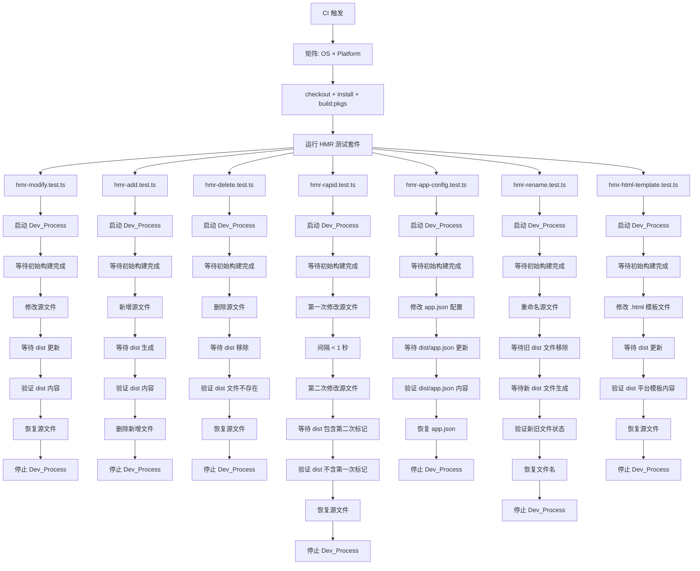

# 设计文档

## 概述

本设计为 weapp-vite 的 HMR（热更新）功能提供全面的端到端测试方案。测试基于现有的 `wevu-runtime.hmr.test.ts` 架构进行扩展，覆盖五种文件类型（模板、样式、脚本、JSON、Vue SFC）的三种操作（修改、新增、删除），并通过 GitHub Actions CI 矩阵在三大操作系统（macOS、Windows、Linux）× 三个小程序平台（weapp、alipay、tt）上运行。

设计遵循现有代码库的模式：使用 `startDevProcess` 启动 dev 监听进程，通过文件系统操作触发 HMR，然后轮询 dist 目录验证输出结果。

## 架构

### 测试文件组织

```text
e2e/
├── ci/
│   ├── wevu-runtime.hmr.test.ts          # 现有测试（将被重构）
│   ├── hmr-modify.test.ts                # 修改操作测试
│   ├── hmr-add.test.ts                   # 新增操作测试（含组件级新增，需求 13）
│   ├── hmr-delete.test.ts                # 删除操作测试（含组件级删除，需求 14）
│   ├── hmr-rapid.test.ts                 # 连续快速修改测试（需求 11）
│   ├── hmr-app-config.test.ts            # app.json 配置修改测试（需求 12）
│   ├── hmr-rename.test.ts                # 文件重命名测试（需求 15）
│   └── hmr-html-template.test.ts         # HTML 模板文件测试（需求 16）
├── utils/
│   ├── dev-process.ts                    # 现有，不修改
│   ├── dev-process-env.ts                # 现有，不修改
│   └── hmr-helpers.ts                    # 新增 HMR 测试工具函数
└── wevu-runtime.utils.ts                 # 现有，不修改

e2e-apps/wevu-runtime-e2e/src/
├── pages/hmr/                            # 现有 HMR 测试页面（修改操作目标）
│   ├── index.wxml
│   ├── index.ts
│   ├── index.wxss
│   └── index.json
├── pages/hmr-sfc/                        # 新增 Vue SFC HMR 测试页面
│   └── index.vue
├── pages/hmr-html/                       # 新增 HTML 模板 HMR 测试页面（需求 16）
│   ├── index.html                        # 使用 .html 作为模板扩展名
│   ├── index.ts
│   ├── index.wxss
│   └── index.json
├── pages/hmr-temp/                       # 新增/删除操作的临时目录（测试时动态创建）
└── components/hmr-temp-comp/             # 组件级新增/删除操作的临时目录（需求 13、14）

.github/workflows/
└── ci-e2e.yml                            # 修改：扩展 CI 矩阵支持多 OS
```

### 测试执行流程



### Dev_Process 生命周期管理

每个测试用例遵循统一的生命周期：

1. 清理 dist 目录
2. 启动 `weapp-vite dev` 进程
3. 等待 `app.json` 生成（确认初始构建完成）
4. 等待目标文件的初始输出
5. 执行文件操作（修改/新增/删除）
6. 等待并验证 dist 目录变化
7. 在 `finally` 块中恢复源文件并停止进程

## 组件与接口

### hmr-helpers.ts - HMR 测试工具模块

```typescript
import fs from 'fs-extra'

/**
 * 等待文件包含指定内容
 */
export async function waitForFileContains(
  filePath: string,
  marker: string,
  timeoutMs?: number
): Promise<string>

/**
 * 等待文件从文件系统中被移除
 */
export async function waitForFileRemoved(
  filePath: string,
  timeoutMs?: number
): Promise<void>

/**
 * 平台相关的文件扩展名映射
 */
export const PLATFORM_EXT: Record<RuntimePlatform, {
  template: string
  style: string
}>

/**
 * 支持的平台列表
 */
export const SUPPORTED_PLATFORMS: readonly ['weapp', 'alipay', 'tt']

/**
 * 根据环境变量解析要测试的平台
 */
export function resolvePlatforms(): RuntimePlatform[]

/**
 * 启动 dev 进程并等待初始构建完成的便捷函数
 */
export function startHmrDevProcess(
  platform: RuntimePlatform
): DevProcessController

/**
 * 生成唯一的 HMR 标记字符串
 */
export function createHmrMarker(prefix: string, platform: string): string
```

### 测试文件接口

每个测试文件遵循统一模式：

```typescript
// hmr-modify.test.ts
describe.sequential('HMR modify (dev watch)', () => {
  it.each(platforms)('修改 .wxml 模板 (%s)', async (platform) => { ... })
  it.each(platforms)('修改 .wxss 样式 (%s)', async (platform) => { ... })
  it.each(platforms)('修改 .ts 脚本 (%s)', async (platform) => { ... })
  it.each(platforms)('修改 .json 配置 (%s)', async (platform) => { ... })
  it.each(platforms)('修改 .vue SFC template (%s)', async (platform) => { ... })
  it.each(platforms)('修改 .vue SFC style (%s)', async (platform) => { ... })
  it.each(platforms)('修改 .vue SFC script (%s)', async (platform) => { ... })
  // 组件级别的修改测试
  it.each(platforms)('修改组件 .wxml 模板 (%s)', async (platform) => { ... })
  it.each(platforms)('修改组件 .wxss 样式 (%s)', async (platform) => { ... })
  it.each(platforms)('修改组件 .ts 脚本 (%s)', async (platform) => { ... })
  it.each(platforms)('修改组件 .json 配置 (%s)', async (platform) => { ... })
})

// hmr-add.test.ts
describe.sequential('HMR add (dev watch)', () => {
  it.each(platforms)('新增 .wxml 模板 (%s)', async (platform) => { ... })
  it.each(platforms)('新增 .wxss 样式 (%s)', async (platform) => { ... })
  it.each(platforms)('新增 .ts 脚本 (%s)', async (platform) => { ... })
  it.each(platforms)('新增 .json 配置 (%s)', async (platform) => { ... })
  it.each(platforms)('新增 .vue SFC (%s)', async (platform) => { ... })
  // 组件级新增测试（需求 13）
  it.each(platforms)('新增完整组件 (%s)', async (platform) => { ... })
  it.each(platforms)('在现有组件中新增 .wxss 样式 (%s)', async (platform) => { ... })
})

// hmr-delete.test.ts
describe.sequential('HMR delete (dev watch)', () => {
  it.each(platforms)('删除 .wxml 模板 (%s)', async (platform) => { ... })
  it.each(platforms)('删除 .wxss 样式 (%s)', async (platform) => { ... })
  it.each(platforms)('删除 .ts 脚本 (%s)', async (platform) => { ... })
  it.each(platforms)('删除 .json 配置 (%s)', async (platform) => { ... })
  it.each(platforms)('删除 .vue SFC (%s)', async (platform) => { ... })
  // 组件级删除测试（需求 14）
  it.each(platforms)('删除组件 .wxml 模板 (%s)', async (platform) => { ... })
  it.each(platforms)('删除组件 .wxss 样式 (%s)', async (platform) => { ... })
})

// hmr-rapid.test.ts — 连续快速修改测试（需求 11）
describe.sequential('HMR rapid modifications (dev watch)', () => {
  it.each(platforms)('连续快速修改 .wxml 模板 (%s)', async (platform) => { ... })
  it.each(platforms)('连续快速修改 .ts 脚本 (%s)', async (platform) => { ... })
  it.each(platforms)('连续快速修改 .vue SFC (%s)', async (platform) => { ... })
})

// hmr-app-config.test.ts — app.json 配置修改测试（需求 12）
describe.sequential('HMR app.json config (dev watch)', () => {
  it.each(platforms)('修改 app.json window 配置 (%s)', async (platform) => { ... })
  it.each(platforms)('修改 app.json pages 数组 (%s)', async (platform) => { ... })
})

// hmr-rename.test.ts — 文件重命名测试（需求 15）
describe.sequential('HMR rename (dev watch)', () => {
  it.each(platforms)('重命名 .wxml 模板文件 (%s)', async (platform) => { ... })
  it.each(platforms)('重命名 .ts 脚本文件 (%s)', async (platform) => { ... })
})

// hmr-html-template.test.ts — HTML 模板文件测试（需求 16）
describe.sequential('HMR html template (dev watch)', () => {
  it.each(platforms)('修改 .html 模板文件 (%s)', async (platform) => { ... })
  it.each(platforms)('新增 .html 模板文件 (%s)', async (platform) => { ... })
})
```

## 数据模型

### 平台扩展名映射

```typescript
type RuntimePlatform = 'weapp' | 'alipay' | 'tt'

const PLATFORM_EXT: Record<RuntimePlatform, { template: string, style: string }> = {
  weapp: { template: 'wxml', style: 'wxss' },
  alipay: { template: 'axml', style: 'acss' },
  tt: { template: 'ttml', style: 'ttss' },
}
```

### 测试文件路径常量

```typescript
// 修改操作目标（现有文件）
const HMR_PAGE_DIR = 'pages/hmr'
const HMR_SFC_PAGE_DIR = 'pages/hmr-sfc'
const HMR_HTML_PAGE_DIR = 'pages/hmr-html' // HTML 模板测试页面（需求 16）

// 新增/删除操作目标（临时文件）
const HMR_TEMP_DIR = 'pages/hmr-temp'

// 组件修改操作目标（现有组件）
const HMR_COMPONENT_DIR = 'components/x-child'

// 组件级新增/删除操作目标（临时组件目录，需求 13、14）
const HMR_COMPONENT_TEMP_DIR = 'components/hmr-temp-comp'

// app.json 路径（需求 12）
const APP_JSON_PATH = 'app.json'

// 重命名测试临时目录（需求 15）
const HMR_RENAME_TEMP_DIR = 'pages/hmr-rename-temp'
```

### HMR 标记策略

每个测试用例使用唯一标记（marker）来验证 HMR 是否生效：

- 修改测试：在源文件中插入 `HMR-MODIFY-{TYPE}-{PLATFORM}` 标记，验证 dist 文件包含该标记
- 新增测试：创建包含 `HMR-ADD-{TYPE}-{PLATFORM}` 标记的新文件，验证 dist 中出现对应文件
- 删除测试：先确认 dist 中存在文件，删除源文件后验证 dist 中文件被移除
- 连续快速修改测试（需求 11）：第一次修改插入 `HMR-RAPID-FIRST-{TYPE}-{PLATFORM}` 标记，第二次修改插入 `HMR-RAPID-SECOND-{TYPE}-{PLATFORM}` 标记，验证 dist 最终仅包含第二次标记
- app.json 配置测试（需求 12）：修改 window 配置插入 `HMR-APPCONFIG-{PLATFORM}` 标记，验证 dist/app.json 包含该标记
- 重命名测试（需求 15）：将源文件从 `old-name` 重命名为 `new-name`，验证 dist 中旧文件被移除、新文件被生成
- HTML 模板测试（需求 16）：在 .html 模板文件中插入 `HMR-HTML-{PLATFORM}` 标记，验证 dist 中对应平台模板文件包含该标记

### CI 矩阵配置模型

```yaml
strategy:
  fail-fast: false
  matrix:
    os: [ubuntu-latest, windows-latest, macos-latest]
    platform: [weapp, alipay, tt]
```

这将产生 3 × 3 = 9 个并行 job，每个 job 的名称包含 OS 和平台信息以便定位失败。

## 正确性属性

_属性（Property）是指在系统所有有效执行中都应成立的特征或行为——本质上是对系统应做什么的形式化陈述。属性是人类可读规范与机器可验证正确性保证之间的桥梁。_

### Property 1: 连续快速修改最终一致性

*对于任意*文件类型（模板、脚本、Vue SFC）和任意平台，当对同一源文件连续执行两次修改（间隔小于 1 秒）时，dist 目录中的输出文件最终应仅包含第二次修改的标记内容，不应包含第一次修改的独有标记。

**Validates: Requirements 11.1, 11.2, 11.3**

### Property 2: app.json window 配置修改传播

*对于任意*平台和任意合法的 window 配置项修改，修改 Source_Root 中 app.json 的 window 配置后，dist/app.json 应包含修改后的配置值。

**Validates: Requirements 12.1**

### Property 3: app.json pages 数组修改触发页面生成

*对于任意*平台，当向 app.json 的 pages 数组新增一个页面路径时，dist/app.json 应包含该新页面路径，且 dist 目录中应生成该页面对应的输出文件。

**Validates: Requirements 12.2**

### Property 4: 组件级文件新增生成所有输出

*对于任意*平台，当在 components 目录中新增一个完整组件（含 .wxml、.ts、.wxss、.json）时，dist 目录中应生成该组件的所有对应输出文件（平台模板、.js、平台样式、.json）。

**Validates: Requirements 13.1, 13.2**

### Property 5: 组件级文件删除移除 dist 输出

*对于任意*平台和任意组件文件类型（模板、样式），当从 components 目录中删除该文件时，dist 目录中对应的平台输出文件应被移除。

**Validates: Requirements 14.1, 14.2**

### Property 6: 文件重命名等价于删除旧文件加创建新文件

*对于任意*平台和任意可重命名的文件类型（模板、脚本），当将源文件从旧名重命名为新名时，dist 目录中旧名对应的输出文件应被移除，且新名对应的输出文件应被生成并包含正确内容。

**Validates: Requirements 15.1, 15.2**

### Property 7: HTML 模板文件修改热更新

*对于任意*平台，当修改 .html 模板文件内容时，dist 目录中对应的平台模板文件应包含修改后的内容，行为与 .wxml 模板文件一致。

**Validates: Requirements 16.1**

### Property 8: HTML 模板文件新增热更新

*对于任意*平台，当在 Source_Root 中新增一个 .html 模板文件时，dist 目录中应生成对应的平台模板文件。

**Validates: Requirements 16.2**

## 错误处理

### 连续快速修改场景（需求 11）

- chokidar 的 `awaitWriteFinish` 配置（`stabilityThreshold: 100, pollInterval: 20`）确保文件写入稳定后才触发事件
- 测试中两次修改间隔应小于 1 秒但大于 `stabilityThreshold`，以模拟真实快速编辑场景
- 若 dist 在超时时间内仍包含第一次标记而非第二次标记，测试应报告超时错误

### app.json 配置修改场景（需求 12）

- 修改 app.json 时需确保 JSON 格式合法，否则 dev 进程可能报错
- pages 数组新增页面路径时，对应的源文件可能不存在，测试需先创建源文件再修改 app.json
- 测试结束后需恢复 app.json 到原始状态，避免影响其他测试

### 组件级操作场景（需求 13、14）

- 新增完整组件时需确保所有文件（.wxml、.ts、.wxss、.json）同时或按序创建
- 删除组件文件时需注意 watcher 可能因文件不存在而忽略事件，测试需先确认 dist 中存在对应文件
- 临时组件目录 `components/hmr-temp-comp/` 需在测试结束后完全清理

### 文件重命名场景（需求 15）

- chokidar 通过 `raw` 事件的 `rename` 类型处理重命名，内部转换为 `create` 或 `delete` 事件
- 跨目录重命名不在测试范围内，仅测试同目录内的重命名
- Windows 上 `fs.rename` 的行为可能与 Unix 不同，需确保测试在三个 OS 上均通过
- 测试结束后需将文件名恢复到原始状态

### HTML 模板场景（需求 16）

- `templateExtensions` 常量定义了 `['wxml', 'html']`，确保 .html 文件被 watcher 监听
- .html 文件在 dist 中输出为对应平台的模板扩展名（如 weapp → .wxml），而非保持 .html
- 测试页面 `pages/hmr-html/` 需在 app.json 中注册

## 测试策略

### 双重测试方法

本测试套件采用端到端集成测试为主、属性测试为辅的策略：

- **E2E 集成测试**：每个测试用例启动真实的 `weapp-vite dev` 进程，通过文件系统操作触发 HMR，验证 dist 输出。这是主要的测试手段。
- **属性测试**：使用 `fast-check` 库对关键属性进行参数化验证，确保在随机生成的平台和文件类型组合下行为一致。

### 属性测试配置

- 属性测试库：`fast-check`（已在项目 devDependencies 中或需添加）
- 每个属性测试最少运行 100 次迭代
- 每个属性测试需通过注释引用设计文档中的属性编号
- 标记格式：**Feature: weapp-vite-hmr-e2e, Property {number}: {property_text}**
- 每个正确性属性由单个属性测试实现

### 测试分工

| 测试文件                     | 测试类型            | 覆盖需求 |
| ---------------------------- | ------------------- | -------- |
| `hmr-rapid.test.ts`          | E2E + Property 1    | 需求 11  |
| `hmr-app-config.test.ts`     | E2E + Property 2, 3 | 需求 12  |
| `hmr-add.test.ts`（扩展）    | E2E + Property 4    | 需求 13  |
| `hmr-delete.test.ts`（扩展） | E2E + Property 5    | 需求 14  |
| `hmr-rename.test.ts`         | E2E + Property 6    | 需求 15  |
| `hmr-html-template.test.ts`  | E2E + Property 7, 8 | 需求 16  |

### 单元测试补充

- `hmr-helpers.ts` 中的 `createHmrMarker` 函数需单元测试验证标记唯一性
- `resolvePlatforms` 函数需单元测试验证环境变量解析逻辑
- 边缘情况：空文件修改、超大文件修改、特殊字符文件名等通过 E2E 测试覆盖
