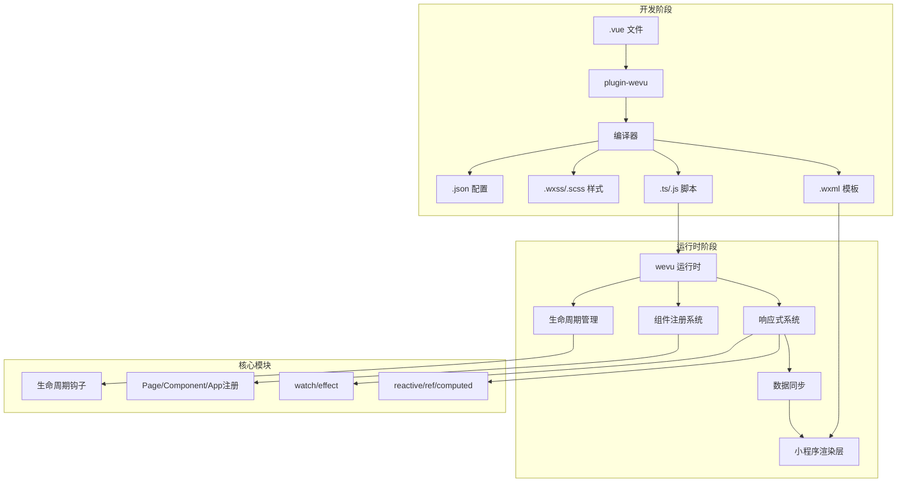
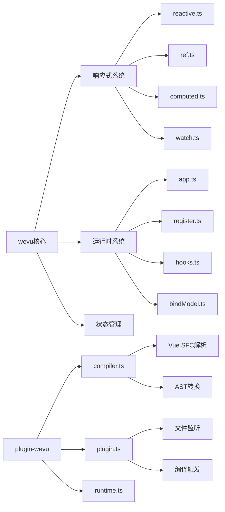
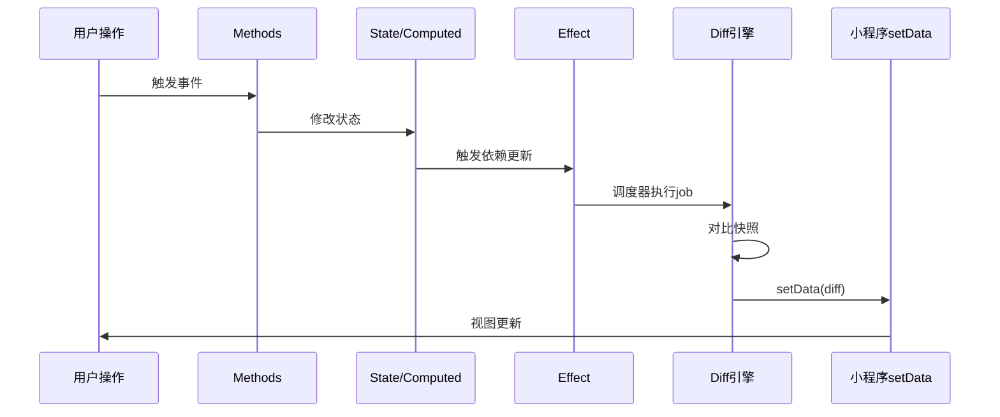
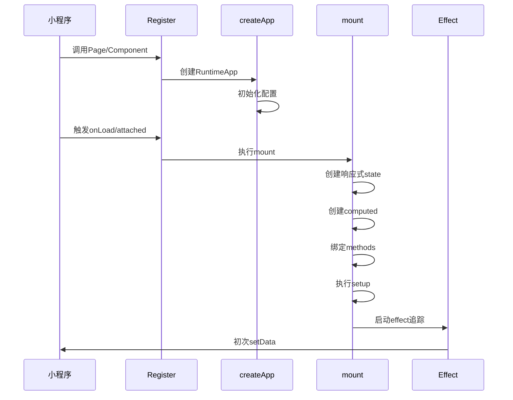
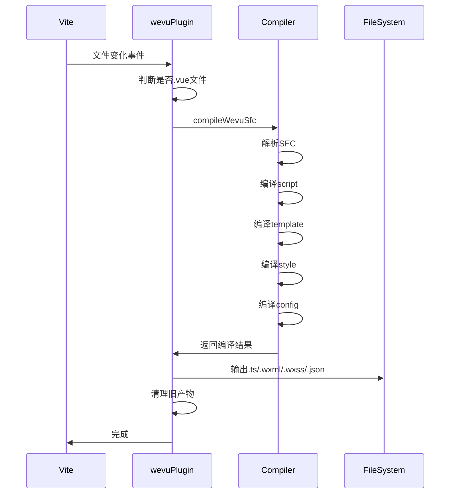

# WeVu Vue运行时框架实现设计文档

## 一、需求概述

本设计旨在实现一个完整的Vue运行时框架系统，使开发者能够在微信小程序中使用Vue 3的语法和特性。该系统由两个核心包组成：

1. **packages/wevu**：运行时框架包，在小程序环境中复刻Vue的响应式系统和组件模型
2. **packages/plugin-wevu**：Vite插件包，负责编译.vue单文件组件为小程序可识别的文件格式

同时需要在apps目录下创建一个综合示例项目，涵盖所有使用场景。

## 二、系统架构设计

### 2.1 整体架构



### 2.2 模块关系图



## 三、核心功能模块设计

### 3.1 响应式系统 (packages/wevu/src/reactivity)

#### 3.1.1 reactive响应式对象

**功能职责**：

- 将普通对象转换为响应式对象
- 使用Proxy拦截对象的读写操作
- 支持深层嵌套对象的响应式转换
- 维护对象的原始值映射关系

**核心机制**：

- 通过WeakMap维护响应式对象缓存，避免重复代理
- 使用VERSION_KEY符号标记对象版本，优化深层依赖追踪
- 支持根对象版本传播，当嵌套对象变化时通知根对象

**数据结构**：

| 数据结构    | 类型                    | 用途                           |
| ----------- | ----------------------- | ------------------------------ |
| reactiveMap | WeakMap<object, proxy>  | 缓存原始对象到响应式代理的映射 |
| rawMap      | WeakMap<proxy, object>  | 缓存响应式代理到原始对象的映射 |
| rawRootMap  | WeakMap<object, object> | 缓存嵌套对象到根对象的映射     |

#### 3.1.2 ref引用类型

**功能职责**：

- 为基本类型提供响应式包装
- 通过.value属性访问和修改值
- 自动解包对象类型的ref

**关键特性**：

- 支持泛型类型推导
- 对象类型自动转换为reactive
- 提供isRef类型守卫
- 支持unref解包操作

#### 3.1.3 computed计算属性

**功能职责**：

- 基于依赖数据自动计算派生值
- 缓存计算结果，仅在依赖变化时重新计算
- 支持只读和可写两种模式

**计算属性配置**：

| 配置项 | 类型               | 说明         |
| ------ | ------------------ | ------------ |
| get    | () => T            | 计算函数     |
| set    | (value: T) => void | 可选的设置器 |

#### 3.1.4 watch侦听器

**功能职责**：

- 侦听响应式数据变化并执行回调
- 支持单个或多个数据源
- 提供立即执行和深度侦听选项

**侦听器选项**：

| 选项      | 类型             | 默认值 | 说明         |
| --------- | ---------------- | ------ | ------------ |
| immediate | boolean          | false  | 是否立即执行 |
| deep      | boolean          | false  | 是否深度侦听 |
| flush     | 'sync' \| 'post' | 'post' | 回调执行时机 |

#### 3.1.5 effect副作用系统

**功能职责**：

- 追踪响应式依赖并在变化时执行副作用函数
- 提供调度器机制控制副作用执行时机
- 支持手动停止副作用

**工作流程**：

1. 执行副作用函数，收集依赖
2. 依赖变化时触发调度器
3. 调度器决定何时重新执行副作用
4. 支持通过返回的stop函数停止追踪

### 3.2 运行时系统 (packages/wevu/src/runtime)

#### 3.2.1 应用创建与挂载

**createApp函数职责**：

- 创建运行时应用实例
- 配置全局属性和插件系统
- 自动注册小程序App构造函数

**应用配置结构**：

| 配置项   | 类型                | 说明           |
| -------- | ------------------- | -------------- |
| data     | () => D             | 状态初始化函数 |
| computed | ComputedDefinitions | 计算属性定义   |
| methods  | MethodDefinitions   | 方法定义       |
| watch    | WatchMap            | 侦听器定义     |
| setup    | SetupFunction       | setup组合式API |

**mount挂载流程**：

1. 初始化响应式状态
2. 创建计算属性和方法代理
3. 建立数据同步机制
4. 启动effect追踪器
5. 返回运行时实例

#### 3.2.2 组件注册系统

**Page注册流程**：

1. 包装用户定义的生命周期钩子
2. 在onLoad时挂载运行时实例
3. 在onUnload时卸载运行时实例
4. 桥接methods到小程序事件处理器
5. 注册生命周期钩子调用点

**Component注册流程**：

1. 转换lifetimes和pageLifetimes
2. 在attached时挂载运行时
3. 在detached时卸载运行时
4. 合并用户方法和运行时方法
5. 支持组件特有的生命周期

**App注册流程**：

1. 挂载全局运行时实例
2. 注册应用级生命周期钩子
3. 支持onAppLaunch/onAppShow/onAppHide/onAppError
4. 维护globalData全局数据

#### 3.2.3 生命周期钩子系统

**钩子注册机制**：

- 所有钩子必须在setup函数同步执行期间注册
- 使用currentInstance追踪当前实例上下文
- 支持同一钩子注册多个回调（部分钩子除外）

**支持的生命周期钩子**：

| 钩子名称          | 触发时机              | 返回值支持 | 多次注册 |
| ----------------- | --------------------- | ---------- | -------- |
| onShow            | 页面/组件显示         | 否         | 是       |
| onHide            | 页面/组件隐藏         | 否         | 是       |
| onReady           | 页面/组件初次渲染完成 | 否         | 是       |
| onUnload          | 页面卸载              | 否         | 是       |
| onPageScroll      | 页面滚动              | 否         | 是       |
| onShareAppMessage | 分享                  | 是         | 否       |
| onShareTimeline   | 分享朋友圈            | 是         | 否       |
| onAddToFavorites  | 收藏                  | 是         | 否       |
| onSaveExitState   | 保存退出状态          | 是         | 否       |
| onTabItemTap      | Tab点击               | 否         | 是       |
| onRouteDone       | 路由动画完成          | 否         | 是       |

#### 3.2.4 数据同步机制

**diff算法**：

- 比较前后快照，生成最小变更集
- 递归比较嵌套对象和数组
- 跳过相同的值以优化性能

**setData优化**：

- 使用effect追踪所有响应式依赖
- 通过调度器批量更新
- 仅传递变化的数据路径
- 支持Promise形式的setData

**快照收集流程**：

1. 将响应式对象转换为普通对象
2. 收集所有computed值
3. 生成完整的数据快照
4. 与上次快照进行diff
5. 调用小程序setData同步差异

#### 3.2.5 双向绑定支持

**bindModel功能**：

- 为表单控件提供双向绑定语法糖
- 支持绑定state属性和computed属性
- 自动生成值和事件处理器对象

**绑定目标支持**：

| 绑定类型     | 语法示例                | 返回值              |
| ------------ | ----------------------- | ------------------- |
| state属性    | bindModel('name')       | { value, onChange } |
| computed属性 | bindModel('fullName')   | { value, onChange } |
| 嵌套路径     | bindModel('user.email') | { value, onChange } |

### 3.3 编译系统 (packages/plugin-wevu)

#### 3.3.1 SFC编译器

**compileWevuSfc功能**：

- 解析.vue单文件组件
- 分离script、template、style、config块
- 编译每个块为对应的小程序文件

**编译输出映射**：

| 源块                 | 目标文件    | 处理逻辑                      |
| -------------------- | ----------- | ----------------------------- |
| &lt;script&gt;       | .ts/.js     | 编译setup语法，注入运行时调用 |
| &lt;script setup&gt; | .ts/.js     | 使用@vue/compiler-sfc编译     |
| &lt;template&gt;     | .wxml       | 直接提取模板内容              |
| &lt;style&gt;        | .wxss/.scss | 提取样式内容                  |
| &lt;config&gt;       | .json       | 解析JSON/JS/TS配置            |

#### 3.3.2 脚本转换器

**transformScript职责**：

- 解析脚本为AST
- 定位export default声明
- 替换为变量声明
- 注入createWevuComponent调用

**转换示例流程**：

```
输入：export default { data() { return { count: 0 } } }
      ↓
解析：识别export default节点
      ↓
转换：const __wevuOptions = { data() { return { count: 0 } } }
      ↓
注入：import { createWevuComponent } from '@weapp-vite/plugin-wevu/runtime'
      createWevuComponent(__wevuOptions)
      ↓
输出：完整的小程序页面/组件脚本
```

#### 3.3.3 配置块编译

**支持的配置语言**：

| 语言  | 特性           | 用途         |
| ----- | -------------- | ------------ |
| json  | 标准JSON       | 基础配置     |
| jsonc | 支持注释       | 带注释的配置 |
| json5 | 更灵活的语法   | 高级配置     |
| js    | JavaScript对象 | 动态配置     |
| ts    | TypeScript对象 | 类型安全配置 |

**配置合并策略**：

- 支持多个config块
- 按顺序深度合并
- 后定义的覆盖先定义的
- 最终输出JSON格式

**动态配置求值**：

1. 将JS/TS配置写入临时文件
2. 使用rolldown-require加载模块
3. 执行export default获取配置对象
4. 支持函数和Promise
5. 清理临时文件

#### 3.3.4 Vite插件集成

**wevuPlugin功能**：

- 监听.vue文件变化
- 触发编译流程
- 输出编译结果到指定目录
- 清理过期文件

**文件监听策略**：

| 事件   | 处理方式               |
| ------ | ---------------------- |
| add    | 编译新增的.vue文件     |
| change | 重新编译变更的.vue文件 |
| unlink | 删除对应的编译产物     |

**输出路径解析**：

- 支持outputRoot配置项
- 默认原地输出
- 保持源文件的相对路径结构
- 处理多个srcRoot的情况

**生命周期钩子**：

| 钩子            | 调用时机       | 作用                      |
| --------------- | -------------- | ------------------------- |
| configResolved  | 配置解析完成   | 初始化roots，执行全量编译 |
| buildStart      | 构建开始       | 执行全量编译              |
| watchChange     | 文件变化       | 处理单个文件编译或删除    |
| configureServer | 开发服务器启动 | 配置文件监听器            |
| buildEnd        | 构建结束       | 非watch模式清理编译产物   |
| closeBundle     | bundle关闭     | 清理所有编译产物          |

### 3.4 状态管理 (packages/wevu/src/store)

#### 3.4.1 Store定义

**defineStore功能**：

- 定义全局状态存储
- 支持state、getters、actions
- 提供类型推导支持

**Store结构**：

| 部分    | 类型    | 说明           |
| ------- | ------- | -------------- |
| id      | string  | store唯一标识  |
| state   | () => S | 状态初始化函数 |
| getters | Getters | 计算属性集合   |
| actions | Actions | 方法集合       |

#### 3.4.2 Store管理器

**createStore功能**：

- 创建store管理器实例
- 维护所有store实例
- 提供install方法集成到运行时

**storeToRefs功能**：

- 将store的state和getters转为refs
- 保持响应式特性
- 方便在模板中使用

## 四、示例应用设计 (apps/wevu-comprehensive-demo)

### 4.1 应用结构

```
apps/wevu-comprehensive-demo/
├── src/
│   ├── app.vue                    # 应用入口
│   ├── pages/
│   │   ├── index/
│   │   │   └── index.vue          # 首页 - 功能导航
│   │   ├── basic/
│   │   │   └── index.vue          # 基础响应式示例
│   │   ├── computed/
│   │   │   └── index.vue          # 计算属性示例
│   │   ├── watch/
│   │   │   └── index.vue          # 侦听器示例
│   │   ├── lifecycle/
│   │   │   └── index.vue          # 生命周期示例
│   │   ├── setup/
│   │   │   └── index.vue          # setup语法示例
│   │   ├── setup-script/
│   │   │   └── index.vue          # script setup示例
│   │   ├── form/
│   │   │   └── index.vue          # 表单双向绑定示例
│   │   ├── list/
│   │   │   └── index.vue          # 列表渲染示例
│   │   ├── component/
│   │   │   └── index.vue          # 组件通信示例
│   │   ├── store/
│   │   │   └── index.vue          # 状态管理示例
│   │   └── advanced/
│   │       └── index.vue          # 高级特性示例
│   ├── components/
│   │   ├── counter/
│   │   │   └── counter.vue        # 计数器组件
│   │   ├── todo-item/
│   │   │   └── todo-item.vue      # 待办项组件
│   │   └── user-card/
│   │       └── user-card.vue      # 用户卡片组件
│   ├── stores/
│   │   ├── user.ts                # 用户store
│   │   └── todos.ts               # 待办事项store
│   └── utils/
│       └── helpers.ts             # 工具函数
├── vite.config.ts
├── package.json
├── project.config.json
└── tsconfig.json
```

### 4.2 功能示例清单

#### 4.2.1 基础响应式 (pages/basic)

**演示内容**：

- reactive对象响应式
- ref基本类型响应式
- 嵌套对象响应式
- 数组响应式操作

**交互场景**：

- 按钮点击修改数据
- 实时显示数据变化
- 数组增删改查操作
- 对象属性动态添加删除

#### 4.2.2 计算属性 (pages/computed)

**演示内容**：

- 只读计算属性
- 可写计算属性
- 链式计算属性
- 计算属性缓存机制

**示例场景**：

- 购物车总价计算
- 过滤和排序列表
- 格式化显示数据
- 双向绑定computed

#### 4.2.3 侦听器 (pages/watch)

**演示内容**：

- 基础watch用法
- 立即执行immediate
- 深度侦听deep
- 多数据源侦听
- 字符串方法名侦听

**示例场景**：

- 搜索关键词变化
- 表单验证
- 数据持久化
- 联动下拉框

#### 4.2.4 生命周期 (pages/lifecycle)

**演示内容**：

- 所有生命周期钩子演示
- 多次注册同一钩子
- 钩子执行顺序
- 返回值处理（分享等）

**可视化展示**：

- 时间线显示钩子调用
- 控制台日志输出
- 钩子执行计数
- 参数传递演示

#### 4.2.5 Setup语法 (pages/setup)

**演示内容**：

- setup函数基础用法
- 访问运行时上下文
- 返回值绑定到实例
- 组合多个功能

**示例代码模式**：

- 使用ref和reactive
- 调用生命周期钩子
- 定义方法和计算属性
- 访问props和context

#### 4.2.6 Script Setup (pages/setup-script)

**演示内容**：

- script setup语法糖
- 顶层变量自动暴露
- defineProps和defineEmits
- 编译宏使用

**对比展示**：

- 与普通setup的代码量对比
- 类型推导优势
- 开发体验提升

#### 4.2.7 表单绑定 (pages/form)

**演示内容**：

- input双向绑定
- textarea双向绑定
- checkbox多选绑定
- radio单选绑定
- picker选择器绑定
- switch开关绑定

**bindModel使用**：

- 简化绑定语法
- 自动处理事件
- 支持computed绑定

#### 4.2.8 列表渲染 (pages/list)

**演示内容**：

- 基础列表渲染
- 条件渲染v-if
- 列表过滤和排序
- 动态添加删除项
- 列表项动画过渡

**数据操作**：

- push/pop/shift/unshift
- splice修改
- 响应式更新验证

#### 4.2.9 组件通信 (pages/component)

**演示内容**：

- 父子组件通信
- 组件属性传递
- 自定义事件触发
- provide/inject依赖注入

**组件示例**：

- Counter计数器组件
- TodoItem待办项组件
- UserCard用户卡片组件

#### 4.2.10 状态管理 (pages/store)

**演示内容**：

- 定义和使用store
- state状态访问
- getters计算状态
- actions方法调用
- 跨页面状态共享

**Store示例**：

- UserStore用户信息
- TodosStore待办列表
- 订阅state变化

#### 4.2.11 高级特性 (pages/advanced)

**演示内容**：

- 全局属性注册
- 插件系统使用
- 自定义指令模拟
- 性能优化技巧
- 错误处理最佳实践

### 4.3 配置文件示例

#### vite.config.ts配置

```
目标配置结构：
- weapp.srcRoot指向编译输出目录
- wevuPlugin配置include源目录
- wevuPlugin配置outputRoot编译输出目录
- 启用TypeScript支持
```

#### package.json配置

```
必需依赖：
- weapp-vite（工作区版本）
- @weapp-vite/plugin-wevu（工作区版本）
- wevu（工作区版本）
- miniprogram-api-typings
- typescript

脚本命令：
- dev: 开发模式
- dev:open: 开发并打开工具
- build: 生产构建
- open: 打开开发者工具
```

#### tsconfig.json配置

```
编译选项：
- 启用严格模式
- 目标ES2020+
- 模块系统ESNext
- 支持JSX
- 包含类型定义
```

## 五、关键实现要点

### 5.1 响应式追踪优化

**版本标记机制**：

- 使用Symbol作为版本键
- 避免深度遍历所有属性
- 任何写操作触发版本更新
- effect可选择追踪版本或具体属性

**性能考量**：

- WeakMap避免内存泄漏
- 缓存响应式对象避免重复代理
- 根对象版本传播减少依赖数量

### 5.2 小程序适配策略

**setData限制处理**：

- 单次传输数据不超过1MB
- 批量更新减少调用次数
- diff算法生成最小变更集
- 路径式更新支持（如 'list[0].name'）

**生命周期映射**：

| Vue生命周期 | 小程序Page | 小程序Component    |
| ----------- | ---------- | ------------------ |
| onMounted   | onLoad     | attached           |
| onUnmounted | onUnload   | detached           |
| onShow      | onShow     | pageLifetimes.show |
| onHide      | onHide     | pageLifetimes.hide |
| onReady     | onReady    | ready              |

### 5.3 setup函数执行时机

**执行时机控制**：

- Page在onLoad时执行
- Component在attached时执行
- App在onLaunch时执行

**上下文管理**：

- setCurrentInstance设置当前实例
- 生命周期钩子依赖currentInstance
- setup执行完成后清除currentInstance
- 防止异步代码中错误使用钩子

### 5.4 类型推导支持

**泛型约束**：

- Data类型约束为object
- Computed类型推导返回值
- Methods类型推导参数和返回值
- 公共实例类型组合

**工具类型**：

- ExtractComputed提取计算属性类型
- ExtractMethods提取方法类型
- ComponentPublicInstance组合公共实例类型

### 5.5 编译产物管理

**文件清理策略**：

- 追踪每个.vue文件的编译产物
- 文件删除时清理对应产物
- 编译配置变化时清理旧产物
- watch模式退出时可选清理

**输出路径计算**：

- 保持源文件相对路径结构
- 支持自定义outputRoot
- 处理多srcRoot场景
- 防止路径穿越安全问题

## 六、数据流转设计

### 6.1 响应式数据流



### 6.2 组件初始化流程



### 6.3 编译流程



## 七、错误处理与边界情况

### 7.1 编译错误处理

**SFC解析错误**：

- 捕获Vue解析器错误
- 提供友好的错误信息
- 标注错误文件和位置
- 不中断watch模式

**配置块求值错误**：

- JS/TS配置执行失败
- 提供完整堆栈信息
- 回退到默认配置
- 清理临时文件

### 7.2 运行时错误处理

**生命周期钩子错误**：

- 捕获钩子执行异常
- 防止阻断后续钩子
- 记录错误日志
- 继续执行流程

**Watch回调错误**：

- 捕获回调异常
- 不影响其他watcher
- 不停止依赖追踪
- 输出警告信息

### 7.3 边界情况处理

**空配置处理**：

- data函数返回空对象
- computed为空对象
- methods为空对象
- 正常初始化运行时

**重复挂载防护**：

- 检查是否已挂载
- 防止重复初始化
- 清理旧的effect
- 重置状态

**循环依赖检测**：

- computed之间循环依赖
- watch循环触发
- 防止无限递归
- 提供警告信息

## 八、性能优化策略

### 8.1 编译性能

**增量编译**：

- 仅编译变化的文件
- 缓存编译结果
- 复用AST解析

**并行处理**：

- 多文件并行编译
- 独立编译各个块
- 异步写入文件

### 8.2 运行时性能

**批量更新**：

- 调度器合并多次更新
- 单帧内仅执行一次setData
- 微任务队列优化

**依赖追踪优化**：

- 版本标记减少追踪粒度
- 计算属性缓存
- 避免不必要的深度遍历

**内存管理**：

- WeakMap自动回收
- 卸载时清理所有引用
- 停止所有effect和watch

### 8.3 包体积优化

**Tree Shaking**：

- 模块化导出
- 标记sideEffects
- 按需引入功能

**代码分割**：

- 运行时与编译时分离
- store单独导出
- 工具函数独立模块

## 九、测试策略

### 9.1 单元测试覆盖

**响应式系统测试**：

- reactive对象代理
- ref值包装
- computed缓存机制
- watch触发时机
- effect依赖追踪

**运行时系统测试**：

- 组件注册流程
- 生命周期调用
- 数据同步机制
- bindModel功能

**编译系统测试**：

- SFC解析正确性
- 脚本转换准确性
- 配置块编译
- 文件输出路径

### 9.2 集成测试场景

**完整流程测试**：

- .vue文件编译到小程序文件
- 运行时挂载和卸载
- 响应式更新触发setData
- 组件间通信

**边界情况测试**：

- 空配置处理
- 错误恢复
- 重复操作
- 异常输入

### 9.3 示例应用验证

**功能验证**：

- 所有示例页面可运行
- 交互功能正常
- 数据响应正确
- 无运行时错误

**性能验证**：

- 页面加载时间
- setData调用频率
- 内存占用
- 包体积大小

## 十、文档与注释规范

### 10.1 代码注释要求

**公共API注释**：

- 函数用途说明
- 参数类型和含义
- 返回值说明
- 使用示例

**复杂逻辑注释**：

- 算法思路
- 边界条件
- 性能考量
- 注意事项

### 10.2 类型定义文档

**导出类型**：

- 接口完整定义
- 泛型参数说明
- 类型约束描述
- 使用场景示例

### 10.3 示例代码文档

**每个示例包含**：

- 功能说明注释
- 关键代码注解
- 交互步骤说明
- 预期结果描述

## 十一、实现优先级

### P0 - 核心功能（必须实现）

1. 响应式系统基础（reactive、ref、computed、watch）
2. 运行时Page注册和挂载
3. 基础SFC编译（script、template、style）
4. Vite插件基础功能
5. 数据同步机制

### P1 - 重要功能（优先实现）

1. Component组件注册
2. 生命周期钩子系统
3. setup函数支持
4. script setup编译
5. config块编译
6. 基础示例应用

### P2 - 增强功能（后续实现）

1. App注册支持
2. provide/inject依赖注入
3. bindModel双向绑定
4. Store状态管理
5. 完整示例应用

### P3 - 优化功能（可选实现）

1. 性能优化
2. 错误提示增强
3. 开发体验改进
4. 高级示例
5. 文档完善

## 十二、兼容性考虑

### 12.1 小程序平台

**目标平台**：

- 微信小程序（主要支持）
- 其他小程序平台（预留扩展）

**基础库版本**：

- 最低支持版本2.10.0
- 推荐使用3.0.0+
- Skyline渲染引擎兼容

### 12.2 Vue版本

**Vue编译器版本**：

- 使用Vue 3.5+的compiler-sfc
- 支持最新的script setup语法
- 兼容Composition API

### 12.3 构建工具

**Vite版本**：

- Vite 7+
- weapp-vite最新版本
- Rolldown打包器

## 十三、部署与发布

### 13.1 包发布策略

**版本号规则**：

- wevu和plugin-wevu同步版本
- 遵循语义化版本
- 主版本号表示breaking changes

**发布检查清单**：

- 所有测试通过
- 构建产物正确
- 类型定义完整
- 文档更新

### 13.2 示例应用部署

**示例代码同步**：

- 与核心包版本对应
- 保持API使用最新
- 提供完整的运行说明

## 十四、后续扩展方向

### 14.1 功能扩展

**指令系统**：

- 模拟Vue指令
- 自定义指令支持
- 内置常用指令

**组件增强**：

- 异步组件
- 动态组件
- 递归组件

### 14.2 工具链扩展

**开发工具**：

- Devtools集成
- 调试工具
- 性能分析

**脚手架增强**：

- 项目模板
- 代码生成器
- 迁移工具

### 14.3 生态集成

**UI库适配**：

- Vant Weapp
- TDesign
- 其他组件库

**路由系统**：

- 声明式路由
- 路由守卫
- 页面缓存
