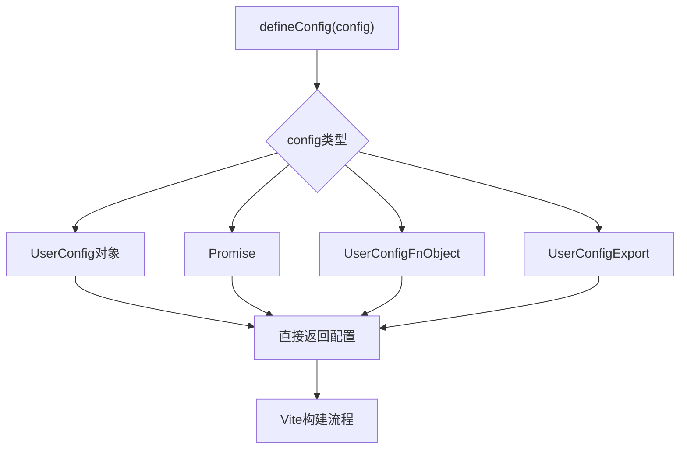
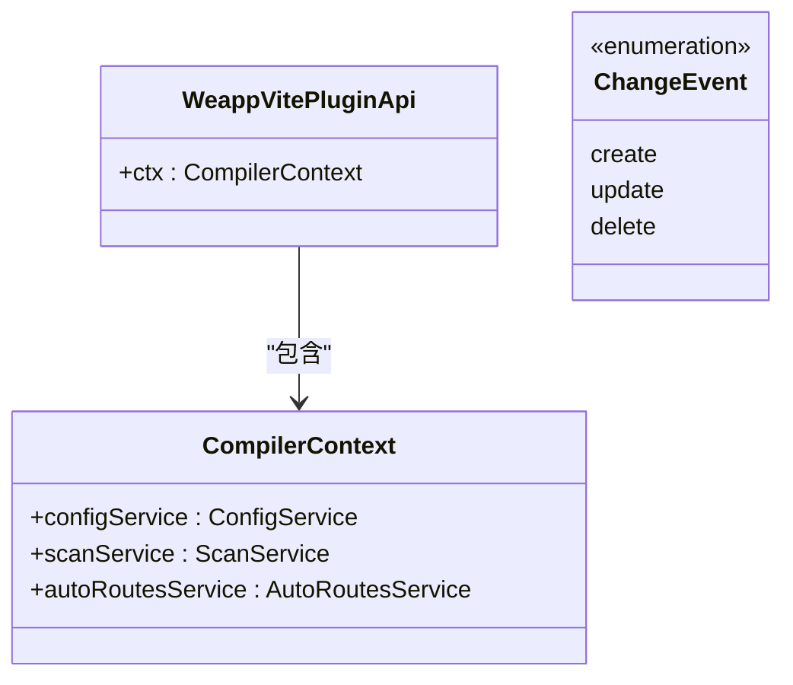
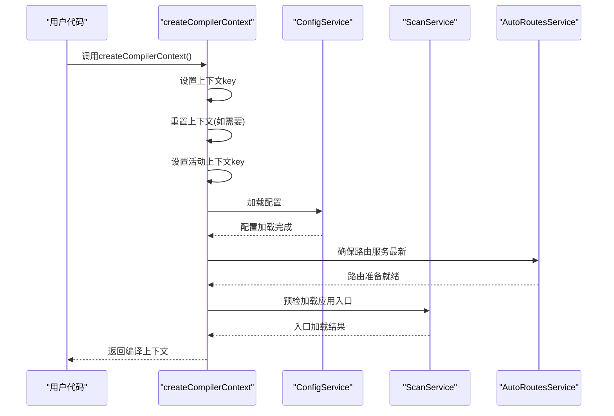
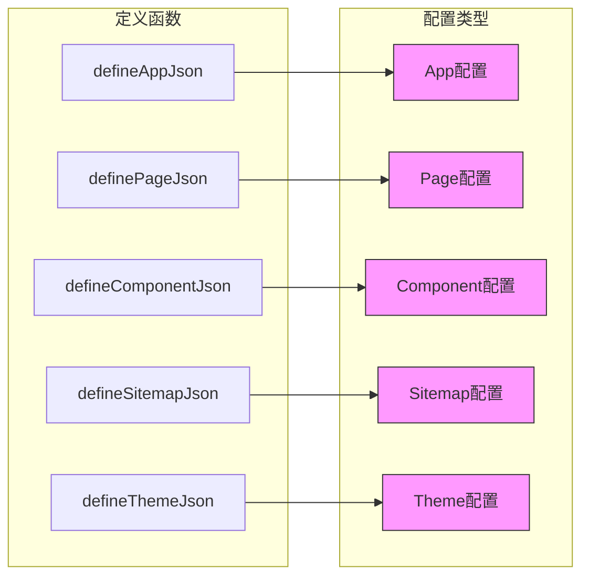

# API参考

<cite>
**本文档中引用的文件**
- [config.ts](file://packages/weapp-vite/src/config.ts)
- [createContext.ts](file://packages/weapp-vite/src/createContext.ts)
- [json.ts](file://packages/weapp-vite/src/json.ts)
- [types/plugin.ts](file://packages/weapp-vite/src/types/plugin.ts)
- [types/context.ts](file://packages/weapp-vite/src/types/context.ts)
- [types/external.ts](file://packages/weapp-vite/src/types/external.ts)
- [index.ts](file://packages/weapp-vite/src/index.ts)
</cite>

## 目录
1. [配置API](#配置api)
2. [插件API](#插件api)
3. [编译上下文API](#编译上下文api)
4. [运行时API和工具函数](#运行时api和工具函数)

## 配置API

weapp-vite的配置API基于Vite的配置系统进行扩展，提供了专门针对小程序开发的配置选项。通过`defineConfig`函数可以定义项目配置，支持同步、异步和函数形式的配置导出。

配置对象通过`weapp`字段扩展Vite的`UserConfig`接口，允许开发者指定小程序特有的配置项。该API的设计理念是保持与Vite生态的兼容性，同时提供小程序开发所需的功能扩展。

**图示来源**
- [config.ts](file://packages/weapp-vite/src/config.ts#L15-L21)

**本节来源**
- [config.ts](file://packages/weapp-vite/src/config.ts#L1-L28)

## 插件API

插件API提供了`WeappVitePluginApi`接口，为插件开发人员提供了访问编译上下文的能力。插件系统允许开发者在构建过程中注入自定义逻辑，实现功能扩展。

`ChangeEvent`类型定义了文件系统变化的三种事件类型：创建、更新和删除，可用于监听文件变化并触发相应的处理逻辑。插件API的设计旨在提供灵活的扩展机制，同时保持核心系统的稳定性。

**图示来源**
- [types/plugin.ts](file://packages/weapp-vite/src/types/plugin.ts#L3-L8)
- [types/context.ts](file://packages/weapp-vite/src/types/context.ts)

**本节来源**
- [types/plugin.ts](file://packages/weapp-vite/src/types/plugin.ts#L1-L8)

## 编译上下文API

编译上下文API通过`createCompilerContext`函数提供，用于创建和管理编译过程中的上下文对象。该上下文包含了配置服务、扫描服务和自动路由服务等核心组件，是整个构建系统的核心协调者。

`createCompilerContext`函数接受可选的配置参数，支持通过key标识不同的上下文实例。函数内部会初始化配置服务并加载配置，确保构建环境的正确设置。此API的设计考虑了多实例场景下的隔离需求，允许并行的构建任务使用独立的上下文。

**图示来源**
- [createContext.ts](file://packages/weapp-vite/src/createContext.ts#L4-L27)

**本节来源**
- [createContext.ts](file://packages/weapp-vite/src/createContext.ts#L1-L28)

## 运行时API和工具函数

运行时API提供了处理小程序JSON配置文件的工具函数，包括`defineAppJson`、`definePageJson`、`defineComponentJson`、`defineSitemapJson`和`defineThemeJson`。这些函数采用函数式设计模式，接收配置对象或配置函数作为参数，并直接返回输入的配置。

这些工具函数的设计理念是提供类型安全的配置定义方式，同时支持基于编译上下文的动态配置生成。通过`ConfigFn<T>`类型定义，配置可以是静态对象，也可以是接收编译上下文作为参数的函数，从而实现条件配置和动态配置。

**图示来源**
- [json.ts](file://packages/weapp-vite/src/json.ts#L18-L36)

**本节来源**
- [json.ts](file://packages/weapp-vite/src/json.ts#L1-L37)