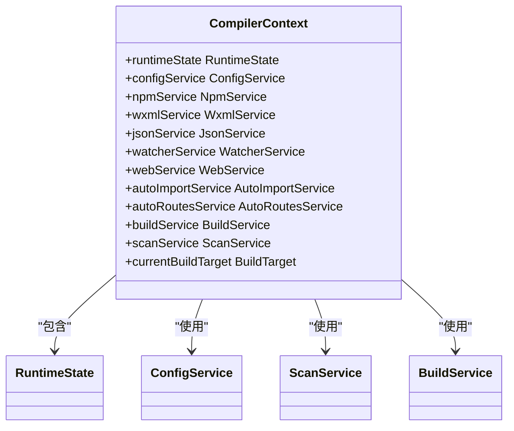
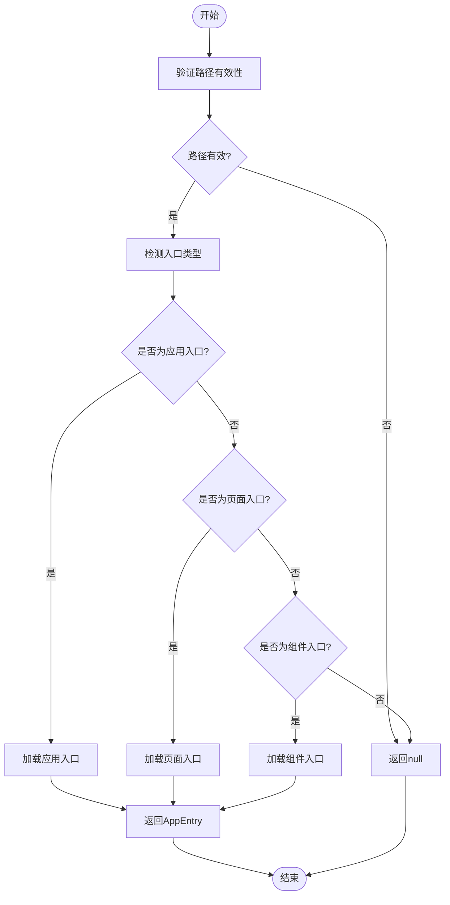
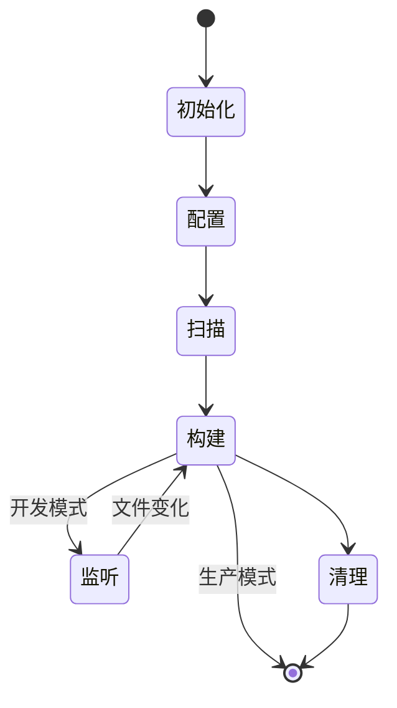
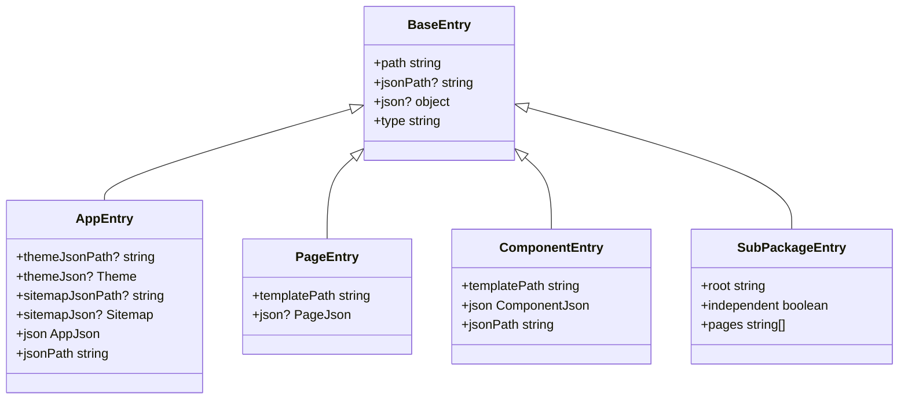

# 上下文API

<cite>
**本文档中引用的文件**  
- [CompilerContext.ts](file://packages/weapp-vite/src/context/CompilerContext.ts)
- [createCompilerContextInstance.ts](file://packages/weapp-vite/src/context/createCompilerContextInstance.ts)
- [getInstance.ts](file://packages/weapp-vite/src/context/getInstance.ts)
- [runtimeState.ts](file://packages/weapp-vite/src/runtime/runtimeState.ts)
- [types/entry.ts](file://packages/weapp-vite/src/types/entry.ts)
- [scanPlugin.ts](file://packages/weapp-vite/src/runtime/scanPlugin.ts)
- [buildPlugin.ts](file://packages/weapp-vite/src/runtime/buildPlugin.ts)
- [configPlugin.ts](file://packages/weapp-vite/src/runtime/configPlugin.ts)
</cite>

## 目录
1. [简介](#简介)
2. [CompilerContext设计与核心作用](#compilercontext设计与核心作用)
3. [上下文属性详解](#上下文属性详解)
4. [公共方法说明](#公共方法说明)
5. [生命周期与状态管理](#生命周期与状态管理)
6. [入口点类型系统](#入口点类型系统)
7. [插件协调机制](#插件协调机制)
8. [构建场景应用模式](#构建场景应用模式)

## 简介
weapp-vite编译上下文API是整个构建系统的核心枢纽，负责协调配置、扫描、构建、监听等各个阶段的执行。CompilerContext作为全局状态容器，贯穿整个编译生命周期，为各个插件和服务提供统一的访问接口。

**Section sources**
- [CompilerContext.ts](file://packages/weapp-vite/src/context/CompilerContext.ts)

## CompilerContext设计与核心作用
CompilerContext类采用单例模式设计，作为整个构建系统的中央控制单元。它通过组合多个服务插件（如configService、scanService、buildService等）来实现模块化架构，每个服务负责特定领域的功能。

该上下文对象在构建流程中扮演着"大脑"的角色，主要职责包括：
- 管理全局运行时状态（runtimeState）
- 协调各个构建阶段的执行顺序
- 提供统一的配置访问接口
- 维护依赖关系和缓存信息
- 支持多目标构建（应用/插件）



**Diagram sources**
- [CompilerContext.ts](file://packages/weapp-vite/src/context/CompilerContext.ts)
- [runtimeState.ts](file://packages/weapp-vite/src/runtime/runtimeState.ts)

**Section sources**
- [CompilerContext.ts](file://packages/weapp-vite/src/context/CompilerContext.ts)

## 上下文属性详解
CompilerContext包含多个核心属性，每个属性对应一个特定的服务或状态管理器：

- **config**：配置服务，管理项目配置、环境变量和构建选项
- **root**：项目根目录，所有路径解析的基准点
- **mode**：当前构建模式（development/production）
- **env**：环境变量集合，包含NODE_ENV等运行时环境信息
- **resolve**：路径解析服务，处理模块解析和别名映射

这些属性通过服务插件注入的方式初始化，确保了松耦合的设计。例如，configService在初始化时会读取项目根目录下的配置文件，并将其解析结果存储在runtimeState.config.options中。

**Section sources**
- [CompilerContext.ts](file://packages/weapp-vite/src/context/CompilerContext.ts)
- [configPlugin.ts](file://packages/weapp-vite/src/runtime/configPlugin.ts)

## 公共方法说明
### getEntry
获取指定路径的入口点信息。该方法会根据文件路径自动识别入口类型（应用、页面、组件等），并返回相应的Entry对象。



**Diagram sources**
- [scanPlugin.ts](file://packages/weapp-vite/src/runtime/scanPlugin.ts)

### scan
执行项目扫描，发现所有入口点并建立依赖关系图。该方法会遍历源码目录，识别应用、页面、组件等入口文件，并收集相关信息。

### build
启动构建流程，根据当前配置和入口点生成最终的产物。该方法会协调各个构建阶段，包括依赖分析、代码转换、资源优化等。

### close
清理上下文资源，包括关闭监听器、释放内存缓存等。在开发服务器停止时调用此方法以确保资源正确释放。

### on、emit
事件系统方法，用于在构建流程中发布和订阅事件。其他插件可以通过这些方法与构建系统进行交互。

**Section sources**
- [CompilerContext.ts](file://packages/weapp-vite/src/context/CompilerContext.ts)
- [scanPlugin.ts](file://packages/weapp-vite/src/runtime/scanPlugin.ts)
- [buildPlugin.ts](file://packages/weapp-vite/src/runtime/buildPlugin.ts)

## 生命周期与状态管理
CompilerContext的生命周期从createCompilerContextInstance开始，到close方法调用结束。整个生命周期可分为以下几个阶段：

1. **初始化阶段**：创建运行时状态，注册各个服务插件
2. **配置阶段**：加载项目配置，解析命令行参数
3. **扫描阶段**：发现入口点，建立依赖关系
4. **构建阶段**：执行代码转换和资源优化
5. **监听阶段**：在开发模式下监听文件变化
6. **清理阶段**：释放资源，关闭连接

状态管理通过RuntimeState接口实现，该接口定义了各个服务的状态存储结构。所有状态变更都必须通过相应服务的方法进行，确保状态的一致性和可追踪性。



**Diagram sources**
- [runtimeState.ts](file://packages/weapp-vite/src/runtime/runtimeState.ts)
- [createCompilerContextInstance.ts](file://packages/weapp-vite/src/context/createCompilerContextInstance.ts)

**Section sources**
- [runtimeState.ts](file://packages/weapp-vite/src/runtime/runtimeState.ts)

## 入口点类型系统
weapp-vite定义了严格的入口点类型系统，用于区分不同类型的构建单元：

### AppEntry
应用入口，包含app.js和app.json文件。这是整个小程序的起点，定义了全局配置和页面路由。

```typescript
interface AppEntry extends BaseEntry {
    type: 'app'
    themeJsonPath?: string
    themeJson?: Theme
    sitemapJsonPath?: string
    sitemapJson?: Sitemap
    json: AppJson
    jsonPath: string
}
```

### PageEntry
页面入口，包含js和wxml文件。每个页面都有独立的逻辑和视图文件。

```typescript
interface PageEntry extends BaseEntry {
    type: 'page'
    templatePath: string
    json?: PageJson
}
```

### ComponentEntry
组件入口，包含js、wxml和json文件，且json文件中component字段为true。

```typescript
interface ComponentEntry extends BaseEntry {
    type: 'component'
    templatePath: string
    json: ComponentJson
    jsonPath: string
}
```

### SubPackageEntry
分包入口，用于支持小程序的分包加载功能。每个分包可以包含自己的页面和资源。



**Diagram sources**
- [types/entry.ts](file://packages/weapp-vite/src/types/entry.ts)

**Section sources**
- [types/entry.ts](file://packages/weapp-vite/src/types/entry.ts)

## 插件协调机制
CompilerContext通过服务插件模式实现插件间的协调工作。每个服务插件在初始化时会向上下文注册自己，并可以访问其他已注册的服务。

插件协调的关键在于依赖注入和事件驱动：
- **依赖注入**：服务插件通过构造函数参数接收CompilerContext实例
- **事件驱动**：通过on/emit方法实现跨插件通信
- **状态共享**：通过runtimeState实现状态共享

这种设计模式确保了插件之间的松耦合，同时又能高效协作。

**Section sources**
- [createCompilerContextInstance.ts](file://packages/weapp-vite/src/context/createCompilerContextInstance.ts)
- [CompilerContext.ts](file://packages/weapp-vite/src/context/CompilerContext.ts)

## 构建场景应用模式
### 开发模式
在开发模式下，CompilerContext会启动监听服务，实时响应文件变化。配置mode为'development'，启用热重载功能。

### 生产构建
生产构建时，mode设置为'production'，启用代码压缩、资源优化等生产级特性。构建结果会被输出到指定目录。

### 分析模式
通过analyze-dashboard功能，可以可视化构建产物的依赖关系和大小分布，帮助优化性能。

不同场景下，CompilerContext会调整其行为策略，但核心API保持一致，确保了使用体验的统一性。

**Section sources**
- [CompilerContext.ts](file://packages/weapp-vite/src/context/CompilerContext.ts)
- [buildPlugin.ts](file://packages/weapp-vite/src/runtime/buildPlugin.ts)
- [configPlugin.ts](file://packages/weapp-vite/src/runtime/configPlugin.ts)