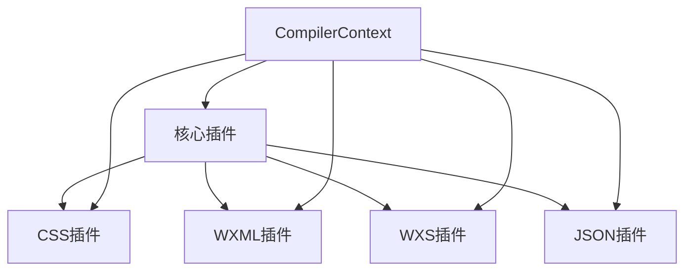
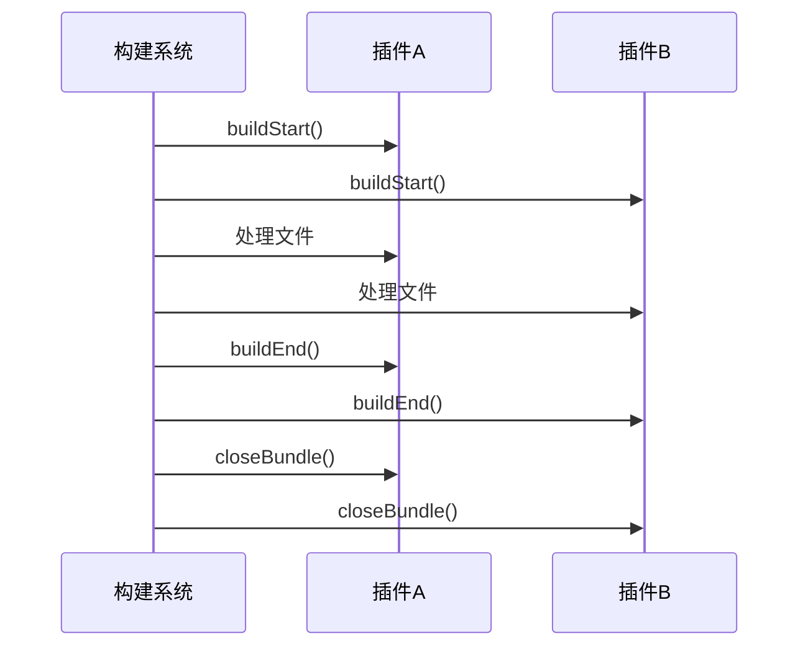
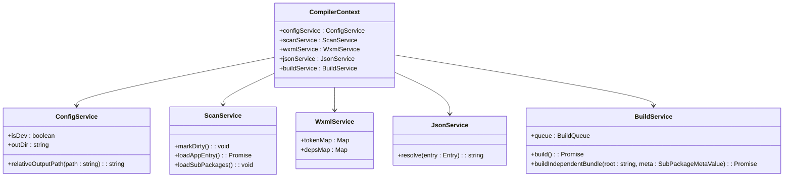
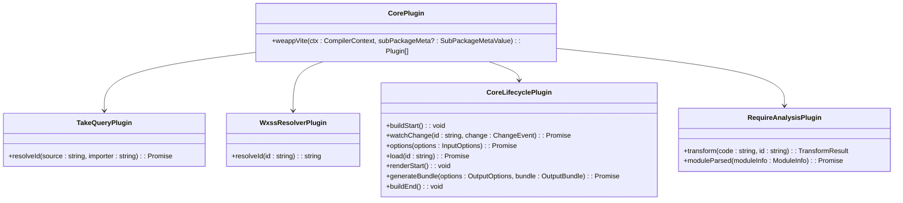
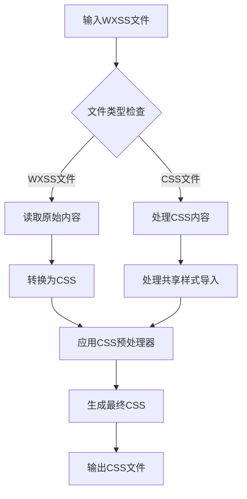
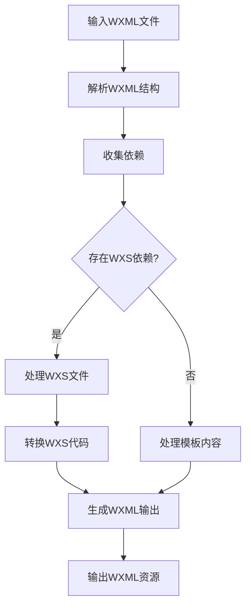
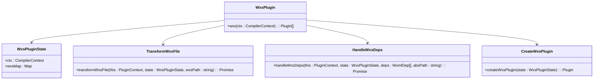
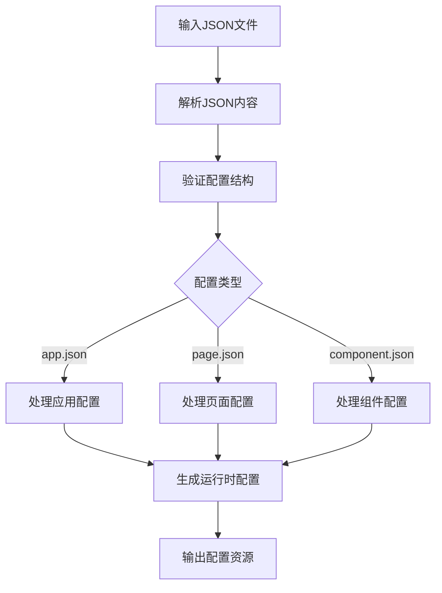
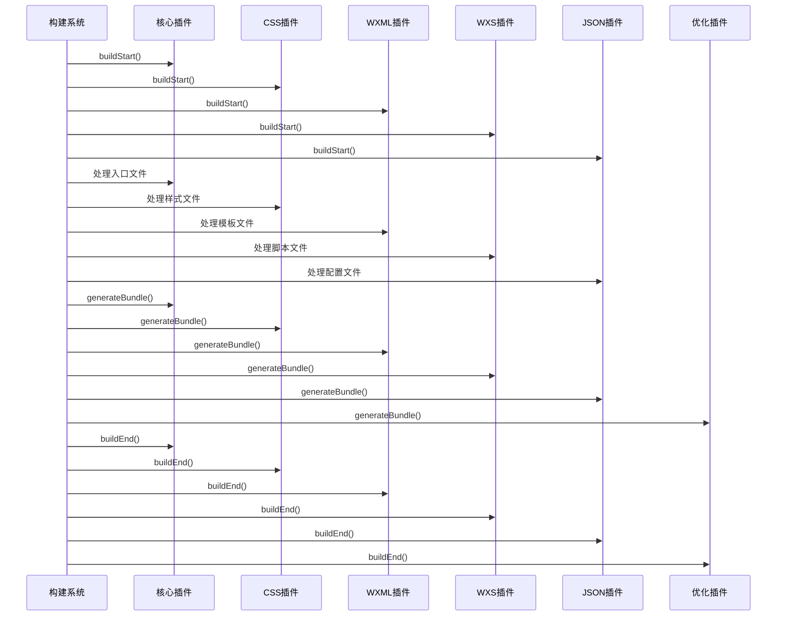
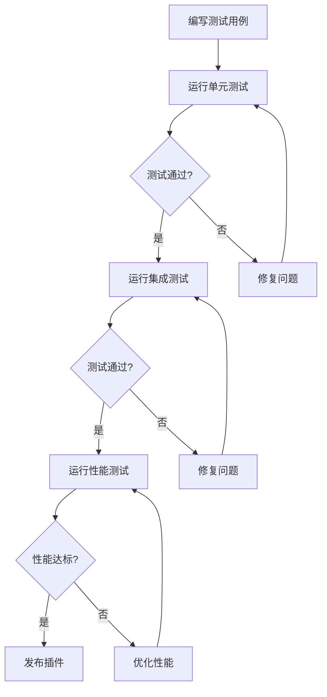

# 插件API

<cite>
**本文档中引用的文件**  
- [core.ts](file://packages/weapp-vite/src/plugins/core.ts)
- [css.ts](file://packages/weapp-vite/src/plugins/css.ts)
- [wxs.ts](file://packages/weapp-vite/src/plugins/wxs.ts)
- [json.ts](file://packages/weapp-vite/src/json.ts)
- [context.ts](file://packages/weapp-vite/src/types/context.ts)
- [wxmlEmit.ts](file://packages/weapp-vite/src/plugins/utils/wxmlEmit.ts)
- [handle.ts](file://packages/weapp-vite/src/wxml/handle.ts)
- [index.ts](file://packages/weapp-vite/src/wxs/index.ts)
</cite>

## 目录
1. [插件系统设计理念与架构](#插件系统设计理念与架构)
2. [插件生命周期钩子](#插件生命周期钩子)
3. [上下文对象CompilerContext](#上下文对象compilercontext)
4. [核心插件实现机制](#核心插件实现机制)
5. [CSS插件](#css插件)
6. [WXML插件](#wxml插件)
7. [WXS插件](#wxs插件)
8. [JSON插件](#json插件)
9. [插件执行顺序与依赖关系](#插件执行顺序与依赖关系)
10. [自定义插件开发示例](#自定义插件开发示例)
11. [插件调试与测试方法](#插件调试与测试方法)

## 插件系统设计理念与架构

weapp-vite插件系统基于Vite和Rolldown构建，采用模块化设计，通过一系列预定义的插件来处理小程序特有的文件类型和构建需求。系统核心设计理念是将小程序的各种资源文件（如WXML、WXSS、WXS、JSON等）转换为标准的Web资源，同时保持小程序的运行时特性。

插件架构采用分层设计，主要包括核心插件、CSS插件、WXML插件、WXS插件和JSON插件等。每个插件负责处理特定类型的文件，通过Vite的插件生命周期钩子与构建系统进行交互。插件之间通过共享的CompilerContext对象进行通信和数据交换。

**插件架构图**


**Diagram sources**
- [core.ts](file://packages/weapp-vite/src/plugins/core.ts)
- [css.ts](file://packages/weapp-vite/src/plugins/css.ts)
- [wxs.ts](file://packages/weapp-vite/src/plugins/wxs.ts)

## 插件生命周期钩子

weapp-vite插件系统提供了完整的生命周期钩子，允许插件在构建过程的不同阶段执行特定操作。主要生命周期钩子包括：

- **buildStart**: 构建开始时调用，用于初始化插件状态和清理缓存
- **buildEnd**: 构建结束时调用，用于执行构建后的清理和汇总操作
- **closeBundle**: 捆绑完成后调用，用于执行最终的资源处理和优化

这些钩子遵循Vite插件API规范，确保与Vite生态系统的兼容性。插件通过实现这些钩子来参与构建流程，处理特定类型的文件或执行特定的构建任务。



**Diagram sources**
- [core.ts](file://packages/weapp-vite/src/plugins/core.ts)
- [wxs.ts](file://packages/weapp-vite/src/plugins/wxs.ts)

## 上下文对象CompilerContext

CompilerContext是weapp-vite插件系统的核心数据结构，为插件提供访问编译器状态和配置的能力。该对象包含了构建过程中所需的各种服务和配置信息。

### 主要属性和方法

- **configService**: 配置服务，提供对项目配置的访问
- **scanService**: 扫描服务，用于扫描项目文件和依赖
- **wxmlService**: WXML处理服务，管理WXML文件的解析和转换
- **jsonService**: JSON处理服务，处理小程序配置文件
- **buildService**: 构建服务，控制构建流程

这些服务通过CompilerContext对象暴露给插件，使插件能够访问构建系统的内部状态和功能。



**Diagram sources**
- [context.ts](file://packages/weapp-vite/src/types/context.ts)
- [core.ts](file://packages/weapp-vite/src/plugins/core.ts)

## 核心插件实现机制

核心插件是weapp-vite插件系统的基础，负责协调其他插件的工作并处理构建流程的核心逻辑。核心插件通过weappVite函数创建，返回一组预定义的插件实例。

### 核心插件组成

核心插件由多个子插件组成，包括：
- **take查询插件**: 处理模块导入的take查询
- **WXSS解析插件**: 解析WXSS文件并转换为CSS
- **核心生命周期插件**: 管理构建生命周期
- **require分析插件**: 分析模块依赖关系

这些子插件协同工作，确保构建流程的正确执行。



**Diagram sources**
- [core.ts](file://packages/weapp-vite/src/plugins/core.ts)

## CSS插件

CSS插件负责处理小程序的WXSS文件，将其转换为标准的CSS文件，并处理相关的样式导入和依赖关系。

### 主要功能

- **WXSS到CSS转换**: 将WXSS文件转换为CSS文件
- **样式导入处理**: 处理@import语句和样式依赖
- **共享样式管理**: 管理分包间的共享样式
- **样式缓存**: 缓存处理后的样式以提高构建性能

CSS插件通过generateBundle钩子在构建结束时处理所有样式文件，确保样式资源的正确生成和优化。



**Diagram sources**
- [css.ts](file://packages/weapp-vite/src/plugins/css.ts)

## WXML插件

WXML插件负责处理小程序的WXML模板文件，解析模板结构并处理相关的依赖关系。

### 主要功能

- **WXML解析**: 解析WXML文件的结构和内容
- **依赖收集**: 收集WXML文件中的依赖（如WXS文件）
- **模板转换**: 转换WXML模板为可执行的代码
- **事件处理**: 处理模板中的事件绑定

WXML插件通过renderStart和generateBundle钩子参与构建流程，在渲染开始时处理WXML文件，并在生成bundle时输出处理后的资源。



**Diagram sources**
- [wxmlEmit.ts](file://packages/weapp-vite/src/plugins/utils/wxmlEmit.ts)
- [handle.ts](file://packages/weapp-vite/src/wxml/handle.ts)

## WXS插件

WXS插件负责处理小程序的WXS脚本文件，将其转换为可在小程序环境中运行的JavaScript代码。

### 主要功能

- **WXS语法转换**: 将WXS语法转换为标准JavaScript
- **模块系统处理**: 处理WXS的模块导入和导出
- **内置API转换**: 将WXS的内置API转换为小程序等效实现
- **依赖分析**: 分析WXS文件的依赖关系

WXS插件通过buildStart和buildEnd钩子管理WXS文件的处理流程，在构建开始时清理状态，在构建结束时处理所有WXS依赖并输出结果。



**Diagram sources**
- [wxs.ts](file://packages/weapp-vite/src/plugins/wxs.ts)
- [index.ts](file://packages/weapp-vite/src/wxs/index.ts)

## JSON插件

JSON插件负责处理小程序的各种JSON配置文件，包括app.json、page.json等，确保配置的正确解析和应用。

### 主要功能

- **JSON配置解析**: 解析小程序的JSON配置文件
- **配置验证**: 验证JSON配置的正确性
- **配置转换**: 将JSON配置转换为运行时可用的格式
- **资源生成**: 根据JSON配置生成相应的资源文件

JSON插件通过defineAppJson、definePageJson等辅助函数提供类型安全的配置定义方式，使开发者能够以编程方式定义和管理小程序配置。



**Diagram sources**
- [json.ts](file://packages/weapp-vite/src/json.ts)

## 插件执行顺序与依赖关系

weapp-vite插件系统通过enforce属性和插件注册顺序来管理插件的执行顺序，确保构建流程的正确性。

### 执行顺序规则

- **enforce: 'pre'**: 在其他插件之前执行
- **enforce: 'post'**: 在其他插件之后执行
- **默认顺序**: 按照插件注册的顺序执行

核心插件通常设置为enforce: 'pre'，以确保在其他插件之前处理基础构建任务。而优化类插件通常设置为enforce: 'post'，在所有资源处理完成后执行。



**Diagram sources**
- [core.ts](file://packages/weapp-vite/src/plugins/core.ts)
- [css.ts](file://packages/weapp-vite/src/plugins/css.ts)
- [wxs.ts](file://packages/weapp-vite/src/plugins/wxs.ts)

## 自定义插件开发示例

开发自定义weapp-vite插件需要遵循Vite插件API规范，并考虑小程序的特殊需求。以下是一个简单的自定义插件示例：

```typescript
import type { Plugin } from 'vite'
import type { CompilerContext } from './context'

export function myCustomPlugin(ctx: CompilerContext): Plugin {
  return {
    name: 'my-custom-plugin',
    enforce: 'pre',
    
    buildStart() {
      // 初始化插件状态
      console.log('自定义插件开始构建')
    },
    
    resolveId(id) {
      // 自定义模块解析逻辑
      if (id.startsWith('my-prefix:')) {
        return this.resolve(id.slice(10), undefined, { skipSelf: true })
      }
      return null
    },
    
    load(id) {
      // 自定义文件加载逻辑
      if (id.endsWith('.myext')) {
        const content = fs.readFileSync(id, 'utf-8')
        return `export default ${JSON.stringify(content)}`
      }
      return null
    },
    
    buildEnd() {
      // 构建结束后的清理工作
      console.log('自定义插件构建完成')
    }
  }
}
```

这个示例插件展示了如何创建一个基本的weapp-vite插件，包括名称定义、执行顺序设置和主要生命周期钩子的实现。

**Section sources**
- [core.ts](file://packages/weapp-vite/src/plugins/core.ts)

## 插件调试与测试方法

weapp-vite插件的调试和测试是确保插件质量的重要环节。系统提供了多种调试和测试工具来帮助开发者验证插件的正确性。

### 调试方法

- **日志输出**: 使用内置的logger工具输出调试信息
- **断点调试**: 在开发环境中设置断点进行逐步调试
- **构建分析**: 使用analyze工具分析构建结果

### 测试方法

- **单元测试**: 使用Vitest编写单元测试，验证插件功能
- **集成测试**: 测试插件在完整构建流程中的行为
- **性能测试**: 评估插件对构建性能的影响

测试框架提供了丰富的断言和模拟功能，使开发者能够全面验证插件的行为。



**Section sources**
- [core.ts](file://packages/weapp-vite/src/plugins/core.ts)
- [wxs.ts](file://packages/weapp-vite/src/plugins/wxs.ts)