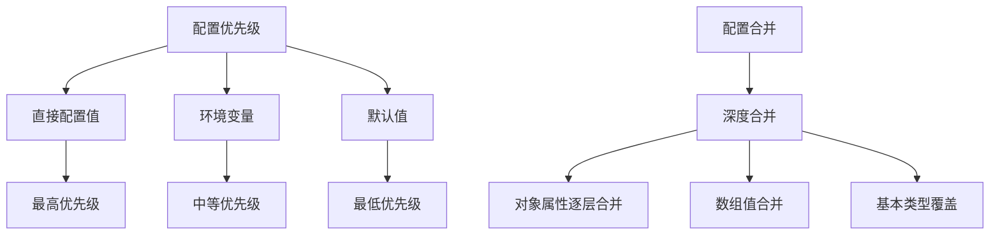
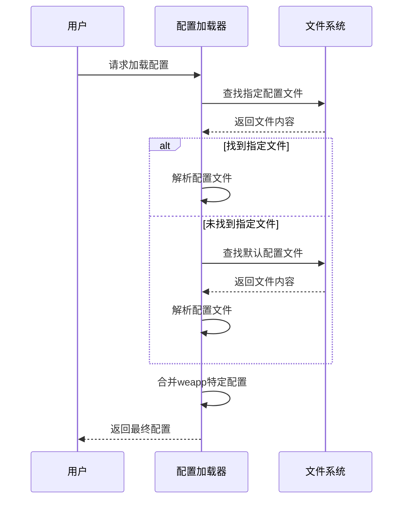
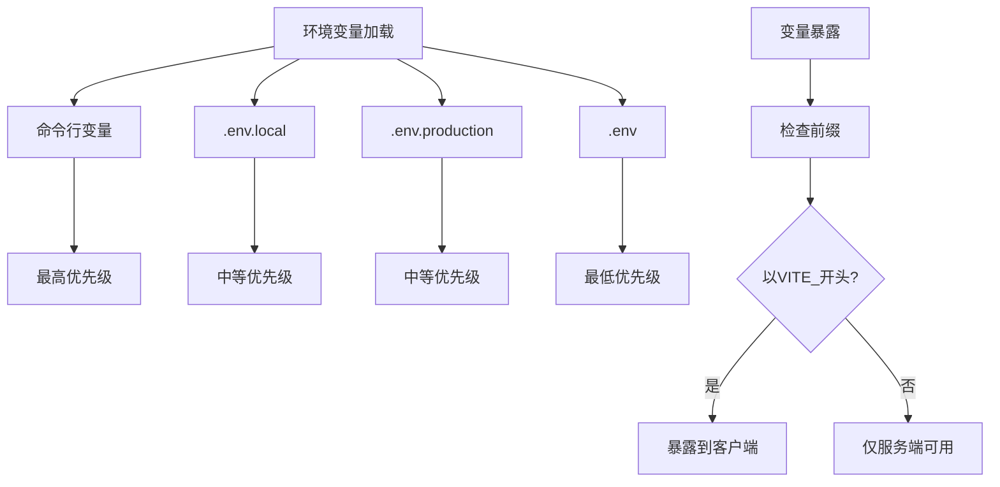

# 配置API

<cite>
**本文档中引用的文件**  
- [config.ts](file://packages/weapp-vite/src/config.ts)
- [defaults.ts](file://packages/weapp-vite/src/defaults.ts)
- [types/config.ts](file://packages/weapp-vite/src/types/config.ts)
- [loadConfig.ts](file://packages/weapp-vite/src/cli/loadConfig.ts)
- [vite.config.ts](file://apps/vite-native/vite.config.ts)
- [vite.config.mts](file://apps/weapp-wechat-zhihu/vite.config.mts)
</cite>

## 目录
1. [介绍](#介绍)
2. [WeappViteConfig接口结构](#weappviteconfig接口结构)
3. [核心配置项详解](#核心配置项详解)
4. [配置项关系与优先级](#配置项关系与优先级)
5. [完整配置示例](#完整配置示例)
6. [配置文件加载机制](#配置文件加载机制)
7. [环境变量处理](#环境变量处理)

## 介绍
WeappViteConfig是weapp-vite框架的核心配置接口，用于定义小程序项目的构建行为和开发环境设置。该配置系统扩展了Vite的UserConfig，提供了针对小程序开发的特定功能和优化。通过WeappViteConfig，开发者可以精确控制项目的源码目录、构建输出、分包策略、组件自动导入等关键环节。

**Section sources**
- [config.ts](file://packages/weapp-vite/src/config.ts#L8-L13)
- [types/config.ts](file://packages/weapp-vite/src/types/config.ts#L329-L477)

## WeappViteConfig接口结构
WeappViteConfig接口定义了weapp-vite的完整配置体系，包含从基础路径设置到高级构建优化的各个层面。该接口通过模块化设计，将相关功能分组管理，如json配置、构建npm、分包配置等。接口设计遵循渐进式增强原则，提供合理的默认值，同时允许开发者根据项目需求进行深度定制。

```mermaid
classDiagram
class WeappViteConfig {
+srcRoot : string
+autoRoutes : boolean
+pluginRoot : string
+jsonAlias : AliasOptions
+npm : NpmOptions
+generate : GenerateOptions
+tsconfigPaths : TsconfigPathsOptions
+subPackages : SubPackageConfig
+copy : CopyOptions
+web : WeappWebConfig
+isAdditionalWxml : Function
+platform : MpPlatform
+jsFormat : JsFormat
+es5 : boolean
+wxml : boolean | EnhanceWxmlOptions
+wxs : boolean
+autoImportComponents : AutoImportComponentsOption
+enhance : EnhanceOptions
+debug : DebugOptions
+worker : WorkerOptions
+chunks : ChunksConfig
}
class AliasOptions {
+entries : Alias[] | { [find : string] : string }
}
class GenerateOptions {
+extensions : GenerateExtensionsOptions
+dirs : GenerateDirsOptions
+filenames : GenerateFilenamesOptions
+templates : GenerateTemplatesConfig
}
class SubPackageConfig {
+[root : string] : SubPackageSettings
}
class SubPackageSettings {
+independent : boolean
+dependencies : (string | RegExp)[]
+inlineConfig : Partial<InlineConfig>
+autoImportComponents : AutoImportComponentsOption
+watchSharedStyles : boolean
+styles : SubPackageStyleConfigEntry | SubPackageStyleConfigEntry[]
}
WeappViteConfig --> AliasOptions : "包含"
WeappViteConfig --> GenerateOptions : "包含"
WeappViteConfig --> SubPackageConfig : "包含"
SubPackageConfig --> SubPackageSettings : "包含"
```

**Diagram sources**
- [types/config.ts](file://packages/weapp-vite/src/types/config.ts#L329-L477)

**Section sources**
- [types/config.ts](file://packages/weapp-vite/src/types/config.ts#L329-L477)

## 核心配置项详解
### srcRoot
**类型定义**: `string`  
**默认值**: `'.'`  
**使用场景**: 指定小程序源码的根目录，即app.json文件所在的目录。对于TypeScript项目，通常设置为`miniprogram`或`src`目录。  
**代码示例**: `srcRoot: 'src'`

### mode
**类型定义**: `string`  
**默认值**: `'development'`  
**使用场景**: 设置Vite的运行模式，影响环境变量的加载和构建行为。开发环境通常为`development`，生产环境为`production`。  
**代码示例**: `mode: 'production'`

### envPrefix
**类型定义**: `string | string[]`  
**默认值**: `'VITE_'`  
**使用场景**: 定义环境变量的前缀，只有以指定前缀开头的环境变量才会被暴露到客户端代码中。  
**代码示例**: `envPrefix: ['VITE_', 'APP_']`

### envDir
**类型定义**: `string`  
**默认值**: 项目根目录  
**使用场景**: 指定环境变量文件所在的目录。可以将不同环境的配置文件集中管理。  
**代码示例**: `envDir: 'envDir'`

### envFile
**类型定义**: `string | false`  
**默认值**: `.env`, `.env.local`等  
**使用场景**: 自定义环境变量文件的名称。设置为`false`可禁用环境文件加载。  
**代码示例**: `envFile: '.env.production'`

### env
**类型定义**: `Record<string, any>`  
**默认值**: 从环境文件加载  
**使用场景**: 直接在配置中定义环境变量，优先级高于文件中的定义。  
**代码示例**: `env: { API_URL: 'https://api.example.com' }`

### define
**类型定义**: `Record<string, string>`  
**默认值**: `{}`  
**使用场景**: 在编译时替换全局常量，常用于定义构建时的常量值。  
**代码示例**: `define: { __VERSION__: '"1.0.0"' }`

### resolve
**类型定义**: `ResolveOptions`  
**默认值**: Vite默认解析选项  
**使用场景**: 配置模块解析行为，如别名、扩展名等。  
**代码示例**: `resolve: { alias: { '@': path.resolve(__dirname, 'src') } }`

### resolveJsonModule
**类型定义**: `boolean`  
**默认值**: `true`  
**使用场景**: 是否允许直接导入JSON模块。  
**代码示例**: `resolveJsonModule: false`

### resolveFallback
**类型定义**: `Record<string, string | false>`  
**默认值**: `{}`  
**使用场景**: 为缺失的模块提供替代实现，常用于兼容性处理。  
**代码示例**: `resolveFallback: { fs: false }`

### resolveMainFields
**类型定义**: `string[]`  
**默认值**: `['module', 'jsnext:main', 'main']`  
**使用场景**: 定义package.json中用于解析模块的字段优先级。  
**代码示例**: `resolveMainFields: ['browser', 'module', 'main']`

### resolveConditions
**类型定义**: `string[]`  
**默认值**: `['import', 'module', 'browser', 'default']`  
**使用场景**: 定义ESM导入条件，影响模块解析行为。  
**代码示例**: `resolveConditions: ['production', 'module', 'browser']`

### resolveExtensions
**类型定义**: `string[]`  
**默认值**: `['.', '.mjs', '.js', '.ts', '.jsx', '.tsx', '.json']`  
**使用场景**: 定义导入时自动尝试的扩展名。  
**代码示例**: `resolveExtensions: ['.js', '.ts', '.vue']`

### resolvePreserveSymlinks
**类型定义**: `boolean`  
**默认值**: `false`  
**使用场景**: 是否保留符号链接的原始路径。  
**代码示例**: `resolvePreserveSymlinks: true`

### resolvePreferRelative
**类型定义**: `boolean`  
**默认值**: `false`  
**使用场景**: 是否优先解析相对路径。  
**代码示例**: `resolvePreferRelative: true`

### resolvePreferBuiltins
**类型定义**: `boolean`  
**默认值**: `true`  
**使用场景**: 是否优先解析内置模块。  
**代码示例**: `resolvePreferBuiltins: false`

### resolveDedupe
**类型定义**: `string[]`  
**默认值**: `[]`  
**使用场景**: 强制某些依赖使用单一实例，避免重复打包。  
**代码示例**: `resolveDedupe: ['vue']`

### resolveAlias
**类型定义**: `Record<string, string> | Array<{ find: string | RegExp, replacement: string }>`  
**默认值**: `{}`  
**使用场景**: 配置模块导入别名，简化路径引用。  
**代码示例**: `resolveAlias: { '@': path.resolve(__dirname, 'src') }`

### resolveExternal
**类型定义**: `string[] | RegExp[] | ((id: string, parentId: string | undefined, isResolved: boolean) => boolean)`  
**默认值**: `[]`  
**使用场景**: 指定哪些模块应该作为外部依赖，不被打包。  
**代码示例**: `resolveExternal: ['lodash']`

### resolveExternalize
**类型定义**: `string[] | RegExp[]`  
**默认值**: `[]`  
**使用场景**: 将指定模块外部化，通常用于npm包。  
**代码示例**: `resolveExternalize: ['@vant/weapp']`

### resolveExternalizePackages
**类型定义**: `boolean | string[] | RegExp[]`  
**默认值**: `false`  
**使用场景**: 控制是否将node_modules中的包外部化。  
**代码示例**: `resolveExternalizePackages: true`

### resolveExternalizePackagesInclude
**类型定义**: `string[] | RegExp[]`  
**默认值**: `[]`  
**使用场景**: 指定哪些包应该被包含在外部化处理中。  
**代码示例**: `resolveExternalizePackagesInclude: ['@vant/weapp']`

### resolveExternalizePackagesExclude
**类型定义**: `string[] | RegExp[]`  
**默认值**: `[]`  
**使用场景**: 指定哪些包应该被排除在外部化处理之外。  
**代码示例**: `resolveExternalizePackagesExclude: ['lodash-es']`

**Section sources**
- [types/config.ts](file://packages/weapp-vite/src/types/config.ts#L329-L477)
- [vite.config.ts](file://apps/vite-native/vite.config.ts#L59-L130)

## 配置项关系与优先级
WeappViteConfig中的配置项遵循明确的优先级规则。直接在配置中定义的值优先级最高，其次是环境变量，最后是默认值。对于合并配置，采用深度合并策略，确保复杂对象的各个属性都能正确继承和覆盖。例如，`enhance`配置项中的`wxml`和`wxs`设置会被顶层的同名配置覆盖。



**Diagram sources**
- [loadConfig.ts](file://packages/weapp-vite/src/cli/loadConfig.ts#L43-L47)

**Section sources**
- [loadConfig.ts](file://packages/weapp-vite/src/cli/loadConfig.ts#L43-L47)

## 完整配置示例
以下是一个典型的weapp-vite配置文件示例，展示了在实际项目中的配置模式：

```typescript
import type { UserConfig } from 'weapp-vite/config'
import path from 'pathe'
import { UnifiedViteWeappTailwindcssPlugin as uvwt } from 'weapp-tailwindcss/vite'
import { TDesignResolver, VantResolver } from 'weapp-vite/auto-import-components/resolvers'

export default <UserConfig>{
  envDir: 'envDir',
  css: {
    preprocessorOptions: {
      scss: {
        silenceDeprecations: ['legacy-js-api'],
        api: 'modern-compiler',
      },
    },
  },
  weapp: {
    jsonAlias: {
      entries: [
        {
          find: '@',
          replacement: path.resolve(__dirname, 'components'),
        },
      ],
    },
    generate: {
      extensions: {
        js: 'ts',
        wxss: 'scss',
      },
      dirs: {
        component: 'components',
        page: 'pages',
      },
    },
    autoImportComponents: {
      globs: ['components/**/*'],
      resolvers: [
        TDesignResolver(),
        VantResolver(),
      ],
    },
    subPackages: {
      packageB: {
        dependencies: [
          'tdesign-miniprogram',
          'miniprogram-computed',
        ],
        independent: true,
      },
    },
    copy: {
      include: ['./pages/index/what-the-fuck.wxss'],
    },
    worker: {
      entry: ['index'],
    },
  },
  build: {
    minify: false,
  },
}
```

**Section sources**
- [vite.config.ts](file://apps/vite-native/vite.config.ts#L1-L138)

## 配置文件加载机制
weapp-vite的配置文件加载机制支持多种配置文件格式，包括`weapp-vite.config.ts`、`vite.config.ts`等。系统会自动查找并加载这些文件，如果同时存在多个配置文件，会将它们的配置进行合并。加载过程优先考虑指定的配置文件，然后是默认的配置文件位置。



**Diagram sources**
- [loadConfig.ts](file://packages/weapp-vite/src/cli/loadConfig.ts#L7-L62)

**Section sources**
- [loadConfig.ts](file://packages/weapp-vite/src/cli/loadConfig.ts#L7-L62)

## 环境变量处理
weapp-vite的环境变量处理机制遵循Vite的标准规范，支持`.env`、`.env.local`、`.env.[mode]`等多种环境文件。环境变量的加载优先级为：命令行变量 > `.env.local` > `.env.[mode]` > `.env`。只有以`envPrefix`指定前缀开头的变量才会被暴露到客户端代码中。



**Diagram sources**
- [config.ts](file://packages/weapp-vite/src/config.ts#L3-L4)
- [types/config.ts](file://packages/weapp-vite/src/types/config.ts#L350-L353)

**Section sources**
- [types/config.ts](file://packages/weapp-vite/src/types/config.ts#L350-L353)