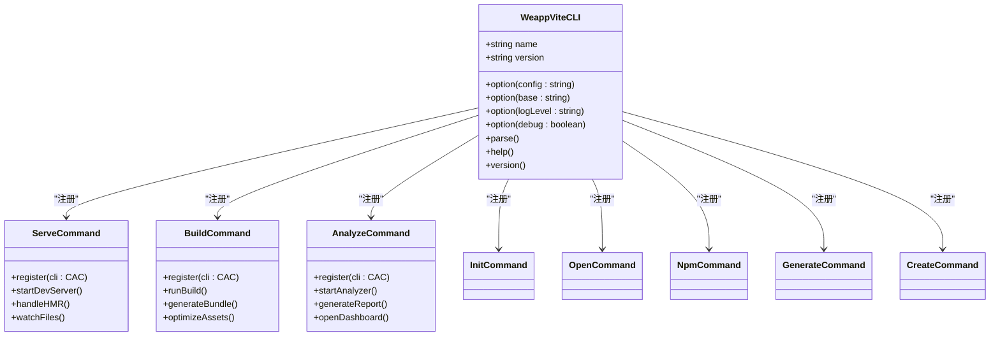

# CLI工具

<cite>
**本文档中引用的文件**  
- [cli.ts](file://packages/create-weapp-vite/src/cli.ts)
- [createProject.ts](file://@weapp-core/init/src/createProject.ts)
- [weapp-vite.js](file://packages/weapp-vite/bin/weapp-vite.js)
- [cli.ts](file://packages/weapp-vite/src/cli.ts)
- [analyze.ts](file://packages/weapp-vite/src/cli/commands/analyze.ts)
- [build.ts](file://packages/weapp-vite/src/cli/commands/build.ts)
- [serve.ts](file://packages/weapp-vite/src/cli/commands/serve.ts)
- [weapp.js](file://packages/weapp-ide-cli/bin/weapp.js)
- [cli.ts](file://packages/weapp-ide-cli/src/cli.ts)
- [index.ts](file://packages/weapp-ide-cli/src/cli/index.ts)
</cite>

## 目录
1. [项目初始化工具](#项目初始化工具)
2. [主CLI工具](#主cli工具)
3. [IDE集成工具](#ide集成工具)
4. [工具集成与工作流](#工具集成与工作流)
5. [使用示例](#使用示例)

## 项目初始化工具

`create-weapp-vite` 是一个用于快速创建微信小程序项目的脚手架工具。它提供了交互式界面和非交互式命令行模式，帮助开发者快速搭建项目结构。

该工具通过 `@weapp-core/init` 模块实现项目创建功能，支持多种模板选择，包括默认模板、Tailwindcss集成模板、Vant组件库模板和TDesign组件库模板。工具使用 `@inquirer/prompts` 提供交互式命令行界面，允许用户选择项目目录、模板类型等配置。

在非交互模式下，可以通过命令行参数直接指定目标目录和模板名称，便于在自动化脚本中使用。工具会检查目标目录是否存在，并在目录已存在时提示用户是否覆盖。


**图源**  
- [cli.ts](file://packages/create-weapp-vite/src/cli.ts#L7-L50)

**本节来源**  
- [cli.ts](file://packages/create-weapp-vite/src/cli.ts#L1-L58)
- [createProject.ts](file://@weapp-core/init/src/createProject.ts)

## 主CLI工具

`weapp-vite` 是核心的命令行工具，提供了开发服务器启动、生产构建、配置分析等关键功能。工具基于 `cac`（Command Anywhere CLI）库构建，支持丰富的命令行选项和子命令。

### 命令结构

主工具通过模块化方式注册各个子命令，包括：
- `dev`/`serve`: 启动开发服务器
- `build`: 生产环境构建
- `analyze`: 构建分析
- `init`: 项目初始化
- `open`: 打开微信开发者工具
- `npm`: NPM包管理
- `generate`: 代码生成

### 开发服务器命令

`dev` 命令用于启动开发服务器，支持热重载和快速刷新。通过 `registerServeCommand` 函数注册，接受配置文件、基础路径、日志级别等选项。

### 生产构建命令

`build` 命令用于生成生产环境的代码包。通过 `registerBuildCommand` 函数注册，支持分析模式、生成报告等功能。

### 配置分析命令

`analyze` 命令用于分析构建结果，帮助开发者优化包大小。通过 `registerAnalyzeCommand` 函数注册，可以启动可视化分析仪表板。



**图源**  
- [cli.ts](file://packages/weapp-vite/src/cli.ts#L1-L50)
- [serve.ts](file://packages/weapp-vite/src/cli/commands/serve.ts)
- [build.ts](file://packages/weapp-vite/src/cli/commands/build.ts)
- [analyze.ts](file://packages/weapp-vite/src/cli/commands/analyze.ts)

**本节来源**  
- [cli.ts](file://packages/weapp-vite/src/cli.ts#L1-L50)
- [weapp-vite.js](file://packages/weapp-vite/bin/weapp-vite.js)

## IDE集成工具

`weapp-ide-cli` 是一个增强版的微信开发者工具命令行接口，提供了更友好的参数体验、路径兼容性和配置管理能力。

### 核心功能

该工具主要提供以下功能：
- 自动识别或记忆微信开发者工具CLI所在位置
- 自动补全路径参数的绝对路径
- 支持与官方指令完全一致的调用方式
- 支持多平台（macOS、Windows、Linux）
- 内置支付宝小程序CLI入口

### 命令结构

工具通过解析命令行参数，将指令转发给微信开发者工具的CLI。支持的常用命令包括：
- `login`: 终端扫码登录账号
- `open`: 启动工具并打开项目
- `preview`: 生成预览二维码
- `upload`: 上传小程序代码
- `quit`: 关闭微信开发者工具

### 支付宝小程序支持

工具内置了对支付宝小程序官方CLI `minidev` 的支持，可以通过 `weapp alipay` 或 `weapp ali` 命令直接转发指令。


**图源**  
- [weapp.js](file://packages/weapp-ide-cli/bin/weapp.js)
- [cli.ts](file://packages/weapp-ide-cli/src/cli.ts)
- [index.ts](file://packages/weapp-ide-cli/src/cli/index.ts)

**本节来源**  
- [weapp.js](file://packages/weapp-ide-cli/bin/weapp.js)
- [cli.ts](file://packages/weapp-ide-cli/src/cli.ts)
- [README.md](file://packages/weapp-ide-cli/README.md)

## 工具集成与工作流

这三个CLI工具在开发工作流中扮演着不同的角色，共同构成了一个完整的开发工具链。

### 工具关系

`create-weapp-vite` 用于项目初始化，`weapp-vite` 用于日常开发和构建，`weapp-ide-cli` 用于与IDE集成。三者通过npm包依赖关系紧密集成。

在 `weapp-vite` 的package.json中，可以看到它依赖了 `weapp-ide-cli`，这表明主工具可以直接调用IDE集成工具的功能，如打开开发者工具等。

### 开发工作流

典型的开发工作流如下：
1. 使用 `create-weapp-vite` 创建新项目
2. 进入项目目录，使用 `weapp-vite dev` 启动开发服务器
3. 在代码编辑器中进行开发，利用热重载功能
4. 使用 `weapp-vite build` 生成生产包
5. 使用 `weapp open` 打开微信开发者工具进行调试
6. 使用 `weapp preview` 生成预览二维码

### 配置管理

`weapp-ide-cli` 提供了配置管理功能，用户可以通过 `weapp config` 命令设置微信开发者工具CLI的路径。配置文件保存在用户主目录下，实现了路径的持久化记忆。

### 跨平台支持

所有工具都考虑了跨平台兼容性：
- `create-weapp-vite` 使用 `node:path` 处理路径
- `weapp-vite` 检查Node.js版本兼容性
- `weapp-ide-cli` 支持不同操作系统的默认安装路径

**本节来源**  
- [package.json](file://packages/weapp-vite/package.json)
- [package.json](file://packages/weapp-ide-cli/package.json)
- [package.json](file://packages/create-weapp-vite/package.json)

## 使用示例

以下是一些常见的使用示例，展示了如何在实际开发中使用这些工具。

### 项目创建

```bash
# 交互式创建项目
create-weapp-vite

# 非交互式创建项目
create-weapp-vite my-app default

# 创建Tailwindcss项目
create-weapp-vite my-app tailwindcss
```

### 开发服务器

```bash
# 启动开发服务器
weapp-vite dev

# 指定配置文件
weapp-vite dev -c vite.config.ts

# 设置基础路径
weapp-vite dev --base /my-app/

# 设置日志级别
weapp-vite dev --logLevel warn
```

### 生产构建

```bash
# 构建生产包
weapp-vite build

# 分析构建结果
weapp-vite build --analyze

# 指定环境模式
weapp-vite build --mode production
```

### IDE集成

```bash
# 打开微信开发者工具
weapp open -p

# 启动指定项目
weapp open --project ./dist/dev/mp-weixin

# 生成预览二维码
weapp preview --project ./dist/dev/mp-weixin

# 上传小程序
weapp upload --project ./dist/build/mp-weixin --version 1.0.0

# 配置CLI路径
weapp config
```

### 支付宝小程序

```bash
# 登录支付宝账号
weapp alipay login

# 预览支付宝小程序
weapp alipay preview --project ./dist/mp-alipay

# 上传支付宝小程序
weapp alipay upload --project ./dist/mp-alipay --version 1.0.0
```

**本节来源**  
- [README.md](file://packages/weapp-ide-cli/README.md)
- [package.json](file://packages/create-weapp-vite/my-app/package.json)