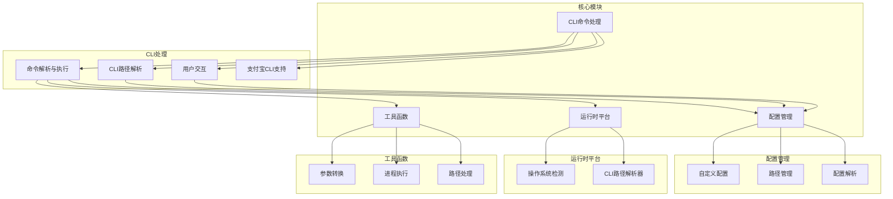
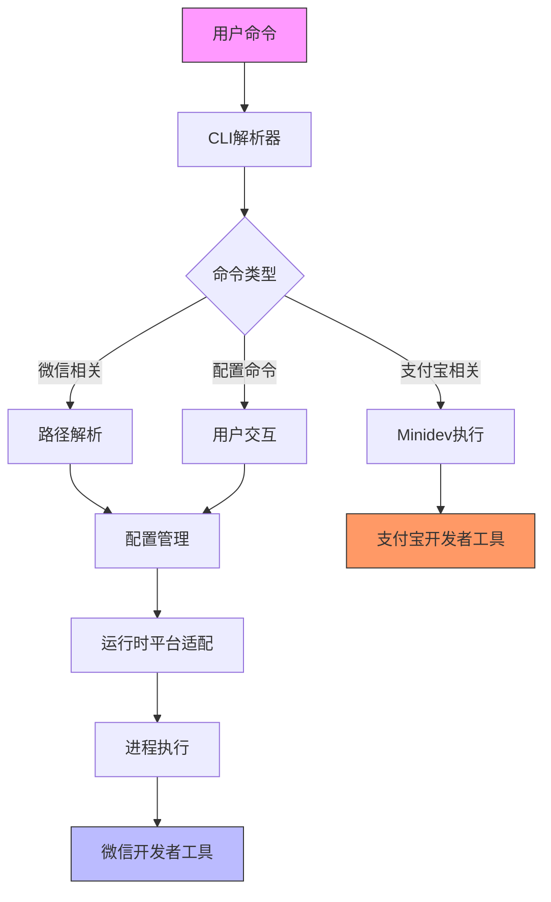
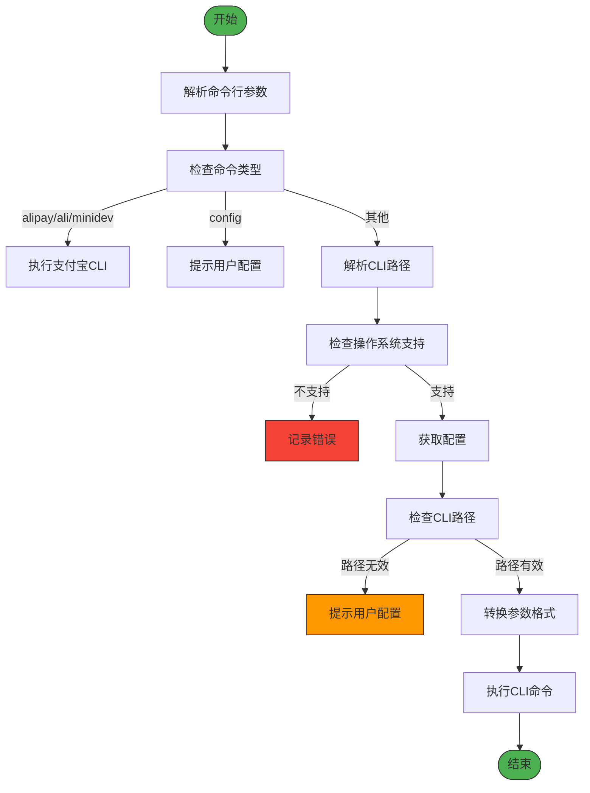
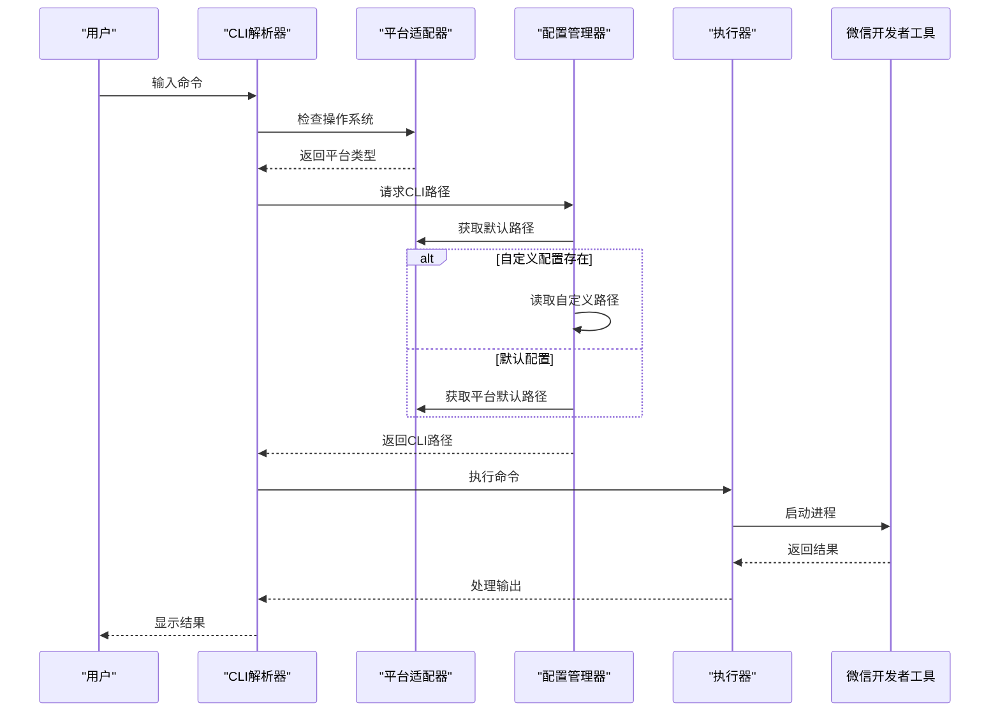

# IDE集成工具

<cite>
**本文档中引用的文件**  
- [package.json](file://packages/weapp-ide-cli/package.json)
- [src/index.ts](file://packages/weapp-ide-cli/src/index.ts)
- [src/cli.ts](file://packages/weapp-ide-cli/src/cli.ts)
- [src/cli/index.ts](file://packages/weapp-ide-cli/src/cli/index.ts)
- [src/cli/run.ts](file://packages/weapp-ide-cli/src/cli/run.ts)
- [src/cli/resolver.ts](file://packages/weapp-ide-cli/src/cli/resolver.ts)
- [src/cli/prompt.ts](file://packages/weapp-ide-cli/src/cli/prompt.ts)
- [src/cli/minidev.ts](file://packages/weapp-ide-cli/src/cli/minidev.ts)
- [src/config/index.ts](file://packages/weapp-ide-cli/src/config/index.ts)
- [src/config/resolver.ts](file://packages/weapp-ide-cli/src/config/resolver.ts)
- [src/config/custom.ts](file://packages/weapp-ide-cli/src/config/custom.ts)
- [src/config/paths.ts](file://packages/weapp-ide-cli/src/config/paths.ts)
- [src/runtime/platform.ts](file://packages/weapp-ide-cli/src/runtime/platform.ts)
- [src/types.ts](file://packages/weapp-ide-cli/src/types.ts)
- [src/utils/index.ts](file://packages/weapp-ide-cli/src/utils/index.ts)
- [src/utils/argv.ts](file://packages/weapp-ide-cli/src/utils/argv.ts)
- [src/utils/exec.ts](file://packages/weapp-ide-cli/src/utils/exec.ts)
- [src/utils/path.ts](file://packages/weapp-ide-cli/src/utils/path.ts)
</cite>

## 目录
1. [简介](#简介)
2. [项目结构](#项目结构)
3. [核心组件](#核心组件)
4. [架构概述](#架构概述)
5. [详细组件分析](#详细组件分析)
6. [依赖分析](#依赖分析)
7. [性能考虑](#性能考虑)
8. [故障排除指南](#故障排除指南)
9. [结论](#结论)

## 简介
weapp-ide-cli 是一个专为微信开发者工具设计的命令行接口集成工具，旨在提升开发效率和自动化能力。该工具通过标准化的CLI接口与微信开发者工具进行通信，支持项目打开、实时预览、调试等功能。它不仅简化了开发工作流，还为构建自动化脚本提供了坚实基础。本工具与主 weapp-vite CLI 紧密协作，特别是在 `open` 命令中实现了无缝集成，使得开发者能够快速启动开发环境。

## 项目结构
weapp-ide-cli 的项目结构遵循模块化设计原则，将功能划分为清晰的目录层级。核心逻辑位于 `src` 目录下，包含CLI处理、配置管理、运行时平台适配和工具函数等关键模块。`bin` 目录存放可执行文件入口，`config` 模块负责路径解析和用户自定义配置，`runtime` 模块处理跨平台兼容性问题。



**图示来源**
- [src/cli/index.ts](file://packages/weapp-ide-cli/src/cli/index.ts)
- [src/config/index.ts](file://packages/weapp-ide-cli/src/config/index.ts)
- [src/runtime/platform.ts](file://packages/weapp-ide-cli/src/runtime/platform.ts)
- [src/utils/index.ts](file://packages/weapp-ide-cli/src/utils/index.ts)

**本节来源**
- [package.json](file://packages/weapp-ide-cli/package.json)
- [src/index.ts](file://packages/weapp-ide-cli/src/index.ts)

## 核心组件
weapp-ide-cli 的核心组件包括命令行解析器、配置管理系统、跨平台运行时和工具函数库。这些组件协同工作，实现了与微信开发者工具的高效通信。命令行解析器负责处理用户输入，配置管理系统管理CLI路径等关键设置，跨平台运行时确保在不同操作系统上的兼容性，工具函数库提供参数转换、进程执行等基础功能。

**本节来源**
- [src/cli.ts](file://packages/weapp-ide-cli/src/cli.ts)
- [src/types.ts](file://packages/weapp-ide-cli/src/types.ts)

## 架构概述
weapp-ide-cli 采用分层架构设计，从上到下分为命令行接口层、业务逻辑层、配置管理层和运行时适配层。这种设计实现了关注点分离，提高了代码的可维护性和可扩展性。工具通过进程间通信与微信开发者工具进行交互，利用标准输入输出流传递数据和状态信息。



**图示来源**
- [src/cli/run.ts](file://packages/weapp-ide-cli/src/cli/run.ts)
- [src/cli/resolver.ts](file://packages/weapp-ide-cli/src/cli/resolver.ts)
- [src/runtime/platform.ts](file://packages/weapp-ide-cli/src/runtime/platform.ts)

## 详细组件分析

### CLI命令处理分析
CLI命令处理模块是weapp-ide-cli的核心，负责解析用户输入并执行相应操作。该模块支持多种命令格式，包括标准参数和别名参数，提供了灵活的使用方式。

#### 命令解析流程


**图示来源**
- [src/cli/run.ts](file://packages/weapp-ide-cli/src/cli/run.ts)
- [src/cli/resolver.ts](file://packages/weapp-ide-cli/src/cli/resolver.ts)
- [src/cli/prompt.ts](file://packages/weapp-ide-cli/src/cli/prompt.ts)

**本节来源**
- [src/cli/run.ts](file://packages/weapp-ide-cli/src/cli/run.ts)
- [src/cli/resolver.ts](file://packages/weapp-ide-cli/src/cli/resolver.ts)
- [src/cli/prompt.ts](file://packages/weapp-ide-cli/src/cli/prompt.ts)

### 配置管理分析
配置管理模块负责处理weapp-ide-cli的配置信息，包括CLI路径的存储和读取。该模块支持自定义配置和默认配置两种模式，提供了灵活的配置管理能力。

#### 配置解析流程
```mermaid
classDiagram
class ConfigResolver {
+getConfig() ResolvedConfig
+resolveCliPath() Promise~{cliPath : string, source : ConfigSource}~
}
class CustomConfig {
+createCustomConfig(config) Promise~string~
+defaultCustomConfigFilePath string
}
class Paths {
+getWindowsDefaultCli() string
+getDarwinDefaultCli() string
+getLinuxCliResolver() CliPathResolver
}
ConfigResolver --> CustomConfig : "使用"
ConfigResolver --> Paths : "使用"
CustomConfig --> Paths : "依赖"
note right of ConfigResolver
负责解析配置源，
支持自定义和默认配置
end
note right of CustomConfig
管理用户自定义配置，
存储在全局位置
end
note right of Paths
提供各平台默认CLI路径
end
```

**图示来源**
- [src/config/resolver.ts](file://packages/weapp-ide-cli/src/config/resolver.ts)
- [src/config/custom.ts](file://packages/weapp-ide-cli/src/config/custom.ts)
- [src/config/paths.ts](file://packages/weapp-ide-cli/src/config/paths.ts)

**本节来源**
- [src/config/index.ts](file://packages/weapp-ide-cli/src/config/index.ts)
- [src/config/resolver.ts](file://packages/weapp-ide-cli/src/config/resolver.ts)

### 运行时平台分析
运行时平台模块处理跨平台兼容性问题，确保weapp-ide-cli在不同操作系统上的正常运行。该模块识别当前操作系统类型，并根据平台特性提供相应的CLI路径解析策略。

#### 平台适配逻辑


**图示来源**
- [src/runtime/platform.ts](file://packages/weapp-ide-cli/src/runtime/platform.ts)
- [src/utils/exec.ts](file://packages/weapp-ide-cli/src/utils/exec.ts)

**本节来源**
- [src/runtime/platform.ts](file://packages/weapp-ide-cli/src/runtime/platform.ts)
- [src/utils/exec.ts](file://packages/weapp-ide-cli/src/utils/exec.ts)

## 依赖分析
weapp-ide-cli 的依赖关系清晰，主要依赖于几个核心外部库和内部模块。这些依赖关系确保了工具的功能完整性和跨平台兼容性。

```mermaid
graph TD
A[weapp-ide-cli] --> B[execa]
A --> C[fs-extra]
A --> D[pathe]
A --> E[@weapp-core/logger]
B --> F[进程执行]
C --> G[文件系统操作]
D --> H[路径处理]
E --> I[日志记录]
A --> J[CLI解析]
A --> K[配置管理]
A --> L[平台适配]
A --> M[工具函数]
J --> K
J --> L
J --> M
K --> G
L --> H
M --> F
M --> H
style A fill:#2196F3,stroke:#333
style B fill:#4CAF50,stroke:#333
style C fill:#4CAF50,stroke:#333
style D fill:#4CAF50,stroke:#333
style E fill:#4CAF50,stroke:#333
```

**图示来源**
- [package.json](file://packages/weapp-ide-cli/package.json)
- [src/index.ts](file://packages/weapp-ide-cli/src/index.ts)

**本节来源**
- [package.json](file://packages/weapp-ide-cli/package.json)
- [src/index.ts](file://packages/weapp-ide-cli/src/index.ts)

## 性能考虑
weapp-ide-cli 在设计时充分考虑了性能因素，通过多种优化策略确保快速响应和高效执行。工具采用异步操作避免阻塞主线程，使用缓存机制减少重复的路径解析操作，并通过流式处理标准输出/错误流实现即时反馈。参数转换过程经过优化，确保在各种命令组合下都能快速完成。此外，配置读取和路径解析都实现了懒加载和结果缓存，减少了不必要的文件系统访问。

## 故障排除指南
当使用weapp-ide-cli遇到问题时，可以参考以下常见问题的解决方案：

**本节来源**
- [src/cli/run.ts](file://packages/weapp-ide-cli/src/cli/run.ts)
- [src/cli/prompt.ts](file://packages/weapp-ide-cli/src/cli/prompt.ts)
- [src/runtime/platform.ts](file://packages/weapp-ide-cli/src/runtime/platform.ts)

### 常见连接问题
1. **CLI路径未找到**：执行 `weapp config` 命令手动设置微信开发者工具CLI路径
2. **平台不支持**：确认当前操作系统是否在支持列表中（Windows、macOS、Linux）
3. **权限问题**：确保CLI可执行文件具有执行权限

### 版本兼容性问题
1. **检查微信开发者工具版本**：确保安装的是最新版本
2. **更新weapp-ide-cli**：使用包管理器更新到最新版本
3. **验证CLI接口兼容性**：参考微信官方文档确认CLI命令格式

### 配置问题
1. **重置配置**：删除自定义配置文件后重新配置
2. **检查环境变量**：确保PATH环境变量包含必要的工具路径
3. **验证路径格式**：确保输入的路径格式正确且文件存在

## 结论
weapp-ide-cli 作为一个专业的IDE集成工具，通过精心设计的架构和清晰的模块划分，实现了与微信开发者工具的高效集成。工具不仅提供了基本的命令行接口功能，还通过智能化的配置管理和跨平台适配，大大提升了开发体验。其与主weapp-vite CLI的紧密协作，特别是在open命令中的集成，为开发者构建了完整的自动化工作流解决方案。未来可以通过增加更多高级功能和优化用户体验，进一步提升工具的价值。