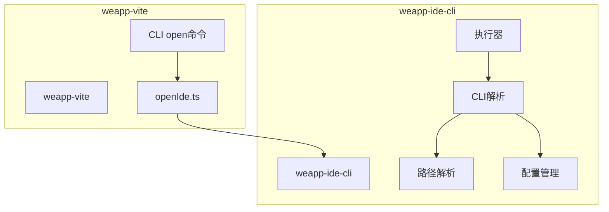
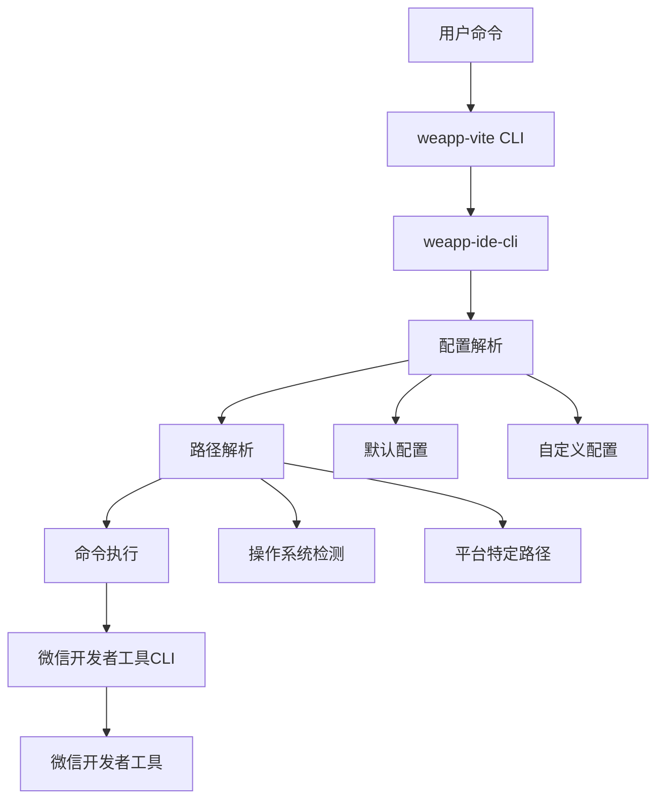
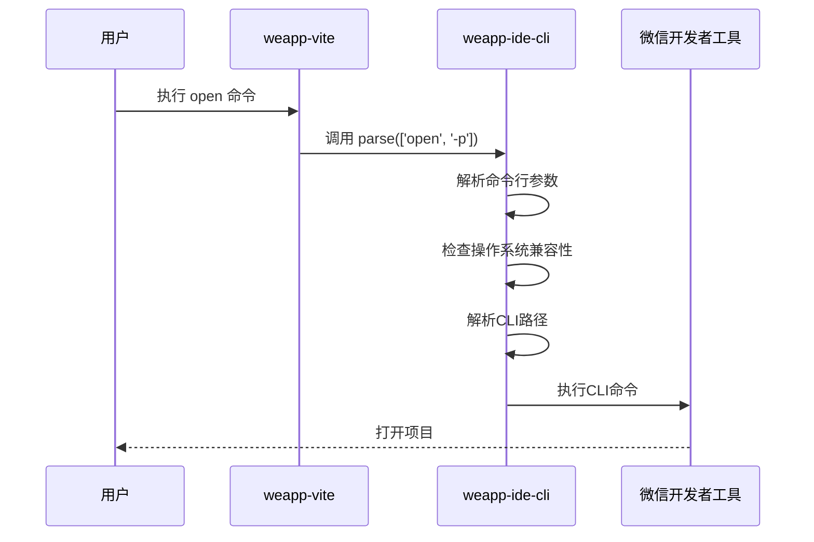
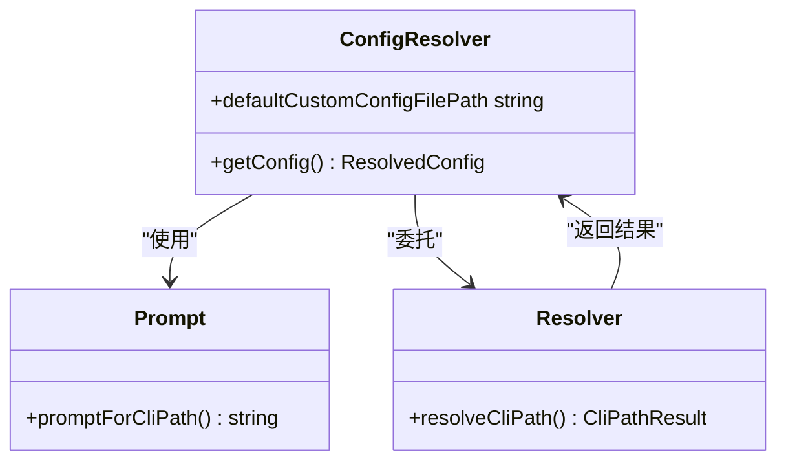
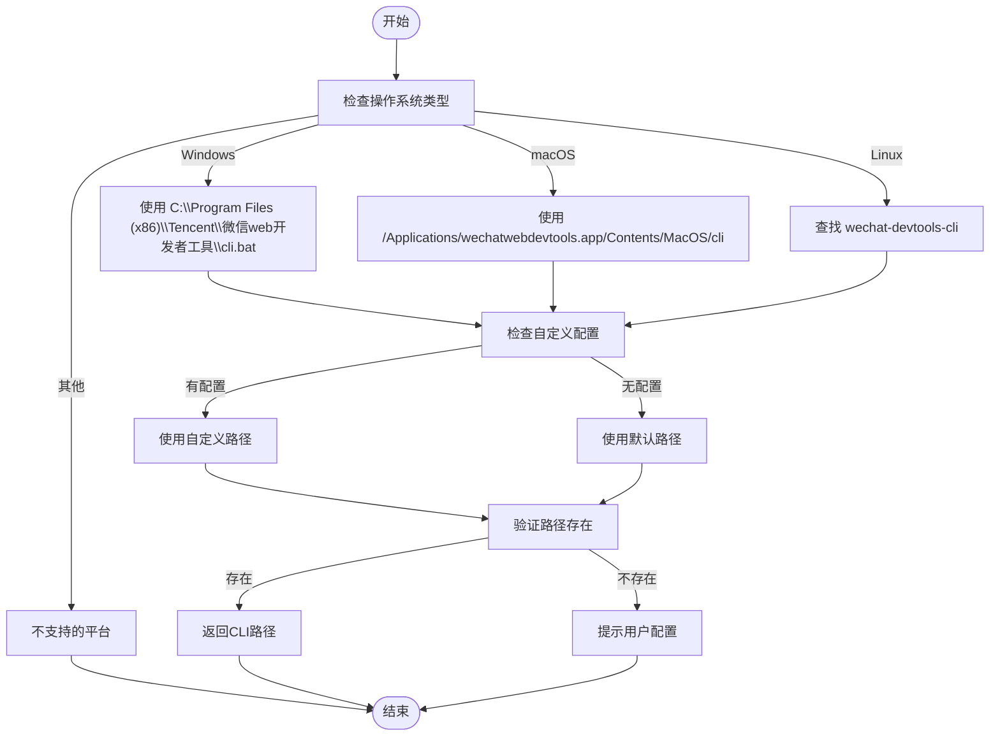

# IDE集成

<cite>
**本文档引用的文件**
- [openIde.ts](file://packages/weapp-vite/src/cli/openIde.ts)
- [run.ts](file://packages/weapp-ide-cli/src/cli/run.ts)
- [resolver.ts](file://packages/weapp-ide-cli/src/cli/resolver.ts)
- [config/resolver.ts](file://packages/weapp-ide-cli/src/config/resolver.ts)
- [prompt.ts](file://packages/weapp-ide-cli/src/cli/prompt.ts)
- [projectConfig.ts](file://@weapp-core/init/src/projectConfig.ts)
- [getProjectConfig.ts](file://packages/weapp-vite/src/utils/projectConfig.ts)
- [open.ts](file://packages/weapp-vite/src/cli/commands/open.ts)
- [platform.ts](file://packages/weapp-ide-cli/src/runtime/platform.ts)
- [exec.ts](file://packages/weapp-ide-cli/src/utils/exec.ts)
</cite>

## 目录
1. [简介](#简介)
2. [项目结构](#项目结构)
3. [核心组件](#核心组件)
4. [架构概述](#架构概述)
5. [详细组件分析](#详细组件分析)
6. [依赖分析](#依赖分析)
7. [性能考虑](#性能考虑)
8. [故障排除指南](#故障排除指南)
9. [结论](#结论)

## 简介
weapp-vite 提供了与微信开发者工具的深度集成，通过 `weapp-ide-cli` 封装了微信官方命令行工具，实现了项目自动打开、配置同步、跨平台兼容等功能。本文档详细介绍了IDE集成的机制、使用方法、通信协议、配置同步、跨平台配置、实际使用示例、性能优化和常见问题解决方案。

## 项目结构
weapp-vite 的 IDE 集成功能主要分布在 `packages/weapp-ide-cli` 和 `packages/weapp-vite` 两个包中，通过模块化设计实现了功能分离和复用。



**图示来源**
- [openIde.ts](file://packages/weapp-vite/src/cli/openIde.ts)
- [run.ts](file://packages/weapp-ide-cli/src/cli/run.ts)

**章节来源**
- [openIde.ts](file://packages/weapp-vite/src/cli/openIde.ts)
- [run.ts](file://packages/weapp-ide-cli/src/cli/run.ts)

## 核心组件
weapp-vite 的 IDE 集成由多个核心组件构成，包括命令行接口、路径解析器、配置管理器和执行器，这些组件协同工作以实现与微信开发者工具的无缝集成。

**章节来源**
- [openIde.ts](file://packages/weapp-vite/src/cli/openIde.ts)
- [run.ts](file://packages/weapp-ide-cli/src/cli/run.ts)
- [resolver.ts](file://packages/weapp-ide-cli/src/cli/resolver.ts)

## 架构概述
weapp-vite 的 IDE 集成架构采用分层设计，从上层应用到下层系统调用，每一层都有明确的职责和接口。



**图示来源**
- [run.ts](file://packages/weapp-ide-cli/src/cli/run.ts)
- [config/resolver.ts](file://packages/weapp-ide-cli/src/config/resolver.ts)
- [platform.ts](file://packages/weapp-ide-cli/src/runtime/platform.ts)

## 详细组件分析

### openIde 组件分析
openIde 组件是 weapp-vite 与微信开发者工具集成的核心，负责处理打开IDE的请求和执行。



**图示来源**
- [openIde.ts](file://packages/weapp-vite/src/cli/openIde.ts)
- [run.ts](file://packages/weapp-ide-cli/src/cli/run.ts)

**章节来源**
- [openIde.ts](file://packages/weapp-vite/src/cli/openIde.ts)
- [run.ts](file://packages/weapp-ide-cli/src/cli/run.ts)

### 配置管理组件分析
配置管理组件负责处理IDE集成所需的配置信息，包括CLI路径、默认设置等。



**图示来源**
- [config/resolver.ts](file://packages/weapp-ide-cli/src/config/resolver.ts)
- [prompt.ts](file://packages/weapp-ide-cli/src/cli/prompt.ts)
- [resolver.ts](file://packages/weapp-ide-cli/src/cli/resolver.ts)

**章节来源**
- [config/resolver.ts](file://packages/weapp-ide-cli/src/config/resolver.ts)
- [prompt.ts](file://packages/weapp-ide-cli/src/cli/prompt.ts)

### 路径解析组件分析
路径解析组件负责在不同操作系统上正确解析微信开发者工具CLI的路径。



**图示来源**
- [platform.ts](file://packages/weapp-ide-cli/src/runtime/platform.ts)
- [resolver.ts](file://packages/weapp-ide-cli/src/cli/resolver.ts)

**章节来源**
- [platform.ts](file://packages/weapp-ide-cli/src/runtime/platform.ts)
- [resolver.ts](file://packages/weapp-ide-cli/src/cli/resolver.ts)

## 依赖分析
weapp-vite 的 IDE 集成功能依赖于多个内部和外部组件，这些依赖关系确保了功能的完整性和稳定性。

```mermaid
graph LR
A[weapp-vite] --> B[weapp-ide-cli]
B --> C[@weapp-core/logger]
B --> D[execa]
B --> E[fs-extra]
B --> F[pathe]
A --> G[@weapp-core/logger]
subgraph "外部依赖"
D
E
F
end
subgraph "内部依赖"
B
C
G
end
```

**图示来源**
- [package.json](file://packages/weapp-ide-cli/package.json)
- [openIde.ts](file://packages/weapp-vite/src/cli/openIde.ts)

**章节来源**
- [package.json](file://packages/weapp-ide-cli/package.json)
- [openIde.ts](file://packages/weapp-vite/src/cli/openIde.ts)

## 性能考虑
weapp-vite 的 IDE 集成功能在设计时考虑了性能优化，通过缓存、异步操作和错误处理机制来提高响应速度和用户体验。

**章节来源**
- [run.ts](file://packages/weapp-ide-cli/src/cli/run.ts)
- [exec.ts](file://packages/weapp-ide-cli/src/utils/exec.ts)

## 故障排除指南
本节提供常见IDE集成问题的解决方案，帮助用户快速定位和解决问题。

**章节来源**
- [run.ts](file://packages/weapp-ide-cli/src/cli/run.ts)
- [prompt.ts](file://packages/weapp-ide-cli/src/cli/prompt.ts)
- [resolver.ts](file://packages/weapp-ide-cli/src/cli/resolver.ts)

## 结论
weapp-vite 通过 `weapp-ide-cli` 提供了强大而灵活的微信开发者工具集成能力，实现了跨平台兼容、配置管理、路径解析和命令执行等功能。这种设计不仅提高了开发效率，还确保了在不同环境下的稳定性和可靠性。