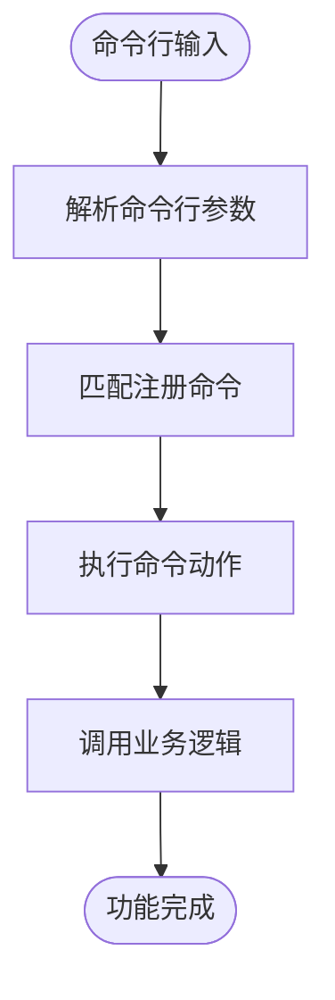
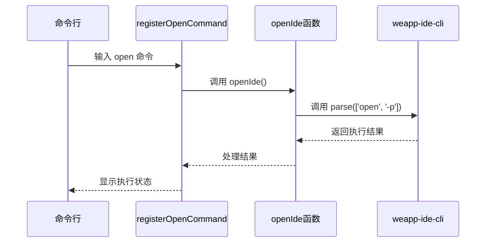
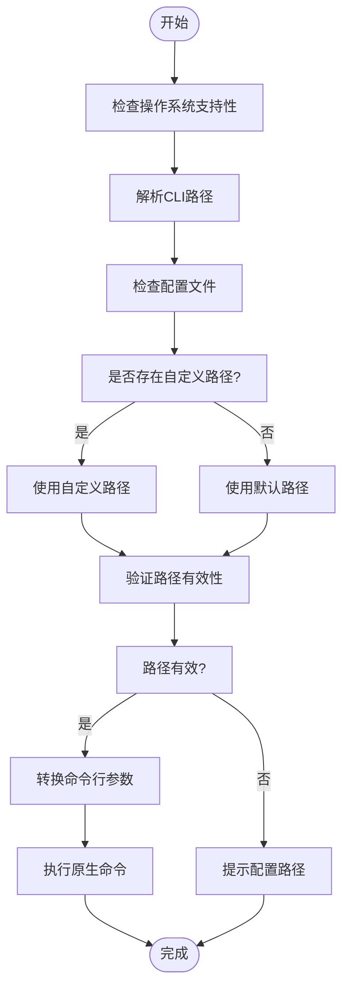
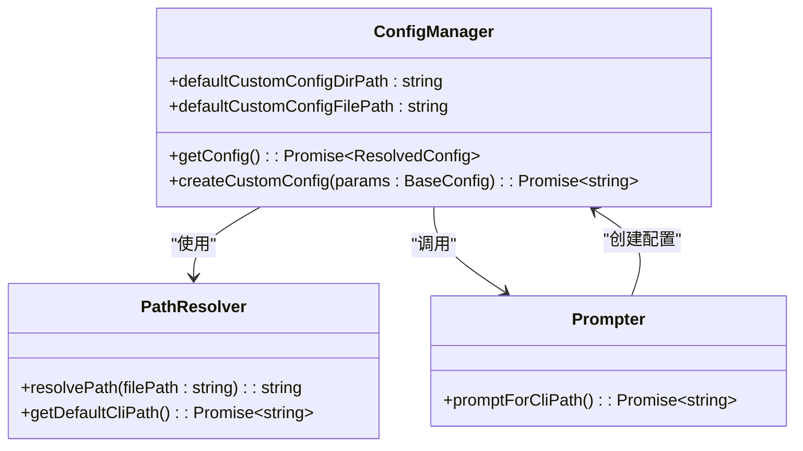
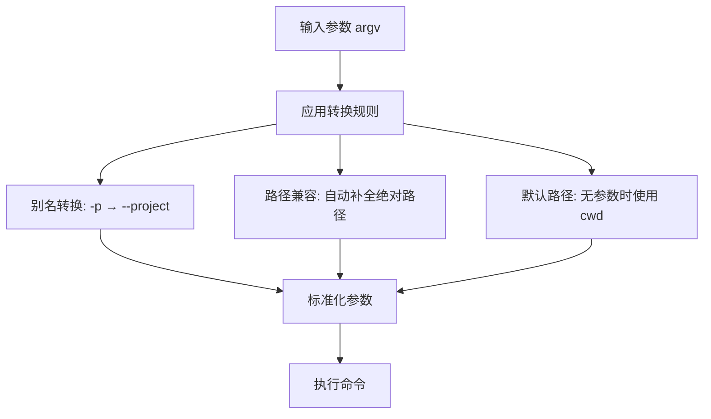
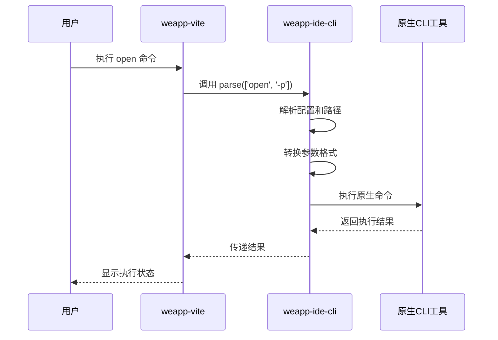
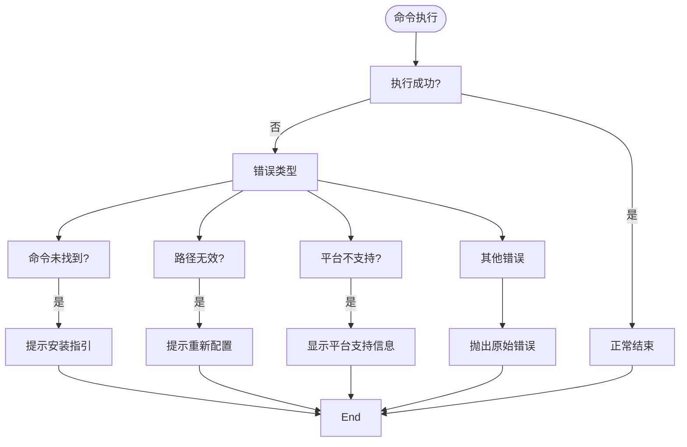
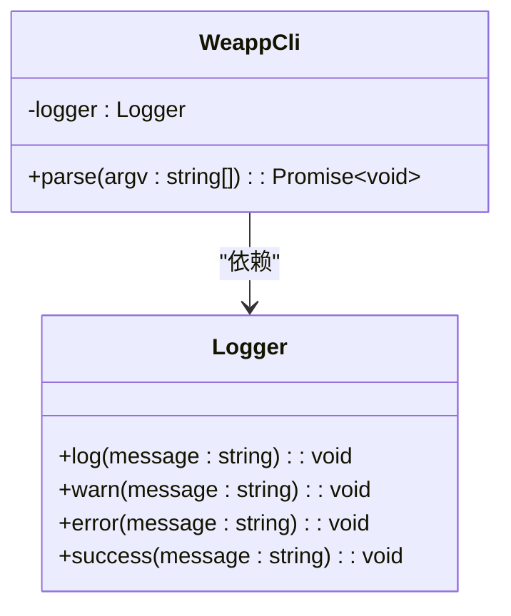

# 基础集成

<cite>
**本文档引用文件**  
- [openIde.ts](file://packages/weapp-vite/src/cli/openIde.ts)
- [commands/open.ts](file://packages/weapp-vite/src/cli/commands/open.ts)
- [weapp-ide-cli/README.md](file://packages/weapp-ide-cli/README.md)
- [weapp-ide-cli/package.json](file://packages/weapp-ide-cli/package.json)
- [weapp-ide-cli/src/cli/run.ts](file://packages/weapp-ide-cli/src/cli/run.ts)
- [weapp-ide-cli/src/cli/resolver.ts](file://packages/weapp-ide-cli/src/cli/resolver.ts)
- [weapp-ide-cli/src/cli/prompt.ts](file://packages/weapp-ide-cli/src/cli/prompt.ts)
- [weapp-ide-cli/src/utils/argv.ts](file://packages/weapp-ide-cli/src/utils/argv.ts)
- [weapp-ide-cli/src/utils/path.ts](file://packages/weapp-ide-cli/src/utils/path.ts)
- [weapp-ide-cli/src/config/resolver.ts](file://packages/weapp-ide-cli/src/config/resolver.ts)
- [weapp-ide-cli/src/config/custom.ts](file://packages/weapp-ide-cli/src/config/custom.ts)
- [weapp-ide-cli/src/cli/minidev.ts](file://packages/weapp-ide-cli/src/cli/minidev.ts)
- [weapp-ide-cli/src/utils/exec.ts](file://packages/weapp-ide-cli/src/utils/exec.ts)
</cite>

## 目录
1. [简介](#简介)
2. [CLI命令注册与执行流程](#cli命令注册与执行流程)
3. [open命令实现机制](#open命令实现机制)
4. [weapp-ide-cli核心功能](#weapp-ide-cli核心功能)
5. [基础集成使用示例](#基础集成使用示例)
6. [通信机制分析](#通信机制分析)
7. [常见问题与解决方案](#常见问题与解决方案)
8. [调试方法与工具](#调试方法与工具)
9. [总结](#总结)

## 简介
weapp-vite基础IDE集成通过weapp-ide-cli封装微信开发者工具的命令行接口，提供更友好的参数体验、路径兼容与配置管理能力。该集成允许开发者通过命令行直接调用微信开发者工具，实现项目自动化加载、预览和上传等功能，极大提升了开发效率。

**本文档引用文件**  
- [weapp-ide-cli/README.md](file://packages/weapp-ide-cli/README.md)

## CLI命令注册与执行流程

weapp-vite的CLI命令系统基于CAC（Command-Action-Command）模式构建，命令注册和执行流程如下：

1. **命令注册**：通过`registerOpenCommand`函数将`open`命令注册到CLI实例
2. **命令解析**：CAC框架解析命令行参数并匹配对应命令
3. **动作执行**：触发对应命令的action回调函数
4. **功能调用**：调用具体的业务逻辑函数实现功能



**Diagram sources**
- [commands/open.ts](file://packages/weapp-vite/src/cli/commands/open.ts)

**Section sources**
- [commands/open.ts](file://packages/weapp-vite/src/cli/commands/open.ts)

## open命令实现机制

open命令的实现机制分为两个层次：weapp-vite层和weapp-ide-cli层。

### weapp-vite层实现
在weapp-vite中，`open`命令通过`registerOpenCommand`注册，并在执行时调用`openIde`函数：



**Diagram sources**
- [commands/open.ts](file://packages/weapp-vite/src/cli/commands/open.ts)
- [openIde.ts](file://packages/weapp-vite/src/cli/openIde.ts)

**Section sources**
- [commands/open.ts](file://packages/weapp-vite/src/cli/commands/open.ts)
- [openIde.ts](file://packages/weapp-vite/src/cli/openIde.ts)

### weapp-ide-cli层实现
weapp-ide-cli接收到命令后，执行以下流程：

1. **平台检查**：验证当前操作系统是否支持
2. **路径解析**：获取微信开发者工具CLI的安装路径
3. **参数转换**：对命令行参数进行标准化处理
4. **命令执行**：调用原生CLI工具



**Diagram sources**
- [weapp-ide-cli/src/cli/run.ts](file://packages/weapp-ide-cli/src/cli/run.ts)
- [weapp-ide-cli/src/cli/resolver.ts](file://packages/weapp-ide-cli/src/cli/resolver.ts)

**Section sources**
- [weapp-ide-cli/src/cli/run.ts](file://packages/weapp-ide-cli/src/cli/run.ts)
- [weapp-ide-cli/src/cli/resolver.ts](file://packages/weapp-ide-cli/src/cli/resolver.ts)

## weapp-ide-cli核心功能

weapp-ide-cli作为基础集成的核心组件，提供了多项增强功能。

### 配置管理
weapp-ide-cli实现了灵活的配置管理系统，支持自定义CLI路径配置：



**Diagram sources**
- [weapp-ide-cli/src/config/resolver.ts](file://packages/weapp-ide-cli/src/config/resolver.ts)
- [weapp-ide-cli/src/config/custom.ts](file://packages/weapp-ide-cli/src/config/custom.ts)
- [weapp-ide-cli/src/cli/prompt.ts](file://packages/weapp-ide-cli/src/cli/prompt.ts)

**Section sources**
- [weapp-ide-cli/src/config/resolver.ts](file://packages/weapp-ide-cli/src/config/resolver.ts)
- [weapp-ide-cli/src/config/custom.ts](file://packages/weapp-ide-cli/src/config/custom.ts)
- [weapp-ide-cli/src/cli/prompt.ts](file://packages/weapp-ide-cli/src/cli/prompt.ts)

### 参数处理
weapp-ide-cli对命令行参数进行智能处理，包括别名转换和路径补全：



**Diagram sources**
- [weapp-ide-cli/src/utils/argv.ts](file://packages/weapp-ide-cli/src/utils/argv.ts)
- [weapp-ide-cli/src/utils/path.ts](file://packages/weapp-ide-cli/src/utils/path.ts)

**Section sources**
- [weapp-ide-cli/src/utils/argv.ts](file://packages/weapp-ide-cli/src/utils/argv.ts)
- [weapp-ide-cli/src/utils/path.ts](file://packages/weapp-ide-cli/src/utils/path.ts)

## 基础集成使用示例

### 基本用法
```bash
# 打开微信开发者工具（加载当前目录项目）
weapp open -p

# 打开指定项目
weapp open --project ./dist/dev/mp-weixin

# 预览项目
weapp preview

# 上传项目
weapp upload --project ./dist/build/mp-weixin
```

### 配置CLI路径
首次使用需要配置微信开发者工具CLI路径：
```bash
# 启动配置向导
weapp config

# 按提示输入CLI路径
# MacOS: /Applications/wechatwebdevtools.app/Contents/MacOS/cli
# Windows: C:\Program Files (x86)\Tencent\微信web开发者工具\cli.bat
```

### 支付宝小程序支持
```bash
# 调用支付宝小程序CLI
weapp alipay login
weapp alipay preview --project ./dist/mp-alipay
```

**Section sources**
- [weapp-ide-cli/README.md](file://packages/weapp-ide-cli/README.md)

## 通信机制分析

### 参数传递机制
基础集成的参数传递遵循标准CLI规范，通过进程间通信调用原生工具：



**Diagram sources**
- [weapp-ide-cli/src/cli/run.ts](file://packages/weapp-ide-cli/src/cli/run.ts)
- [weapp-ide-cli/src/utils/exec.ts](file://packages/weapp-ide-cli/src/utils/exec.ts)

**Section sources**
- [weapp-ide-cli/src/cli/run.ts](file://packages/weapp-ide-cli/src/cli/run.ts)
- [weapp-ide-cli/src/utils/exec.ts](file://packages/weapp-ide-cli/src/utils/exec.ts)

### 错误处理机制
系统实现了多层次的错误处理：



**Diagram sources**
- [weapp-ide-cli/src/cli/run.ts](file://packages/weapp-ide-cli/src/cli/run.ts)
- [weapp-ide-cli/src/cli/minidev.ts](file://packages/weapp-ide-cli/src/cli/minidev.ts)

**Section sources**
- [weapp-ide-cli/src/cli/run.ts](file://packages/weapp-ide-cli/src/cli/run.ts)
- [weapp-ide-cli/src/cli/minidev.ts](file://packages/weapp-ide-cli/src/cli/minidev.ts)

## 常见问题与解决方案

### 命令未识别
**问题现象**：执行`weapp`命令提示"command not found"

**解决方案**：
1. 确认已全局安装weapp-ide-cli
```bash
pnpm add -g weapp-ide-cli
# 或
npm install -g weapp-ide-cli
```
2. 检查PATH环境变量是否包含全局npm包目录

### 执行失败
**问题现象**：命令执行失败，提示找不到CLI工具

**解决方案**：
1. 执行配置命令设置CLI路径
```bash
weapp config
```
2. 手动指定项目路径
```bash
weapp open --project /path/to/your/project
```

### 平台不支持
**问题现象**：Linux系统无法使用

**解决方案**：
1. 确认已安装微信开发者工具社区版
2. 手动配置CLI路径到`<安装路径>/files/bin/bin/wechat-devtools-cli`

### 支付宝CLI未安装
**问题现象**：执行`weapp alipay`命令失败

**解决方案**：
1. 安装minidev工具
```bash
pnpm add -g minidev
# 或
npm install -g minidev
```

**Section sources**
- [weapp-ide-cli/README.md](file://packages/weapp-ide-cli/README.md)
- [weapp-ide-cli/src/cli/run.ts](file://packages/weapp-ide-cli/src/cli/run.ts)
- [weapp-ide-cli/src/cli/minidev.ts](file://packages/weapp-ide-cli/src/cli/minidev.ts)

## 调试方法与工具

### 调试模式
weapp-ide-cli提供调试模式，可查看详细执行过程：

```bash
# 进入配置调试模式
weapp-ide-cli debug
```

### 日志输出
系统使用统一的日志组件记录执行过程：



**Diagram sources**
- [weapp-ide-cli/src/logger.ts](file://packages/weapp-ide-cli/src/logger.ts)

**Section sources**
- [weapp-ide-cli/src/logger.ts](file://packages/weapp-ide-cli/src/logger.ts)

### 环境验证
调试前建议验证环境配置：

```bash
# 检查weapp-ide-cli版本
weapp --version

# 检查CLI路径配置
weapp config

# 测试基本功能
weapp open -p
```

## 总结
weapp-vite基础IDE集成通过weapp-ide-cli提供了稳定可靠的微信开发者工具调用能力。系统采用分层架构设计，实现了命令注册、参数处理、路径解析、错误处理等完整功能。通过标准化的API接口和友好的用户体验，开发者可以轻松实现项目自动化集成，提升开发效率。

**Section sources**
- [weapp-ide-cli/README.md](file://packages/weapp-ide-cli/README.md)
- [weapp-ide-cli/package.json](file://packages/weapp-ide-cli/package.json)