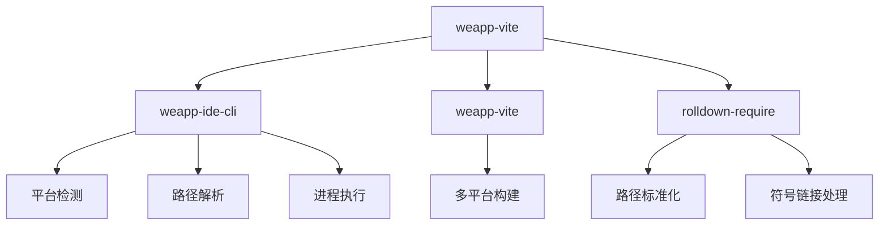
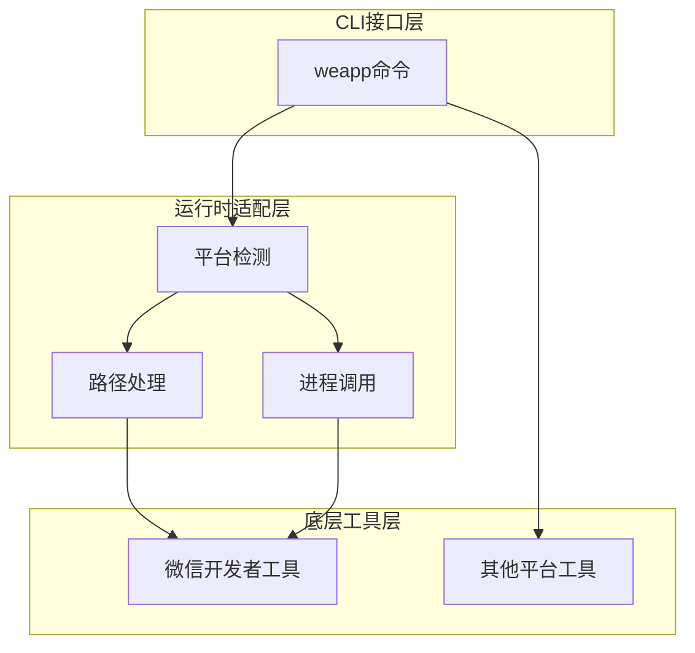
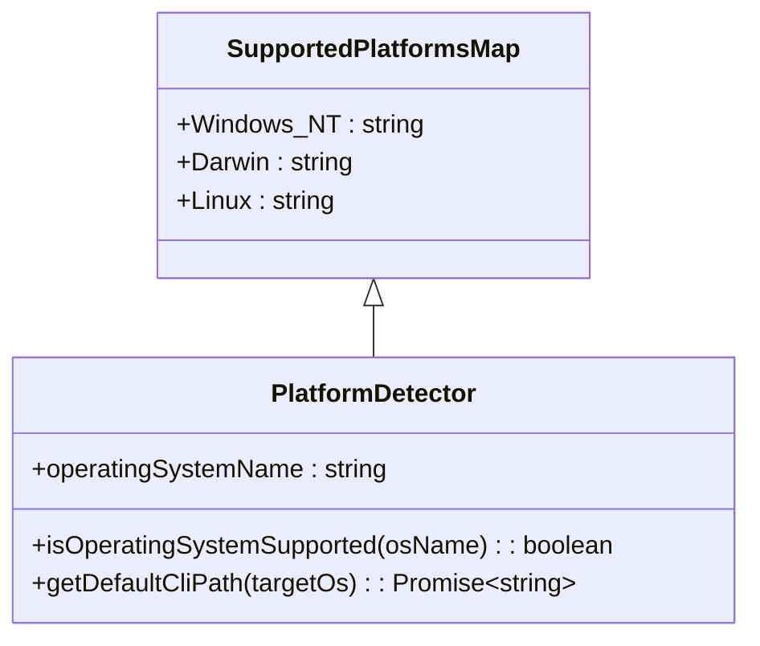
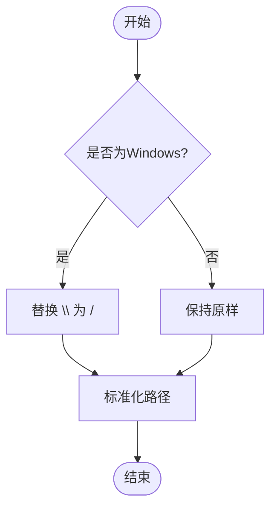
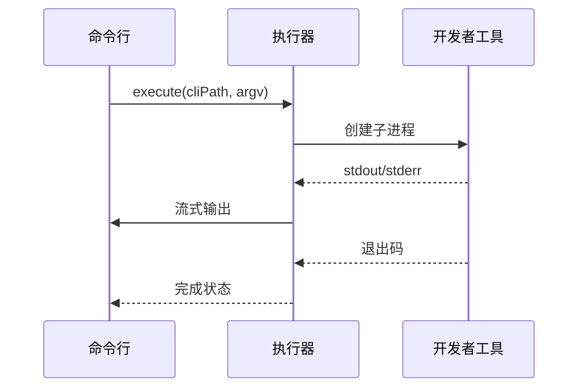
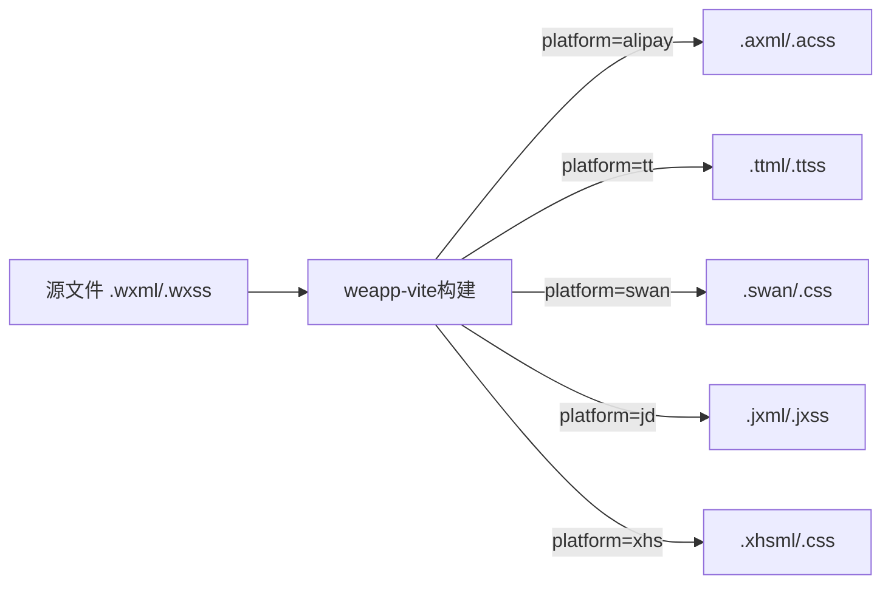
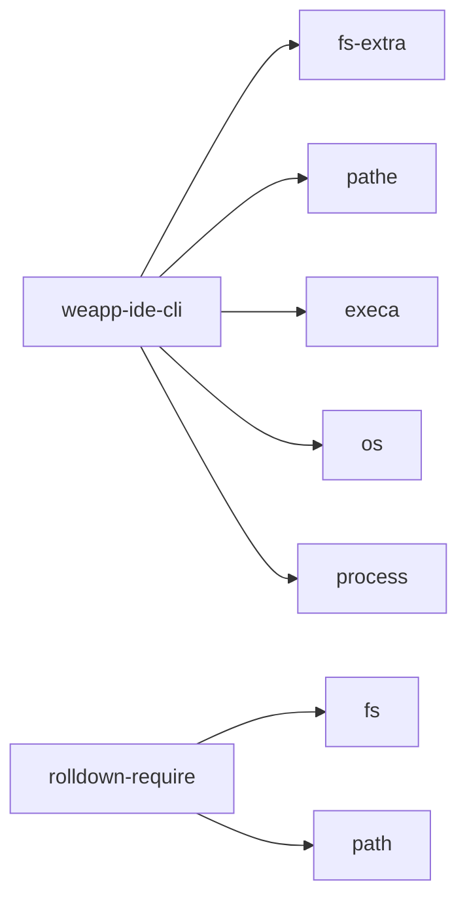

# 跨平台支持

<cite>
**本文档中引用的文件**  
- [platform.ts](file://packages/weapp-ide-cli/src/runtime/platform.ts)
- [path.ts](file://packages/weapp-ide-cli/src/utils/path.ts)
- [exec.ts](file://packages/weapp-ide-cli/src/utils/exec.ts)
- [sharedUtils.ts](file://packages/rolldown-require/src/sharedUtils.ts)
- [resolve.ts](file://packages/rolldown-require/src/plugins/resolve.ts)
- [utils.ts](file://packages/rolldown-require/src/utils.ts)
- [multi-platform.md](file://website/guide/multi-platform.md)
- [index.ts](file://packages/weapp-vite/src/index.ts)
- [weapp-vite.js](file://packages/weapp-vite/bin/weapp-vite.js)
- [weapp.js](file://packages/weapp-ide-cli/bin/weapp.js)
- [cli.ts](file://packages/weapp-ide-cli/src/cli.ts)
</cite>

## 目录

1. [引言](#引言)
2. [项目结构](#项目结构)
3. [核心组件](#核心组件)
4. [架构概述](#架构概述)
5. [详细组件分析](#详细组件分析)
6. [依赖分析](#依赖分析)
7. [性能考虑](#性能考虑)
8. [故障排除指南](#故障排除指南)
9. [结论](#结论)

## 引言

weapp-vite 是一个支持多平台小程序开发的构建工具，具备跨平台IDE集成能力。本项目通过 `weapp-ide-cli` 模块实现了对微信开发者工具在不同操作系统（Windows、macOS、Linux）下的自动化调用与管理。系统针对各操作系统的路径处理、进程调用和权限机制进行了适配，确保在不同环境下均能稳定运行。此外，weapp-vite 还支持支付宝、字节跳动、百度、京东、小红书等多个平台的小程序构建，具备强大的多端适配能力。

## 项目结构

weapp-vite 采用 monorepo 结构组织代码，主要包含以下几个部分：
- `@weapp-core/`：核心初始化逻辑
- `apps/`：各类应用示例
- `docs/` 和 `website/`：文档与网站内容
- `packages/`：核心功能包，包括 `weapp-vite` 构建系统和 `weapp-ide-cli` IDE集成工具
- `templates/`：项目模板

其中，跨平台IDE集成的核心实现在 `packages/weapp-ide-cli` 中，而多平台构建能力则由 `packages/weapp-vite` 提供。

**Diagram sources**
- [platform.ts](file://packages/weapp-ide-cli/src/runtime/platform.ts)
- [weapp-vite.js](file://packages/weapp-vite/bin/weapp-vite.js)
- [sharedUtils.ts](file://packages/rolldown-require/src/sharedUtils.ts)

**Section sources**
- [platform.ts](file://packages/weapp-ide-cli/src/runtime/platform.ts)
- [weapp-vite.js](file://packages/weapp-vite/bin/weapp-vite.js)
- [sharedUtils.ts](file://packages/rolldown-require/src/sharedUtils.ts)

## 核心组件

`weapp-ide-cli` 是实现跨平台IDE集成的核心模块，负责检测本地微信开发者工具安装路径，并通过命令行接口与之通信。该模块在不同操作系统下采用不同的策略来定位可执行文件，并处理相应的路径分隔符差异。

`weapp-vite` 则是构建系统的核心，支持通过 `--platform` 参数指定目标平台，自动转换文件扩展名和目录结构以适配不同小程序平台。

**Section sources**
- [weapp-ide-cli](file://packages/weapp-ide-cli/)
- [weapp-vite](file://packages/weapp-vite/)

## 架构概述

系统整体架构分为三层：CLI接口层、运行时适配层和底层工具层。CLI接口层提供统一的命令行入口；运行时适配层负责操作系统差异的处理；底层工具层则与具体的开发者工具进行交互。

**Diagram sources**
- [cli.ts](file://packages/weapp-ide-cli/src/cli.ts)
- [platform.ts](file://packages/weapp-ide-cli/src/runtime/platform.ts)
- [exec.ts](file://packages/weapp-ide-cli/src/utils/exec.ts)

## 详细组件分析

### 平台检测与适配

系统通过 Node.js 的 `os.type()` 方法识别当前操作系统，并根据结果选择相应的处理策略。支持 Windows_NT、Darwin（macOS）和 Linux 三大平台。

**Diagram sources**
- [platform.ts](file://packages/weapp-ide-cli/src/runtime/platform.ts)

#### 路径处理机制

针对不同操作系统的路径分隔符差异，系统采用了 `pathe` 库进行统一处理，并提供了 `slash()` 函数将反斜杠替换为正斜杠，确保路径在跨平台环境下的兼容性。

**Diagram sources**
- [sharedUtils.ts](file://packages/rolldown-require/src/sharedUtils.ts)
- [path.ts](file://packages/weapp-ide-cli/src/utils/path.ts)

#### 进程调用流程

系统使用 `execa` 库执行外部命令，将标准输出和错误流重定向到当前进程，实现与开发者工具的无缝交互。

**Diagram sources**
- [exec.ts](file://packages/weapp-ide-cli/src/utils/exec.ts)

### 多平台构建支持

weapp-vite 支持多种小程序平台的构建，通过 `--platform` 参数指定目标平台，自动转换文件扩展名。

**Diagram sources**
- [multi-platform.md](file://website/guide/multi-platform.md)

**Section sources**
- [multi-platform.md](file://website/guide/multi-platform.md)

## 依赖分析

系统依赖关系清晰，各模块职责分明。`weapp-ide-cli` 依赖于 Node.js 内置模块和第三方库如 `fs-extra`、`pathe` 和 `execa`，用于文件操作、路径处理和进程执行。

**Diagram sources**
- [package.json](file://packages/weapp-ide-cli/package.json)
- [package.json](file://packages/rolldown-require/package.json)

**Section sources**
- [platform.ts](file://packages/weapp-ide-cli/src/runtime/platform.ts)
- [sharedUtils.ts](file://packages/rolldown-require/src/sharedUtils.ts)

## 性能考虑

系统在路径解析和文件访问方面进行了优化，特别是在 Windows 系统下对网络驱动器和符号链接的处理。通过缓存已解析的路径和延迟加载机制，减少了重复的文件系统调用。

对于大规模项目，建议使用 SSD 存储以提高构建速度，并避免在路径过长的目录中存放项目文件，以防触发 Windows 系统的 MAX_PATH 限制。

## 故障排除指南

常见问题及解决方案：

1. **可执行文件找不到**：确保微信开发者工具已正确安装，并检查环境变量 PATH 是否包含相关路径。
2. **权限不足**：在 Linux 系统下，可能需要手动授予可执行权限 `chmod +x wechat-devtools-cli`。
3. **路径分隔符错误**：系统已自动处理，但自定义脚本中应使用 `path.join()` 而非字符串拼接。
4. **网络驱动器问题**：Windows 下访问网络路径时可能出现 realpath 解析异常，建议将项目存放在本地磁盘。

**Section sources**
- [platform.ts](file://packages/weapp-ide-cli/src/runtime/platform.ts)
- [utils.ts](file://packages/rolldown-require/src/utils.ts)

## 结论

weapp-vite 通过精心设计的跨平台架构，实现了对多种小程序平台的支持。其IDE集成方案充分考虑了不同操作系统的特性，在路径处理、进程调用等方面提供了完善的适配策略。开发者可以基于此工具链高效地进行多端开发，显著提升开发效率和项目可维护性。