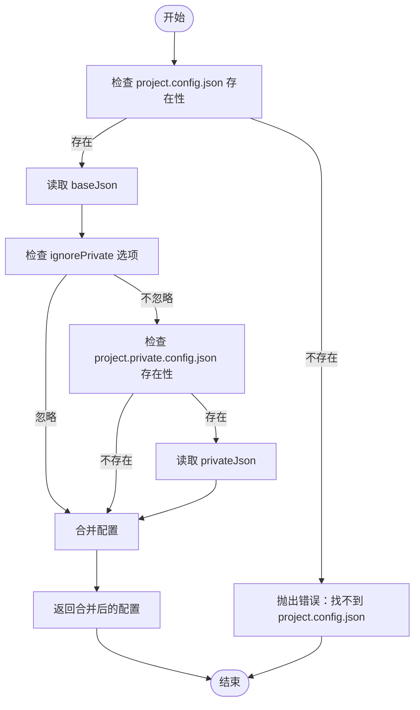
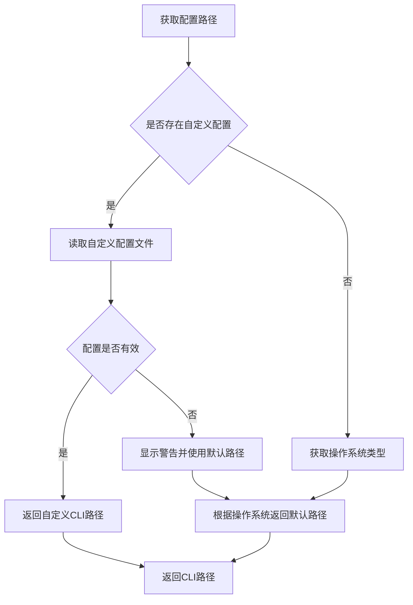
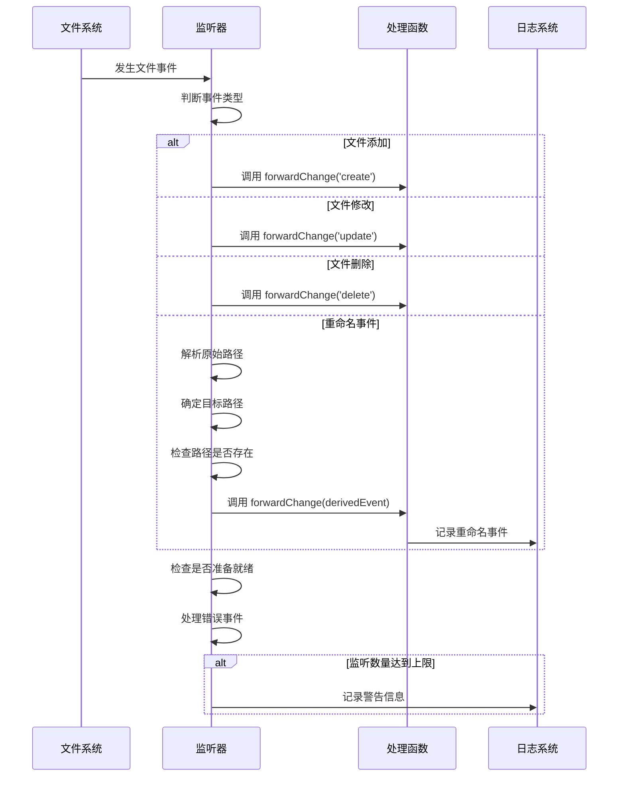

# 配置同步

<cite>
**本文档中引用的文件**  
- [projectConfig.ts](file://@weapp-core/init/src/projectConfig.ts)
- [projectConfig.ts](file://packages/weapp-vite/src/utils/projectConfig.ts)
- [paths.ts](file://packages/weapp-ide-cli/src/config/paths.ts)
- [resolver.ts](file://packages/weapp-ide-cli/src/config/resolver.ts)
- [platform.ts](file://packages/weapp-ide-cli/src/runtime/platform.ts)
- [openIde.ts](file://packages/weapp-vite/src/cli/openIde.ts)
- [invalidateEntry.ts](file://packages/weapp-vite/src/plugins/utils/invalidateEntry.ts)
</cite>

## 目录
1. [简介](#简介)
2. [项目配置文件同步机制](#项目配置文件同步机制)
3. [配置路径解析与映射](#配置路径解析与映射)
4. [配置变更监听与自动更新](#配置变更监听与自动更新)
5. [配置同步调试方法](#配置同步调试方法)
6. [常见问题与解决方案](#常见问题与解决方案)
7. [配置同步效果验证](#配置同步效果验证)

## 简介
weapp-vite 提供了一套完整的 IDE 配置同步机制，用于管理微信小程序开发中的项目配置文件。该系统通过 `project.config.json` 和 `project.private.config.json` 文件实现配置管理，并支持跨平台路径处理、配置变更监听和自动更新功能。本文档详细说明了配置同步的实现原理、工作机制和最佳实践。

## 项目配置文件同步机制
weapp-vite 的配置同步机制基于两个核心配置文件：`project.config.json` 和 `project.private.config.json`。系统通过合并这两个文件的内容来生成最终的项目配置。

主配置文件 `project.config.json` 包含项目的基本配置信息，如编译类型、包选项、设置项等。私有配置文件 `project.private.config.json` 用于存储用户特定的配置，其内容会覆盖主配置文件中的相同字段。

配置合并的实现逻辑位于 `packages/weapp-vite/src/utils/projectConfig.ts` 文件中，通过 `getProjectConfig` 函数完成。该函数首先读取主配置文件，然后根据选项决定是否读取私有配置文件，最后使用 `Object.assign` 方法将私有配置合并到主配置上，实现配置覆盖。

**图示来源**
- [projectConfig.ts](file://packages/weapp-vite/src/utils/projectConfig.ts#L5-L33)

**本节来源**
- [projectConfig.ts](file://packages/weapp-vite/src/utils/projectConfig.ts#L5-L33)

## 配置路径解析与映射
配置路径的解析与映射是配置同步机制的重要组成部分，特别是在不同操作系统环境下处理路径差异。

系统在 `@weapp-core/init/src/projectConfig.ts` 文件中实现了配置路径的处理逻辑。当创建或更新项目配置时，系统会解析配置文件的路径，并根据项目根目录确定输出路径。路径解析使用了 `pathe` 库来确保跨平台兼容性。

对于不同操作系统的路径处理，`packages/weapp-ide-cli` 模块提供了专门的解决方案。在 `src/runtime/platform.ts` 文件中，系统定义了不同操作系统的默认 CLI 路径：

- Windows 系统：`C:\Program Files (x86)\Tencent\微信web开发者工具\cli.bat`
- macOS 系统：`/Applications/wechatwebdevtools.app/Contents/MacOS/cli`
- Linux 系统：通过环境变量 PATH 查找 `wechat-devtools-cli`

用户自定义的 CLI 路径配置存储在用户主目录下的 `.weapp-ide-cli/config.json` 文件中。系统首先检查是否存在自定义配置，如果存在则使用自定义路径；否则使用对应操作系统的默认路径。

**图示来源**
- [platform.ts](file://packages/weapp-ide-cli/src/runtime/platform.ts#L64-L72)
- [paths.ts](file://packages/weapp-ide-cli/src/config/paths.ts#L6-L11)
- [resolver.ts](file://packages/weapp-ide-cli/src/config/resolver.ts#L7-L43)

**本节来源**
- [platform.ts](file://packages/weapp-ide-cli/src/runtime/platform.ts#L64-L72)
- [paths.ts](file://packages/weapp-ide-cli/src/config/paths.ts#L6-L11)
- [resolver.ts](file://packages/weapp-ide-cli/src/config/resolver.ts#L7-L43)

## 配置变更监听与自动更新
配置变更监听与自动更新策略是确保开发环境实时同步的关键机制。weapp-vite 通过文件系统监听器实现对配置文件的实时监控。

在 `packages/weapp-vite/src/plugins/utils/invalidateEntry.ts` 文件中，系统设置了文件监听器，监听以下事件：
- `add`：文件添加事件
- `change`：文件修改事件
- `unlink`：文件删除事件
- `raw`：原始文件系统事件

当监听到配置文件发生变化时，系统会触发相应的处理函数，更新内存中的配置状态，并通知相关组件进行重新加载。对于重命名事件，系统会根据目标路径是否存在来判断是创建还是删除事件。

监听器还处理了监听数量达到上限的情况，在 `error` 事件处理中，当检测到监听限制错误时，会发出警告并停用侧车文件监听。

**图示来源**
- [invalidateEntry.ts](file://packages/weapp-vite/src/plugins/utils/invalidateEntry.ts#L426-L456)

**本节来源**
- [invalidateEntry.ts](file://packages/weapp-vite/src/plugins/utils/invalidateEntry.ts#L426-L456)

## 配置同步调试方法
配置同步的调试主要通过日志查看和状态检查两种方式实现。

### 日志查看
系统提供了详细的日志输出，帮助开发者了解配置同步的执行过程。日志信息包括：
- 配置文件读取和写入操作
- CLI 路径解析过程
- 文件监听事件
- 错误和警告信息

在 `packages/weapp-ide-cli/src/config/resolver.ts` 文件中，当成功读取自定义配置时，系统会输出以下日志：
- "全局配置文件路径：~/.weapp-ide-cli/config.json"
- "自定义 CLI 路径：[实际路径]"

当解析自定义配置失败时，系统会输出警告信息，包括失败原因，然后尝试使用默认路径。

### 状态检查
通过检查以下文件和目录的状态可以验证配置同步是否正常工作：
1. 检查 `~/.weapp-ide-cli/config.json` 是否存在且格式正确
2. 验证项目根目录下的 `project.config.json` 和 `project.private.config.json` 文件
3. 确认 CLI 可执行文件路径是否可访问

使用 `weapp config` 命令可以交互式地配置 CLI 路径，并验证配置是否正确保存。

**本节来源**
- [resolver.ts](file://packages/weapp-ide-cli/src/config/resolver.ts#L7-L43)
- [custom.ts](file://packages/weapp-ide-cli/src/config/custom.ts#L11-L30)

## 常见问题与解决方案
### 配置不同步问题
**问题描述**：修改配置文件后，IDE 没有反映最新配置。

**解决方案**：
1. 检查文件监听器是否正常工作
2. 确认 `project.private.config.json` 中的配置是否正确覆盖了 `project.config.json` 中的对应字段
3. 重启开发服务器以强制重新加载配置

### 路径错误问题
**问题描述**：在不同操作系统上出现路径解析错误。

**解决方案**：
1. 确保使用 `pathe` 库进行路径操作，避免直接使用 Node.js 的 `path` 模块
2. 检查自定义配置中的路径是否使用了正确的分隔符
3. 验证环境变量 PATH 是否包含正确的 CLI 工具路径

### CLI 工具无法找到
**问题描述**：系统无法找到微信开发者工具的 CLI。

**解决方案**：
1. 运行 `weapp config` 命令手动配置 CLI 路径
2. 确认微信开发者工具已安装且"服务端口"已开启
3. 检查 `~/.weapp-ide-cli/config.json` 文件中的路径配置

**本节来源**
- [platform.ts](file://packages/weapp-ide-cli/src/runtime/platform.ts#L64-L72)
- [resolver.ts](file://packages/weapp-ide-cli/src/config/resolver.ts#L7-L43)
- [AGENTS.md](file://AGENTS.md#L18-L20)

## 配置同步效果验证
验证配置同步效果的方法包括：

1. **功能测试**：使用 `weapp open -p` 命令打开项目，验证是否能正确启动微信开发者工具
2. **路径验证**：检查输出日志中的路径信息是否正确
3. **变更测试**：修改配置文件后观察是否自动同步到 IDE
4. **跨平台测试**：在不同操作系统上验证配置同步功能

通过运行测试用例可以进一步验证配置同步的正确性。在 `packages/weapp-vite/test/utils.test.ts` 文件中，使用 `just-diff` 库对比忽略私有配置和包含私有配置时的差异，确保配置合并逻辑正确。

**本节来源**
- [openIde.ts](file://packages/weapp-vite/src/cli/openIde.ts#L4-L11)
- [utils.test.ts](file://packages/weapp-vite/test/utils.test.ts#L5-L13)
- [commands/open.ts](file://packages/weapp-vite/src/cli/commands/open.ts#L4-L10)