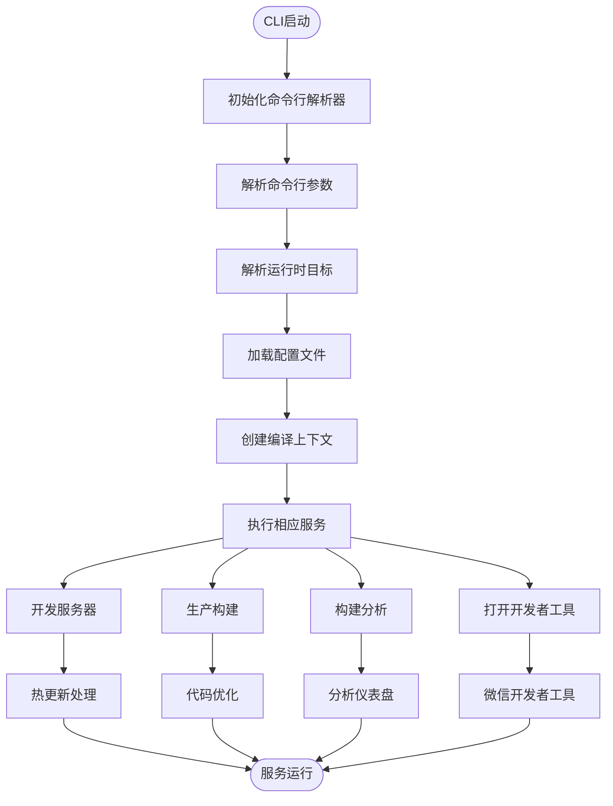

# 主CLI工具

<cite>
**本文档中引用的文件**  
- [weapp-vite.js](file://packages/weapp-vite/bin/weapp-vite.js)
- [cli.ts](file://packages/weapp-vite/src/cli.ts)
- [serve.ts](file://packages/weapp-vite/src/cli/commands/serve.ts)
- [build.ts](file://packages/weapp-vite/src/cli/commands/build.ts)
- [analyze.ts](file://packages/weapp-vite/src/cli/commands/analyze.ts)
- [open.ts](file://packages/weapp-vite/src/cli/commands/open.ts)
- [runtime.ts](file://packages/weapp-vite/src/cli/runtime.ts)
- [options.ts](file://packages/weapp-vite/src/cli/options.ts)
- [config.ts](file://packages/weapp-vite/src/config.ts)
- [createContext.ts](file://packages/weapp-vite/src/createContext.ts)
- [package.json](file://packages/weapp-vite/package.json)
</cite>

## 目录
1. [简介](#简介)
2. [核心命令详解](#核心命令详解)
3. [配置文件加载机制](#配置文件加载机制)
4. [执行流程分析](#执行流程分析)
5. [开发服务器热更新原理](#开发服务器热更新原理)
6. [构建优化策略](#构建优化策略)
7. [使用示例](#使用示例)
8. [CLI与插件系统交互](#cli与插件系统交互)
9. [性能调优建议](#性能调优建议)
10. [常见问题解决方案](#常见问题解决方案)

## 简介
weapp-vite主CLI工具是现代化小程序打包工具的核心入口，提供了一套完整的开发、构建和分析工作流。该工具基于Vite构建，为微信小程序开发提供了快速的开发服务器、高效的生产构建、详细的构建分析以及便捷的微信开发者工具集成功能。

**Section sources**
- [cli.ts](file://packages/weapp-vite/src/cli.ts#L1-L50)
- [package.json](file://packages/weapp-vite/package.json#L1-L156)

## 核心命令详解

### serve命令
serve命令用于启动开发服务器，支持热更新和实时预览功能。该命令别名为dev和serve，是开发阶段的主要入口。

**参数选项：**
- `--skipNpm`：是否跳过npm包构建
- `-o, --open`：是否自动打开微信开发者工具
- `-p, --platform <platform>`：目标平台（weapp | h5）
- `--analyze`：是否启动分包分析仪表盘（实验特性）

**使用场景：** 开发阶段的实时预览和调试。

**Section sources**
- [serve.ts](file://packages/weapp-vite/src/cli/commands/serve.ts#L1-L99)

### build命令
build命令用于生产环境构建，生成优化后的代码包。该命令支持多种构建选项，满足不同部署需求。

**参数选项：**
- `--target <target>`：转译目标（默认：modules）
- `--outDir <dir>`：输出目录（默认：dist）
- `-p, --platform <platform>`：目标平台（weapp | h5）
- `--sourcemap [output]`：是否输出source maps（默认：false）
- `--minify [minifier]`：是否启用压缩，或指定压缩器（默认：esbuild）
- `--emptyOutDir`：当输出目录在根目录外时是否强制清空
- `-w, --watch`：文件变更时是否重新构建
- `--skipNpm`：是否跳过npm包构建
- `-o, --open`：构建完成后是否打开微信开发者工具
- `--analyze`：是否输出分包分析仪表盘

**使用场景：** 生产环境的代码打包和部署。

**Section sources**
- [build.ts](file://packages/weapp-vite/src/cli/commands/build.ts#L1-L81)

### analyze命令
analyze命令用于构建分析，帮助开发者了解包体结构和源码映射关系。

**参数选项：**
- `--json`：以JSON格式输出结果
- `--output <file>`：将分析结果写入指定文件（JSON格式）
- `-p, --platform <platform>`：目标平台（weapp | h5）

**使用场景：** 代码包大小优化和分包策略调整。

**Section sources**
- [analyze.ts](file://packages/weapp-vite/src/cli/commands/analyze.ts#L1-L136)

### open命令
open命令用于打开微信开发者工具，简化开发流程。

**使用场景：** 快速打开微信开发者工具进行调试。

**Section sources**
- [open.ts](file://packages/weapp-vite/src/cli/commands/open.ts#L1-L11)

## 配置文件加载机制
weapp-vite CLI工具通过`resolveConfigFile`函数解析配置文件，支持通过`-c`或`--config`参数指定配置文件路径。配置文件遵循Vite的配置规范，并通过`defineConfig`函数进行类型定义。

配置文件中的`weapp`字段用于扩展Vite的`UserConfig`，提供小程序特定的配置选项。CLI工具在启动时会创建编译上下文，加载配置服务，并预检应用入口。

**Section sources**
- [options.ts](file://packages/weapp-vite/src/cli/options.ts#L1-L52)
- [config.ts](file://packages/weapp-vite/src/config.ts#L1-L29)
- [createContext.ts](file://packages/weapp-vite/src/createContext.ts#L1-L28)

## 执行流程分析
weapp-vite CLI工具的执行流程如下：

1. **初始化**：通过cac库创建命令行解析器，注册各个命令。
2. **运行时目标解析**：根据平台参数确定运行目标（小程序或Web）。
3. **配置加载**：解析配置文件，创建内联配置。
4. **上下文创建**：创建编译上下文，加载配置服务。
5. **服务执行**：根据命令类型执行相应的构建或开发服务。
6. **结果处理**：输出构建结果，启动分析仪表盘或打开开发者工具。



**Diagram sources**
- [cli.ts](file://packages/weapp-vite/src/cli.ts#L1-L50)
- [runtime.ts](file://packages/weapp-vite/src/cli/runtime.ts#L1-L76)

**Section sources**
- [cli.ts](file://packages/weapp-vite/src/cli.ts#L1-L50)
- [runtime.ts](file://packages/weapp-vite/src/cli/runtime.ts#L1-L76)

## 开发服务器热更新原理
weapp-vite开发服务器的热更新实现基于Rolldown的监听机制。当文件发生变化时，构建服务会触发`END`事件，CLI工具监听此事件并触发分包分析更新。

热更新流程：
1. 启动Rolldown监听器
2. 监听`event`事件
3. 当收到`END`事件时，触发分包分析更新
4. 更新分析仪表盘数据

这种机制确保了开发过程中代码变更能够实时反映在分析结果中，帮助开发者即时了解变更对包体结构的影响。

**Section sources**
- [serve.ts](file://packages/weapp-vite/src/cli/commands/serve.ts#L41-L71)

## 构建优化策略
weapp-vite在构建过程中采用了多种优化策略：

1. **分包分析**：通过`analyzeSubpackages`函数分析分包结构，识别跨包复用的模块。
2. **代码压缩**：支持terser和esbuild两种压缩器，默认使用esbuild以获得更快的构建速度。
3. **Source Map**：可选生成source map，便于生产环境的错误定位。
4. **输出目录管理**：支持清空输出目录，确保构建结果的纯净性。
5. **平台特定优化**：针对不同平台（weapp、h5）应用不同的构建策略。

这些优化策略共同作用，确保生成的代码包既小又高效。

**Section sources**
- [build.ts](file://packages/weapp-vite/src/cli/commands/build.ts#L1-L81)
- [analyze.ts](file://packages/weapp-vite/src/cli/commands/analyze.ts#L1-L136)

## 使用示例

### 启动开发服务器
```bash
weapp-vite serve
# 或使用别名
weapp-vite dev
# 指定配置文件
weapp-vite -c vite.config.ts
# 打开微信开发者工具
weapp-vite --open
# 启动分包分析
weapp-vite --analyze
```

### 生产环境构建
```bash
weapp-vite build
# 指定输出目录
weapp-vite build --outDir dist-prod
# 生成source map
weapp-vite build --sourcemap
# 禁用压缩
weapp-vite build --minify false
# 构建后打开开发者工具
weapp-vite build --open
```

### 构建分析
```bash
weapp-vite analyze
# 输出JSON结果
weapp-vite analyze --json
# 将结果写入文件
weapp-vite analyze --output analysis.json
```

### 打开微信开发者工具
```bash
weapp-vite open
```

**Section sources**
- [cli.ts](file://packages/weapp-vite/src/cli.ts#L1-L50)
- [serve.ts](file://packages/weapp-vite/src/cli/commands/serve.ts#L1-L99)
- [build.ts](file://packages/weapp-vite/src/cli/commands/build.ts#L1-L81)
- [analyze.ts](file://packages/weapp-vite/src/cli/commands/analyze.ts#L1-L136)
- [open.ts](file://packages/weapp-vite/src/cli/commands/open.ts#L1-L11)

## CLI与插件系统交互
weapp-vite CLI工具通过编译上下文与核心插件系统交互。`createCompilerContext`函数创建的上下文包含了配置服务、扫描服务和自动路由服务等核心组件。

CLI命令执行时，通过上下文访问这些服务，实现与插件系统的无缝集成。例如，构建服务负责代码转换和打包，配置服务管理项目配置，扫描服务处理文件扫描等。

这种设计模式实现了CLI工具与插件系统的解耦，使得功能扩展更加灵活。

**Section sources**
- [createContext.ts](file://packages/weapp-vite/src/createContext.ts#L1-L28)
- [cli.ts](file://packages/weapp-vite/src/cli.ts#L1-L50)

## 性能调优建议

1. **合理使用分包**：根据业务模块划分分包，避免主包过大。
2. **优化依赖引入**：按需引入第三方库，避免全量引入。
3. **启用代码压缩**：生产环境构建时启用压缩，减小包体积。
4. **使用分析工具**：定期使用analyze命令检查包体结构，识别冗余代码。
5. **合理配置source map**：开发环境启用source map便于调试，生产环境可选择性启用。
6. **优化图片资源**：使用适当的图片格式和压缩算法。
7. **减少全局变量**：避免在全局作用域声明大量变量，减少内存占用。

**Section sources**
- [build.ts](file://packages/weapp-vite/src/cli/commands/build.ts#L1-L81)
- [analyze.ts](file://packages/weapp-vite/src/cli/commands/analyze.ts#L1-L136)

## 常见问题解决方案

### 开发服务器无法启动
**问题原因：** 端口被占用或配置文件错误。
**解决方案：** 检查端口占用情况，验证配置文件语法。

### 构建结果不符合预期
**问题原因：** 配置项设置不当或代码存在兼容性问题。
**解决方案：** 检查构建配置，使用analyze命令分析包体结构。

### 热更新失效
**问题原因：** 文件监听机制异常或事件处理逻辑错误。
**解决方案：** 重启开发服务器，检查文件权限设置。

### 分包分析结果不准确
**问题原因：** 分包配置不完整或代码引用关系复杂。
**解决方案：** 完善分包配置，使用`--json`参数导出详细分析结果进行排查。

**Section sources**
- [serve.ts](file://packages/weapp-vite/src/cli/commands/serve.ts#L1-L99)
- [build.ts](file://packages/weapp-vite/src/cli/commands/build.ts#L1-L81)
- [analyze.ts](file://packages/weapp-vite/src/cli/commands/analyze.ts#L1-L136)