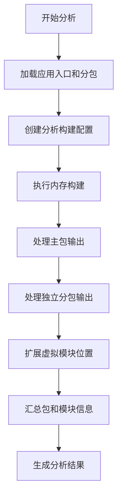
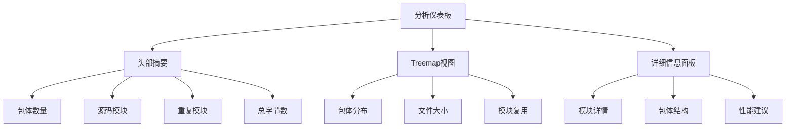
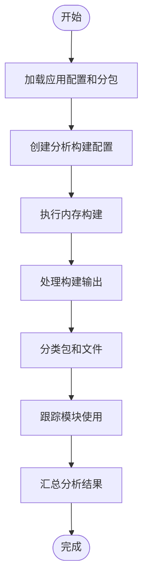
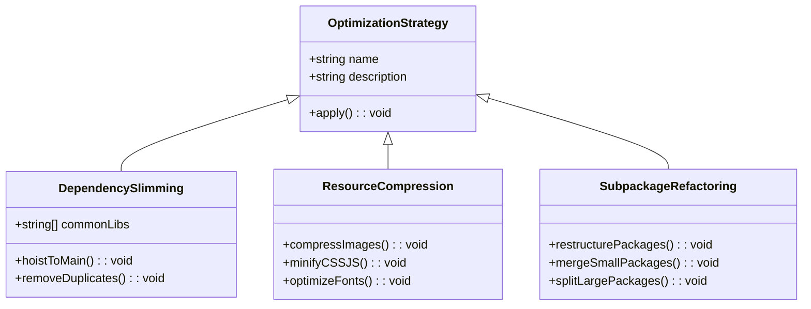

# 分析工具

<cite>
**本文档引用文件**   
- [subpackages.ts](file://packages/weapp-vite/src/analyze/subpackages.ts)
- [dashboard.ts](file://packages/weapp-vite/src/cli/analyze/dashboard.ts)
- [analyze.ts](file://packages/weapp-vite/src/cli/commands/analyze.ts)
- [serve.ts](file://packages/weapp-vite/src/cli/commands/serve.ts)
- [build.ts](file://packages/weapp-vite/src/cli/commands/build.ts)
- [useTreemapData.ts](file://packages/weapp-vite/analyze-dashboard/useTreemapData.ts)
- [App.vue](file://packages/weapp-vite/analyze-dashboard/App.vue)
- [main.ts](file://packages/weapp-vite/analyze-dashboard/main.ts)
- [mock-data.ts](file://packages/weapp-vite/analyze-dashboard/mock-data.ts)
- [subpackage.md](file://website/guide/subpackage.md)
</cite>

## 目录

1. [介绍](#介绍)
2. [核心功能原理](#核心功能原理)
3. [命令行使用方法](#命令行使用方法)
4. [分析仪表板详解](#分析仪表板详解)
5. [数据采集与处理流程](#数据采集与处理流程)
6. [优化建议与实践](#优化建议与实践)
7. [常见问题解决](#常见问题解决)

## 介绍

weapp-vite分析工具是一个专为小程序项目设计的构建产物分析系统，旨在帮助开发者深入理解项目依赖关系、文件大小分布和分包结构。该工具通过可视化仪表板和命令行输出，提供treemap视图、依赖图谱、性能指标等丰富的可视化功能，使开发者能够快速识别性能瓶颈、冗余依赖和不合理分包。

**分析工具**的核心价值在于其能够将复杂的构建产物转化为直观的可视化信息，帮助团队优化项目结构，提升应用性能。无论是通过命令行快速查看分析结果，还是通过交互式仪表板深入探索，该工具都为小程序开发提供了强大的支持。

## 核心功能原理

weapp-vite分析工具的核心功能基于对构建产物的深度分析，通过收集和处理Rolldown打包器的输出信息，生成详细的分析报告。分析过程主要分为三个阶段：扫描、构建和汇总。

在扫描阶段，工具通过`scanService.loadAppEntry()`和`scanService.loadSubPackages()`方法加载应用入口和分包配置，识别项目中的主包和所有分包。这一阶段确定了分析的范围和上下文。

构建阶段是分析的核心，工具创建一个特殊的构建配置，设置`write: false`和`watch: null`，确保构建过程只在内存中进行，不写入磁盘。通过调用`build(analysisConfig)`，工具获取主包的构建输出，并从`buildService`中获取独立分包的输出。

最后，在汇总阶段，工具处理所有构建输出，将chunk和asset文件分类到相应的包中，并跟踪每个模块在不同包中的使用情况。关键的数据结构包括`PackageAccumulator`和`ModuleAccumulator`，它们分别用于收集包和模块的信息。



**图表来源**
- [subpackages.ts](file://packages/weapp-vite/src/analyze/subpackages.ts#L539-L600)

**本节来源**
- [subpackages.ts](file://packages/weapp-vite/src/analyze/subpackages.ts#L539-L600)

## 命令行使用方法

weapp-vite分析工具提供了灵活的命令行接口，支持多种输出格式和选项，满足不同场景的需求。主要的命令是`weapp-vite analyze`，它可以直接在项目根目录下执行。

基本用法非常简单：
```bash
weapp-vite analyze
```

该命令会自动读取当前目录下的`vite.config.ts`和`app.json`配置，执行一次内存构建，并输出分析结果。默认情况下，工具会启动一个交互式的分析仪表板，通过浏览器查看详细的可视化信息。

对于需要自动化处理的场景，工具支持JSON输出和文件写入选项：
```bash
weapp-vite analyze --json --output report/analyze.json
```

`--json`选项会将完整的分析结果以JSON格式输出到标准输出，而`--output <file>`选项会将结果写入指定的文件。如果指定的路径包含不存在的目录，工具会自动创建这些目录。

工具还支持平台指定选项：
```bash
weapp-vite analyze -p weapp
```

`-p`或`--platform`选项用于指定目标平台，默认支持小程序平台。如果尝试在Web平台使用分析命令，工具会发出警告并忽略相关配置。

当在开发服务器模式下使用时，可以通过`--analyze`标志启用实时分析：
```bash
weapp-vite serve --analyze
```

这会在启动开发服务器的同时启动分析仪表板，并在每次构建完成时自动更新分析结果，实现真正的实时监控。

**本节来源**
- [analyze.ts](file://packages/weapp-vite/src/cli/commands/analyze.ts#L77-L135)
- [serve.ts](file://packages/weapp-vite/src/cli/commands/serve.ts#L49-L72)

## 分析仪表板详解

分析仪表板是weapp-vite分析工具的核心可视化组件，提供了一个交互式的界面来探索构建产物的详细信息。仪表板基于Vue 3和ECharts构建，采用现代化的暗色主题，确保在各种环境下都有良好的可读性。

仪表板的主界面由三个主要部分组成：头部摘要、treemap视图和详细信息面板。头部摘要显示了关键的性能指标，包括包体数量、源码模块数量、重复模块数量和总字节数。这些指标为开发者提供了项目规模的快速概览。



**图表来源**
- [App.vue](file://packages/weapp-vite/analyze-dashboard/App.vue#L74-L102)

**本节来源**
- [App.vue](file://packages/weapp-vite/analyze-dashboard/App.vue#L1-L102)
- [main.ts](file://packages/weapp-vite/analyze-dashboard/main.ts#L1-L36)

Treemap视图是仪表板的核心功能，它使用矩形树图算法将包体结构可视化。每个矩形代表一个文件或模块，其大小与文件大小成正比。主包、分包和独立分包使用不同的颜色区分，使结构一目了然。

通过点击矩形，用户可以钻取到更详细的层级，查看包内的文件分布和文件内的模块组成。悬停在矩形上会显示详细的工具提示，包括文件名、大小、来源和使用统计等信息。

详细信息面板显示了重复模块的列表，按使用次数排序，帮助开发者快速识别潜在的优化点。每个条目显示了模块的来源、使用次数和涉及的包体，为依赖精简提供了直接的依据。

仪表板支持实时更新模式，当与开发服务器集成时，每次代码更改和重新构建后，分析结果会自动更新，无需手动刷新页面。这种实时反馈机制极大地提高了开发效率。

## 数据采集与处理流程

weapp-vite分析工具的数据采集与处理流程是一个精心设计的管道系统，确保从构建产物中提取出准确和有用的信息。整个流程始于`analyzeSubpackages`函数的调用，该函数接受一个`CompilerContext`对象作为参数。

数据采集的第一步是加载应用配置和分包信息。工具通过`configService`、`scanService`和`buildService`三个核心服务获取必要的上下文信息。`configService`提供项目配置，`scanService`负责扫描应用结构，而`buildService`管理构建过程。



**图表来源**
- [subpackages.ts](file://packages/weapp-vite/src/analyze/subpackages.ts#L539-L600)

**本节来源**
- [subpackages.ts](file://packages/weapp-vite/src/analyze/subpackages.ts#L539-L600)

创建分析构建配置是关键步骤，工具合并了默认配置、共享构建配置和分析专用配置。分析专用配置设置了`write: false`和`watch: null`，确保构建过程高效且不影响开发环境。

构建输出处理是数据采集的核心，工具遍历Rolldown的输出，将每个chunk和asset文件分类到相应的包中。`processChunk`和`processAsset`函数分别处理代码块和资源文件，提取文件大小、来源和模块信息。

模块使用跟踪通过`ModuleAccumulator`实现，它记录每个模块在哪些包中被使用，以及在每个包中被哪些文件引用。这种细粒度的跟踪为后续的优化建议提供了坚实的基础。

最后，`summarizePackages`和`summarizeModules`函数将累积的数据转换为最终的分析结果，包括包体报告、模块使用情况和分包描述符。这些数据结构被设计为易于序列化和反序列化，支持JSON输出和跨工具集成。

## 优化建议与实践

基于分析工具提供的数据，开发者可以采取多种优化策略来改进项目结构和性能。以下是基于分析结果的常见优化建议和实践。

### 依赖精简

分析工具的重复模块列表是依赖精简的起点。通过识别被多个包体引用的第三方库，开发者可以决定是否将这些依赖提升到主包中。对于`sharedStrategy: 'hoist'`策略，建议将常用的工具库如`lodash`、`dayjs`等统一管理，避免在多个分包中重复包含。



**图表来源**
- [subpackages.ts](file://packages/weapp-vite/src/analyze/subpackages.ts#L415-L448)

**本节来源**
- [subpackages.ts](file://packages/weapp-vite/src/analyze/subpackages.ts#L415-L448)
- [subpackage.md](file://website/guide/subpackage.md#L112-L149)

### 资源压缩

文件大小分布是资源压缩的主要依据。通过treemap视图，开发者可以快速识别占用空间较大的文件，优先进行优化。常见的压缩策略包括：

- 图片优化：使用WebP格式替代PNG/JPG，应用适当的压缩质量
- CSS/JS压缩：确保生产构建中启用了代码压缩和混淆
- 字体优化：只包含必要的字符集，使用子集化技术

### 分包重构

分包结构分析可以帮助开发者优化包体布局。对于过大的主包，可以考虑将部分功能迁移到独立分包；对于过小的分包，可以考虑合并以减少包体数量。`weapp.chunks.duplicateWarningBytes`配置项可以设置冗余体积的提醒阈值，帮助团队提前关注包体膨胀问题。

## 常见问题解决

在使用weapp-vite分析工具时，开发者可能会遇到一些常见问题。以下是这些问题的解决方案。

### 分析数据不准确

如果分析结果与预期不符，首先检查`vite.config.ts`和`app.json`配置是否正确。确保分包配置在两个文件中保持一致，特别是`independent`属性。可以通过`weapp.debug.watchFiles`选项查看产物位置，确认独立分包是否生成了独立的`miniprogram_npm`。

### 仪表板无法打开

如果分析仪表板无法打开，检查是否已正确构建仪表板产物。首次使用前需要执行`pnpm --filter weapp-vite run build:dashboard`命令生成仪表板文件。确保`ANALYZE_DASHBOARD_ROOT`环境变量指向正确的目录。

### 性能分析偏差

性能分析偏差通常源于构建配置的差异。确保分析构建配置与生产构建配置尽可能一致，避免因配置不同导致的分析结果偏差。可以通过`--mode production`参数指定分析模式，确保使用生产环境的优化设置。

**本节来源**
- [dashboard.ts](file://packages/weapp-vite/src/cli/analyze/dashboard.ts#L1-L173)
- [subpackage.md](file://website/guide/subpackage.md#L240-L243)