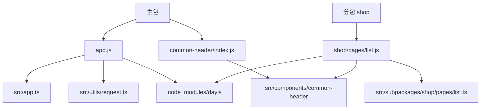
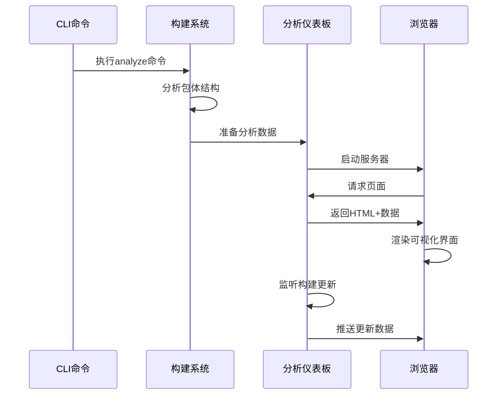
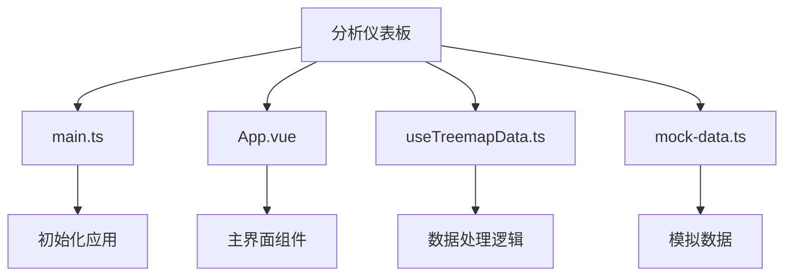

# 可视化仪表板

<cite>
**本文档引用文件**  
- [main.ts](file://packages/weapp-vite/analyze-dashboard/main.ts)
- [App.vue](file://packages/weapp-vite/analyze-dashboard/App.vue)
- [useTreemapData.ts](file://packages/weapp-vite/analyze-dashboard/useTreemapData.ts)
- [mock-data.ts](file://packages/weapp-vite/analyze-dashboard/mock-data.ts)
- [src-types.ts](file://packages/weapp-vite/analyze-dashboard/src-types.ts)
- [vite.config.ts](file://packages/weapp-vite/analyze-dashboard/vite.config.ts)
- [style.css](file://packages/weapp-vite/analyze-dashboard/style.css)
- [index.html](file://packages/weapp-vite/analyze-dashboard/index.html)
- [subpackages.ts](file://packages/weapp-vite/src/analyze/subpackages.ts)
- [dashboard.ts](file://packages/weapp-vite/src/cli/analyze/dashboard.ts)
- [analyze.ts](file://packages/weapp-vite/src/cli/commands/analyze.ts)
- [packagePaths.ts](file://packages/weapp-vite/src/packagePaths.ts)
- [build-analyze-dashboard.mjs](file://packages/weapp-vite/scripts/build-analyze-dashboard.mjs)
</cite>

## 目录
1. [简介](#简介)
2. [启动与访问分析仪表板](#启动与访问分析仪表板)
3. [功能模块详解](#功能模块详解)
4. [数据交互机制](#数据交互机制)
5. [使用示例](#使用示例)
6. [架构设计](#架构设计)
7. [常见问题解决](#常见问题解决)

## 简介

weapp-vite 分析仪表板是一个可视化工具，用于深入分析小程序项目的包体结构、依赖关系和性能指标。该仪表板通过 treemap 视图、依赖图谱等可视化组件，帮助开发者直观地理解项目构成，识别大体积文件和跨包复用模块，优化项目结构。

仪表板的核心功能包括：
- 显示主包、分包和虚拟包的结构
- 可视化源码模块与产物文件的映射关系
- 识别跨包复用的模块
- 提供包体大小、模块数量等关键指标

**Section sources**
- [App.vue](file://packages/weapp-vite/analyze-dashboard/App.vue#L81-L86)

## 启动与访问分析仪表板

### 启动方法

分析仪表板可以通过 CLI 命令启动。首先需要确保仪表板的构建产物已生成：

```bash
# 构建仪表板前端资源
pnpm --filter weapp-vite run build:dashboard
```

然后在项目根目录运行分析命令：

```bash
# 启动分析仪表板
weapp-vite analyze
```

### 访问方式

仪表板启动后，会自动打开浏览器并显示访问地址。默认情况下，仪表板运行在本地服务器上，可通过以下 URL 访问：

```
http://127.0.0.1:端口号
```

仪表板支持实时模式，当项目重新构建时，分析数据会自动更新。

**Section sources**
- [dashboard.ts](file://packages/weapp-vite/src/cli/analyze/dashboard.ts#L88-L172)
- [build-analyze-dashboard.mjs](file://packages/weapp-vite/scripts/build-analyze-dashboard.mjs#L1-L22)

## 功能模块详解

### Treemap 视图

Treemap 视图是仪表板的核心可视化组件，用于展示包体结构和模块分布。每个矩形区域代表一个包、文件或模块，面积大小与体积成正比。

#### 颜色编码
- **主包**：深蓝色
- **分包**：深绿色
- **独立分包**：深橙色
- **虚拟包**：深紫色

#### 交互功能
- 点击矩形可下钻查看更详细的结构
- 悬停显示详细信息（体积、来源等）
- 支持缩放和平移操作



**Diagram sources**
- [App.vue](file://packages/weapp-vite/analyze-dashboard/App.vue#L121-L124)
- [useTreemapData.ts](file://packages/weapp-vite/analyze-dashboard/useTreemapData.ts#L54-L75)

### 依赖图谱

依赖图谱展示了模块之间的依赖关系，帮助识别循环依赖和复杂的依赖链。

### 性能指标

仪表板首页显示关键性能指标：

| 指标 | 描述 |
|------|------|
| 包体数量 | 项目中包含的包总数 |
| 源码模块 | 源码中定义的模块数量 |
| 跨包复用 | 被多个包引用的模块数量 |
| 总产物 | 所有产物文件的总体积 |

**Section sources**
- [App.vue](file://packages/weapp-vite/analyze-dashboard/App.vue#L88-L115)

### 分包结构

分包结构视图展示了项目中所有分包的组织方式，包括：
- 分包根目录
- 分包名称
- 是否为独立分包
- 分包间的依赖关系

## 数据交互机制

### 前后端交互流程



**Diagram sources**
- [dashboard.ts](file://packages/weapp-vite/src/cli/analyze/dashboard.ts#L97-L157)
- [main.ts](file://packages/weapp-vite/analyze-dashboard/main.ts#L22-L27)

### 数据传输格式

分析数据通过全局变量 `__WEAPP_VITE_ANALYZE_RESULT__` 传递，数据结构定义如下：

```typescript
interface AnalyzeSubpackagesResult {
  packages: PackageReport[]
  modules: ModuleUsage[]
  subPackages: SubPackageDescriptor[]
}
```

其中 `PackageReport` 包含包的ID、标签、类型和文件列表，`ModuleUsage` 记录模块的使用情况。

**Section sources**
- [subpackages.ts](file://packages/weapp-vite/src/analyze/subpackages.ts#L52-L56)
- [src-types.ts](file://packages/weapp-vite/analyze-dashboard/src-types.ts#L1)

## 使用示例

### 探索项目结构

1. 启动分析仪表板
2. 在 treemap 视图中观察主包和分包的分布
3. 点击感兴趣的包查看其内部文件结构
4. 进一步下钻查看具体模块的组成

### 识别大体积文件

1. 观察 treemap 中面积最大的矩形
2. 悬停查看文件详细信息（体积、来源等）
3. 根据提示优化大体积文件（如代码分割、压缩等）

### 分析依赖关系

1. 查看"跨包复用模块"列表
2. 识别被多个包引用的公共模块
3. 评估是否需要调整模块的组织方式

**Section sources**
- [mock-data.ts](file://packages/weapp-vite/analyze-dashboard/mock-data.ts#L11-L294)
- [useTreemapData.ts](file://packages/weapp-vite/analyze-dashboard/useTreemapData.ts#L214-L308)

## 架构设计

### 技术栈

- **前端框架**：Vue 3 + Composition API
- **可视化库**：ECharts
- **样式框架**：Tailwind CSS
- **构建工具**：Vite

### 组件结构



**Diagram sources**
- [main.ts](file://packages/weapp-vite/analyze-dashboard/main.ts#L1-L36)
- [App.vue](file://packages/weapp-vite/analyze-dashboard/App.vue#L1-L147)

### 构建部署流程

1. 使用 Vite 构建前端资源
2. 输出到 `modules/analyze-dashboard` 目录
3. CLI 命令启动开发服务器
4. 注入分析数据到全局变量
5. 提供静态文件服务

**Section sources**
- [vite.config.ts](file://packages/weapp-vite/analyze-dashboard/vite.config.ts#L1-L53)
- [packagePaths.ts](file://packages/weapp-vite/src/packagePaths.ts#L24)

## 常见问题解决

### 仪表板无法打开

**问题**：执行 `weapp-vite analyze` 命令后，提示"未找到仪表盘产物"

**解决方案**：
1. 确保已执行构建命令：
```bash
pnpm --filter weapp-vite run build:dashboard
```
2. 检查 `modules/analyze-dashboard` 目录是否存在且包含构建产物

### 数据加载缓慢

**问题**：仪表板加载时间过长

**解决方案**：
1. 检查项目规模，大型项目可能需要更长的分析时间
2. 确保系统有足够的内存和CPU资源
3. 考虑在生产模式下运行分析

### 图表显示异常

**问题**：treemap 图表显示不完整或布局混乱

**解决方案**：
1. 检查浏览器控制台是否有JavaScript错误
2. 确认分析数据格式正确
3. 尝试清除浏览器缓存后重新加载

**Section sources**
- [dashboard.ts](file://packages/weapp-vite/src/cli/analyze/dashboard.ts#L11-L19)
- [main.ts](file://packages/weapp-vite/analyze-dashboard/main.ts#L30-L35)