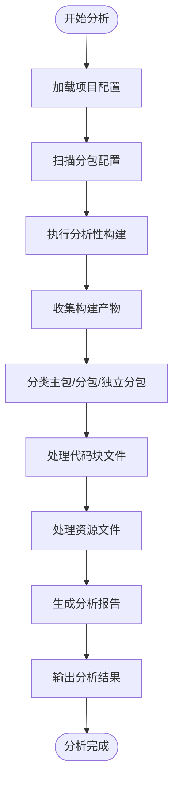
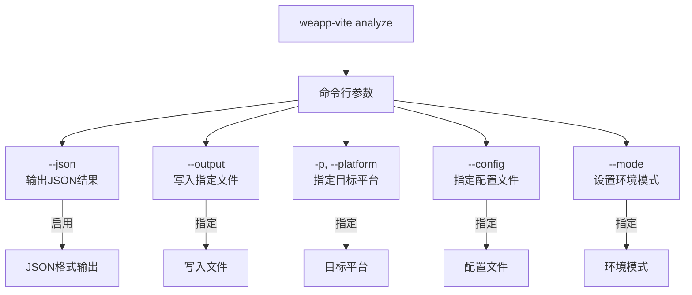
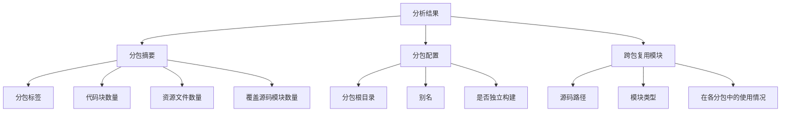
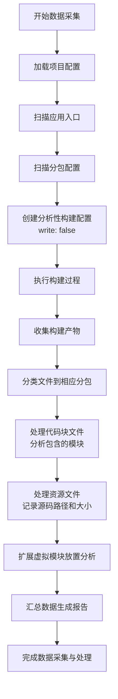
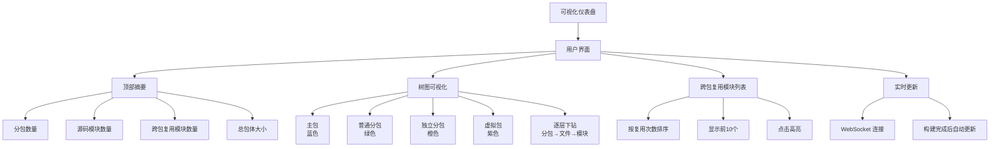
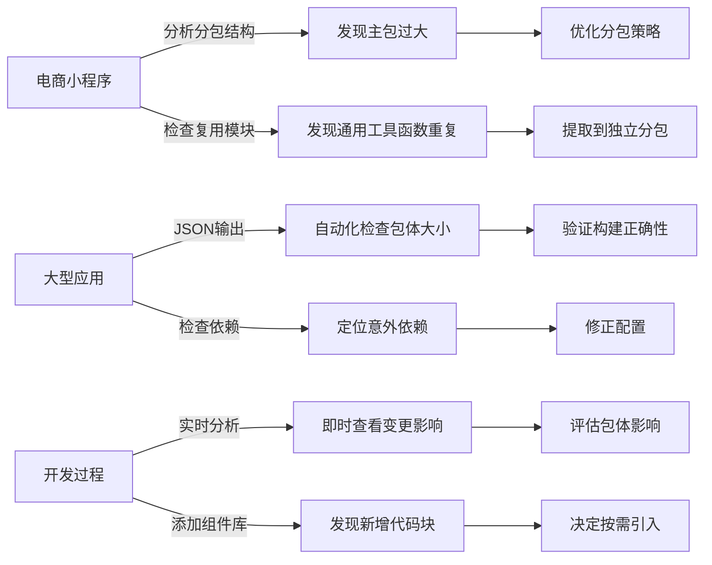
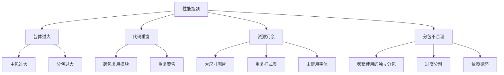
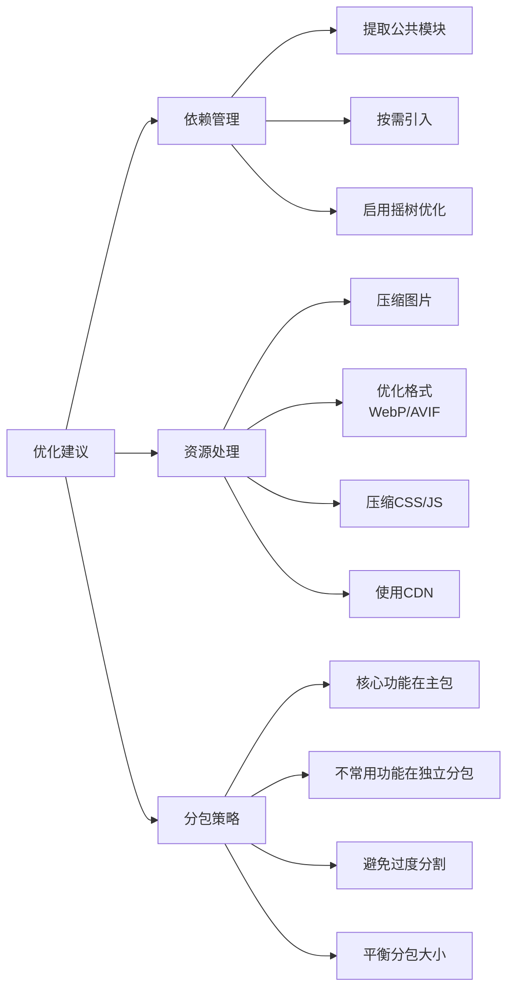
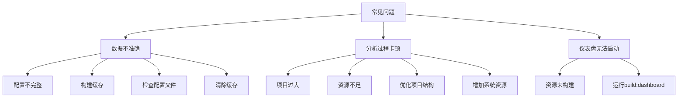

# 命令行分析

<cite>
**本文档中引用的文件**  
- [analyze.ts](file://packages/weapp-vite/src/cli/commands/analyze.ts)
- [subpackages.ts](file://packages/weapp-vite/src/analyze/subpackages.ts)
- [dashboard.ts](file://packages/weapp-vite/src/cli/analyze/dashboard.ts)
- [packagePaths.ts](file://packages/weapp-vite/src/packagePaths.ts)
- [vite.config.ts](file://packages/weapp-vite/analyze-dashboard/vite.config.ts)
- [App.vue](file://packages/weapp-vite/analyze-dashboard/App.vue)
- [useTreemapData.ts](file://packages/weapp-vite/analyze-dashboard/useTreemapData.ts)
- [main.ts](file://packages/weapp-vite/analyze-dashboard/main.ts)
- [serve.ts](file://packages/weapp-vite/src/cli/commands/serve.ts)
- [build-analyze-dashboard.mjs](file://packages/weapp-vite/scripts/build-analyze-dashboard.mjs)
</cite>

## 目录
1. [介绍](#介绍)
2. [核心功能与实现原理](#核心功能与实现原理)
3. [命令行使用方法](#命令行使用方法)
4. [分析输出格式与内容解读](#分析输出格式与内容解读)
5. [数据采集与处理流程](#数据采集与处理流程)
6. [分包信息分析](#分包信息分析)
7. [可视化仪表盘](#可视化仪表盘)
8. [使用示例](#使用示例)
9. [性能瓶颈识别](#性能瓶颈识别)
10. [优化建议](#优化建议)
11. [常见问题解决](#常见问题解决)

## 介绍

weapp-vite 提供了强大的命令行分析功能，旨在帮助开发者深入理解小程序项目的构建产物与源码之间的映射关系。该功能通过 `analyze` 命令实现，能够对主包、分包和独立分包的构建结果进行详细分析，提供文件大小统计、依赖关系分析和分包配置等关键信息。

分析功能的核心目标是帮助开发者识别性能瓶颈、发现冗余依赖和不合理分包结构，从而优化小程序的包体大小和加载性能。该功能支持多种输出模式，包括控制台输出、JSON 文件输出和交互式可视化仪表盘，满足不同场景下的分析需求。

**Section sources**
- [analyze.ts](file://packages/weapp-vite/src/cli/commands/analyze.ts#L76-L135)

## 核心功能与实现原理

weapp-vite 的分析功能基于 Vite 和 Rolldown 构建系统，通过分析构建产物来提取关键指标。其核心实现原理是通过构建一个不写入文件系统的分析配置，执行构建过程并收集输出信息，然后对这些信息进行分类和统计。

分析功能主要由三个核心模块组成：命令行接口、数据采集与处理、可视化展示。命令行接口负责解析用户输入的参数并调用相应的分析逻辑；数据采集与处理模块负责从构建产物中提取文件大小、模块依赖和分包信息；可视化展示模块则将分析结果以交互式仪表盘的形式呈现给开发者。

分析过程首先会加载项目配置和应用入口，然后扫描所有分包配置。接着，系统会执行一次分析性构建，收集主包、独立分包和共享虚拟包的构建产物。通过对这些产物的分析，系统能够建立文件与源码模块之间的映射关系，并统计各分包的大小和内容。



**Diagram sources**
- [subpackages.ts](file://packages/weapp-vite/src/analyze/subpackages.ts#L539-L600)
- [analyze.ts](file://packages/weapp-vite/src/cli/commands/analyze.ts#L96-L102)

**Section sources**
- [subpackages.ts](file://packages/weapp-vite/src/analyze/subpackages.ts#L539-L600)
- [analyze.ts](file://packages/weapp-vite/src/cli/commands/analyze.ts#L96-L102)

## 命令行使用方法

weapp-vite 的分析功能通过 `weapp-vite analyze` 命令提供，支持多种参数配置来满足不同的分析需求。基本的命令语法为 `weapp-vite analyze [root]`，其中 `[root]` 是可选的项目根目录路径。

主要的命令行参数包括：
- `--json`：以 JSON 格式输出分析结果，便于程序化处理
- `--output <file>`：将分析结果写入指定的 JSON 文件
- `-p, --platform <platform>`：指定目标平台（weapp | h5），分析功能主要支持小程序平台
- `--config <file>`：指定配置文件路径
- `--mode <mode>`：设置环境模式（development | production）

当不使用 `--json` 参数时，分析结果将以结构化的文本形式输出到控制台，包括各分包的文件数量、资源大小和跨包复用的模块信息。如果同时使用 `--output` 参数，分析结果将被写入指定的文件，方便后续分析或存档。



**Diagram sources**
- [analyze.ts](file://packages/weapp-vite/src/cli/commands/analyze.ts#L78-L82)
- [types.ts](file://packages/weapp-vite/src/cli/types.ts#L27-L30)

**Section sources**
- [analyze.ts](file://packages/weapp-vite/src/cli/commands/analyze.ts#L78-L82)

## 分析输出格式与内容解读

分析命令的输出包含三个主要部分：分包摘要、分包配置和跨包复用模块。这些信息以结构化的文本形式呈现，帮助开发者快速了解项目的构建情况。

分包摘要部分会列出每个分包的基本信息，包括分包标签、代码块数量、资源文件数量和覆盖的源码模块数量。例如，输出可能显示 "主包：15 个模块产物，8 个资源，覆盖 120 个源码模块"，这表明主包包含 15 个 JavaScript 代码块和 8 个静态资源文件，这些文件由 120 个源码模块生成。

分包配置部分会列出项目中定义的所有分包，包括分包根目录、别名和是否为独立构建。这对于理解项目的分包结构非常有帮助，特别是当项目包含多个分包时，可以快速查看每个分包的配置细节。

跨包复用模块部分是分析结果中最重要的部分之一，它会列出在多个分包中复用的源码模块。这些模块可能导致包体膨胀，因为它们会被复制到每个使用它们的分包中。分析结果会显示每个复用模块的源码路径、类型和在各个分包中的使用情况，帮助开发者识别潜在的优化点。



**Diagram sources**
- [analyze.ts](file://packages/weapp-vite/src/cli/commands/analyze.ts#L32-L73)
- [subpackages.ts](file://packages/weapp-vite/src/analyze/subpackages.ts#L52-L56)

**Section sources**
- [analyze.ts](file://packages/weapp-vite/src/cli/commands/analyze.ts#L32-L73)

## 数据采集与处理流程

分析功能的数据采集与处理流程始于项目配置的加载和应用入口的扫描。系统首先会创建一个编译上下文，加载项目配置文件并解析运行时目标。然后，通过扫描服务加载应用入口文件和所有分包配置，建立项目的整体结构视图。

数据采集的核心是执行一次分析性构建。系统会创建一个特殊的构建配置，该配置与正常构建配置相同，但设置了 `write: false` 选项，确保构建产物不会写入文件系统。这样可以在不产生实际文件的情况下获取完整的构建输出信息。构建过程会生成主包、独立分包和共享虚拟包的产物，这些产物包含了文件名、大小、类型和包含的模块等详细信息。

采集到的构建产物数据会被分类处理。系统会根据文件路径判断其所属的分包类型（主包、普通分包、独立分包或虚拟包），并将文件和模块信息归入相应的分包报告中。对于每个代码块文件，系统会分析其包含的源码模块，记录模块的源码路径、类型和大小。对于资源文件，系统会记录其源码路径和大小。

处理流程还包括对虚拟模块放置的扩展分析。某些模块可能被标记为虚拟模块，系统会分析这些模块在实际分包中的具体放置情况，确保分析结果的准确性。最后，所有分类和处理后的数据会被汇总成一个结构化的分析报告，包含分包信息、模块使用情况和分包配置等。



**Diagram sources**
- [subpackages.ts](file://packages/weapp-vite/src/analyze/subpackages.ts#L539-L600)
- [analyze.ts](file://packages/weapp-vite/src/cli/commands/analyze.ts#L96-L102)

**Section sources**
- [subpackages.ts](file://packages/weapp-vite/src/analyze/subpackages.ts#L539-L600)

## 分包信息分析

分包信息分析是 weapp-vite 分析功能的重要组成部分，它能够详细展示项目中各个分包的结构和内容。系统通过扫描 `app.json` 文件中的 `subPackages` 或 `subpackages` 配置来识别所有分包，并为每个分包生成详细的分析报告。

分析结果中的分包信息包括分包类型、文件列表和模块使用情况。分包类型分为四种：主包（main）、普通分包（subPackage）、独立分包（independent）和虚拟包（virtual）。主包包含小程序的核心代码和资源，普通分包用于按功能或页面组织代码，独立分包具有独立的运行环境，虚拟包则用于表示共享的代码块。

对于每个分包，系统会列出其包含的所有文件，包括代码块文件（chunk）和资源文件（asset）。代码块文件通常是 JavaScript 或其他可执行代码，资源文件则包括图片、样式表等静态资源。系统还会分析每个文件中包含的源码模块，建立文件与源码之间的映射关系。

分包分析的一个关键功能是识别跨包复用的模块。当同一个源码模块被多个分包引用时，它会被复制到每个引用它的分包中，导致包体膨胀。分析结果会明确指出这些复用模块，并列出它们在各个分包中的具体使用情况，帮助开发者识别潜在的优化机会。

```mermaid
classDiagram
class PackageReport {
+id : string
+label : string
+type : PackageType
+files : PackageFileEntry[]
}
class PackageFileEntry {
+file : string
+type : 'chunk' | 'asset'
+from : BuildOrigin
+size? : number
+isEntry? : boolean
+modules? : ModuleInFile[]
+source? : string
}
class ModuleInFile {
+id : string
+source : string
+sourceType : ModuleSourceType
+bytes? : number
+originalBytes? : number
}
class ModuleUsage {
+id : string
+source : string
+sourceType : ModuleSourceType
+packages : Array<{ packageId : string, files : string[] }>
}
class SubPackageDescriptor {
+root : string
+independent : boolean
+name? : string
}
class AnalyzeSubpackagesResult {
+packages : PackageReport[]
+modules : ModuleUsage[]
+subPackages : SubPackageDescriptor[]
}
AnalyzeSubpackagesResult --> PackageReport : "包含"
AnalyzeSubpackagesResult --> ModuleUsage : "包含"
AnalyzeSubpackagesResult --> SubPackageDescriptor : "包含"
PackageReport --> PackageFileEntry : "包含"
PackageFileEntry --> ModuleInFile : "包含"
```

**Diagram sources**
- [subpackages.ts](file://packages/weapp-vite/src/analyze/subpackages.ts#L32-L56)
- [analyze.ts](file://packages/weapp-vite/src/cli/commands/analyze.ts#L102)

**Section sources**
- [subpackages.ts](file://packages/weapp-vite/src/analyze/subpackages.ts#L32-L56)

## 可视化仪表盘

weapp-vite 提供了一个交互式的可视化仪表盘，用于直观展示分析结果。仪表盘基于 Vue 和 ECharts 构建，通过树图（Treemap）可视化各个分包、文件和模块的大小关系，帮助开发者快速识别包体结构中的异常和优化点。

要启动可视化仪表盘，可以在执行 `analyze` 命令时省略 `--json` 参数，或者在 `serve` 命令中使用 `--analyze` 选项。系统会自动启动一个本地服务器，提供一个交互式的 Web 界面。仪表盘的 UI 设计简洁直观，顶部显示了关键指标摘要，包括分包数量、源码模块数量、跨包复用模块数量和总包体大小。

树图是仪表盘的核心组件，它以面积大小表示各个元素的体积。主包通常显示为最大的矩形，分包和独立分包按大小比例显示在周围。通过点击可以逐层下钻，从分包级别深入到文件级别，再到模块级别，查看详细的大小信息。不同类型的分包使用不同的颜色区分，主包为蓝色，普通分包为绿色，独立分包为橙色，虚拟包为紫色。

仪表盘还提供了跨包复用模块的列表，按复用次数排序显示前 10 个最常复用的模块。点击列表中的模块可以在树图中高亮显示其在各个分包中的位置，便于分析其分布情况。此外，仪表盘支持实时更新功能，在开发服务器运行时，每次构建完成后会自动更新分析结果，保持数据的实时性。



**Diagram sources**
- [dashboard.ts](file://packages/weapp-vite/src/cli/analyze/dashboard.ts#L88-L172)
- [App.vue](file://packages/weapp-vite/analyze-dashboard/App.vue#L1-L102)
- [useTreemapData.ts](file://packages/weapp-vite/analyze-dashboard/useTreemapData.ts#L164-L359)

**Section sources**
- [dashboard.ts](file://packages/weapp-vite/src/cli/analyze/dashboard.ts#L88-L172)

## 使用示例

weapp-vite 的分析功能在不同项目结构下都能提供有价值的洞察。以下是一些典型的使用示例，展示了如何在实际项目中应用分析功能。

在一个包含多个分包的电商小程序中，开发者可以使用 `weapp-vite analyze` 命令来检查分包结构是否合理。分析结果可能显示主包过大，包含了许多本应属于分包的代码。通过查看跨包复用模块列表，开发者发现一些通用工具函数被复制到了多个分包中，导致包体膨胀。基于这些发现，开发者可以将这些通用函数提取到独立分包或通过构建配置优化共享策略。

在一个使用独立分包的大型应用中，分析功能可以帮助验证独立分包的构建是否正确。通过 `--json` 参数将分析结果输出到文件，开发者可以编写脚本自动化检查独立分包的大小是否在预期范围内。如果发现某个独立分包意外包含了主包的代码，可以通过检查其依赖配置来定位问题。

在开发过程中，结合 `serve` 命令的 `--analyze` 选项使用实时分析功能，可以即时看到代码变更对包体结构的影响。例如，当添加一个新的 UI 组件库时，开发者可以立即在可视化仪表盘中看到新增的代码块和资源文件，评估其对包体大小的影响，并决定是否需要按需引入或进行代码分割。



**Diagram sources**
- [analyze.ts](file://packages/weapp-vite/src/cli/commands/analyze.ts#L127)
- [serve.ts](file://packages/weapp-vite/src/cli/commands/serve.ts#L23-L24)

**Section sources**
- [analyze.ts](file://packages/weapp-vite/src/cli/commands/analyze.ts#L127)
- [serve.ts](file://packages/weapp-vite/src/cli/commands/serve.ts#L23-L24)

## 性能瓶颈识别

weapp-vite 的分析功能是识别小程序性能瓶颈的强大工具。通过详细的包体分析，开发者可以快速定位导致加载缓慢和包体过大的根本原因。

主要的性能瓶颈识别点包括：包体过大、代码重复、资源冗余和分包不合理。包体过大通常表现为主包或某个分包的大小超过平台限制或性能最佳实践建议的阈值。分析结果中的总大小统计和分包大小分布可以帮助快速识别这个问题。

代码重复是另一个常见的性能瓶颈，特别是在使用分包的项目中。当同一个源码模块被多个分包引用时，它会被复制到每个分包中，导致包体膨胀。分析结果中的跨包复用模块列表明确指出了这些重复的模块，按复用次数排序，让开发者能够优先处理影响最大的问题。

资源冗余也是一个重要问题，包括未压缩的图片、重复的样式表和不必要的字体文件。分析结果会列出所有资源文件及其大小，帮助开发者识别占用空间较大的资源。通过查看资源文件的源码路径，开发者可以追溯到具体的引入位置，决定是否需要优化或移除。

分包不合理可能导致加载性能下降。例如，将频繁使用的功能放在独立分包中，会导致用户每次使用都需要下载额外的包。分析结果中的分包配置和使用情况可以帮助评估分包策略的合理性，识别需要重构的分包结构。



**Diagram sources**
- [subpackages.ts](file://packages/weapp-vite/src/analyze/subpackages.ts#L53-L73)
- [analyze.ts](file://packages/weapp-vite/src/cli/commands/analyze.ts#L53-L73)

**Section sources**
- [subpackages.ts](file://packages/weapp-vite/src/analyze/subpackages.ts#L53-L73)

## 优化建议

基于分析结果，weapp-vite 提供了多种优化建议来改善小程序的性能和包体大小。这些建议涵盖了依赖管理、资源处理和分包策略等多个方面。

在依赖管理方面，建议将频繁复用的模块提取到独立分包或公共依赖中。对于 `node_modules` 中的大型依赖，建议使用按需引入的方式，只引入实际使用的功能模块。分析结果中的跨包复用模块列表是识别这些优化机会的关键，开发者应该优先处理复用次数最多的模块。

资源处理方面，建议对图片资源进行压缩和格式优化，使用 WebP 等现代图片格式。对于 CSS 和 JavaScript 文件，建议启用压缩和混淆。分析结果中的资源文件列表可以帮助识别占用空间较大的资源，优先进行优化。此外，可以考虑使用 CDN 托管大型静态资源，减少包体大小。

分包策略优化是另一个重要方向。建议将不常用的功能放入独立分包，而将核心功能保留在主包中。对于大型分包，可以考虑进一步拆分，但要避免过度分割导致的加载性能下降。分析结果中的分包大小分布和使用情况可以帮助制定合理的分包策略。



**Diagram sources**
- [analyze.ts](file://packages/weapp-vite/src/cli/commands/analyze.ts#L53-L73)
- [subpackages.ts](file://packages/weapp-vite/src/analyze/subpackages.ts#L61-L63)

**Section sources**
- [analyze.ts](file://packages/weapp-vite/src/cli/commands/analyze.ts#L53-L73)

## 常见问题解决

在使用 weapp-vite 分析功能时，可能会遇到一些常见问题。了解这些问题的原因和解决方案可以帮助开发者更有效地使用分析工具。

最常见的问题是分析数据不准确或输出信息不完整。这通常是由于项目配置不完整或构建缓存导致的。解决方案是确保项目配置文件（如 `vite.config.ts` 和 `app.json`）正确无误，并在分析前清除构建缓存。可以通过删除 `dist` 目录或使用 `--force` 选项来强制重新构建。

另一个常见问题是分析过程卡顿或超时。这通常发生在大型项目中，由于需要处理大量的文件和模块。解决方案是优化项目结构，减少不必要的文件和依赖，或者增加系统资源。在极端情况下，可以考虑分阶段分析，先分析主包，再单独分析各个分包。

可视化仪表盘无法启动也是一个常见问题。这通常是由于仪表盘资源未正确构建导致的。错误信息会提示"未找到仪表盘产物，请先执行 `pnpm --filter weapp-vite run build:dashboard` 生成"。解决方案是运行指定的构建命令来生成仪表盘资源，然后重新执行分析命令。



**Diagram sources**
- [dashboard.ts](file://packages/weapp-vite/src/cli/analyze/dashboard.ts#L17-L19)
- [build-analyze-dashboard.mjs](file://packages/weapp-vite/scripts/build-analyze-dashboard.mjs#L11-L16)

**Section sources**
- [dashboard.ts](file://packages/weapp-vite/src/cli/analyze/dashboard.ts#L17-L19)