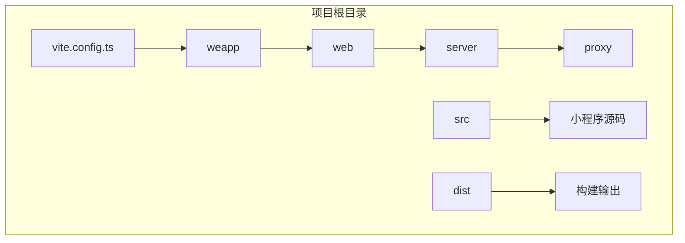
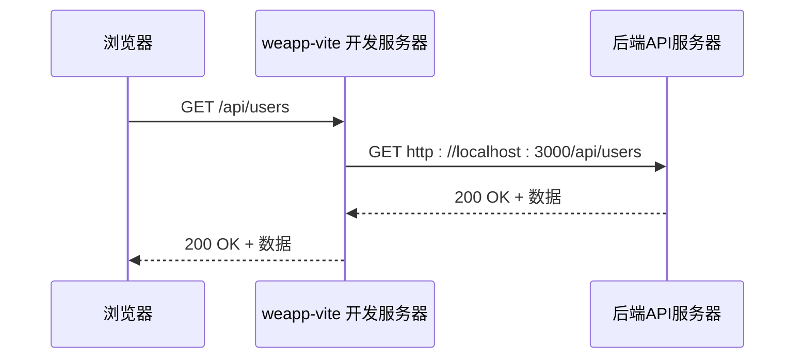
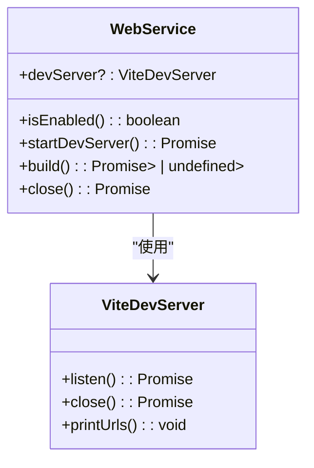
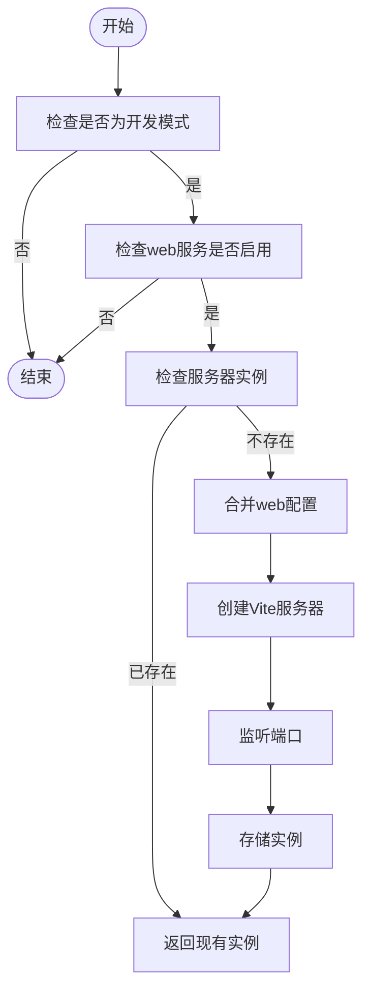
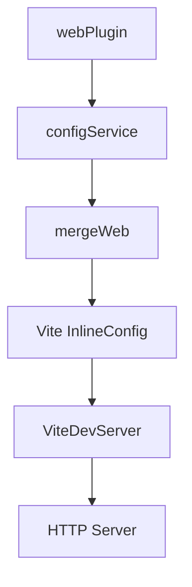

# 代理配置

<cite>
**本文档引用文件**  
- [vite.config.ts](file://apps/vite-native/vite.config.ts)
- [vite.config.ts](file://apps/weapp-vite-web-demo/vite.config.ts)
- [webPlugin.ts](file://packages/weapp-vite/src/runtime/webPlugin.ts)
- [merge.ts](file://packages/weapp-vite/src/runtime/config/internal/merge.ts)
- [serve.ts](file://packages/weapp-vite/src/cli/commands/serve.ts)
</cite>

## 目录
1. [介绍](#介绍)
2. [项目结构](#项目结构)
3. [核心组件](#核心组件)
4. [架构概述](#架构概述)
5. [详细组件分析](#详细组件分析)
6. [依赖分析](#依赖分析)
7. [性能考虑](#性能考虑)
8. [故障排除指南](#故障排除指南)
9. [结论](#结论)
10. [附录](#附录)（如有必要）

## 介绍
weapp-vite 是一个专为微信小程序开发优化的 Vite 构建工具，其开发服务器提供了强大的代理配置功能，用于解决小程序开发中的跨域问题。通过配置反向代理，开发者可以在本地开发环境中无缝访问后端 API，而无需修改小程序代码或配置 CORS。本文档全面介绍 weapp-vite 开发服务器的代理配置功能，包括配置语法、工作原理、高级选项和实际使用示例。

## 项目结构
weapp-vite 项目的结构遵循 Vite 的标准约定，同时针对微信小程序的特性进行了扩展。核心配置文件 `vite.config.ts` 位于项目根目录，用于定义开发服务器、构建选项和 weapp-vite 特有的扩展配置。`weapp` 配置块是 weapp-vite 的核心，其中 `web` 子配置用于管理 H5 端的开发服务器，包括代理设置。



**图示来源**
- [vite.config.ts](file://apps/weapp-vite-web-demo/vite.config.ts#L9-L30)

**本节来源**
- [vite.config.ts](file://apps/weapp-vite-web-demo/vite.config.ts#L1-L31)

## 核心组件
weapp-vite 的代理功能主要由 `webPlugin.ts` 中的 `WebService` 组件实现。该组件负责创建和管理一个独立的 Vite 开发服务器，用于服务 H5 端的应用。代理配置通过 `mergeWeb` 函数从 `weapp` 配置中提取，并合并到 Vite 的内联配置中，最终由 Vite 的开发服务器处理。

**本节来源**
- [webPlugin.ts](file://packages/weapp-vite/src/runtime/webPlugin.ts#L1-L52)
- [merge.ts](file://packages/weapp-vite/src/runtime/config/internal/merge.ts#L29-L69)

## 架构概述
weapp-vite 的代理架构基于 Vite 的开发服务器能力。当启用 H5 开发模式时，`WebService` 会启动一个 Vite 服务器。该服务器的配置中包含了从 `weapp.web.vite.server` 继承的设置，其中 `proxy` 选项用于定义反向代理规则。当浏览器向开发服务器发起请求时，服务器会根据代理规则将请求转发到目标后端服务，并将响应返回给浏览器，从而绕过同源策略限制。



**图示来源**
- [webPlugin.ts](file://packages/weapp-vite/src/runtime/webPlugin.ts#L23-L41)
- [serve.ts](file://packages/weapp-vite/src/cli/commands/serve.ts#L24-L47)

## 详细组件分析

### WebService 组件分析
`WebService` 是 weapp-vite 中负责 H5 端开发的核心组件。它封装了 Vite 的 `createServer` 和 `build` 功能，提供了一个统一的接口来启动开发服务器和执行构建。

#### WebService 类图


**图示来源**
- [webPlugin.ts](file://packages/weapp-vite/src/runtime/webPlugin.ts#L5-L11)

#### 启动开发服务器流程


**图示来源**
- [webPlugin.ts](file://packages/weapp-vite/src/runtime/webPlugin.ts#L23-L41)

**本节来源**
- [webPlugin.ts](file://packages/weapp-vite/src/runtime/webPlugin.ts#L1-L52)

### 配置合并机制
`mergeWeb` 函数负责将 `weapp` 配置中的 `web` 部分与 Vite 的默认配置进行合并，生成最终的内联配置。

**本节来源**
- [merge.ts](file://packages/weapp-vite/src/runtime/config/internal/merge.ts#L29-L69)

## 依赖分析
weapp-vite 的代理功能依赖于多个核心模块。`webPlugin` 依赖 `configService` 来获取配置，`configService` 又依赖 `merge` 函数来生成最终的 Vite 配置。`ViteDevServer` 由 Vite 核心库提供，负责处理 HTTP 请求和代理转发。



**图示来源**
- [webPlugin.ts](file://packages/weapp-vite/src/runtime/webPlugin.ts#L33-L37)
- [merge.ts](file://packages/weapp-vite/src/runtime/config/internal/merge.ts#L29-L69)

**本节来源**
- [webPlugin.ts](file://packages/weapp-vite/src/runtime/webPlugin.ts#L1-L52)
- [merge.ts](file://packages/weapp-vite/src/runtime/config/internal/merge.ts#L29-L69)

## 性能考虑
weapp-vite 的代理功能在开发模式下运行，对性能的要求主要体现在启动速度和请求响应延迟上。由于代理是基于 Vite 的开发服务器，它继承了 Vite 的高效热更新机制。代理本身不会对性能造成显著影响，因为请求转发是异步进行的。然而，代理的目标服务器性能会直接影响整体响应时间。

## 故障排除指南
当代理配置不生效时，首先检查 `weapp.web.enabled` 是否设置为 `true`。其次，确认 `vite.config.ts` 中的代理规则语法正确。可以通过在 `startDevServer` 函数中添加日志来调试配置合并过程。如果遇到循环重定向，检查代理目标 URL 是否正确，避免将请求代理回自身。

**本节来源**
- [webPlugin.ts](file://packages/weapp-vite/src/runtime/webPlugin.ts#L19-L21)
- [webPlugin.ts](file://packages/weapp-vite/src/runtime/webPlugin.ts#L24-L28)

## 结论
weapp-vite 通过集成 Vite 的强大功能，为微信小程序的 H5 开发提供了灵活且高效的代理解决方案。通过简单的配置，开发者可以轻松解决跨域问题，提升开发效率。其模块化的设计和清晰的依赖关系使得功能易于理解和维护。

## 附录
### 代理配置示例
```ts
// vite.config.ts
export default defineConfig({
  weapp: {
    web: {
      vite: {
        server: {
          proxy: {
            '/api': {
              target: 'http://localhost:3000',
              changeOrigin: true,
              rewrite: (path) => path.replace(/^\/api/, '')
            }
          }
        }
      }
    }
  }
})
```

**本节来源**
- [vite.config.ts](file://apps/weapp-vite-web-demo/vite.config.ts#L9-L30)