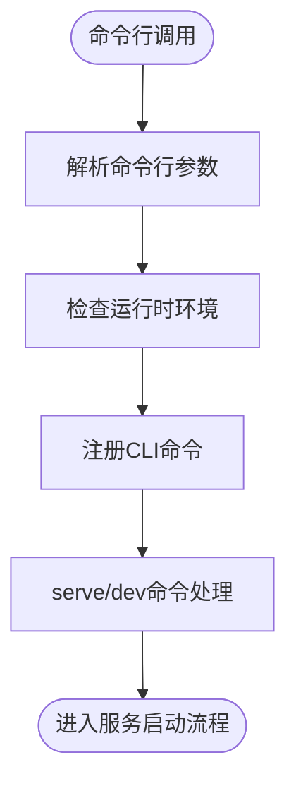
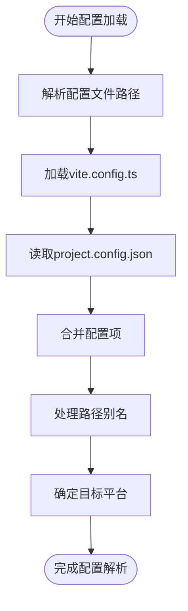
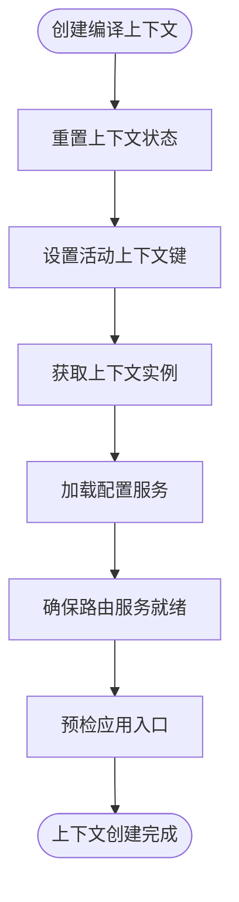
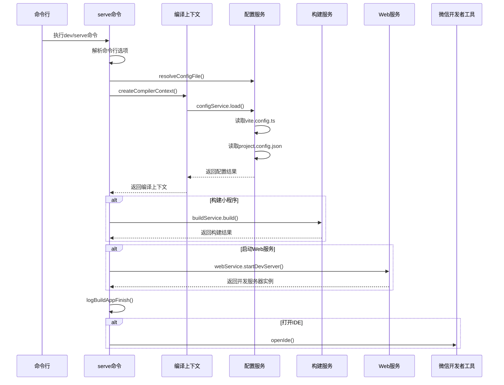

# 启动流程

<cite>
**本文档中引用的文件**  
- [weapp-vite.js](file://packages/weapp-vite/bin/weapp-vite.js)
- [cli.ts](file://packages/weapp-vite/src/cli.ts)
- [serve.ts](file://packages/weapp-vite/src/cli/commands/serve.ts)
- [createContext.ts](file://packages/weapp-vite/src/createContext.ts)
- [config.ts](file://packages/weapp-vite/src/config.ts)
- [types.ts](file://packages/weapp-vite/src/types.ts)
- [config/types.ts](file://packages/weapp-vite/src/runtime/config/types.ts)
- [getInstance.ts](file://packages/weapp-vite/src/context/getInstance.ts)
- [logger.ts](file://packages/weapp-vite/src/logger.ts)
</cite>

## 目录
1. [启动流程概述](#启动流程概述)
2. [命令行解析与入口](#命令行解析与入口)
3. [配置文件加载与解析](#配置文件加载与解析)
4. [编译上下文创建](#编译上下文创建)
5. [开发服务器实例化](#开发服务器实例化)
6. [小程序特有配置处理](#小程序特有配置处理)
7. [HTTP服务与WebSocket通信](#http服务与websocket通信)
8. [日志输出说明](#日志输出说明)
9. [错误处理机制](#错误处理机制)
10. [启动时序流程图](#启动时序流程图)
11. [调试技巧](#调试技巧)

## 启动流程概述

weapp-vite开发服务器的启动流程从命令行调用开始，经过命令解析、配置加载、上下文创建、服务实例化等多个阶段，最终建立与微信开发者工具的通信通道。整个流程设计为模块化、可扩展的架构，支持多种平台目标和构建模式。

**Section sources**
- [cli.ts](file://packages/weapp-vite/src/cli.ts#L1-L50)
- [serve.ts](file://packages/weapp-vite/src/cli/commands/serve.ts#L1-L99)

## 命令行解析与入口

启动流程始于`weapp-vite`命令行工具的执行。入口文件位于`packages/weapp-vite/bin/weapp-vite.js`，该文件通过Node.js的shebang语法指定运行环境，并导入核心CLI模块。

CLI系统基于`cac`库构建，注册了多个子命令，其中`serve`（别名`dev`）用于启动开发服务器。命令行选项包括配置文件指定、日志级别、调试模式等通用Vite选项，以及`--platform`、`--open`等weapp-vite特有选项。

**Diagram sources**
- [weapp-vite.js](file://packages/weapp-vite/bin/weapp-vite.js#L1-L3)
- [cli.ts](file://packages/weapp-vite/src/cli.ts#L1-L50)

**Section sources**
- [weapp-vite.js](file://packages/weapp-vite/bin/weapp-vite.js#L1-L3)
- [cli.ts](file://packages/weapp-vite/src/cli.ts#L1-L50)

## 配置文件加载与解析

配置系统支持标准的`vite.config.ts`文件以及小程序特有的`project.config.json`。在`serve`命令执行时，首先通过`resolveConfigFile`函数确定配置文件路径，然后使用`configService.load`方法加载和解析配置。

配置解析过程会合并命令行参数、环境变量和配置文件中的设置，形成最终的配置对象。weapp-vite扩展了Vite的配置类型，通过声明合并在`UserConfig`接口中添加了`weapp`字段，用于存放小程序特定配置。

**Diagram sources**
- [serve.ts](file://packages/weapp-vite/src/cli/commands/serve.ts#L24-L36)
- [config/types.ts](file://packages/weapp-vite/src/runtime/config/types.ts#L8-L90)

**Section sources**
- [serve.ts](file://packages/weapp-vite/src/cli/commands/serve.ts#L24-L36)
- [config.ts](file://packages/weapp-vite/src/config.ts#L1-L29)
- [config/types.ts](file://packages/weapp-vite/src/runtime/config/types.ts#L8-L90)

## 编译上下文创建

编译上下文是weapp-vite的核心数据结构，通过`createCompilerContext`函数创建。该函数首先重置指定键的上下文（避免复用陈旧的全局上下文），然后获取或创建新的编译上下文实例。

上下文创建过程中会依次初始化配置服务、扫描服务和自动路由服务。配置服务负责加载项目配置，扫描服务用于分析项目结构，自动路由服务则根据文件系统生成路由配置。在预检阶段，系统会尝试加载应用入口文件以验证项目结构的正确性。

**Diagram sources**
- [createContext.ts](file://packages/weapp-vite/src/createContext.ts#L1-L28)
- [getInstance.ts](file://packages/weapp-vite/src/context/getInstance.ts#L1-L45)

**Section sources**
- [createContext.ts](file://packages/weapp-vite/src/createContext.ts#L1-L28)
- [getInstance.ts](file://packages/weapp-vite/src/context/getInstance.ts#L1-L45)

## 开发服务器实例化

开发服务器的实例化由`webService.startDevServer`方法完成。该方法基于Vite的核心开发服务器实现，但在启动前会进行小程序特定的配置合并和插件初始化。

服务器实例化过程包括：创建Rollup构建器、初始化插件管道、建立模块依赖图、启动文件监听器等。对于小程序平台，系统会同时启动构建服务来生成小程序所需的文件结构；对于Web平台，则启动Vite开发服务器提供标准的开发体验。

在`serve`命令的实现中，系统会根据目标平台决定是否启动小程序构建服务和Web开发服务器，并在两者都启用时协调它们的启动顺序和状态报告。

**Section sources**
- [serve.ts](file://packages/weapp-vite/src/cli/commands/serve.ts#L74-L83)

## 小程序特有配置处理

weapp-vite特别处理小程序相关的配置文件，主要是`project.config.json`。该文件在`configService.load`过程中被读取和解析，其内容被合并到最终的配置对象中。

系统会从`project.config.json`中提取项目的基本信息、编译设置、调试选项等，并根据这些配置调整构建行为。例如，根据`miniprogram`字段确定小程序源码目录，根据`packOptions`处理分包配置等。

此外，系统还支持`project.private.config.json`作为私有配置文件，用于存放敏感信息或个人开发环境设置，该文件通常会被.gitignore忽略。

**Section sources**
- [config/types.ts](file://packages/weapp-vite/src/runtime/config/types.ts#L25-L33)
- [serve.ts](file://packages/weapp-vite/src/cli/commands/serve.ts#L27-L36)

## HTTP服务与WebSocket通信

开发服务器通过标准的HTTP协议提供静态资源服务，同时建立WebSocket连接用于热更新（HMR）和状态同步。WebSocket通道用于向客户端推送文件变更、编译错误等实时消息。

与微信开发者工具的通信主要通过文件系统和进程间通信实现。weapp-vite将构建结果输出到小程序项目目录，微信开发者工具监控该目录的文件变化并自动刷新。此外，通过`--open`选项可以自动启动微信开发者工具并打开项目。

对于分包分析等高级功能，系统会启动独立的分析仪表盘服务，通过HTTP提供Web界面，同时使用WebSocket实现实时数据更新。

**Section sources**
- [serve.ts](file://packages/weapp-vite/src/cli/commands/serve.ts#L77-L82)
- [serve.ts](file://packages/weapp-vite/src/cli/commands/serve.ts#L90-L92)

## 日志输出说明

weapp-vite使用统一的日志系统输出启动过程中的关键信息。日志级别支持`info`、`warn`、`error`和`silent`，可通过`--logLevel`参数控制。

启动过程中的主要日志包括：运行时环境检查结果、配置文件路径、目标平台信息、构建服务启动状态、Web服务器地址、分包分析仪表盘URL等。所有日志通过`@weapp-core/logger`包统一管理，确保格式一致且可扩展。

在构建完成后，系统会输出`logBuildAppFinish`日志，汇总小程序和Web平台的构建状态，并提示开发者下一步操作。

**Section sources**
- [logger.ts](file://packages/weapp-vite/src/logger.ts#L1-L7)
- [serve.ts](file://packages/weapp-vite/src/cli/commands/serve.ts#L85-L89)

## 错误处理机制

启动过程中的错误处理采用分层策略。对于配置文件解析失败，系统会捕获异常并输出详细的错误信息，包括文件路径和解析错误原因。对于端口占用等服务器启动错误，在`webService.startDevServer`中捕获并重新抛出，同时输出友好的错误提示。

运行时环境检查（Node.js版本）使用try-catch包裹，确保即使检查失败也不会中断启动流程。对于文件系统操作错误，如无法读取`project.config.json`，系统会提供备选方案或默认值，保证开发服务器能够尽可能启动。

在`serve`命令的实现中，Web服务器启动被包裹在try-catch中，确保错误能够被正确记录并通过日志系统报告。

**Section sources**
- [cli.ts](file://packages/weapp-vite/src/cli.ts#L16-L25)
- [serve.ts](file://packages/weapp-vite/src/cli/commands/serve.ts#L79-L82)

## 启动时序流程图

**Diagram sources**
- [serve.ts](file://packages/weapp-vite/src/cli/commands/serve.ts#L24-L98)

## 调试技巧

调试weapp-vite启动过程可采用以下技巧：
1. 使用`--debug`参数启用调试日志，可配合`--filter`参数过滤特定模块的日志
2. 在`createCompilerContext`前后添加断点，观察上下文状态变化
3. 检查`configService.options`对象，验证配置是否正确加载和合并
4. 监控项目输出目录，确认构建服务是否正常生成文件
5. 使用`--logLevel silent`排除日志干扰，专注于错误信息

对于复杂的配置问题，建议从最小化配置开始，逐步添加配置项以定位问题根源。使用`console.log`或调试器检查`LoadConfigResult`接口的各个字段值是有效的调试方法。

**Section sources**
- [serve.ts](file://packages/weapp-vite/src/cli/commands/serve.ts#L34-L35)
- [createContext.ts](file://packages/weapp-vite/src/createContext.ts#L4-L27)