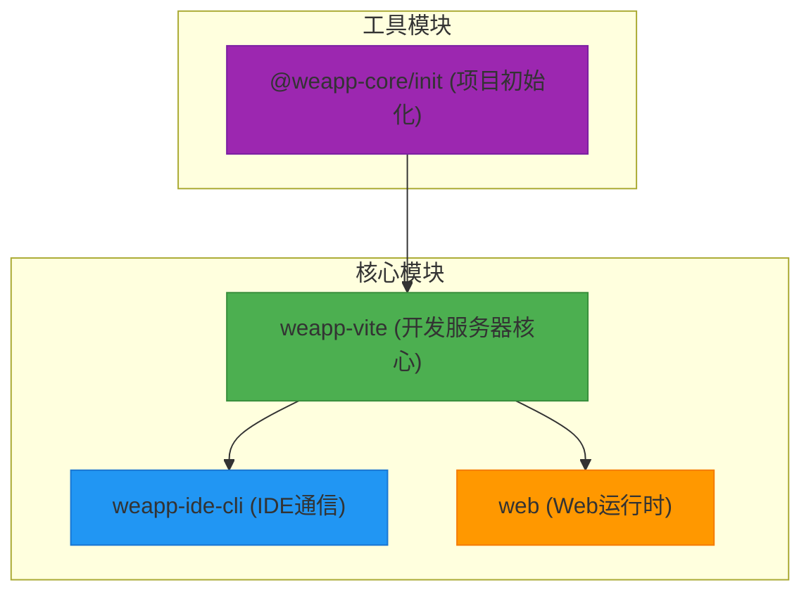
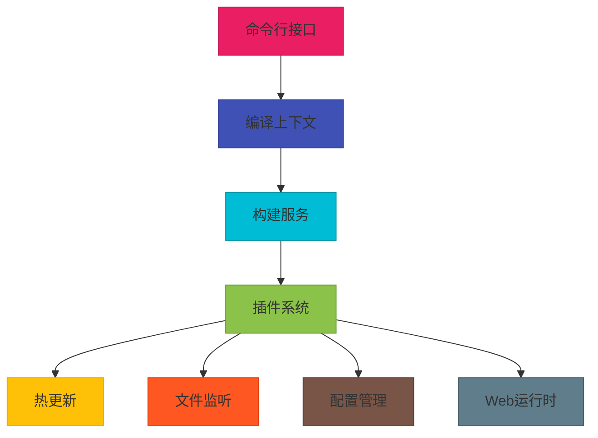
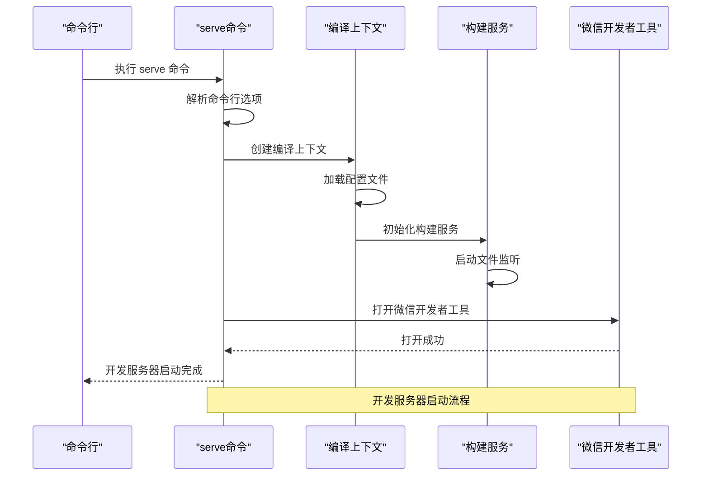
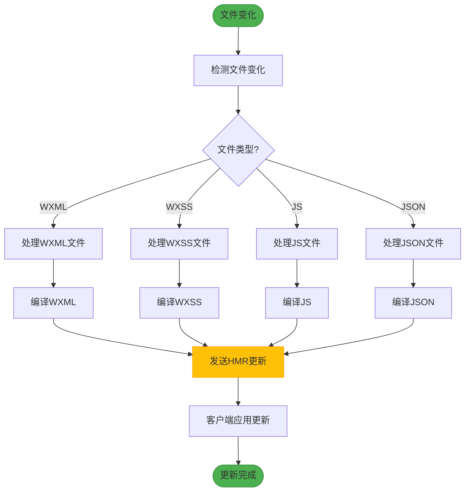
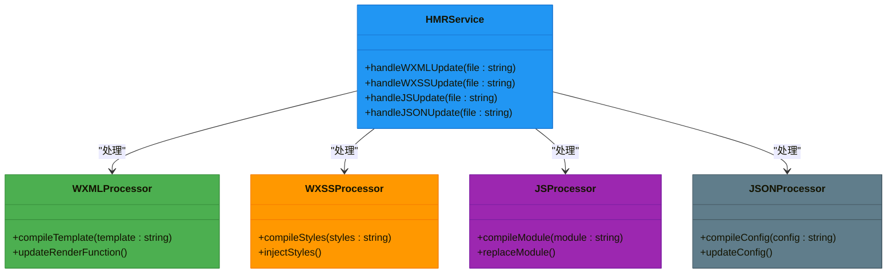
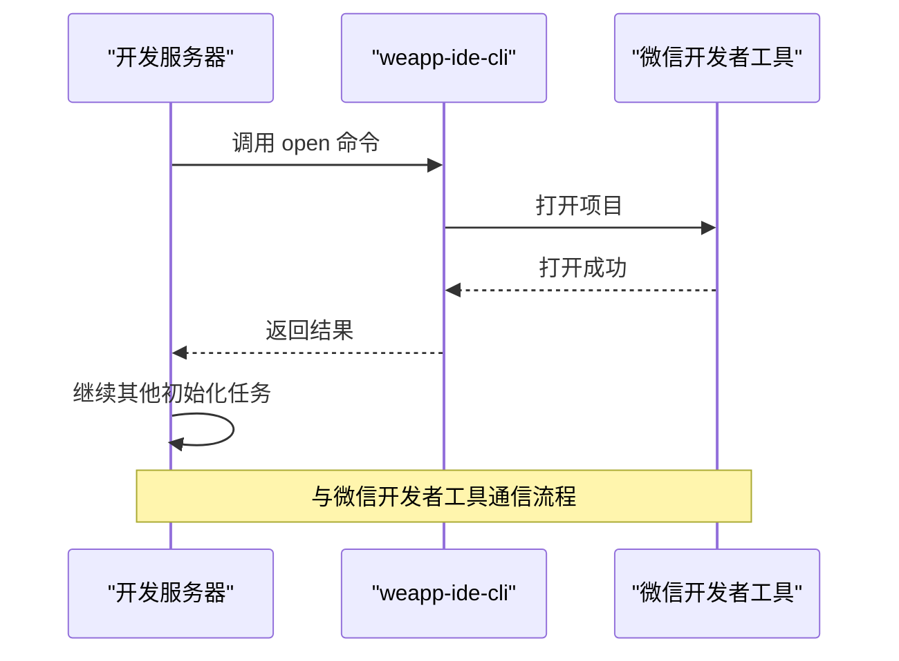
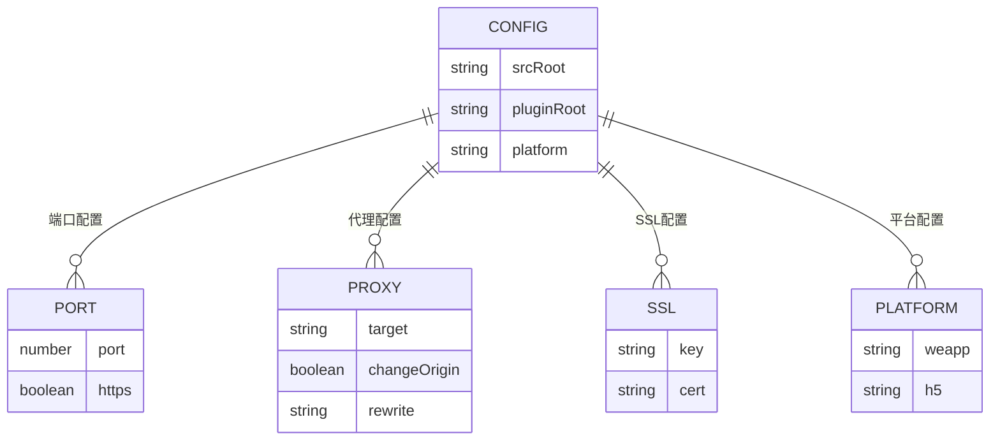
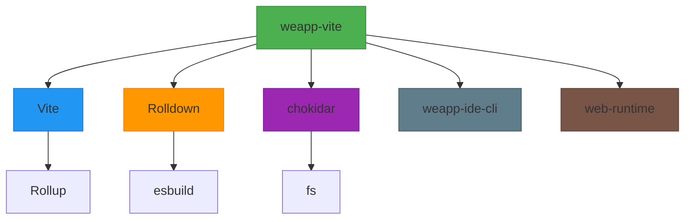

# 开发服务器

<cite>
**本文档中引用的文件**  
- [serve.ts](file://packages/weapp-vite/src/cli/commands/serve.ts)
- [buildPlugin.ts](file://packages/weapp-vite/src/runtime/buildPlugin.ts)
- [watcherPlugin.ts](file://packages/weapp-vite/src/runtime/watcherPlugin.ts)
- [autoRoutes.ts](file://packages/weapp-vite/src/plugins/autoRoutes.ts)
- [addModulesHot.ts](file://packages/weapp-vite/src/plugins/utils/addModulesHot.ts)
- [config.ts](file://packages/weapp-vite/src/config.ts)
- [createContext.ts](file://packages/weapp-vite/src/createContext.ts)
- [webPlugin.ts](file://packages/weapp-vite/src/runtime/webPlugin.ts)
- [types/config.ts](file://packages/weapp-vite/src/types/config.ts)
</cite>

## 目录

1. [介绍](#介绍)
2. [项目结构](#项目结构)
3. [核心组件](#核心组件)
4. [架构概述](#架构概述)
5. [详细组件分析](#详细组件分析)
6. [依赖分析](#依赖分析)
7. [性能考虑](#性能考虑)
8. [故障排除指南](#故障排除指南)
9. [结论](#结论)

## 介绍

weapp-vite开发服务器是专为微信小程序设计的现代化开发环境，基于Vite构建，提供快速启动、热模块替换（HMR）和高效的文件监听机制。该开发服务器不仅支持小程序原生的WXML、WXSS和JS文件，还集成了对TypeScript、Tailwind CSS等现代前端技术的支持。通过与微信开发者工具的深度集成，开发服务器实现了无缝的开发体验，包括自动打开开发者工具、实时编译和调试功能。此外，开发服务器还支持多平台构建，可以同时为小程序和Web端提供服务。

## 项目结构

weapp-vite开发服务器的项目结构遵循模块化设计原则，主要分为以下几个部分：
- `packages/weapp-vite`：核心开发服务器实现
- `packages/weapp-ide-cli`：与微信开发者工具通信的CLI工具
- `packages/web`：Web端运行时支持
- `@weapp-core/init`：项目初始化工具

**Diagram sources**
- [serve.ts](file://packages/weapp-vite/src/cli/commands/serve.ts)
- [openIde.ts](file://packages/weapp-vite/src/cli/openIde.ts)
- [webPlugin.ts](file://packages/weapp-vite/src/runtime/webPlugin.ts)
- [viteConfig.ts](file://@weapp-core/init/src/viteConfig.ts)

**Section sources**
- [serve.ts](file://packages/weapp-vite/src/cli/commands/serve.ts)
- [buildPlugin.ts](file://packages/weapp-vite/src/runtime/buildPlugin.ts)

## 核心组件

weapp-vite开发服务器的核心组件包括开发服务器启动器、文件监听器、热更新处理器和配置管理器。这些组件协同工作，提供了高效的开发体验。开发服务器启动器负责初始化编译上下文和加载配置，文件监听器监控文件系统变化，热更新处理器处理HMR请求，配置管理器则负责解析和管理各种配置选项。这些组件通过插件系统进行扩展，支持灵活的定制和集成。

**Section sources**
- [serve.ts](file://packages/weapp-vite/src/cli/commands/serve.ts)
- [createContext.ts](file://packages/weapp-vite/src/createContext.ts)
- [config.ts](file://packages/weapp-vite/src/config.ts)

## 架构概述

weapp-vite开发服务器采用分层架构设计，主要包括命令行接口层、编译上下文层、构建服务层和插件层。命令行接口层处理用户输入和命令执行，编译上下文层管理编译状态和配置，构建服务层负责实际的构建和监听任务，插件层则提供扩展能力。这种分层设计使得系统具有良好的可维护性和可扩展性。

**Diagram sources**
- [serve.ts](file://packages/weapp-vite/src/cli/commands/serve.ts)
- [createContext.ts](file://packages/weapp-vite/src/createContext.ts)
- [buildPlugin.ts](file://packages/weapp-vite/src/runtime/buildPlugin.ts)
- [watcherPlugin.ts](file://packages/weapp-vite/src/runtime/watcherPlugin.ts)

## 详细组件分析

### 开发服务器启动流程

weapp-vite开发服务器的启动流程始于`serve`命令的执行。该命令首先解析用户输入的选项，然后创建编译上下文，加载配置文件，并初始化各种服务。启动流程的关键步骤包括：解析配置文件、创建编译上下文、启动构建服务和打开微信开发者工具。

**Diagram sources**
- [serve.ts](file://packages/weapp-vite/src/cli/commands/serve.ts)
- [createContext.ts](file://packages/weapp-vite/src/createContext.ts)
- [openIde.ts](file://packages/weapp-vite/src/cli/openIde.ts)

**Section sources**
- [serve.ts](file://packages/weapp-vite/src/cli/commands/serve.ts)
- [createContext.ts](file://packages/weapp-vite/src/createContext.ts)

### 文件监听与热更新机制

weapp-vite开发服务器使用chokidar库实现文件监听功能。当文件发生变化时，监听器会触发相应的处理逻辑，包括重新编译和热更新。热更新机制通过WebSocket与客户端通信，将更新的模块推送到浏览器，实现快速的开发反馈。

**Diagram sources**
- [watcherPlugin.ts](file://packages/weapp-vite/src/runtime/watcherPlugin.ts)
- [buildPlugin.ts](file://packages/weapp-vite/src/runtime/buildPlugin.ts)
- [autoRoutes.ts](file://packages/weapp-vite/src/plugins/autoRoutes.ts)

**Section sources**
- [watcherPlugin.ts](file://packages/weapp-vite/src/runtime/watcherPlugin.ts)
- [buildPlugin.ts](file://packages/weapp-vite/src/runtime/buildPlugin.ts)

### HMR在小程序环境下的特殊实现

weapp-vite开发服务器针对小程序环境实现了特殊的HMR机制。由于小程序的运行环境限制，传统的HMR实现方式无法直接应用。开发服务器通过分析WXML、WXSS和JS文件的依赖关系，实现了增量更新策略。对于WXML文件，开发服务器会重新编译模板并更新对应的渲染函数；对于WXSS文件，会重新编译样式并注入到页面；对于JS文件，会重新编译并替换模块。

**Diagram sources**
- [autoRoutes.ts](file://packages/weapp-vite/src/plugins/autoRoutes.ts)
- [addModulesHot.ts](file://packages/weapp-vite/src/plugins/utils/addModulesHot.ts)
- [wxmlPlugin.ts](file://packages/weapp-vite/src/runtime/wxmlPlugin.ts)

**Section sources**
- [autoRoutes.ts](file://packages/weapp-vite/src/plugins/autoRoutes.ts)
- [addModulesHot.ts](file://packages/weapp-vite/src/plugins/utils/addModulesHot.ts)

### 与微信开发者工具的通信

weapp-vite开发服务器通过weapp-ide-cli工具与微信开发者工具进行通信。当开发服务器启动时，会调用weapp-ide-cli的open命令，自动打开微信开发者工具并加载当前项目。这种集成使得开发者可以无缝地在代码编辑器和开发者工具之间切换，提高了开发效率。

**Diagram sources**
- [openIde.ts](file://packages/weapp-vite/src/cli/openIde.ts)
- [weapp-ide-cli](file://packages/weapp-ide-cli)

**Section sources**
- [openIde.ts](file://packages/weapp-vite/src/cli/openIde.ts)

### 配置选项说明

weapp-vite开发服务器提供了丰富的配置选项，包括端口设置、代理配置和SSL支持。这些配置可以通过vite.config.ts文件进行设置，支持开发和生产环境的不同配置。

**Diagram sources**
- [types/config.ts](file://packages/weapp-vite/src/types/config.ts)
- [config.ts](file://packages/weapp-vite/src/config.ts)

**Section sources**
- [types/config.ts](file://packages/weapp-vite/src/types/config.ts)

## 依赖分析

weapp-vite开发服务器的依赖关系复杂但组织良好。核心依赖包括Vite、Rolldown、chokidar等。这些依赖通过插件系统进行集成，确保了系统的灵活性和可扩展性。

**Diagram sources**
- [package.json](file://packages/weapp-vite/package.json)
- [build.config.ts](file://packages/weapp-vite/build.config.ts)

**Section sources**
- [package.json](file://packages/weapp-vite/package.json)

## 性能考虑

weapp-vite开发服务器在性能方面进行了多项优化，包括减少文件监听开销、优化编译缓存和并行处理任务。这些优化措施显著提高了开发服务器的响应速度和整体性能。

**Section sources**
- [buildPlugin.ts](file://packages/weapp-vite/src/runtime/buildPlugin.ts)
- [cache](file://packages/weapp-vite/src/cache)

## 故障排除指南

weapp-vite开发服务器可能遇到的常见问题包括热更新失效、端口冲突和跨域问题。针对这些问题，开发服务器提供了相应的解决方案和调试工具。

**Section sources**
- [logger.ts](file://packages/weapp-vite/src/logger.ts)
- [debugger.ts](file://packages/weapp-vite/src/debugger.ts)

## 结论

weapp-vite开发服务器通过现代化的技术栈和精心设计的架构，为微信小程序开发提供了高效、灵活的开发环境。其核心优势包括快速的启动速度、实时的热更新和与微信开发者工具的无缝集成。通过深入理解开发服务器的启动流程、文件监听机制和热更新实现原理，开发者可以更好地利用这一工具，提高开发效率和代码质量。