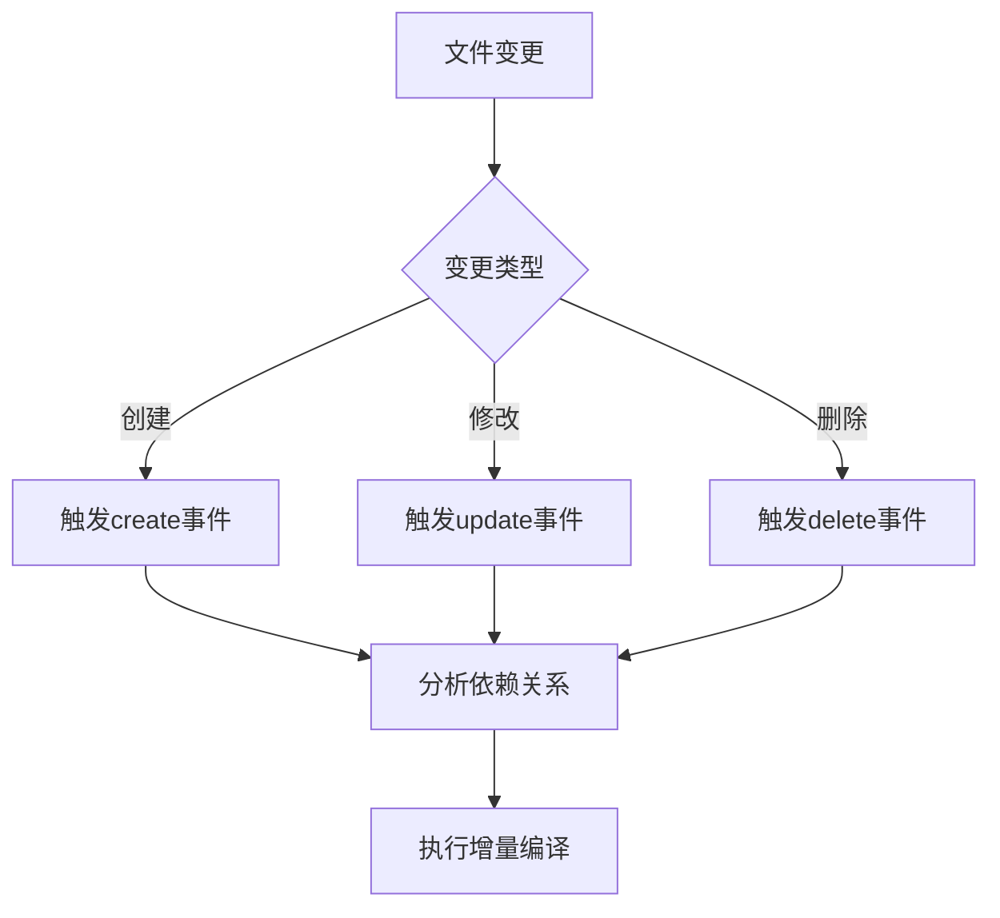
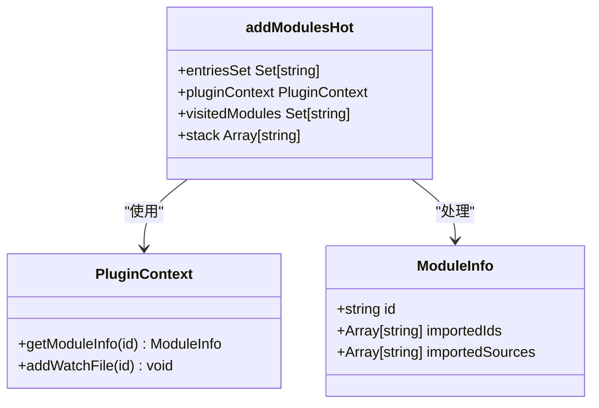
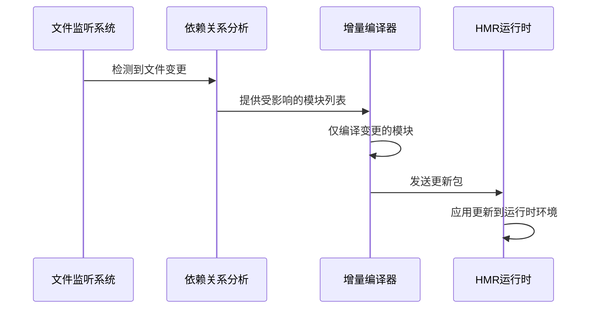
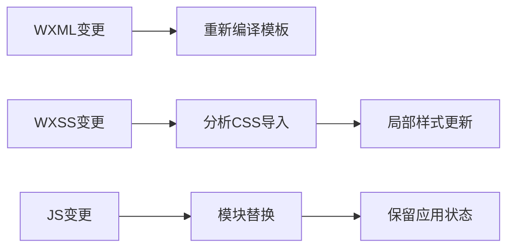
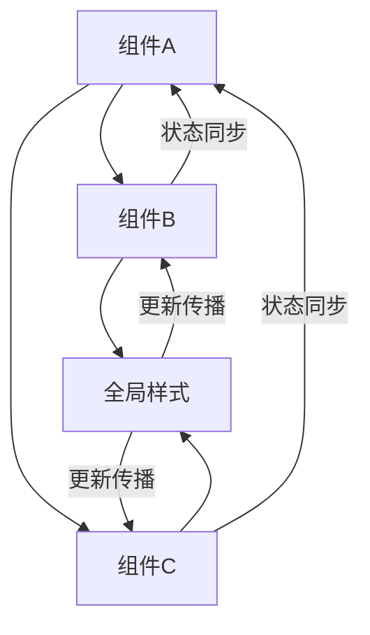

# 热更新实现

<cite>
**本文档引用的文件**
- [addModulesHot.ts](file://packages/weapp-vite/src/plugins/utils/addModulesHot.ts)
- [invalidateEntry.ts](file://packages/weapp-vite/src/plugins/utils/invalidateEntry.ts)
- [core.ts](file://packages/weapp-vite/src/plugins/core.ts)
- [wxs.ts](file://packages/weapp-vite/src/plugins/wxs.ts)
- [autoRoutes.ts](file://packages/weapp-vite/src/plugins/autoRoutes.ts)
- [constants.ts](file://packages/weapp-vite/src/constants.ts)
</cite>

## 目录
1. [简介](#简介)
2. [文件监听系统](#文件监听系统)
3. [依赖关系分析](#依赖关系分析)
4. [增量编译流程](#增量编译流程)
5. [小程序三端文件热更新策略](#小程序三端文件热更新策略)
6. [HMR运行时更新机制](#hmr运行时更新机制)
7. [依赖更新传播机制](#依赖更新传播机制)
8. [HMR配置选项](#hmr配置选项)
9. [性能特征与优化建议](#性能特征与优化建议)
10. [常见问题与解决方案](#常见问题与解决方案)

## 简介
weapp-vite开发服务器的热更新（HMR）机制通过文件监听、依赖分析和增量编译实现快速的开发体验。该系统能够检测文件变更，分析依赖关系，并仅重新编译受影响的模块，从而在不刷新页面的情况下更新应用状态。

**Section sources**
- [core.ts](file://packages/weapp-vite/src/plugins/core.ts#L1-L50)

## 文件监听系统
weapp-vite使用chokidar库实现文件监听功能。系统会监控源代码目录中的文件变化，包括创建、修改和删除事件。监听范围涵盖JavaScript、TypeScript、WXML、WXSS等小程序相关文件格式。

文件监听系统通过`ensureSidecarWatcher`函数初始化，该函数为指定目录创建chokidar监视器实例。监视器配置了适当的忽略规则，避免监听`node_modules`、`dist`等不需要的目录。

**Diagram sources**
- [invalidateEntry.ts](file://packages/weapp-vite/src/plugins/utils/invalidateEntry.ts#L405-L413)
- [core.ts](file://packages/weapp-vite/src/plugins/core.ts#L174-L178)

## 依赖关系分析
依赖关系分析是HMR机制的核心部分。系统通过静态分析代码中的导入语句来构建模块依赖图。对于每个入口文件，系统会递归地收集其所有依赖模块。

`addModulesHot`函数实现了依赖遍历算法，使用栈结构模拟递归过程，避免了深度嵌套导致的栈溢出问题。该函数会为每个模块添加监听，并将其依赖项加入处理队列。

**Diagram sources**
- [addModulesHot.ts](file://packages/weapp-vite/src/plugins/utils/addModulesHot.ts#L3-L28)
- [invalidateEntry.ts](file://packages/weapp-vite/src/plugins/utils/invalidateEntry.ts#L17-L23)

## 增量编译流程
增量编译流程在检测到文件变更后启动。系统首先确定变更文件的类型，然后根据类型执行相应的处理逻辑：

1. 对于JS/TS文件，直接触发模块重新编译
2. 对于WXSS文件，解析CSS导入依赖并更新相关样式表
3. 对于WXML文件，重新解析模板结构并生成新的渲染代码

`invalidateEntryForSidecar`函数负责处理侧车文件（如WXSS、WXML）的变更，它会找到关联的主文件并触发重新编译。

**Diagram sources**
- [invalidateEntry.ts](file://packages/weapp-vite/src/plugins/utils/invalidateEntry.ts#L272-L348)
- [core.ts](file://packages/weapp-vite/src/plugins/core.ts#L182-L190)

## 小程序三端文件热更新策略
weapp-vite针对小程序的三种主要文件类型（WXML、WXSS、JS）采用了不同的热更新策略。

### WXML结构变更处理
WXML文件的结构变更会触发完整的模板重新编译。系统会解析新的WXML结构，生成相应的渲染函数，并在HMR运行时中替换旧的渲染逻辑。

### WXSS样式的局部更新
WXSS文件支持局部更新。系统通过`extractCssImportDependencies`函数分析CSS文件中的导入关系，当某个样式文件变更时，只重新编译受直接影响的样式表，避免全局样式重编译。

### JS逻辑的模块替换
JS文件的热更新采用模块替换机制。当JavaScript模块内容变更时，HMR运行时会卸载旧模块并加载新模块，同时尝试保留应用状态。

**Diagram sources**
- [wxs.ts](file://packages/weapp-vite/src/plugins/wxs.ts#L81-L99)
- [autoRoutes.ts](file://packages/weapp-vite/src/plugins/autoRoutes.ts#L61-L78)
- [constants.ts](file://packages/weapp-vite/src/constants.ts#L25-L30)

## HMR运行时更新机制
HMR运行时在小程序环境中安全地应用更新，避免页面状态丢失。运行时系统通过以下机制确保更新的安全性：

1. 状态保留：在模块替换过程中，尽量保留组件实例的状态数据
2. 生命周期管理：正确处理组件的生命周期钩子，确保更新前后的一致性
3. 错误恢复：如果更新失败，回退到之前的状态

运行时通过`handleHotUpdate`函数处理热更新请求，该函数会验证更新的兼容性，并协调更新过程。

**Section sources**
- [autoRoutes.ts](file://packages/weapp-vite/src/plugins/autoRoutes.ts#L69-L84)
- [wxs.ts](file://packages/weapp-vite/src/plugins/wxs.ts#L114-L130)

## 依赖更新传播机制
weapp-vite实现了多层次的依赖更新传播机制，包括组件依赖、页面依赖和全局依赖。

### 组件依赖
组件依赖的更新会沿着组件树向上传播。当子组件更新时，父组件会收到通知并决定是否需要重新渲染。

### 页面依赖
页面依赖的更新会触发整个页面的重新编译。系统会分析页面JSON配置文件中的依赖关系，确保所有相关资源同步更新。

### 全局依赖
全局依赖（如全局样式、公共组件）的更新会影响所有使用它们的页面和组件。系统通过依赖图追踪这些影响范围。

**Diagram sources**
- [core.ts](file://packages/weapp-vite/src/plugins/core.ts#L197-L219)
- [invalidateEntry.ts](file://packages/weapp-vite/src/plugins/utils/invalidateEntry.ts#L203-L208)

## HMR配置选项
weapp-vite提供了灵活的HMR配置选项，允许开发者根据项目需求进行定制：

- 启用/禁用特定文件类型的热更新
- 自定义更新规则和触发条件
- 配置文件监听的忽略模式
- 调整热更新的性能参数

这些配置可以通过项目配置文件或命令行参数进行设置，为不同开发场景提供最佳体验。

**Section sources**
- [constants.ts](file://packages/weapp-vite/src/constants.ts#L7-L30)
- [invalidateEntry.ts](file://packages/weapp-vite/src/plugins/utils/invalidateEntry.ts#L11-L14)

## 性能特征与优化建议
weapp-vite的HMR系统具有以下性能特征：

- 快速的文件变更检测（毫秒级响应）
- 高效的依赖分析算法
- 增量编译减少不必要的工作量

优化建议包括：
1. 合理组织文件结构，减少不必要的依赖
2. 避免过深的组件嵌套层次
3. 使用代码分割减少单个模块的大小
4. 定期清理无用的监听器和缓存

**Section sources**
- [invalidateEntry.ts](file://packages/weapp-vite/src/plugins/utils/invalidateEntry.ts#L350-L470)
- [core.ts](file://packages/weapp-vite/src/plugins/core.ts#L164-L179)

## 常见问题与解决方案
### 热更新失效
可能原因及解决方案：
- 文件路径大小写不匹配：确保文件路径完全匹配
- 监听器未正确初始化：检查项目配置和目录结构
- 缓存问题：尝试清理构建缓存

### 更新后样式错乱
可能原因及解决方案：
- CSS作用域冲突：使用更具体的选择器
- 样式加载顺序问题：检查样式文件的导入顺序
- 缓存未正确清除：强制刷新样式缓存

这些问题通常可以通过检查配置、清理缓存和重启开发服务器来解决。

**Section sources**
- [invalidateEntry.ts](file://packages/weapp-vite/src/plugins/utils/invalidateEntry.ts#L458-L465)
- [core.ts](file://packages/weapp-vite/src/plugins/core.ts#L194-L195)