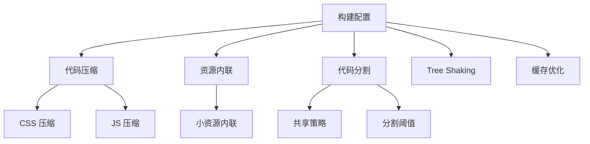
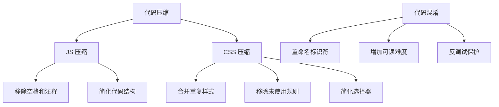
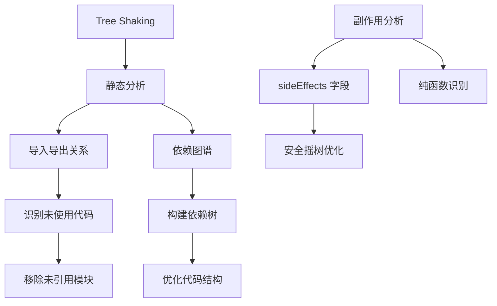
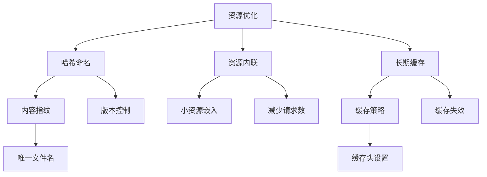
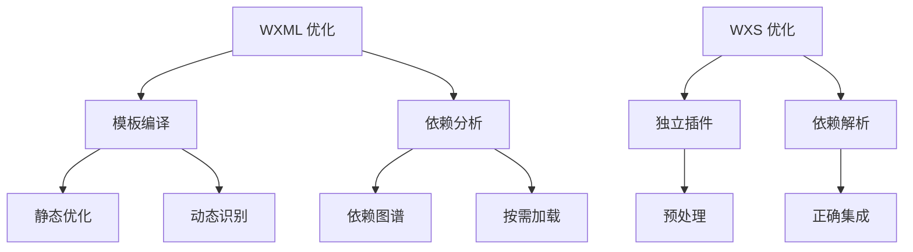
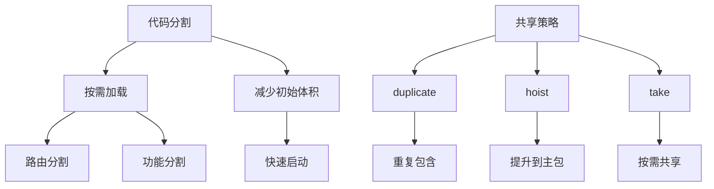
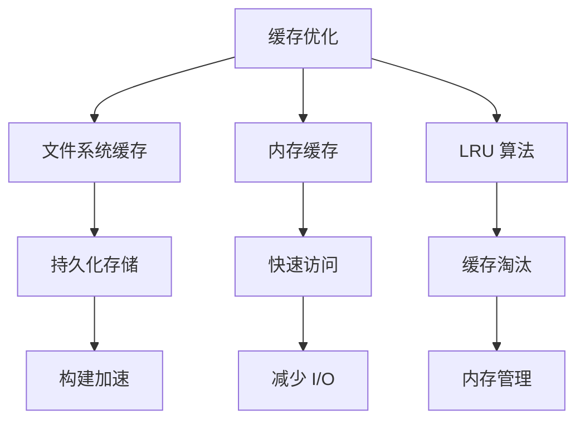

# 代码优化

<cite>
**本文档中引用的文件**  
- [defaults.ts](file://packages/weapp-vite/src/defaults.ts)
- [chunkStrategy.ts](file://packages/weapp-vite/src/runtime/chunkStrategy.ts)
- [core.ts](file://packages/weapp-vite/src/plugins/core.ts)
- [wxs.ts](file://packages/weapp-vite/src/plugins/wxs.ts)
- [utils.ts](file://packages/weapp-vite/src/wxs/utils.ts)
- [cache.ts](file://packages/rolldown-require/src/cache.ts)
- [bundler.ts](file://packages/rolldown-require/src/bundler.ts)
- [packages.ts](file://packages/rolldown-require/src/packages.ts)
- [config.ts](file://packages/weapp-vite/src/runtime/config/types.ts)
- [vite.config.ts](file://apps/vite-native/vite.config.ts)
</cite>

## 目录
1. [简介](#简介)
2. [构建优化配置](#构建优化配置)
3. [代码压缩与混淆](#代码压缩与混淆)
4. [Tree Shaking 实现机制](#tree-shaking-实现机制)
5. [资源文件优化](#资源文件优化)
6. [WXML 与 WXS 优化](#wxml-与-wxs-优化)
7. [代码分割与共享策略](#代码分割与共享策略)
8. [缓存优化机制](#缓存优化机制)
9. [最佳实践建议](#最佳实践建议)

## 简介

weapp-vite 是一个针对小程序环境的构建工具，提供了全面的代码优化功能。本文档详细介绍了在构建过程中应用的各种代码优化技术，包括 CSS 压缩、JS 代码压缩、WXML 模板优化和 WXS 脚本优化。通过分析源码实现，深入探讨了 Tree Shaking 消除未使用代码的机制、资源文件的哈希命名策略、长期缓存优化以及代码混淆和反调试保护的实现方式。

**Section sources**
- [defaults.ts](file://packages/weapp-vite/src/defaults.ts#L1-L88)

## 构建优化配置

weapp-vite 提供了丰富的构建优化配置选项，允许开发者根据项目需求进行精细化调整。核心配置包括代码压缩、资源内联阈值、代码分割策略等。通过 `defineConfig` 函数可以定义构建配置，其中 `weapp` 选项包含了小程序特有的优化设置。

**Diagram sources**
- [vite.config.ts](file://apps/vite-native/vite.config.ts#L1-L9)
- [config.ts](file://packages/weapp-vite/src/runtime/config/types.ts#L1-L69)

**Section sources**
- [vite.config.ts](file://apps/vite-native/vite.config.ts#L1-L9)
- [config.ts](file://packages/weapp-vite/src/runtime/config/types.ts#L1-L69)

## 代码压缩与混淆

weapp-vite 在构建过程中实现了全面的代码压缩和混淆功能。JS 代码压缩通过移除不必要的空格、注释和简化代码结构来减小文件体积。CSS 压缩则通过合并重复样式、移除未使用规则和简化选择器来优化样式文件。

代码混淆功能通过重命名变量、函数和类名，增加代码的可读难度，从而提供一定程度的反调试保护。这种混淆不仅有助于保护源码逻辑，还能进一步减小代码体积。

**Diagram sources**
- [bundler.ts](file://packages/rolldown-require/src/bundler.ts#L92-L146)
- [defaults.ts](file://packages/weapp-vite/src/defaults.ts#L50-L52)

**Section sources**
- [bundler.ts](file://packages/rolldown-require/src/bundler.ts#L92-L146)
- [defaults.ts](file://packages/weapp-vite/src/defaults.ts#L50-L52)

## Tree Shaking 实现机制

Tree Shaking 是 weapp-vite 中消除未使用代码的核心机制。通过静态分析代码的导入导出关系，识别并移除未被引用的模块和函数，从而显著减小构建产物的体积。

在小程序环境下，Tree Shaking 的实现需要考虑特殊的模块系统和运行环境。weapp-vite 通过分析 `sideEffects` 字段来判断模块是否有副作用，对于标记为无副作用的模块，可以安全地进行摇树优化。

**Diagram sources**
- [packages.ts](file://packages/rolldown-require/src/packages.ts#L181-L215)
- [core.ts](file://packages/weapp-vite/src/plugins/core.ts#L630-L687)

**Section sources**
- [packages.ts](file://packages/rolldown-require/src/packages.ts#L181-L215)
- [core.ts](file://packages/weapp-vite/src/plugins/core.ts#L630-L687)

## 资源文件优化

weapp-vite 对资源文件进行了全面的优化处理。通过哈希命名策略，为每个资源文件生成唯一的文件名，确保长期缓存的有效性。当文件内容发生变化时，哈希值也会相应改变，从而强制客户端获取最新版本。

资源内联阈值配置允许将小于指定大小的资源直接嵌入到主文件中，减少 HTTP 请求数量。这种优化对于小图标、字体文件等特别有效，可以显著提升页面加载性能。

**Diagram sources**
- [cache.ts](file://packages/rolldown-require/src/cache.ts#L55-L107)
- [defaults.ts](file://packages/weapp-vite/src/defaults.ts#L68-L87)

**Section sources**
- [cache.ts](file://packages/rolldown-require/src/cache.ts#L55-L107)
- [defaults.ts](file://packages/weapp-vite/src/defaults.ts#L68-L87)

## WXML 与 WXS 优化

weapp-vite 针对小程序特有的 WXML 模板和 WXS 脚本提供了专门的优化处理。WXML 优化主要集中在模板编译和依赖分析上，通过静态分析识别模板中的动态部分，优化渲染性能。

WXS 脚本优化则通过独立的插件系统进行处理，确保 WXS 代码的正确解析和优化。wxs 插件在构建过程中预处理 WXS 文件，分析其依赖关系，并将其正确地集成到最终的构建产物中。

**Diagram sources**
- [wxs.ts](file://packages/weapp-vite/src/plugins/wxs.ts#L106-L141)
- [utils.ts](file://packages/weapp-vite/src/wxs/utils.ts#L1-L5)

**Section sources**
- [wxs.ts](file://packages/weapp-vite/src/plugins/wxs.ts#L106-L141)
- [utils.ts](file://packages/weapp-vite/src/wxs/utils.ts#L1-L5)

## 代码分割与共享策略

weapp-vite 提供了灵活的代码分割和共享策略，支持多种分包模式下的代码组织。通过配置 `chunks.sharedStrategy`，可以选择不同的共享策略，如 'duplicate'（重复）、'hoist'（提升）等。

代码分割策略能够将应用代码拆分为多个独立的块，实现按需加载，减少初始加载时间。共享策略则决定了不同分包之间公共代码的处理方式，平衡代码复用和加载性能。

**Diagram sources**
- [chunkStrategy.ts](file://packages/weapp-vite/src/runtime/chunkStrategy.ts#L86-L807)
- [core.ts](file://packages/weapp-vite/src/plugins/core.ts#L324-L356)

**Section sources**
- [chunkStrategy.ts](file://packages/weapp-vite/src/runtime/chunkStrategy.ts#L86-L807)
- [core.ts](file://packages/weapp-vite/src/plugins/core.ts#L324-L356)

## 缓存优化机制

weapp-vite 实现了多层次的缓存优化机制，包括文件系统缓存和内存缓存。通过 LRU（最近最少使用）缓存算法，高效管理缓存项，确保常用资源的快速访问。

缓存键的生成基于文件内容的哈希值，确保内容变化时缓存能够正确失效。这种机制不仅提高了构建速度，还保证了构建结果的一致性和可靠性。

**Diagram sources**
- [cache.ts](file://packages/rolldown-require/src/cache.ts#L55-L107)
- [file.ts](file://packages/weapp-vite/src/cache/file.ts#L1-L121)

**Section sources**
- [cache.ts](file://packages/rolldown-require/src/cache.ts#L55-L107)
- [file.ts](file://packages/weapp-vite/src/cache/file.ts#L1-L121)

## 最佳实践建议

基于 weapp-vite 的优化特性，以下是推荐的最佳实践：

1. **合理配置代码分割**：根据应用结构和用户行为模式，设计合理的代码分割策略，平衡初始加载时间和后续加载性能。

2. **充分利用 Tree Shaking**：确保第三方库正确声明 `sideEffects` 字段，以便 weapp-vite 能够安全地进行摇树优化。

3. **优化资源文件**：对图片等静态资源进行压缩，并合理设置资源内联阈值，减少 HTTP 请求数量。

4. **配置适当的缓存策略**：利用哈希命名和长期缓存，提高用户再次访问时的加载速度。

5. **监控构建产物**：定期分析构建产物的大小和结构，识别潜在的优化机会。

6. **测试不同优化配置**：在不同网络环境和设备上测试应用性能，确保优化策略的有效性。

通过遵循这些最佳实践，可以充分发挥 weapp-vite 的优化能力，构建高性能的小程序应用。

**Section sources**
- [defaults.ts](file://packages/weapp-vite/src/defaults.ts#L40-L66)
- [chunkStrategy.ts](file://packages/weapp-vite/src/runtime/chunkStrategy.ts#L86-L807)