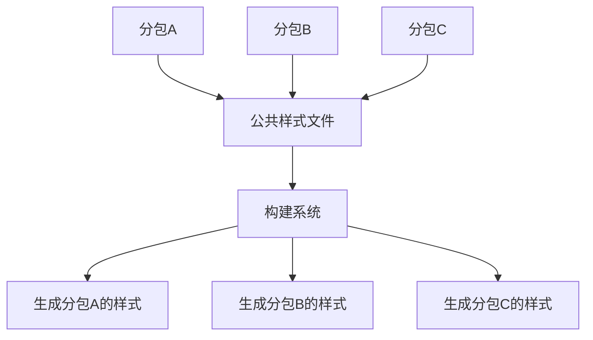
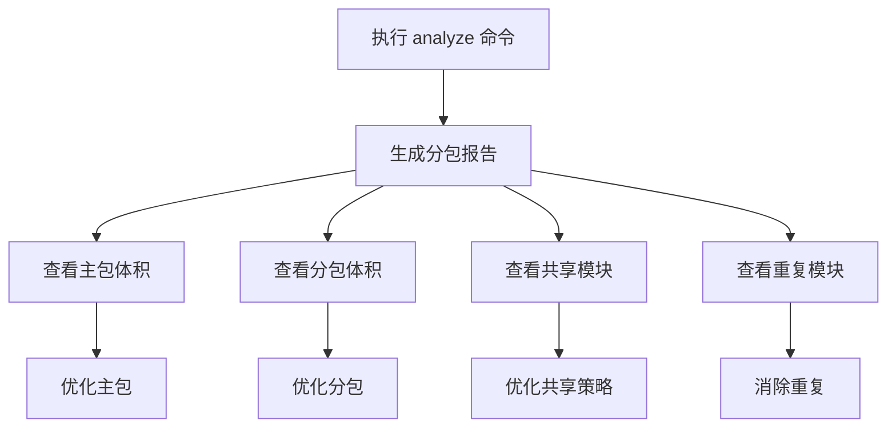

# 分包策略

<cite>
**本文档引用文件**   
- [subpackages.md](file://docs/subpackages.md)
- [config/subpackages.md](file://website/config/subpackages.md)
- [analyze/subpackages.ts](file://packages/weapp-vite/src/analyze/subpackages.ts)
- [chunkStrategy.ts](file://packages/weapp-vite/src/runtime/chunkStrategy.ts)
- [scanPlugin.ts](file://packages/weapp-vite/src/runtime/scanPlugin.ts)
- [core.ts](file://packages/weapp-vite/src/plugins/core.ts)
- [app.json.ts](file://apps/vite-native/app.json.ts)
- [vite.config.ts](file://apps/vite-native/vite.config.ts)
</cite>

## 目录
1. [引言](#引言)
2. [分包机制概述](#分包机制概述)
3. [主包与分包的代码分割策略](#主包与分包的代码分割策略)
4. [公共资源提取与引用机制](#公共资源提取与引用机制)
5. [分包配置定义](#分包配置定义)
6. [跨分包依赖处理](#跨分包依赖处理)
7. [独立分包支持](#独立分包支持)
8. [预下载分包支持](#预下载分包支持)
9. [分包体积分析工具](#分包体积分析工具)
10. [分包加载时机与性能影响](#分包加载时机与性能影响)
11. [分包设计最佳实践](#分包设计最佳实践)
12. [常见分包问题与解决方案](#常见分包问题与解决方案)

## 引言

在大型微信小程序项目中，合理使用分包机制是提升首屏加载速度、优化用户体验和控制包体大小的关键手段。`weapp-vite` 构建工具通过其强大的配置能力和自动化分析，为开发者提供了精细化管理分包的完整解决方案。本文档将深入解析 `weapp-vite` 中分包策略的实现原理，涵盖从配置定义、代码分割、依赖处理到性能优化的各个方面，旨在帮助开发者构建高效、可维护的小程序应用。

## 分包机制概述

微信小程序的分包机制允许开发者将代码按功能或业务模块拆分为多个独立的包，从而实现按需加载。主包负责承载小程序的启动和核心功能，而分包则用于存放非核心或特定场景下的业务逻辑。`weapp-vite` 在此基础之上，提供了更高级的构建能力，使得分包管理更加灵活和高效。

分包主要分为两种类型：普通分包和独立分包。普通分包与主包共享运行时上下文，可以访问主包的全局数据和依赖；而独立分包则拥有独立的运行时上下文，无法直接访问主包的全局数据，但可以独立运行，适用于需要高度隔离的业务场景。

**Section sources**
- [subpackages.md](file://docs/subpackages.md#L1-L151)

## 主包与分包的代码分割策略

`weapp-vite` 的代码分割策略基于对 `app.json` 文件的直接读取和分析。开发者在 `app.json` 中定义的 `subpackages` 或 `subPackages` 字段会被构建系统自动识别，并据此进行代码分割。

构建系统会根据每个分包的 `root` 路径，将对应的源代码文件（位于 `srcRoot` 目录下）编译并打包到指定的分包目录中。主包则包含 `pages` 字段中定义的页面以及未被任何分包包含的公共代码。

为了确保主包的最小化，建议将首屏加载所必需的页面和逻辑保留在主包中，而将其他业务模块尽可能地拆分到分包中。`weapp-vite` 通过 `lazyCodeLoading` 配置项支持分包异步化，可以进一步降低首包体积和首次渲染开销。

**Section sources**
- [subpackages.md](file://docs/subpackages.md#L1-L151)
- [app.json.ts](file://apps/vite-native/app.json.ts#L1-L105)

## 公共资源提取与引用机制

在多分包项目中，如何高效地管理和引用公共资源（如样式、工具函数、第三方库）是一个关键问题。`weapp-vite` 提供了灵活的机制来处理跨分包的公共资源。

### 公共资源提取

`weapp-vite` 通过 `chunks.sharedStrategy` 配置项来控制跨包共享模块的输出策略。该策略决定了当多个分包或主包引用了同一个模块时，该模块应该如何被处理。常见的策略包括：

- **`duplicate`**：将共享模块复制到每个引用它的分包中。这种方式简单直接，但可能导致代码重复。
- **`hoist`**：将共享模块提升到主包中，由主包统一加载。这种方式可以避免代码重复，但会增加主包的体积。

构建系统会自动分析模块的引用关系，并根据配置的策略生成相应的代码。例如，当使用 `duplicate` 策略时，构建系统会为每个分包生成一个包含共享模块的独立 chunk，并在分包的入口文件中引入。

### 公共资源引用

对于样式等静态资源，`weapp-vite` 提供了 `weapp.subPackages.<root>.styles` 配置项，允许为每个分包注入公共样式文件。这些样式文件可以是 `wxss`、`css`、`scss` 等格式，构建系统会统一转换为目标平台的后缀并按作用域注入。



**Diagram sources **
- [config/subpackages.md](file://website/config/subpackages.md#L34-L81)
- [chunkStrategy.ts](file://packages/weapp-vite/src/runtime/chunkStrategy.ts#L459-L503)

**Section sources**
- [config/subpackages.md](file://website/config/subpackages.md#L34-L81)
- [chunkStrategy.ts](file://packages/weapp-vite/src/runtime/chunkStrategy.ts#L459-L503)

## 分包配置定义

`weapp-vite` 的分包配置主要通过 `vite.config.ts` 文件中的 `weapp.subPackages` 选项来定义。该选项是一个对象，其键名为 `app.json` 中分包的 `root` 路径，值为该分包的特定配置。

```ts
export default defineConfig({
  weapp: {
    subPackages: {
      'packages/order': {
        independent: true,
        dependencies: [/^@order\//, 'dayjs'],
        inlineConfig: {
          define: { 'import.meta.env.ORDER_SCOPE': 'true' },
        },
        styles: [
          'styles/theme.scss',
          {
            source: '../shared/styles/components.scss',
            scope: 'components',
            include: ['components/**'],
          },
        ],
      },
    },
  },
})
```

### 配置项说明

- **`independent`**：布尔值，指定该分包是否为独立分包。
- **`dependencies`**：数组，精确控制该分包需要的 `miniprogram_npm` 依赖，防止主包依赖泄漏。
- **`inlineConfig`**：对象，为该分包追加自定义的 Vite 构建配置，如 `define` 宏定义。
- **`styles`**：字符串或对象数组，为该分包注入公共样式文件，并可指定作用域和包含/排除规则。

**Section sources**
- [subpackages.md](file://docs/subpackages.md#L27-L151)
- [vite.config.ts](file://apps/vite-native/vite.config.ts#L59-L100)

## 跨分包依赖处理

跨分包依赖的处理是分包机制中的一个复杂问题。`weapp-vite` 通过构建时的静态分析和代码重写来解决这一问题。

当一个模块被多个分包引用时，构建系统会根据 `chunks.sharedStrategy` 策略决定如何处理该模块。如果策略为 `duplicate`，则该模块会被复制到每个引用它的分包中；如果策略为 `hoist`，则该模块会被提升到主包中。

此外，`weapp-vite` 还支持通过 `markTakeModuleImporter` 和 `resolveSharedChunkName` 等内部函数来精确控制模块的共享行为。这些函数在构建过程中被调用，以确保模块的引用关系正确无误。

**Section sources**
- [chunkStrategy.ts](file://packages/weapp-vite/src/runtime/chunkStrategy.ts#L1-L800)
- [core.ts](file://packages/weapp-vite/src/plugins/core.ts#L414-L440)

## 独立分包支持

独立分包是一种特殊的分包类型，它拥有独立的运行时上下文，无法直接访问主包的全局数据。`weapp-vite` 对独立分包的支持非常完善。

在 `app.json` 中将分包的 `independent` 字段设置为 `true`，即可将其标记为独立分包。`weapp-vite` 会为独立分包创建独立的构建上下文，并精确控制其依赖。

通过 `weapp.subPackages.<root>.dependencies` 配置项，可以为独立分包指定其所需的 `miniprogram_npm` 依赖，防止主包的依赖被错误地引入。同时，`inlineConfig` 配置项允许为独立分包追加自定义的构建配置，如定义特定的环境变量。

**Section sources**
- [subpackages.md](file://docs/subpackages.md#L119-L124)
- [app.json.ts](file://apps/vite-native/app.json.ts#L45-L46)
- [vite.config.ts](file://apps/vite-native/vite.config.ts#L98-L99)

## 预下载分包支持

分包预下载是一种优化策略，允许在特定时机（如首屏加载后）提前下载用户可能访问的分包，从而缩短后续页面的加载时间。

`weapp-vite` 支持通过 `app.json` 中的 `preloadRule` 字段来配置分包预下载规则。开发者可以指定触发页、目标分包、网络条件和超时时间。

```json
{
  "preloadRule": {
    "pages/index/index": {
      "packages": ["packages/profile"],
      "network": "all",
      "timeout": 2000
    }
  }
}
```

在运行时，小程序框架会根据这些规则自动触发分包的预下载。开发者也可以在页面的 `onLoad` 生命周期中结合 `wx.preloadSubpackage` API 进行更细粒度的控制。

**Section sources**
- [subpackages.md](file://docs/subpackages.md#L125-L129)
- [app.json.ts](file://apps/vite-native/app.json.ts#L60-L61)

## 分包体积分析工具

为了帮助开发者优化分包结构，`weapp-vite` 提供了分包体积分析工具。通过在 `package.json` 中添加 `"analyze": "weapp-vite analyze"` 脚本，执行 `pnpm run analyze` 即可生成详细的分包报告。

该报告会展示每个（子）包的产物结构、共享模块以及重复模块，帮助开发者定位潜在的优化点。例如，可以发现哪些模块被重复打包，哪些分包的体积过大等。



**Diagram sources **
- [subpackages.md](file://docs/subpackages.md#L139-L142)

**Section sources**
- [subpackages.md](file://docs/subpackages.md#L139-L142)

## 分包加载时机与性能影响

分包的加载时机对用户体验有着直接的影响。主包的加载速度决定了小程序的启动时间，而分包的加载速度则影响了页面的切换流畅度。

`weapp-vite` 通过分包异步化和预下载机制来优化加载性能。启用 `lazyCodeLoading: "requiredComponents"` 可以避免一次性加载所有自定义组件代码，从而降低首包体积和首次渲染开销。

同时，合理的分包预下载策略可以在用户无感知的情况下提前加载关键分包，显著缩短后续页面的加载时间。开发者应根据用户的使用习惯和业务场景，精心设计分包的加载策略。

**Section sources**
- [subpackages.md](file://docs/subpackages.md#L131-L135)

## 分包设计最佳实践

### 合理划分业务模块

建议以业务边界来拆分分包，例如将订单、用户中心、营销活动等模块分别放入不同的分包中。这样不仅便于团队协作和权限划分，也有利于代码的维护和复用。

### 避免循环依赖

在设计分包时，应尽量避免分包之间的循环依赖。循环依赖会导致构建失败或运行时错误。可以通过将公共代码提取到主包或公共目录来解决此问题。

### 优化公共资源

公共工具、样式、国际化资源等应放在主包或公共目录中，由构建器负责复制或抽取。避免在多个分包中重复定义相同的资源。

### 利用独立分包

对于需要自定义 TabBar、插件能力或明显跨团队交付的模块，优先考虑使用独立分包。独立分包可以提供更好的隔离性和独立性。

**Section sources**
- [subpackages.md](file://docs/subpackages.md#L18-L26)

## 常见分包问题与解决方案

### 分包加载失败

检查 `app.json` 中的 `root` 路径是否正确，确保对应的目录和页面文件存在。同时，检查构建日志中是否有相关错误信息。

### 资源重复

使用分包体积分析工具检查是否存在重复的模块。根据分析结果，调整 `chunks.sharedStrategy` 策略或优化代码结构，消除不必要的重复。

### 路径错误

确保在代码中引用分包资源时使用正确的相对路径或别名。`weapp-vite` 支持通过 `jsonAlias` 配置项定义路径别名，简化路径引用。

**Section sources**
- [subpackages.md](file://docs/subpackages.md#L137-L143)