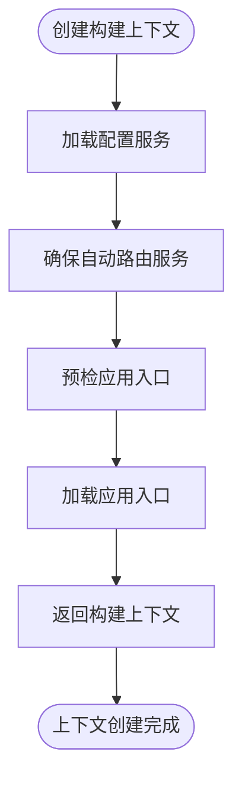
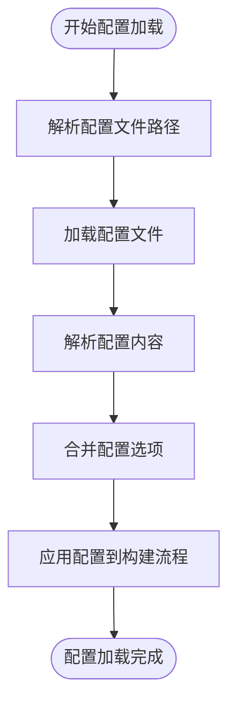
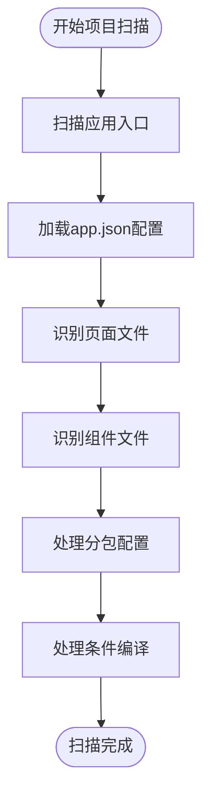
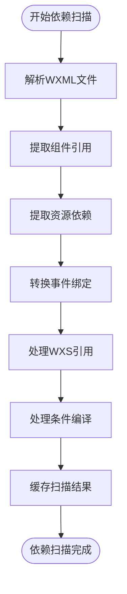
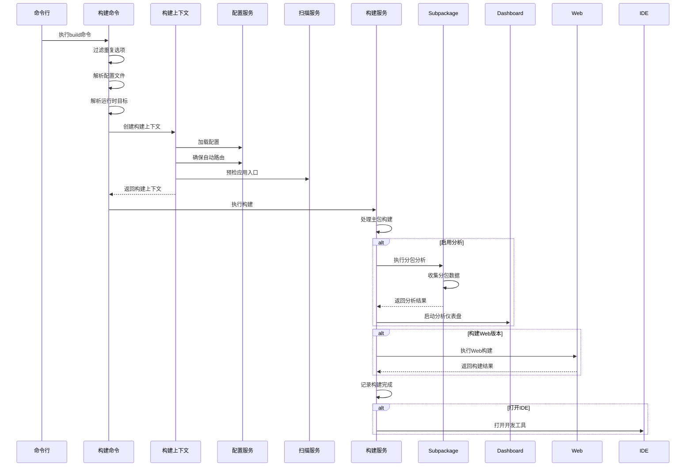
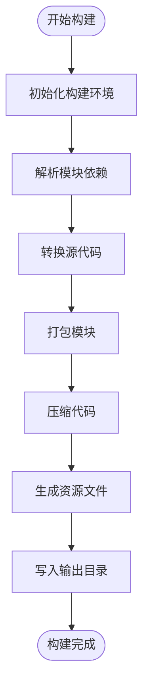
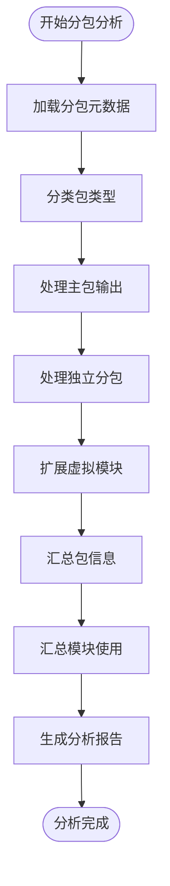
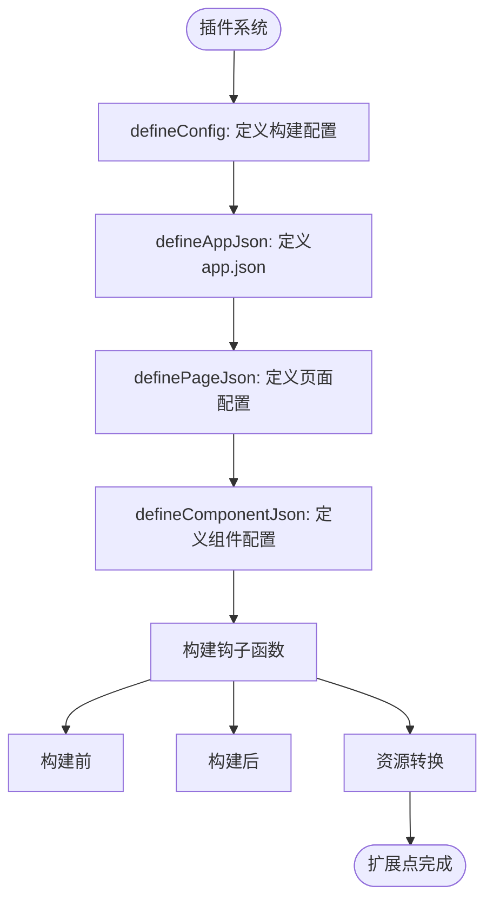

# 构建流程

<cite>
**本文档中引用的文件**
- [build.ts](file://packages/weapp-vite/src/cli/commands/build.ts)
- [createContext.ts](file://packages/weapp-vite/src/createContext.ts)
- [context.ts](file://packages/weapp-vite/src/types/context.ts)
- [scan.ts](file://packages/weapp-vite/src/wxml/scan.ts)
- [config.ts](file://packages/weapp-vite/src/config.ts)
- [subpackages.ts](file://packages/weapp-vite/src/analyze/subpackages.ts)
- [index.ts](file://packages/weapp-vite/src/index.ts)
</cite>

## 目录
1. [构建流程概述](#构建流程概述)
2. [构建上下文创建](#构建上下文创建)
3. [配置加载与解析](#配置加载与解析)
4. [项目扫描与资源识别](#项目扫描与资源识别)
5. [依赖扫描与转换](#依赖扫描与转换)
6. [构建流程时序图](#构建流程时序图)
7. [构建服务执行](#构建服务执行)
8. [分包分析与处理](#分包分析与处理)
9. [插件系统与扩展点](#插件系统与扩展点)

## 构建流程概述

weapp-vite的构建流程从执行构建命令开始，经历配置加载、项目解析、依赖扫描、资源转换和文件输出等多个阶段。整个流程由构建上下文(CompilerContext)协调管理，确保各个构建环节有序执行。构建流程支持主包、分包和独立分包的构建，并提供分包分析功能帮助开发者优化包体积。

**Section sources**
- [build.ts](file://packages/weapp-vite/src/cli/commands/build.ts#L1-L81)

## 构建上下文创建

构建上下文(CompilerContext)是weapp-vite构建系统的核心协调机制。通过`createCompilerContext`函数创建和管理构建上下文，该函数负责初始化配置服务(configService)、扫描服务(scanService)和自动路由服务(autoRoutesService)等关键组件。构建上下文在整个构建生命周期中保持状态一致性，确保各个构建环节能够共享配置和状态信息。

**Diagram sources**
- [createContext.ts](file://packages/weapp-vite/src/createContext.ts#L1-L28)

**Section sources**
- [createContext.ts](file://packages/weapp-vite/src/createContext.ts#L1-L28)
- [context.ts](file://packages/weapp-vite/src/types/context.ts#L1-L17)

## 配置加载与解析

构建流程首先解析小程序项目配置文件project.config.json，该文件定义了项目的根目录、分包配置、编译设置等关键信息。配置服务(configService)负责加载和解析这些配置，并将其应用于整个构建过程。通过`resolveConfigFile`函数确定配置文件路径，然后使用`load`方法加载配置内容，确保构建过程能够正确识别项目结构和构建目标。

**Diagram sources**
- [build.ts](file://packages/weapp-vite/src/cli/commands/build.ts#L38-L47)
- [config.ts](file://packages/weapp-vite/src/config.ts#L1-L29)

**Section sources**
- [build.ts](file://packages/weapp-vite/src/cli/commands/build.ts#L38-L47)
- [config.ts](file://packages/weapp-vite/src/config.ts#L1-L29)

## 项目扫描与资源识别

项目扫描服务(scanService)负责识别和处理小程序的页面、组件和分包。通过扫描源码目录，构建系统能够自动发现应用入口、页面文件和组件文件。分包配置在app.json中定义，构建系统会根据这些配置识别主包和各个分包的根目录。扫描过程还处理条件编译注释，确保平台特定的代码能够正确包含或排除。

**Diagram sources**
- [build.ts](file://packages/weapp-vite/src/cli/commands/build.ts#L42-L48)
- [subpackages.ts](file://packages/weapp-vite/src/analyze/subpackages.ts#L546-L560)

**Section sources**
- [build.ts](file://packages/weapp-vite/src/cli/commands/build.ts#L42-L48)
- [subpackages.ts](file://packages/weapp-vite/src/analyze/subpackages.ts#L546-L560)

## 依赖扫描与转换

依赖扫描是构建流程中的关键环节，特别是对WXML文件的依赖分析。`scanWxml`函数负责解析WXML文件，识别其中的组件引用、资源依赖和事件绑定。通过HTML解析器，构建系统能够准确提取WXML中的各种依赖关系，并进行相应的转换处理，如事件指令转换(@click到bind:tap)、WXS文件引用处理等。扫描结果被缓存以提高构建性能。

**Diagram sources**
- [scan.ts](file://packages/weapp-vite/src/wxml/scan.ts#L1-L303)

**Section sources**
- [scan.ts](file://packages/weapp-vite/src/wxml/scan.ts#L1-L303)

## 构建流程时序图

**Diagram sources**
- [build.ts](file://packages/weapp-vite/src/cli/commands/build.ts#L36-L79)

**Section sources**
- [build.ts](file://packages/weapp-vite/src/cli/commands/build.ts#L36-L79)

## 构建服务执行

构建服务(buildService)负责执行实际的构建任务，包括代码编译、资源压缩和文件输出。构建过程分为多个阶段：初始化、依赖解析、代码转换、打包和输出。构建服务与Vite构建系统集成，利用其高效的模块解析和热更新机制。构建结果包括JavaScript、WXML、WXSS等小程序所需的各种文件格式，并按照配置的输出目录进行组织。

**Diagram sources**
- [build.ts](file://packages/weapp-vite/src/cli/commands/build.ts#L52-L67)

**Section sources**
- [build.ts](file://packages/weapp-vite/src/cli/commands/build.ts#L52-L67)

## 分包分析与处理

分包分析功能帮助开发者理解和优化小程序的包体积结构。通过`analyzeSubpackages`函数，构建系统能够收集主包和各个分包的模块使用情况，生成详细的分包报告。分析过程包括：收集构建输出、分类文件归属、统计模块使用、生成可视化数据等。分包分析结果可用于识别重复依赖、优化共享模块和调整分包策略。

**Diagram sources**
- [subpackages.ts](file://packages/weapp-vite/src/analyze/subpackages.ts#L539-L601)

**Section sources**
- [subpackages.ts](file://packages/weapp-vite/src/analyze/subpackages.ts#L539-L601)

## 插件系统与扩展点

weapp-vite提供丰富的插件系统和扩展点，允许开发者自定义构建流程。关键扩展点包括：`defineConfig`用于定义构建配置，`defineAppJson`、`definePageJson`等用于定义JSON配置，以及各种构建钩子函数。插件可以通过这些扩展点介入构建过程的不同阶段，实现自定义的资源处理、代码转换和构建优化功能。

**Diagram sources**
- [config.ts](file://packages/weapp-vite/src/config.ts#L15-L28)
- [json.ts](file://packages/weapp-vite/src/json.ts#L18-L36)

**Section sources**
- [config.ts](file://packages/weapp-vite/src/config.ts#L15-L28)
- [json.ts](file://packages/weapp-vite/src/json.ts#L18-L36)