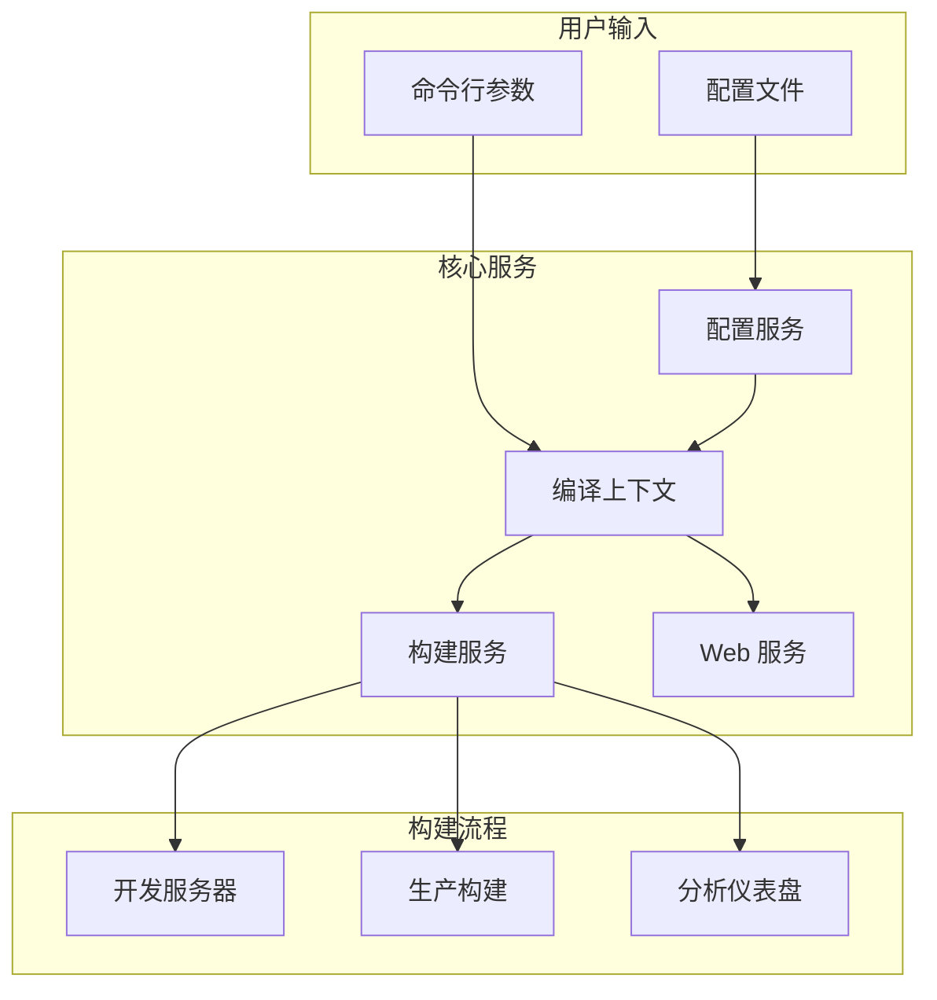
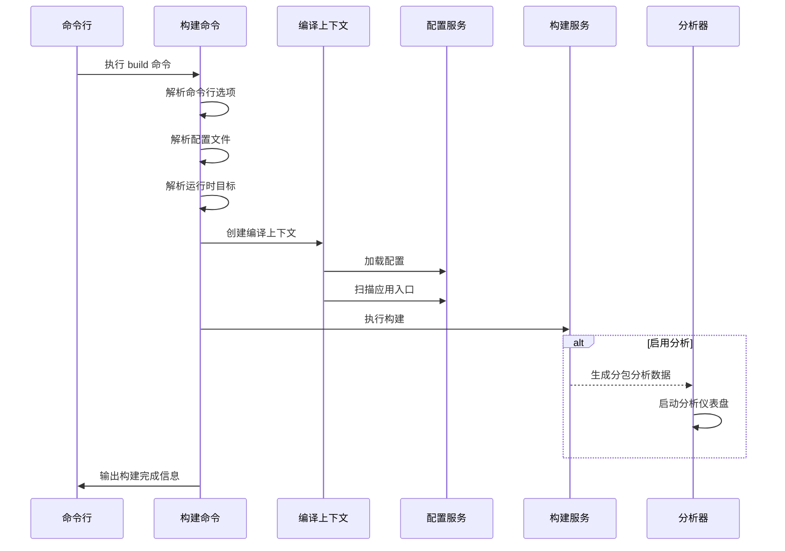
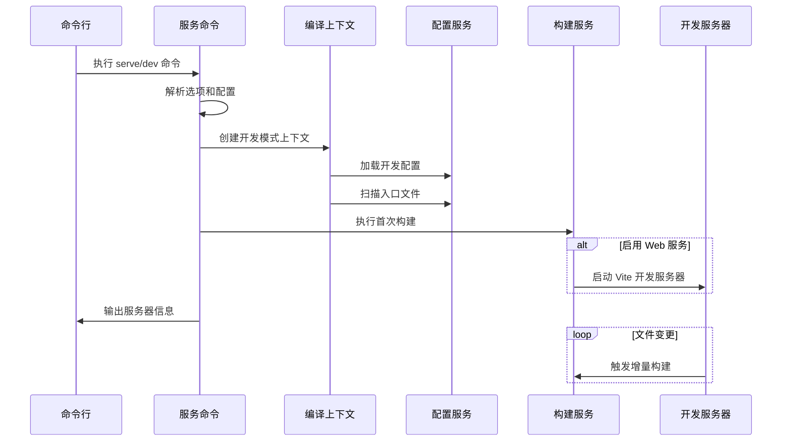
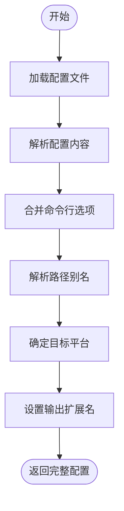

# 构建系统

<cite>
**本文档中引用的文件**  
- [build.ts](file://packages/weapp-vite/src/cli/commands/build.ts)
- [serve.ts](file://packages/weapp-vite/src/cli/commands/serve.ts)
- [config.ts](file://packages/weapp-vite/src/config.ts)
- [createContext.ts](file://packages/weapp-vite/src/createContext.ts)
- [constants.ts](file://packages/weapp-vite/src/constants.ts)
- [types/index.ts](file://packages/weapp-vite/src/types/index.ts)
- [runtime/config/types.ts](file://packages/weapp-vite/src/runtime/config/types.ts)
- [context/getInstance.ts](file://packages/weapp-vite/src/context/getInstance.ts)
- [cli.ts](file://packages/weapp-vite/src/cli.ts)
- [package.json](file://packages/weapp-vite/package.json)
</cite>

## 目录
1. [简介](#简介)
2. [项目结构](#项目结构)
3. [核心组件](#核心组件)
4. [架构概述](#架构概述)
5. [详细组件分析](#详细组件分析)
6. [依赖分析](#依赖分析)
7. [性能考虑](#性能考虑)
8. [故障排除指南](#故障排除指南)
9. [结论](#结论)

## 简介
weapp-vite 是一个现代化的小程序打包工具，基于 Vite 构建，专为微信小程序等轻应用环境设计。它通过整合现代前端开发工具链，提供快速的开发服务器、高效的生产构建流程以及对小程序特有文件格式（如 WXML、WXSS、JSON）的原生支持。本文档全面介绍其构建系统的实现机制，涵盖从源码解析到最终产物生成的完整流程。

## 项目结构
weapp-vite 采用 Monorepo 结构管理多个相关包，主要目录包括：
- `@weapp-core/`：核心功能模块，如初始化、日志、模式生成等
- `apps/`：各类应用示例和测试项目
- `packages/`：核心发布包，其中 `weapp-vite` 是主构建系统
- `templates/`：项目模板，用于快速创建新项目
- `website/`：文档网站

构建系统的核心逻辑位于 `packages/weapp-vite` 中，遵循典型的 Vite 插件架构，并扩展了小程序特有的处理能力。

**Section sources**
- [package.json](file://packages/weapp-vite/package.json#L1-L156)

## 核心组件
weapp-vite 的构建系统由多个核心组件协同工作，主要包括命令行接口（CLI）、配置服务、编译上下文管理、构建服务和运行时目标解析等。这些组件共同实现了开发服务器启动、生产构建、分包分析、IDE 集成等功能。

**Section sources**
- [cli.ts](file://packages/weapp-vite/src/cli.ts#L1-L50)
- [config.ts](file://packages/weapp-vite/src/config.ts#L1-L29)
- [createContext.ts](file://packages/weapp-vite/src/createContext.ts#L1-L28)

## 架构概述
weapp-vite 构建系统基于 Vite 和 Rolldown（Rust 版本的 Rollup）构建，利用 ESBuild 进行依赖预构建，并通过自定义插件处理小程序特有的文件类型。系统支持多平台构建（小程序和 H5），并提供灵活的配置选项。



**Diagram sources**
- [cli.ts](file://packages/weapp-vite/src/cli.ts#L1-L50)
- [createContext.ts](file://packages/weapp-vite/src/createContext.ts#L1-L28)
- [build.ts](file://packages/weapp-vite/src/cli/commands/build.ts#L1-L81)

## 详细组件分析

### 构建命令分析
构建命令是生产环境构建的核心入口，负责解析配置、创建编译上下文、执行构建流程并输出最终产物。



**Diagram sources**
- [build.ts](file://packages/weapp-vite/src/cli/commands/build.ts#L1-L81)
- [createContext.ts](file://packages/weapp-vite/src/createContext.ts#L1-L28)

### 开发服务器命令分析
开发服务器命令用于启动本地开发环境，支持热更新和实时预览。



**Diagram sources**
- [serve.ts](file://packages/weapp-vite/src/cli/commands/serve.ts#L1-L99)
- [createContext.ts](file://packages/weapp-vite/src/createContext.ts#L1-L28)

### 配置系统分析
配置系统负责加载和合并用户配置、命令行选项和默认配置，为构建流程提供统一的配置接口。



**Diagram sources**
- [config.ts](file://packages/weapp-vite/src/config.ts#L1-L29)
- [runtime/config/types.ts](file://packages/weapp-vite/src/runtime/config/types.ts#L1-L90)

## 依赖分析
weapp-vite 的依赖体系分为核心依赖和开发依赖。核心依赖包括 Vite、Rolldown、Babel 等构建工具，以及小程序相关的处理库。系统通过 `package.json` 中的 `dependencies` 字段声明这些依赖，确保在安装时能够正确解析和加载。

```mermaid
dependencyDiagram
weapp-vite --> Vite : "使用"
weapp-vite --> Rolldown : "使用"
weapp-vite --> Babel : "使用"
weapp-vite --> PostCSS : "使用"
weapp-vite --> fdir : "使用"
weapp-vite --> fs-extra : "使用"
Vite --> esbuild : "依赖"
Rolldown --> oxc-parser : "依赖"
Babel --> "@babel/core" : "依赖"
PostCSS --> tailwindcss : "可选依赖"
```

**Diagram sources**
- [package.json](file://packages/weapp-vite/package.json#L97-L125)

## 性能考虑
weapp-vite 通过多种机制优化构建性能：
- 使用 Rolldown（Rust 实现）替代传统 JavaScript 打包器，显著提升构建速度
- 实现智能缓存机制，避免重复构建未变更的文件
- 支持分包构建和公共资源提取，减少主包体积
- 提供构建分析仪表盘，帮助开发者识别性能瓶颈

建议开发者合理配置分包策略，避免过度拆分或合并，同时注意依赖引入的粒度，防止引入不必要的大型库。

## 故障排除指南
常见构建问题及解决方案：
- **构建产物过大**：检查是否误引入了大型依赖库，使用分包功能拆分代码，启用 Tree Shaking
- **依赖缺失**：确认 `package.json` 中正确声明了依赖，检查 `node_modules` 是否完整
- **路径错误**：使用标准化的路径别名配置，避免相对路径过深
- **热更新失效**：检查文件监听是否正常，避免在 `.gitignore` 中误排除源码目录

**Section sources**
- [constants.ts](file://packages/weapp-vite/src/constants.ts#L1-L30)
- [types/index.ts](file://packages/weapp-vite/src/types/index.ts#L1-L8)

## 结论
weapp-vite 构建系统通过整合现代前端工具链，为小程序开发提供了高效、灵活的构建解决方案。其基于 Vite 的架构设计保证了快速的开发体验，而针对小程序特性的深度优化则确保了生产环境的性能和可靠性。通过合理的配置和使用，开发者可以显著提升小程序项目的开发效率和质量。