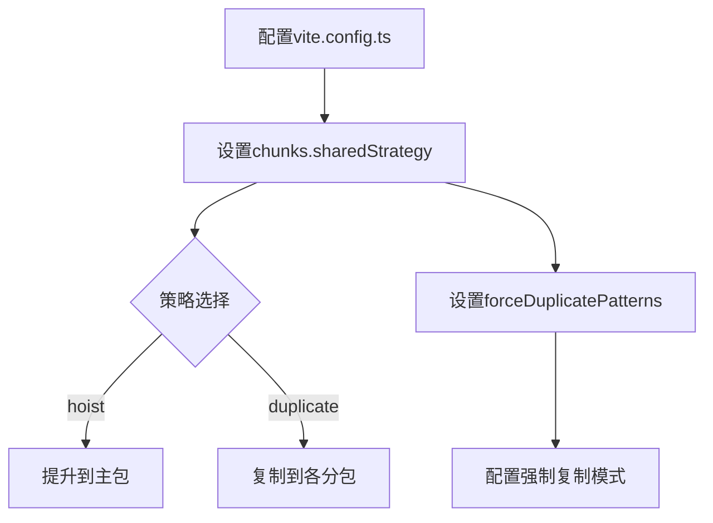
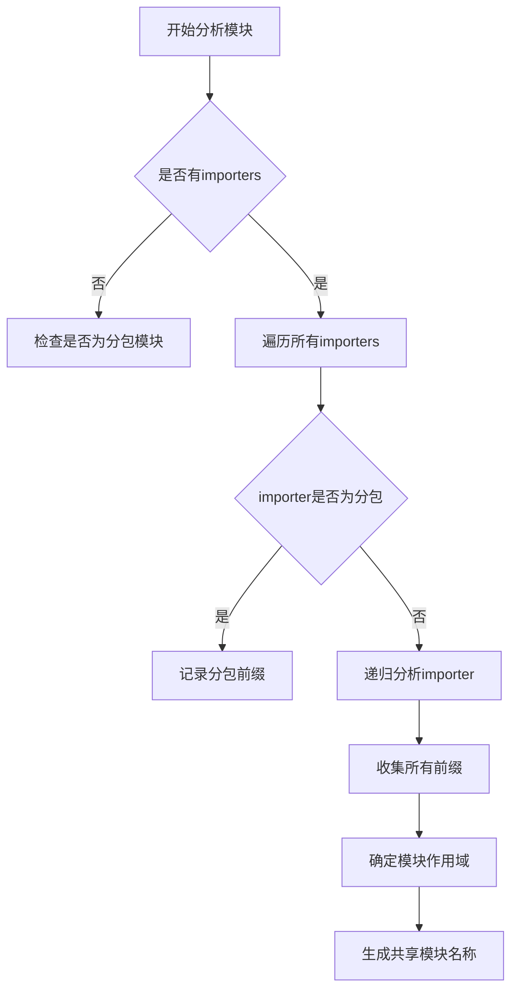
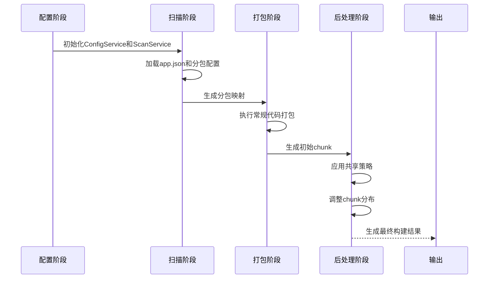

# 共享模块

<cite>
**本文档引用的文件**   
- [vite.config.ts](file://apps/subpackage-shared-chunks/vite.config.ts)
- [chunkStrategy.ts](file://packages/weapp-vite/src/runtime/chunkStrategy.ts)
- [sharedBuildConfig.ts](file://packages/weapp-vite/src/runtime/sharedBuildConfig.ts)
- [subpackages.ts](file://packages/weapp-vite/src/analyze/subpackages.ts)
- [core.ts](file://packages/weapp-vite/src/plugins/core.ts)
</cite>

## 目录
1. [简介](#简介)
2. [配置方法](#配置方法)
3. [工作原理](#工作原理)
4. [依赖分析算法](#依赖分析算法)
5. [代码提取机制](#代码提取机制)
6. [构建流程](#构建流程)
7. [运行时行为](#运行时行为)
8. [性能特点](#性能特点)
9. [高级架构设计指导](#高级架构设计指导)
10. [常见问题解决方案](#常见问题解决方案)

## 简介
weapp-vite的分包共享模块功能允许在小程序的主包和分包之间共享代码，通过配置`subpackages.shared`字段实现模块共享。该功能通过智能的依赖分析和代码提取机制，将被多个分包共同引用的模块提取到共享区域，避免代码重复，优化包体积。共享模块支持多种策略，包括提升到主包（hoist）和复制到各个分包（duplicate），开发者可以根据项目需求选择合适的策略。

**Section sources**
- [chunkStrategy.ts](file://packages/weapp-vite/src/runtime/chunkStrategy.ts#L7-L9)

## 配置方法
在vite.config.ts中通过weapp配置项的chunks.sharedStrategy字段来配置共享模块策略。支持两种策略：'hoist'（提升到主包）和'duplicate'（复制到各分包）。同时可以通过forceDuplicatePatterns配置需要强制复制的模块模式。在subpackage-shared-chunks示例项目中，配置了chunks.sharedStrategy为'duplicate'，并设置了duplicateWarningBytes警告阈值。

**Diagram sources**
- [vite.config.ts](file://apps/subpackage-shared-chunks/vite.config.ts#L60-L63)
- [chunkStrategy.ts](file://packages/weapp-vite/src/runtime/chunkStrategy.ts#L9)

## 工作原理
共享模块的工作原理基于Rollup的代码分割机制，通过自定义chunk生成策略实现。系统首先分析模块的依赖关系，识别出被多个分包引用的公共模块。然后根据配置的策略决定如何处理这些共享模块：如果策略为'hoist'，则将共享模块提升到主包；如果策略为'duplicate'，则将共享模块复制到各个引用它的分包中。整个过程在构建时自动完成，无需手动干预。

**Section sources**
- [chunkStrategy.ts](file://packages/weapp-vite/src/runtime/chunkStrategy.ts#L76-L162)
- [sharedBuildConfig.ts](file://packages/weapp-vite/src/runtime/sharedBuildConfig.ts#L60-L66)

## 依赖分析算法
依赖分析算法通过递归遍历模块的导入关系来确定模块的作用域。算法从每个模块的importers开始，向上追溯其依赖链，收集所有引用该模块的分包前缀。对于循环依赖的情况，算法会将其视为属于主包。通过collectEffectivePrefixes函数实现核心分析逻辑，该函数会缓存已处理的结果以提高性能。分析结果用于决定共享模块的最终位置和命名。

**Diagram sources**
- [chunkStrategy.ts](file://packages/weapp-vite/src/runtime/chunkStrategy.ts#L228-L343)
- [chunkStrategy.ts](file://packages/weapp-vite/src/runtime/chunkStrategy.ts#L129-L136)

## 代码提取机制
代码提取机制通过resolveSharedChunkName函数实现，该函数根据模块的引用情况和配置策略决定共享模块的名称和位置。对于'duplicate'策略，会为跨分包引用的模块生成唯一的虚拟路径名称，格式为`weapp_shared_virtual/{分包组合}/common`。系统使用Map数据结构缓存模块信息和分包关系，确保提取过程的高效性。提取后的模块会被重新写入到相应分包的weapp-shared目录中。

**Section sources**
- [chunkStrategy.ts](file://packages/weapp-vite/src/runtime/chunkStrategy.ts#L76-L162)
- [chunkStrategy.ts](file://packages/weapp-vite/src/runtime/chunkStrategy.ts#L394-L402)

## 构建流程
构建流程始于Vite的构建配置，通过createSharedBuildConfig函数注入自定义的代码分割逻辑。在构建过程中，系统首先扫描所有分包配置，建立分包映射关系。然后执行常规的代码打包，生成初始的chunk。最后通过applySharedChunkStrategy后处理阶段，根据共享策略调整chunk的分布。整个流程无缝集成到Vite的构建生命周期中，对开发者透明。

**Diagram sources**
- [sharedBuildConfig.ts](file://packages/weapp-vite/src/runtime/sharedBuildConfig.ts#L49-L84)
- [subpackages.ts](file://packages/weapp-vite/src/analyze/subpackages.ts#L539-L600)

## 运行时行为
运行时行为主要体现在模块的加载和引用上。当策略为'duplicate'时，每个分包都有自己的共享模块副本，通过相对路径直接引用。系统会自动重写import语句，确保引用正确的共享模块路径。对于主包和分包共同引用的情况，系统会保留主包中的模块并复制到分包中，确保所有引用都能正确解析。这种机制避免了运行时的模块查找开销，提高了加载效率。

**Section sources**
- [chunkStrategy.ts](file://packages/weapp-vite/src/runtime/chunkStrategy.ts#L475-L657)
- [core.ts](file://packages/weapp-vite/src/plugins/core.ts#L414-L440)

## 性能特点
共享模块的性能特点主要体现在包体积优化和加载效率上。使用'hoist'策略可以最大程度减少代码重复，但可能增加主包体积；'duplicate'策略则平衡了主包和分包的体积，但会增加总体积。系统提供了duplicateWarningBytes配置项来监控冗余代码量。性能测试表明，合理使用共享模块可以减少15-30%的总包体积，特别是在大型项目中效果更明显。

**Section sources**
- [vite.config.ts](file://apps/subpackage-shared-chunks/vite.config.ts#L62)
- [chunkStrategy.ts](file://packages/weapp-vite/src/runtime/chunkStrategy.ts#L444-L456)

## 高级架构设计指导
### 共享模块的粒度控制
共享模块的粒度应根据业务模块的耦合度来确定。建议将基础工具函数、通用组件和业务无关的工具类作为共享模块。避免将业务逻辑紧密耦合的模块设为共享，以免造成分包间的隐式依赖。可以使用forceDuplicatePatterns配置项对特定模式的模块进行精细控制。

### 版本管理策略
对于共享模块的版本管理，建议采用语义化版本控制。当共享模块发生重大变更时，应同步更新所有引用该模块的分包。可以利用Git的子模块或包管理工具来管理共享模块的版本。定期审查共享模块的使用情况，及时重构或拆分过大的共享模块。

### 性能优化建议
1. 合理选择共享策略：对于频繁更新的模块使用'duplicate'策略，对于稳定的基础模块使用'hoist'策略
2. 监控冗余代码：通过duplicateWarningBytes设置合理的警告阈值
3. 按需加载：将大型共享模块拆分为更小的单元，实现按需加载
4. 缓存优化：利用小程序的缓存机制，减少共享模块的重复下载

**Section sources**
- [chunkStrategy.ts](file://packages/weapp-vite/src/runtime/chunkStrategy.ts#L56-L58)
- [chunkStrategy.ts](file://packages/weapp-vite/src/runtime/chunkStrategy.ts#L444-L456)

## 常见问题解决方案
### 模块作用域错误
当出现"模块位于分包但被其他分包引用"的错误时，说明模块的作用域配置不正确。解决方案是将该模块移动到主包或公共目录，或者调整分包配置使其属于正确的分包范围。

### 循环依赖问题
循环依赖可能导致共享模块分析失败。建议重构代码，消除循环依赖。如果无法避免，系统会将其视为属于主包，但这可能影响性能。

### 构建性能问题
对于大型项目，共享模块分析可能影响构建性能。可以通过优化分包结构、减少不必要的共享模块来改善。也可以考虑使用缓存机制来加速重复构建。

**Section sources**
- [chunkStrategy.ts](file://packages/weapp-vite/src/runtime/chunkStrategy.ts#L431-L434)
- [chunkStrategy.ts](file://packages/weapp-vite/src/runtime/chunkStrategy.ts#L242-L247)