# 独立分包

<cite>
**本文档引用的文件**
- [subpackages.md](file://website/config/subpackages.md)
- [subpackages.ts](file://packages/weapp-vite/src/analyze/subpackages.ts)
- [buildPlugin.ts](file://packages/weapp-vite/src/runtime/buildPlugin.ts)
- [independent-subpackage.test.ts](file://packages/weapp-vite/test/independent-subpackage.test.ts)
- [independentError.ts](file://packages/weapp-vite/src/runtime/independentError.ts)
- [independent-subpackage.ts](file://apps/vite-native/subpackage-demos/independent-subpackage.ts)
- [index.ts](file://apps/vite-native/packageB/pages/independent-demo/index.ts)
</cite>

## 目录
1. [简介](#简介)
2. [独立分包工作原理](#独立分包工作原理)
3. [配置方法](#配置方法)
4. [使用场景](#使用场景)
5. [构建流程与运行时行为](#构建流程与运行时行为)
6. [性能特点](#性能特点)
7. [架构设计指导](#架构设计指导)
8. [常见问题解决方案](#常见问题解决方案)

## 简介

独立分包是weapp-vite框架中用于优化小程序性能的重要功能。通过将特定分包配置为独立上下文，可以实现资源隔离、依赖独立和构建分离，从而提升小程序的加载速度和运行效率。本文档深入讲解独立分包的工作原理、配置方法和使用场景，为开发者提供全面的技术指导。

## 独立分包工作原理

独立分包的核心机制是为指定分包创建独立的构建上下文。当一个分包被标记为独立时，weapp-vite会为其创建独立的Rolldown编译环境，确保该分包的构建过程与其他分包完全隔离。

在代码实现层面，`analyzeSubpackages`函数负责分析所有分包元数据，并根据`independent`字段的值将独立分包添加到`independentRoots`集合中。这个集合用于在构建过程中识别需要特殊处理的独立分包。

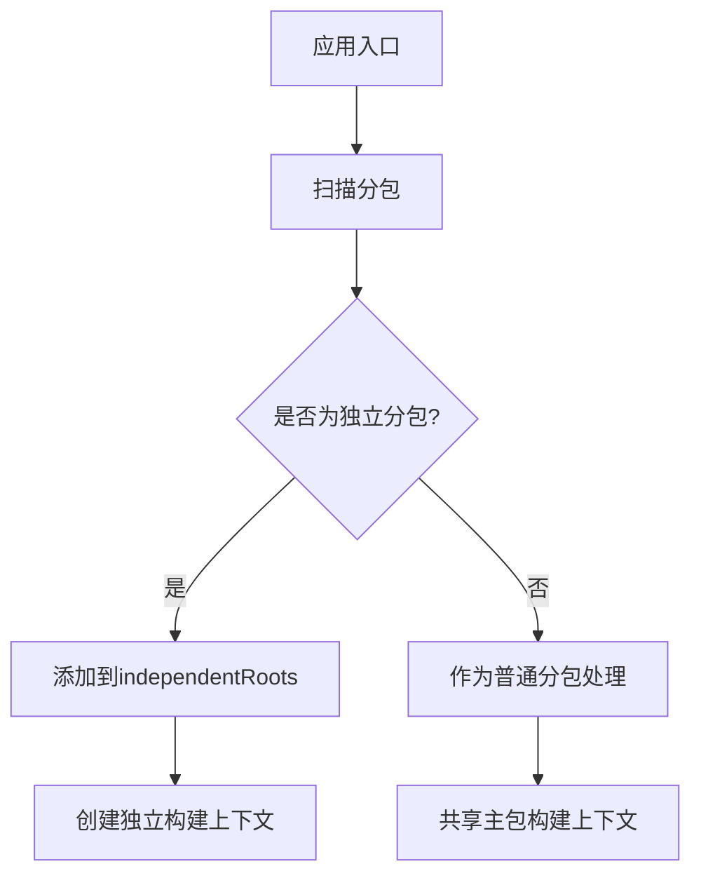

**Diagram sources**
- [subpackages.ts](file://packages/weapp-vite/src/analyze/subpackages.ts#L549-L558)

**Section sources**
- [subpackages.ts](file://packages/weapp-vite/src/analyze/subpackages.ts#L523-L537)

## 配置方法

### 基本配置

在`vite.config.ts`文件中，可以通过`weapp.subPackages`配置项来定义独立分包。配置对象的键名为分包在`app.json`中的`root`路径。

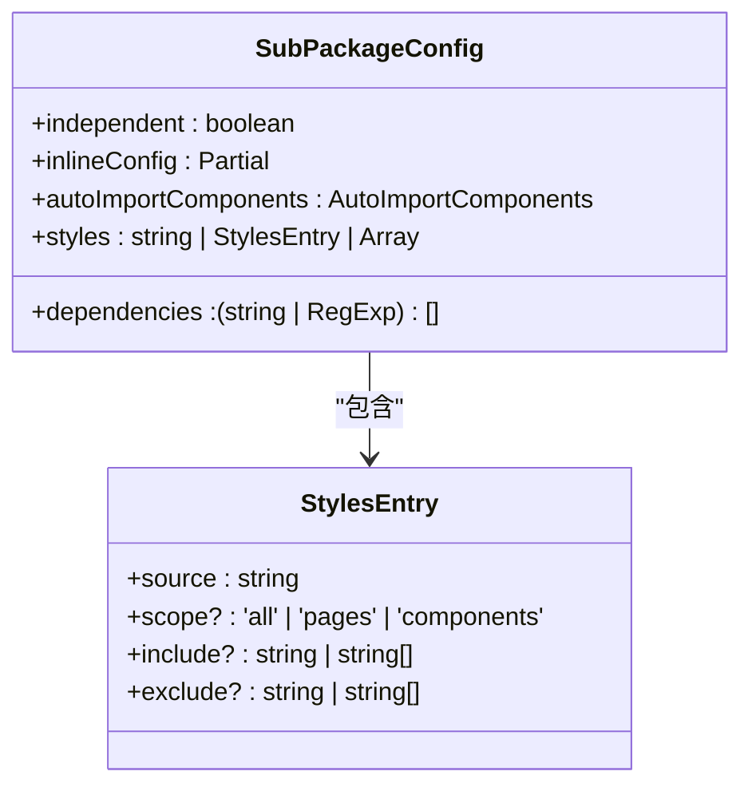

**Diagram sources**
- [subpackages.md](file://website/config/subpackages.md#L8-L24)

### 配置示例

以下是一个典型的独立分包配置示例：

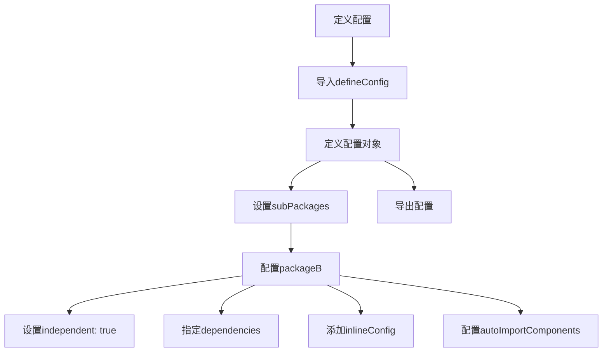

**Diagram sources**
- [subpackages.md](file://website/config/subpackages.md#L34-L79)

**Section sources**
- [subpackages.md](file://website/config/subpackages.md#L64-L75)

## 使用场景

### 资源隔离

独立分包最重要的使用场景是实现资源隔离。通过设置`independent: true`，可以确保该分包不共享主包的node_modules依赖，从而避免依赖冲突和体积膨胀。

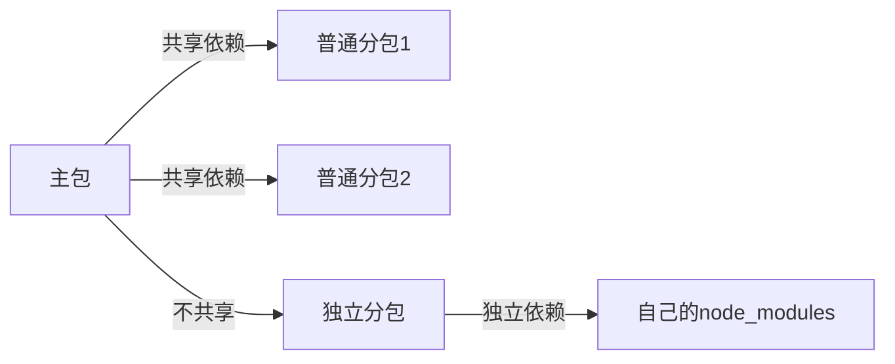

**Diagram sources**
- [independent-subpackage.ts](file://apps/vite-native/subpackage-demos/independent-subpackage.ts#L1-L3)

### 构建日志分离

独立分包的构建过程与其他分包完全分离，这使得构建日志也能够独立显示，便于开发者调试和监控。

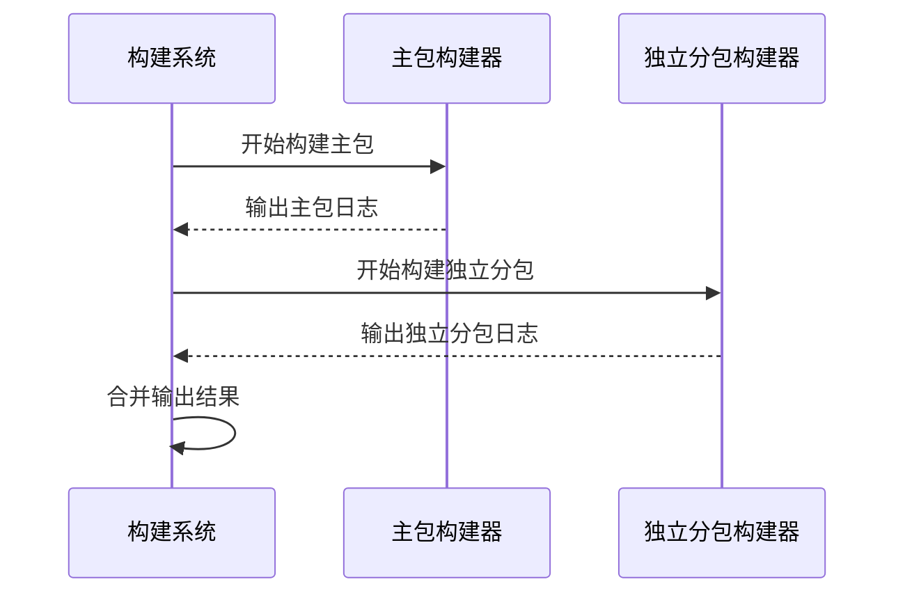

**Diagram sources**
- [buildPlugin.ts](file://packages/weapp-vite/src/runtime/buildPlugin.ts#L63-L105)

**Section sources**
- [index.ts](file://apps/vite-native/packageB/pages/independent-demo/index.ts#L1-L12)

## 构建流程与运行时行为

### 构建流程

独立分包的构建流程包括以下几个关键步骤：

1. 清理输出目录
2. 创建独立构建任务
3. 执行独立构建
4. 存储构建结果
5. 处理构建错误

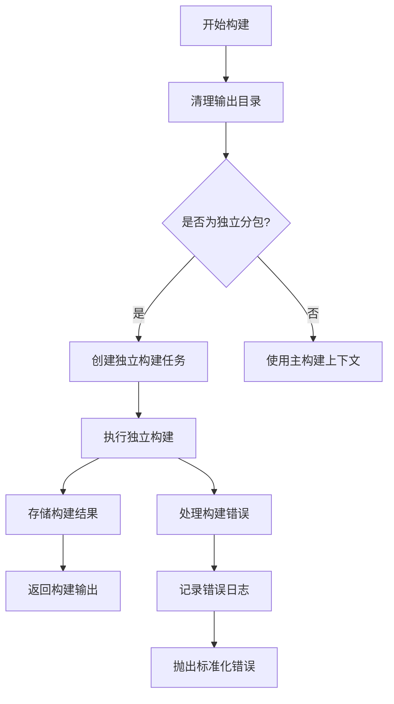

**Diagram sources**
- [buildPlugin.ts](file://packages/weapp-vite/src/runtime/buildPlugin.ts#L314-L344)

### 运行时行为

在运行时，独立分包表现出以下特点：

- 拥有独立的依赖树
- 不共享主包的全局变量
- 可以配置独立的构建选项
- 构建错误独立处理

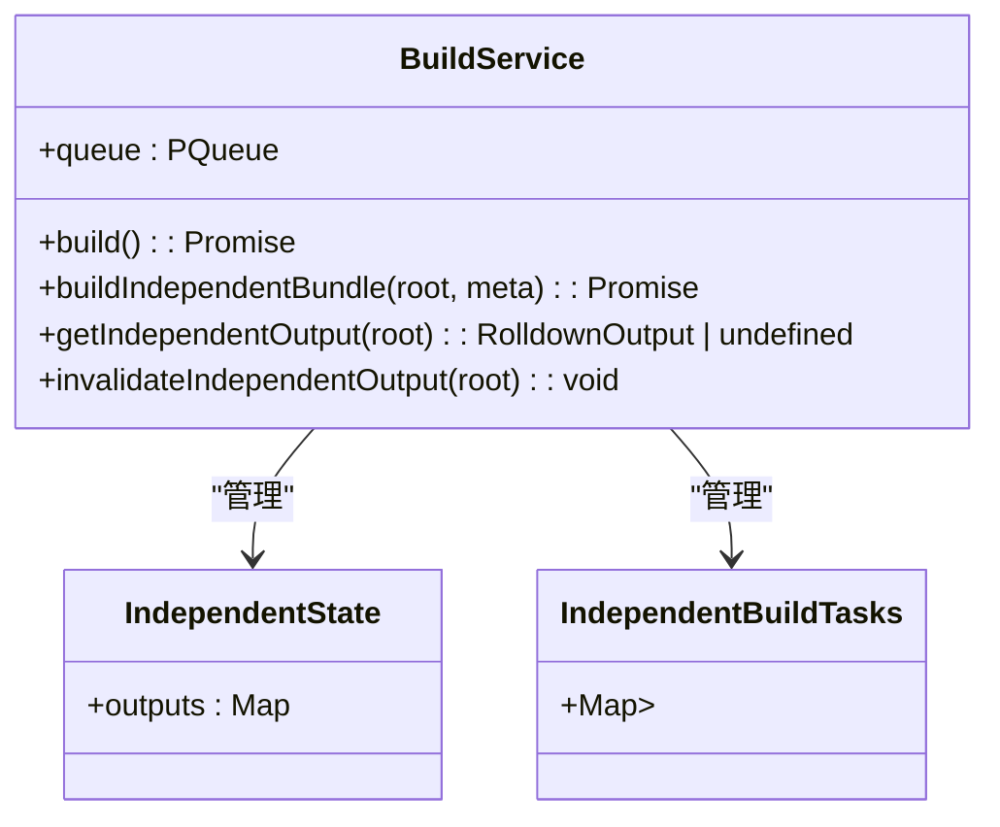

**Diagram sources**
- [buildPlugin.ts](file://packages/weapp-vite/src/runtime/buildPlugin.ts#L19-L29)

**Section sources**
- [buildPlugin.ts](file://packages/weapp-vite/src/runtime/buildPlugin.ts#L31-L373)

## 性能特点

### 体积优化

独立分包通过以下方式优化体积：

- 仅打包必要的依赖
- 避免主包依赖泄漏
- 支持精确的依赖控制

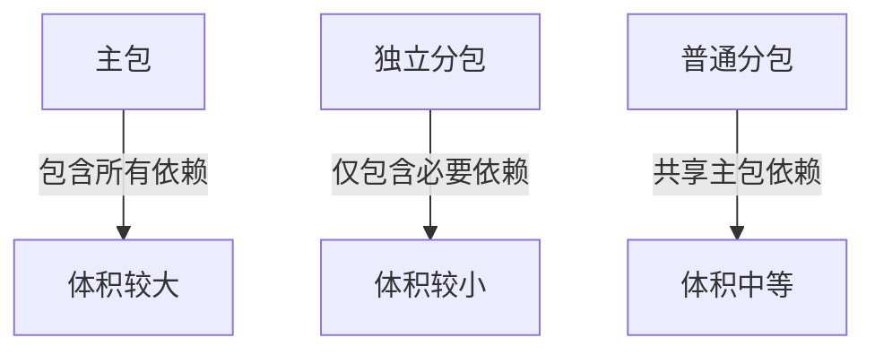

### 加载性能

独立分包的加载性能优势体现在：

- 首屏加载更快
- 按需加载更精确
- 缓存利用率更高

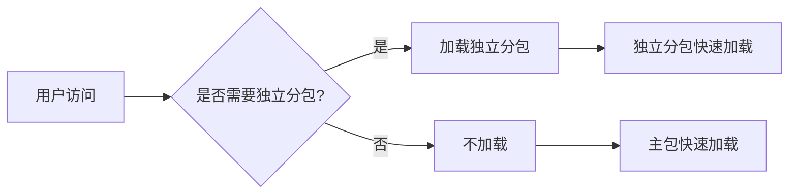

**Section sources**
- [subpackages.md](file://website/config/subpackages.md#L105-L107)

## 架构设计指导

### 何时使用独立分包

建议在以下场景使用独立分包：

- 功能模块相对独立
- 依赖库较多且与其他模块无交集
- 需要频繁更新的模块
- 对加载性能要求较高的模块

### 优化加载性能

优化独立分包加载性能的建议：

1. 精确控制`dependencies`列表
2. 使用`inlineConfig`进行针对性优化
3. 合理配置`autoImportComponents`
4. 利用`styles`配置共享样式

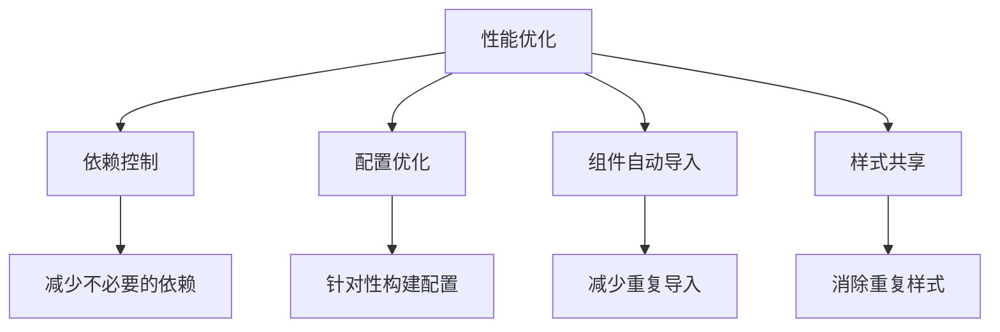

**Section sources**
- [subpackages.md](file://website/config/subpackages.md#L82-L91)

## 常见问题解决方案

### 构建错误处理

当独立分包构建失败时，系统会创建标准化的错误信息，便于开发者定位问题。

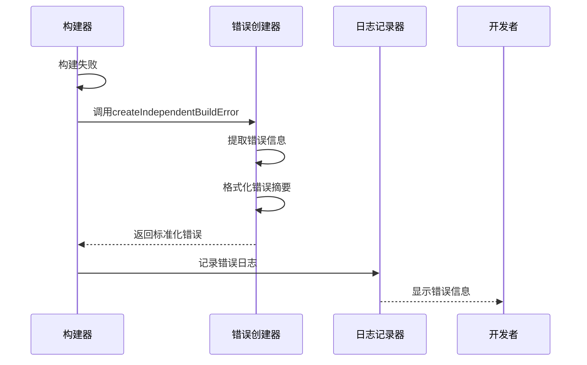

**Diagram sources**
- [independentError.ts](file://packages/weapp-vite/src/runtime/independentError.ts#L99-L159)

### 依赖管理

解决依赖管理问题的建议：

- 明确指定需要的依赖
- 使用正则表达式匹配相关依赖
- 避免引入不必要的大型库

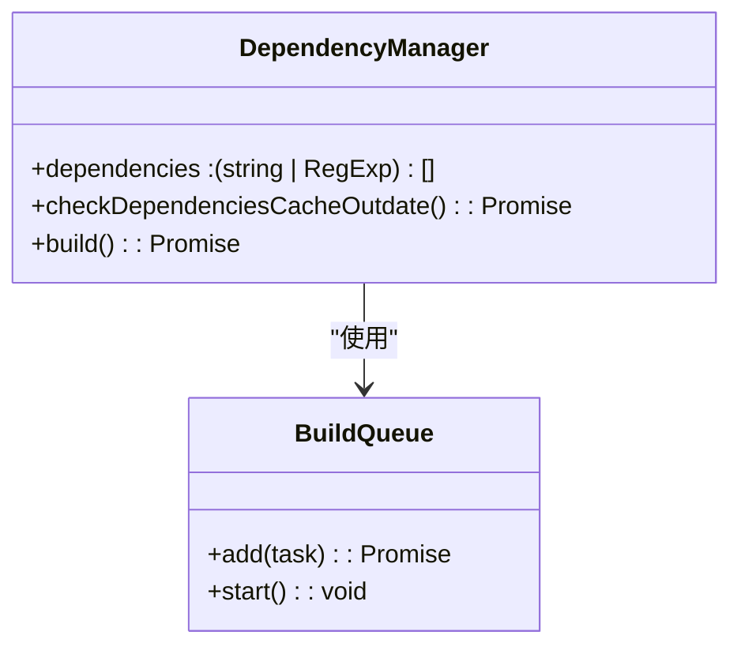

**Section sources**
- [buildPlugin.ts](file://packages/weapp-vite/src/runtime/buildPlugin.ts#L314-L344)