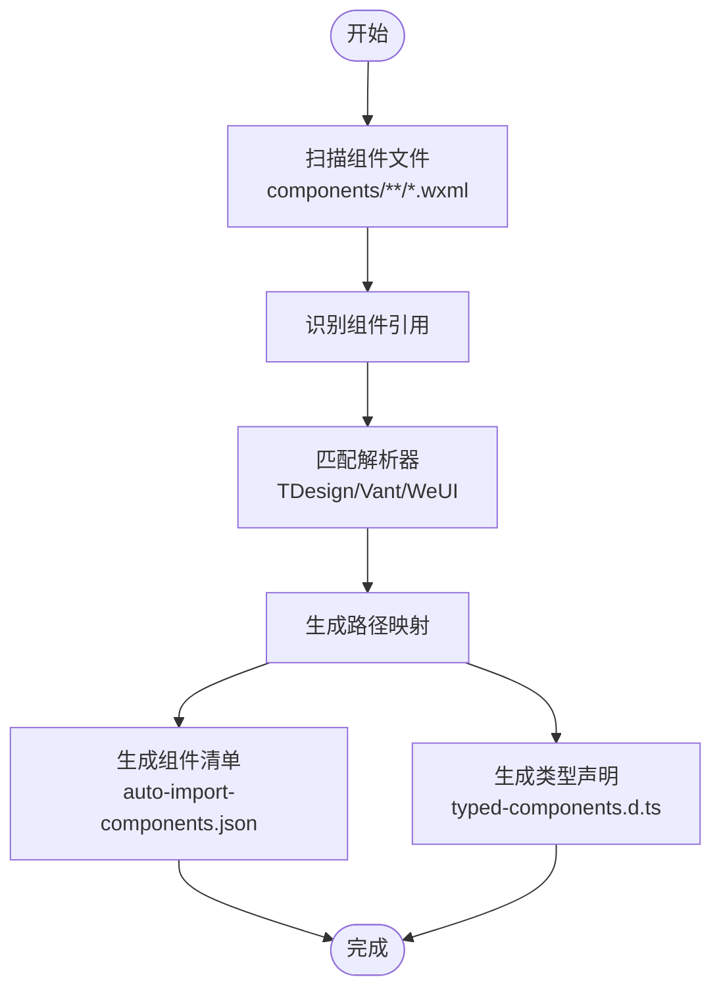
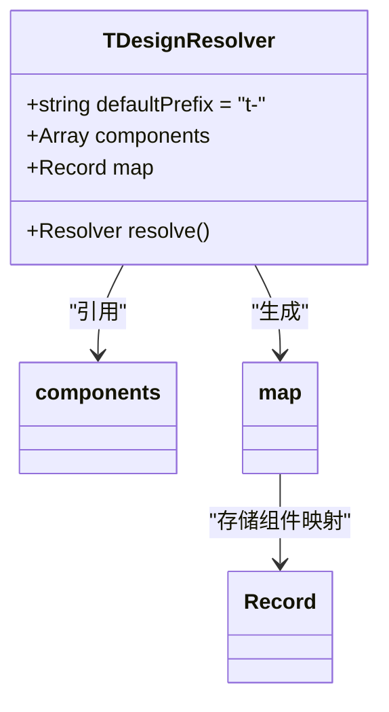
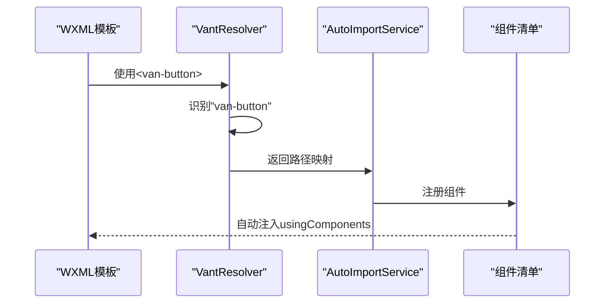
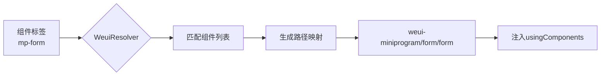
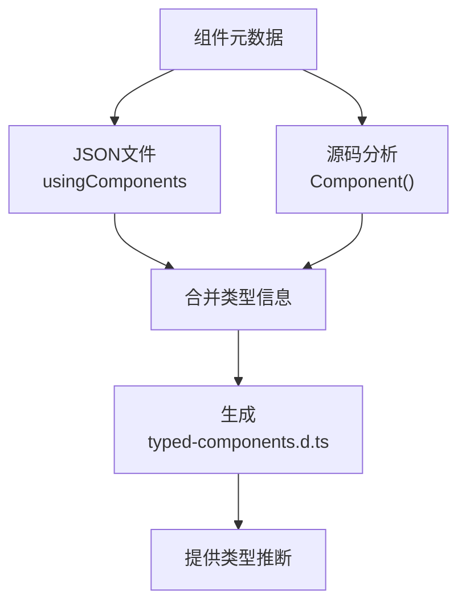

# UI库支持

<cite>
**本文档引用文件**  
- [tdesign.ts](file://packages/weapp-vite/src/auto-import-components/resolvers/tdesign.ts)
- [vant.ts](file://packages/weapp-vite/src/auto-import-components/resolvers/vant.ts)
- [weui.ts](file://packages/weapp-vite/src/auto-import-components/resolvers/weui.ts)
- [types.ts](file://packages/weapp-vite/src/auto-import-components/resolvers/types.ts)
- [tdesign.json](file://packages/weapp-vite/src/auto-import-components/resolvers/json/tdesign.json)
- [vant.json](file://packages/weapp-vite/src/auto-import-components/resolvers/json/vant.json)
- [weui.json](file://packages/weapp-vite/src/auto-import-components/resolvers/json/weui.json)
- [service.ts](file://packages/weapp-vite/src/runtime/autoImport/service.ts)
- [typedDefinition.ts](file://packages/weapp-vite/src/runtime/autoImport/typedDefinition.ts)
- [config.ts](file://packages/weapp-vite/src/runtime/autoImport/config.ts)
- [auto-import.md](file://website/guide/auto-import.md)
- [tdesign.md](file://website/integration/tdesign.md)
- [vant.md](file://website/integration/vant.md)
</cite>

## 目录
1. [简介](#简介)
2. [核心机制](#核心机制)
3. [TDesign解析器实现](#tdesign解析器实现)
4. [Vant解析器实现](#vant解析器实现)
5. [WeUI解析器实现](#weui解析器实现)
6. [类型声明生成](#类型声明生成)
7. [配置与最佳实践](#配置与最佳实践)
8. [常见问题与解决方案](#常见问题与解决方案)

## 简介

weapp-vite 提供了对主流UI库的深度集成支持，通过专用解析器机制实现了TDesign、Vant和WeUI等UI库的自动导入功能。开发者无需手动在JSON文件中声明`usingComponents`，即可直接在WXML模板中使用这些UI库的组件。该系统通过静态分析和运行时服务，实现了组件识别、路径映射和类型声明生成的完整工作流。

**本节来源**  
- [auto-import.md](file://website/guide/auto-import.md#L1-L130)

## 核心机制

weapp-vite的UI库集成核心在于其自动导入服务（AutoImportService），该服务通过解析器（Resolver）机制实现对第三方UI库的支持。系统在编译阶段扫描项目文件，识别组件引用，并自动生成必要的配置文件和类型声明。

核心工作流程包括：
1. **组件识别**：通过glob模式匹配扫描项目中的组件文件
2. **解析器匹配**：使用预定义的解析器处理第三方UI库组件
3. **路径映射**：将组件标签名映射到实际的npm包路径
4. **清单生成**：创建`auto-import-components.json`记录所有注册组件
5. **类型生成**：生成`typed-components.d.ts`提供类型推断支持



**图示来源**  
- [service.ts](file://packages/weapp-vite/src/runtime/autoImport/service.ts#L59-L612)
- [config.ts](file://packages/weapp-vite/src/runtime/autoImport/config.ts#L1-L302)

**本节来源**  
- [service.ts](file://packages/weapp-vite/src/runtime/autoImport/service.ts#L59-L612)
- [config.ts](file://packages/weapp-vite/src/runtime/autoImport/config.ts#L1-L302)

## TDesign解析器实现

TDesign解析器（TDesignResolver）是weapp-vite为腾讯TDesign小程序组件库提供的专用解析器，实现了组件标签到npm包路径的自动映射。

### 实现机制

TDesignResolver基于以下核心设计：
- **默认前缀**：`t-`（可配置）
- **组件映射**：通过`tdesign.json`文件维护所有支持的组件列表
- **路径规则**：`tdesign-miniprogram/${name}/${name}`



**图示来源**  
- [tdesign.ts](file://packages/weapp-vite/src/auto-import-components/resolvers/tdesign.ts#L1-L39)
- [tdesign.json](file://packages/weapp-vite/src/auto-import-components/resolvers/json/tdesign.json#L1-L84)

### 配置选项

TDesignResolver支持以下配置参数：

| 配置项 | 类型 | 默认值 | 说明 |
|-------|------|-------|------|
| prefix | string | "t-" | 组件标签前缀 |
| resolve | function | 内置逻辑 | 自定义解析函数 |

### 使用示例

```typescript
import { TDesignResolver } from 'weapp-vite/auto-import-components/resolvers'

export default {
  weapp: {
    autoImportComponents: {
      resolvers: [
        TDesignResolver({
          prefix: 'td-', // 自定义前缀
          resolve: ({ name, prefix }) => ({
            key: `${prefix}${name}`,
            value: `tdesign-miniprogram/${name}/${name}`
          })
        })
      ]
    }
  }
}
```

**本节来源**  
- [tdesign.ts](file://packages/weapp-vite/src/auto-import-components/resolvers/tdesign.ts#L1-L39)
- [tdesign.json](file://packages/weapp-vite/src/auto-import-components/resolvers/json/tdesign.json#L1-L84)
- [tdesign.md](file://website/integration/tdesign.md#L1-L84)

## Vant解析器实现

Vant解析器（VantResolver）为Vant Weapp组件库提供集成支持，实现了无缝的组件自动导入功能。

### 实现机制

VantResolver的核心实现特点：
- **默认前缀**：`van-`（可配置）
- **组件映射**：通过`vant.json`文件维护组件列表
- **路径规则**：`@vant/weapp/${name}`



**图示来源**  
- [vant.ts](file://packages/weapp-vite/src/auto-import-components/resolvers/vant.ts#L1-L40)
- [vant.json](file://packages/weapp-vite/src/auto-import-components/resolvers/json/vant.json#L1-L72)

### 配置选项

VantResolver支持的配置参数：

| 配置项 | 类型 | 默认值 | 说明 |
|-------|------|-------|------|
| prefix | string | "van-" | 组件标签前缀 |
| resolve | function | 内置逻辑 | 自定义解析函数 |

### 使用示例

```typescript
import { VantResolver } from 'weapp-vite/auto-import-components/resolvers'

export default {
  weapp: {
    autoImportComponents: {
      resolvers: [
        VantResolver({
          prefix: 'v-', // 使用v-前缀
          resolve: ({ name }) => ({
            key: `van-${name}`,
            value: `@vant/weapp/${name}`
          })
        })
      ]
    }
  }
}
```

**本节来源**  
- [vant.ts](file://packages/weapp-vite/src/auto-import-components/resolvers/vant.ts#L1-L40)
- [vant.json](file://packages/weapp-vite/src/auto-import-components/resolvers/json/vant.json#L1-L72)
- [vant.md](file://website/integration/vant.md#L1-L70)

## WeUI解析器实现

WeUI解析器（WeuiResolver）为微信官方WeUI组件库提供集成支持，实现了组件的自动识别和注册。

### 实现机制

WeuiResolver的主要特性：
- **默认前缀**：`mp-`（可配置）
- **组件映射**：通过`weui.json`文件维护支持的组件
- **路径规则**：`weui-miniprogram/${name}/${name}`



**图示来源**  
- [weui.ts](file://packages/weapp-vite/src/auto-import-components/resolvers/weui.ts#L1-L38)
- [weui.json](file://packages/weapp-vite/src/auto-import-components/resolvers/json/weui.json#L1-L24)

### 配置选项

WeuiResolver的配置参数：

| 配置项 | 类型 | 默认值 | 说明 |
|-------|------|-------|------|
| prefix | string | "mp-" | 组件标签前缀 |
| resolve | function | 内置逻辑 | 自定义解析函数 |

### 使用示例

```typescript
import { WeuiResolver } from 'weapp-vite/auto-import-components/resolvers'

export default {
  weapp: {
    autoImportComponents: {
      resolvers: [
        WeuiResolver({
          prefix: 'wx-', // 微信风格前缀
          resolve: ({ name, prefix }) => ({
            key: `${prefix}${name}`,
            value: `weui-miniprogram/${name}/${name}`
          })
        })
      ]
    }
  }
}
```

**本节来源**  
- [weui.ts](file://packages/weapp-vite/src/auto-import-components/resolvers/weui.ts#L1-L38)
- [weui.json](file://packages/weapp-vite/src/auto-import-components/resolvers/json/weui.json#L1-L24)

## 类型声明生成

weapp-vite不仅实现了组件的自动导入，还提供了完整的类型系统支持，通过生成类型声明文件提升开发体验。

### 类型生成机制

系统通过以下流程生成类型声明：

1. **收集组件元数据**：从JSON文件和源码中提取组件属性
2. **合并类型信息**：结合解析器提供的静态映射和动态分析结果
3. **生成声明文件**：创建`typed-components.d.ts`提供类型推断



**图示来源**  
- [typedDefinition.ts](file://packages/weapp-vite/src/runtime/autoImport/typedDefinition.ts#L47-L65)
- [service.ts](file://packages/weapp-vite/src/runtime/autoImport/service.ts#L184-L220)

### 生成的类型结构

生成的类型声明包含以下核心类型：

```typescript
declare namespace ComponentProps {
  't-button': {
    theme: string;
    size: string;
    // ... 其他属性
  };
  'van-button': {
    type: string;
    size: string;
    // ... 其他属性
  };
  // ... 其他组件
  [component: string]: Record<string, any>;
}

export type ComponentPropName = keyof ComponentProps;
export type ComponentProp<Name extends ComponentPropName> = ComponentProps[Name];
export const componentProps: ComponentProps;
```

**本节来源**  
- [typedDefinition.ts](file://packages/weapp-vite/src/runtime/autoImport/typedDefinition.ts#L47-L65)
- [service.ts](file://packages/weapp-vite/src/runtime/autoImport/service.ts#L184-L220)

## 配置与最佳实践

### 基础配置

```typescript
import { TDesignResolver, VantResolver, WeuiResolver } from 'weapp-vite/auto-import-components/resolvers'

export default {
  weapp: {
    autoImportComponents: {
      // 扫描目录
      globs: ['components/**/*.wxml'],
      
      // UI库解析器
      resolvers: [
        TDesignResolver(),
        VantResolver(),
        WeuiResolver()
      ],
      
      // 输出配置
      output: 'dist/auto-import-components.json',
      
      // 类型声明
      typedComponents: true,
      
      // HTML自定义数据
      htmlCustomData: 'dist/mini-program.html-data.json'
    }
  }
}
```

### 高级配置

```typescript
export default {
  weapp: {
    autoImportComponents: {
      resolvers: [
        // 自定义TDesign解析器
        TDesignResolver({
          prefix: 'td-',
          resolve: ({ name, prefix }) => ({
            key: `${prefix}${name}`,
            value: `tdesign-miniprogram/${name}/${name}`
          })
        }),
        
        // 自定义Vant解析器
        VantResolver({
          prefix: 'v-',
          resolve: ({ name }) => ({
            key: `van-${name}`,
            value: `@vant/weapp/${name}`
          })
        })
      ],
      
      // 禁用默认输出
      output: false,
      
      // 自定义类型声明路径
      typedComponents: 'types/components.d.ts'
    }
  }
}
```

### 最佳实践

1. **版本兼容性**：确保UI库版本与解析器支持的版本匹配
2. **路径配置**：在`tsconfig.json`中正确配置`paths`
3. **性能优化**：合理设置`globs`避免扫描过多文件
4. **类型安全**：启用`typedComponents`获得更好的类型推断
5. **开发体验**：启用`htmlCustomData`获得IDE智能提示

**本节来源**  
- [auto-import.md](file://website/guide/auto-import.md#L1-L130)
- [tdesign.md](file://website/integration/tdesign.md#L1-L84)
- [vant.md](file://website/integration/vant.md#L1-L70)

## 常见问题与解决方案

### 常见问题

| 问题现象 | 可能原因 | 解决方案 |
|---------|---------|---------|
| 组件未自动注册 | 未正确配置解析器 | 检查`resolvers`配置是否正确 |
| 类型推断失效 | 未启用`typedComponents` | 在配置中设置`typedComponents: true` |
| 路径映射错误 | 前缀配置不匹配 | 检查组件标签前缀是否与解析器配置一致 |
| 构建失败 | 缺少依赖包 | 确保已安装对应的UI库npm包 |

### 故障排除

1. **检查依赖安装**：
   ```bash
   # TDesign
   pnpm add tdesign-miniprogram
   
   # Vant
   pnpm add @vant/weapp
   
   # WeUI
   pnpm add weui-miniprogram
   ```

2. **验证配置文件**：
   - 确保`vite.config.ts`中正确导入和配置解析器
   - 检查`tsconfig.json`中的`paths`配置

3. **重启开发服务器**：
   修改配置后需要重启`pnpm dev`以刷新缓存

4. **检查组件清单**：
   查看生成的`auto-import-components.json`确认组件是否正确注册

**本节来源**  
- [auto-import.md](file://website/guide/auto-import.md#L125-L130)
- [tdesign.md](file://website/integration/tdesign.md#L1-L84)
- [vant.md](file://website/integration/vant.md#L1-L70)