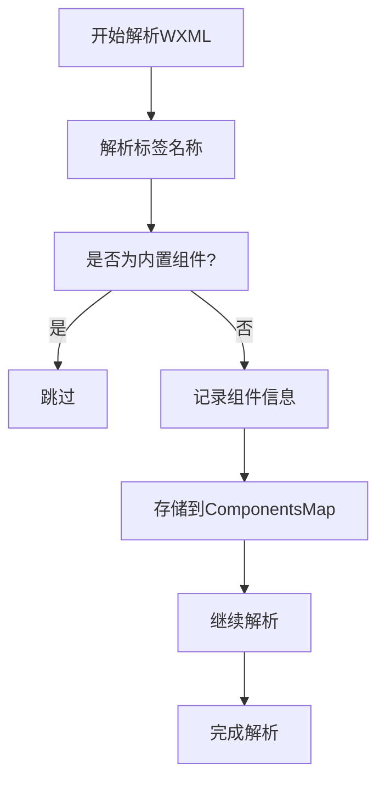

# 工作原理

<cite>
**本文档中引用的文件**
- [scan.ts](file://packages/weapp-vite/src/wxml/scan.ts)
- [CompilerContext.ts](file://packages/weapp-vite/src/context/CompilerContext.ts)
- [autoImportPlugin.ts](file://packages/weapp-vite/src/runtime/autoImportPlugin.ts)
- [service.ts](file://packages/weapp-vite/src/runtime/autoImport/service.ts)
- [wxmlPlugin.ts](file://packages/weapp-vite/src/runtime/wxmlPlugin.ts)
- [useLoadEntry/template.ts](file://packages/weapp-vite/src/plugins/hooks/useLoadEntry/template.ts)
</cite>

## 目录
1. [组件扫描机制](#组件扫描机制)
2. [AST解析wxml文件](#ast解析wxml文件)
3. [插件系统构建时扫描](#插件系统构建时扫描)
4. [类型声明生成](#类型声明生成)
5. [运行时集成过程](#运行时集成过程)
6. [零配置组件发现](#零配置组件发现)
7. [路径解析与命名冲突处理](#路径解析与命名冲突处理)

## 组件扫描机制

weapp-vite的自动组件注册工作原理基于一套完整的构建时扫描和分析机制。系统通过编译器上下文（CompilerContext）管理各种服务，包括wxmlService、autoImportService等核心组件。在构建过程中，系统会扫描项目目录中的wxml文件，识别其中的自定义组件引用，并建立组件依赖关系图。

**Section sources**
- [CompilerContext.ts](file://packages/weapp-vite/src/context/CompilerContext.ts)
- [createContext.ts](file://packages/weapp-vite/src/createContext.ts)

## AST解析wxml文件

wxml文件的解析采用htmlparser2库进行AST遍历。系统通过scanWxml函数对wxml内容进行词法分析，识别出所有自定义组件标签。解析过程包括：

1. 使用Parser监听onopentagname事件获取标签名称
2. 通过onattribute事件收集属性信息
3. 在onclosetag事件中记录组件的起止位置
4. 过滤内置组件，只保留自定义组件

解析结果以ComponentsMap形式存储，包含组件名称和在文件中的位置信息。系统还实现了LRU缓存机制，通过源码哈希值作为缓存键，提高重复解析的效率。



**Diagram sources**
- [scan.ts](file://packages/weapp-vite/src/wxml/scan.ts)
- [shared.ts](file://packages/weapp-vite/src/wxml/shared.ts)

## 插件系统构建时扫描

构建时扫描由多个Vite插件协同完成。核心是createAutoImportServicePlugin，它在构建开始时初始化自动导入服务。扫描流程如下：

1. 通过createTemplateScanner创建模板扫描器
2. 遍历项目中的所有wxml文件
3. 对每个wxml文件调用scan函数进行解析
4. 将解析结果存储到tokenMap中
5. 建立组件依赖关系图

系统还处理了条件编译注释（#ifdef/#endif），根据目标平台决定是否保留特定组件。对于wxs模块引用，系统会进行路径规范化处理，确保正确解析。

**Section sources**
- [autoImportPlugin.ts](file://packages/weapp-vite/src/runtime/autoImportPlugin.ts)
- [wxmlPlugin.ts](file://packages/weapp-vite/src/runtime/wxmlPlugin.ts)

## 类型声明生成

类型声明生成是自动组件注册的重要环节。系统通过createAutoImportService创建服务实例，管理组件注册和类型生成。主要步骤包括：

1. 收集解析器组件：从配置中获取resolvers定义的组件映射
2. 注册本地组件：扫描components目录下的所有组件
3. 生成manifest文件：创建auto-import-components.json记录所有可导入组件
4. 生成类型定义：创建typed-components.d.ts提供TypeScript支持
5. 生成HTML数据文件：创建mini-program.html-data.json用于编辑器智能提示

系统使用Map缓存机制管理组件元数据，包括类型信息和文档说明。当组件发生变化时，会触发相应的写入操作，确保类型声明的实时性。

```mermaid
classDiagram
class AutoImportService {
+registry : Map<string, AutoImportMatch>
+manifestCache : Map<string, string>
+componentMetadataMap : Map<string, ComponentMetadata>
+resolverComponentNames : Set<string>
+registerPotentialComponent(filePath : string) : Promise<void>
+removePotentialComponent(filePath : string) : void
+resolve(componentName : string, importerBaseName? : string) : AutoImportMatch | undefined
+scheduleManifestWrite(shouldWrite : boolean) : void
+scheduleTypedComponentsWrite(shouldWrite : boolean) : void
}
class ComponentMetadata {
+types : Map<string, string>
+docs : Map<string, string>
}
class AutoImportMatch {
+kind : 'local' | 'resolver'
+value : { name : string; from : string }
}
AutoImportService --> ComponentMetadata : "管理"
AutoImportService --> AutoImportMatch : "包含"
```

**Diagram sources**
- [service.ts](file://packages/weapp-vite/src/runtime/autoImport/service.ts)
- [types.ts](file://packages/weapp-vite/src/types/autoImport.ts)

## 运行时集成过程

运行时集成通过Vite插件系统实现。在构建过程中，自动导入插件会注入必要的import语句。具体流程如下：

1. 在buildStart钩子中清除之前的缓存
2. 扫描所有入口文件的模板
3. 分析wxml中的组件引用
4. 生成import语句并注入到对应的js/ts文件中
5. 处理组件样式和脚本的依赖关系

系统通过setWxmlComponentsMap方法将组件映射关系存储到全局状态中，供后续构建步骤使用。对于插件开发场景，系统还会处理publicComponents等特殊配置。

**Section sources**
- [useLoadEntry/template.ts](file://packages/weapp-vite/src/plugins/hooks/useLoadEntry/template.ts)
- [loadEntry.test.ts](file://packages/weapp-vite/src/plugins/hooks/useLoadEntry/loadEntry.test.ts)

## 零配置组件发现

weapp-vite实现了真正的零配置组件发现机制。系统通过以下方式实现：

1. 自动扫描src/components目录下的所有组件
2. 基于文件路径推断组件名称（如src/components/HelloWorld/index.wxml → HelloWorld）
3. 支持驼峰命名和连字符命名的自动转换
4. 提供默认的内置组件过滤规则

开发者无需手动配置usingComponents，系统会自动识别并注册项目中使用的所有组件。对于第三方组件库，可以通过resolvers配置进行扩展。


**Diagram sources**
- [builtin.ts](file://packages/weapp-vite/src/auto-import-components/builtin.ts)
- [scan.ts](file://packages/weapp-vite/src/wxml/scan.ts)

## 路径解析与命名冲突处理

系统采用智能的路径解析策略处理组件引用：

1. 相对路径：以./或../开头，相对于引用文件的目录解析
2. 绝对路径：以/开头，相对于源码根目录解析
3. 模块路径：直接使用模块名称，从源码根目录开始查找

对于命名冲突，系统采用以下策略：
- 优先级：本地组件 > 解析器组件 > 内置组件
- 冲突检测：在注册组件时检查名称冲突
- 覆盖机制：后注册的组件会覆盖先注册的同名组件
- 警告提示：在开发模式下提示潜在的命名冲突

系统还支持通过配置自定义组件解析规则，满足特殊项目的需求。

**Section sources**
- [service.ts](file://packages/weapp-vite/src/runtime/autoImport/service.ts)
- [wxmlPlugin.ts](file://packages/weapp-vite/src/runtime/wxmlPlugin.ts)