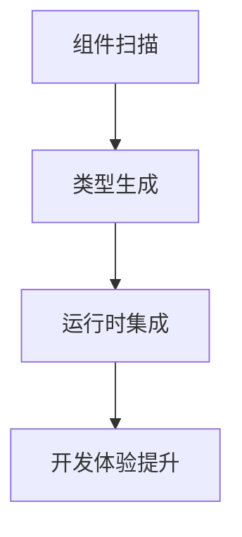
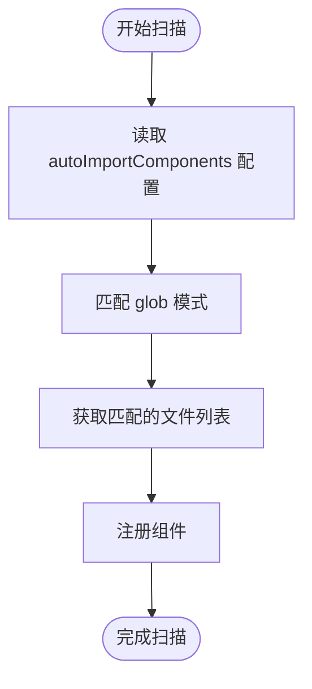
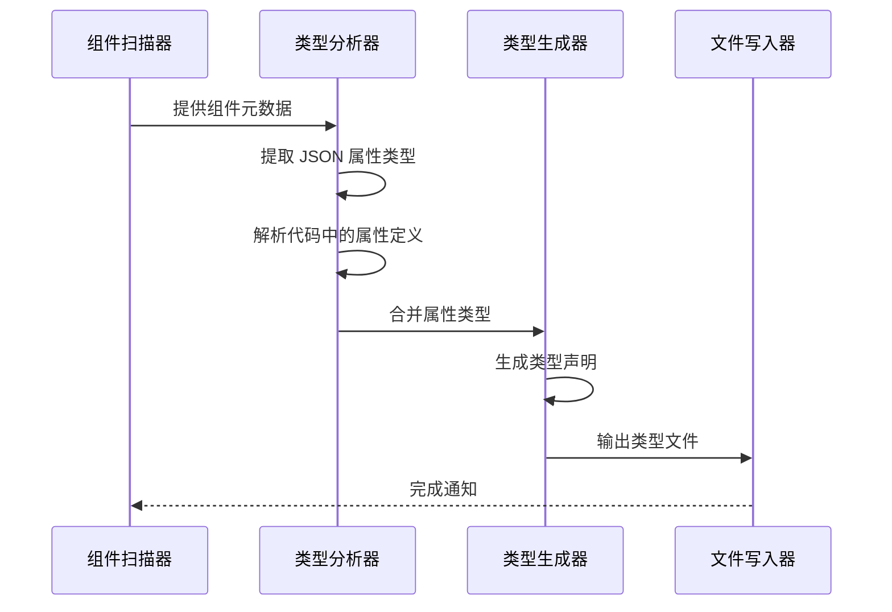
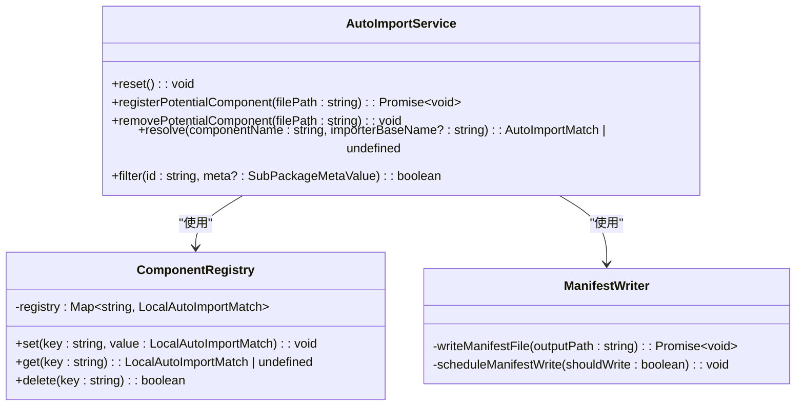
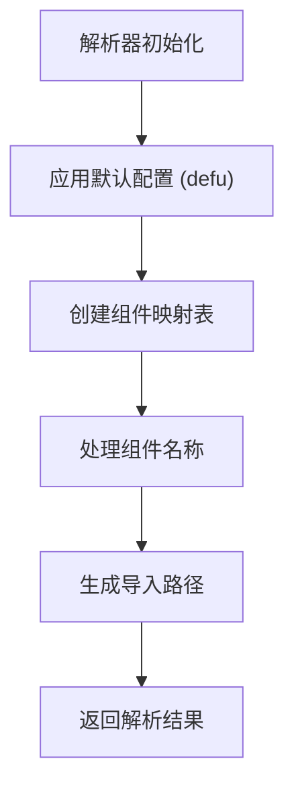
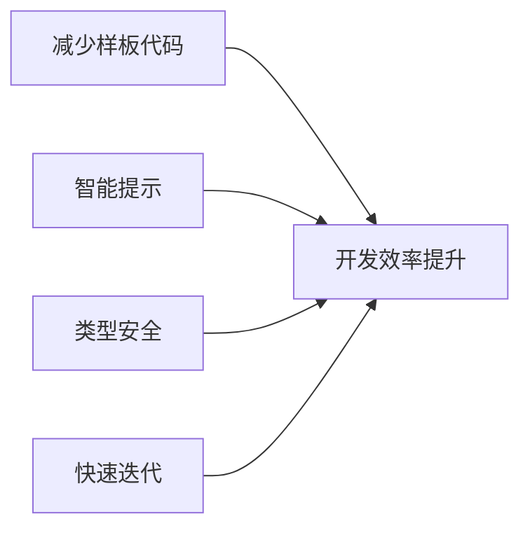
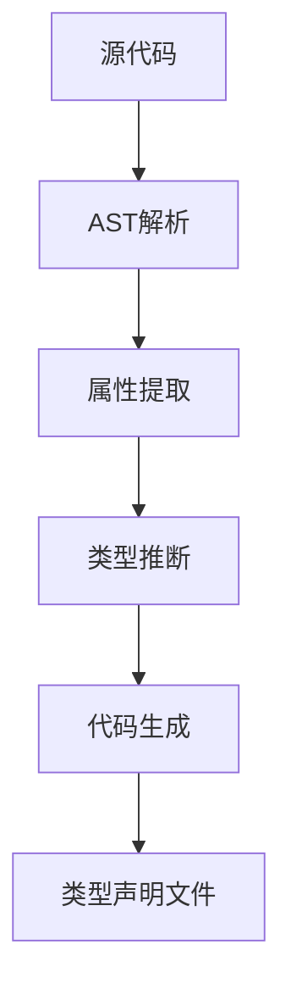
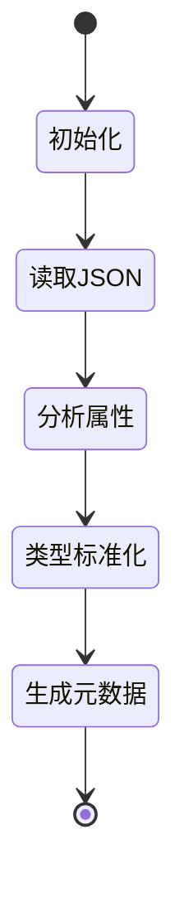

# 自动组件注册

<cite>
**本文档引用的文件**  
- [autoImport.ts](file://packages/weapp-vite/src/plugins/autoImport.ts)
- [service.ts](file://packages/weapp-vite/src/runtime/autoImport/service.ts)
- [config.ts](file://packages/weapp-vite/src/runtime/autoImport/config.ts)
- [typedDefinition.ts](file://packages/weapp-vite/src/runtime/autoImport/typedDefinition.ts)
- [tdesign.ts](file://packages/weapp-vite/src/auto-import-components/resolvers/tdesign.ts)
- [vant.ts](file://packages/weapp-vite/src/auto-import-components/resolvers/vant.ts)
- [metadata.ts](file://packages/weapp-vite/src/runtime/autoImport/metadata.ts)
- [extract.ts](file://apps/vite-native/scripts/extract.ts)
</cite>

## 目录
1. [简介](#简介)
2. [核心机制](#核心机制)
3. [组件扫描与发现](#组件扫描与发现)
4. [类型生成](#类型生成)
5. [运行时集成](#运行时集成)
6. [UI库支持与解析器](#ui库支持与解析器)
7. [配置选项与最佳实践](#配置选项与最佳实践)
8. [开发体验提升](#开发体验提升)
9. [实现细节](#实现细节)
10. [总结](#总结)

## 简介

weapp-vite 的自动组件注册功能为小程序开发提供了现代化的开发体验，实现了类似 Vue 的自动导入功能。该功能通过静态分析和运行时集成，自动发现项目中的自定义组件，并生成相应的类型声明文件，极大地提升了开发效率和代码质量。

该功能的核心目标是：
- **自动化**：无需手动导入组件，减少样板代码
- **类型安全**：自动生成类型声明，提供完整的 TypeScript 支持
- **智能提示**：在编辑器中提供组件属性的智能补全和文档提示
- **无缝集成**：与主流 UI 库（如 TDesign、Vant）无缝集成

本文档将深入解析该功能的实现机制，包括组件扫描、类型生成、运行时集成等关键技术细节。

## 核心机制

自动组件注册功能的核心机制由三个主要部分组成：组件扫描、类型生成和运行时集成。这些部分协同工作，实现了从组件发现到类型安全的完整流程。



**Diagram sources**  
- [autoImport.ts](file://packages/weapp-vite/src/plugins/autoImport.ts)
- [service.ts](file://packages/weapp-vite/src/runtime/autoImport/service.ts)

**Section sources**  
- [autoImport.ts](file://packages/weapp-vite/src/plugins/autoImport.ts)
- [service.ts](file://packages/weapp-vite/src/runtime/autoImport/service.ts)

## 组件扫描与发现

组件扫描是自动注册功能的第一步，负责发现项目中的所有可用组件。该过程通过 Vite 插件系统实现，主要包含以下步骤：

1. **配置解析**：读取 `autoImportComponents` 配置，确定扫描范围
2. **文件匹配**：使用 glob 模式匹配组件文件
3. **注册管理**：维护组件注册表，跟踪组件的增删改



**Diagram sources**  
- [autoImport.ts](file://packages/weapp-vite/src/plugins/autoImport.ts)
- [config.ts](file://packages/weapp-vite/src/runtime/autoImport/config.ts)

**Section sources**  
- [autoImport.ts](file://packages/weapp-vite/src/plugins/autoImport.ts)
- [config.ts](file://packages/weapp-vite/src/runtime/autoImport/config.ts)

## 类型生成

类型生成是自动组件注册功能的关键特性，为开发者提供完整的 TypeScript 支持。该功能通过分析组件的 JSON 配置文件和代码，生成相应的类型声明文件。

### 类型生成流程



**Diagram sources**  
- [service.ts](file://packages/weapp-vite/src/runtime/autoImport/service.ts)
- [typedDefinition.ts](file://packages/weapp-vite/src/runtime/autoImport/typedDefinition.ts)
- [metadata.ts](file://packages/weapp-vite/src/runtime/autoImport/metadata.ts)

**Section sources**  
- [service.ts](file://packages/weapp-vite/src/runtime/autoImport/service.ts)
- [typedDefinition.ts](file://packages/weapp-vite/src/runtime/autoImport/typedDefinition.ts)
- [metadata.ts](file://packages/weapp-vite/src/runtime/autoImport/metadata.ts)

## 运行时集成

运行时集成确保自动注册的组件能够在小程序运行时正确加载和使用。该功能通过生成组件清单文件（manifest）来实现。

### 运行时集成机制



**Diagram sources**  
- [service.ts](file://packages/weapp-vite/src/runtime/autoImport/service.ts)
- [config.ts](file://packages/weapp-vite/src/runtime/autoImport/config.ts)

**Section sources**  
- [service.ts](file://packages/weapp-vite/src/runtime/autoImport/service.ts)
- [config.ts](file://packages/weapp-vite/src/runtime/autoImport/config.ts)

## UI库支持与解析器

weapp-vite 支持多种主流 UI 库，通过特定的解析器实现对不同库的组件自动导入。

### 支持的UI库

| UI库 | 前缀 | 解析器文件 | 组件路径模式 |
|------|------|-----------|-------------|
| TDesign | t- | tdesign.ts | tdesign-miniprogram/{name}/{name} |
| Vant | van- | vant.ts | @vant/weapp/{name} |
| WeUI | mp- | weui.ts | weui-miniprogram/{name}/{name} |

**Diagram sources**  
- [tdesign.ts](file://packages/weapp-vite/src/auto-import-components/resolvers/tdesign.ts)
- [vant.ts](file://packages/weapp-vite/src/auto-import-components/resolvers/vant.ts)

**Section sources**  
- [tdesign.ts](file://packages/weapp-vite/src/auto-import-components/resolvers/tdesign.ts)
- [vant.ts](file://packages/weapp-vite/src/auto-import-components/resolvers/vant.ts)

### 解析器实现



**Diagram sources**  
- [tdesign.ts](file://packages/weapp-vite/src/auto-import-components/resolvers/tdesign.ts)
- [vant.ts](file://packages/weapp-vite/src/auto-import-components/resolvers/vant.ts)

## 配置选项与最佳实践

### 配置选项

```typescript
interface AutoImportComponents {
  globs?: string[];           // 扫描的glob模式
  resolvers?: Resolver[];     // 自定义解析器
  output?: string | false;    // 输出路径
  typedComponents?: boolean | string; // 类型声明配置
  htmlCustomData?: boolean | string; // HTML自定义数据配置
}
```

### 最佳实践

1. **合理配置扫描范围**：避免扫描不必要的文件，提高性能
2. **使用自定义前缀**：避免组件名称冲突
3. **启用类型生成**：充分利用 TypeScript 的类型检查
4. **定期更新组件清单**：确保组件注册的准确性

**Section sources**  
- [config.ts](file://packages/weapp-vite/src/runtime/autoImport/config.ts)

## 开发体验提升

自动组件注册功能显著提升了开发体验，主要体现在以下几个方面：

1. **减少样板代码**：无需手动导入组件
2. **智能提示**：编辑器提供完整的组件属性提示
3. **类型安全**：编译时检查组件属性类型
4. **快速迭代**：新增组件自动注册，无需额外配置



**Diagram sources**  
- [service.ts](file://packages/weapp-vite/src/runtime/autoImport/service.ts)
- [typedDefinition.ts](file://packages/weapp-vite/src/runtime/autoImport/typedDefinition.ts)

## 实现细节

### AST解析与代码生成

自动组件注册功能利用 AST（抽象语法树）解析技术，深入分析组件代码，提取属性定义。



**Diagram sources**  
- [metadata.ts](file://packages/weapp-vite/src/runtime/autoImport/metadata.ts)
- [typedDefinition.ts](file://packages/weapp-vite/src/runtime/autoImport/typedDefinition.ts)

### 组件元数据提取



**Diagram sources**  
- [metadata.ts](file://packages/weapp-vite/src/runtime/autoImport/metadata.ts)

## 总结

weapp-vite 的自动组件注册功能通过组件扫描、类型生成和运行时集成三个核心机制，为小程序开发提供了现代化的开发体验。该功能不仅支持自定义组件的自动发现和注册，还提供了对主流 UI 库（如 TDesign、Vant）的无缝集成。

通过深入理解其实现细节，开发者可以更好地利用这一功能，提升开发效率和代码质量。同时，该功能的可配置性和扩展性也为未来的功能演进提供了坚实的基础。