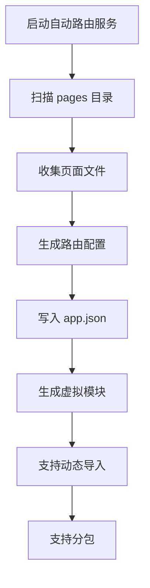
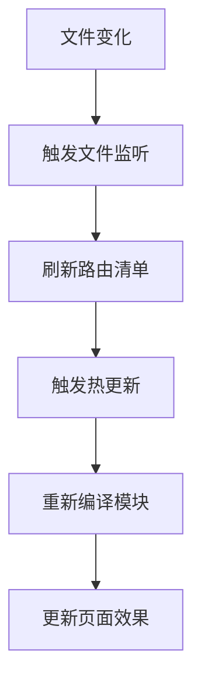

# 自动路由

<cite>
**本文档引用的文件**   
- [auto-routes.ts](file://packages/weapp-vite/auto-routes.ts)
- [auto-routes.ts](file://packages/weapp-vite/src/auto-routes.ts)
- [autoRoutesPlugin.ts](file://packages/weapp-vite/src/runtime/autoRoutesPlugin.ts)
- [autoRoutesPlugin.test.ts](file://packages/weapp-vite/src/runtime/autoRoutesPlugin.test.ts)
- [autoRoutes.test.ts](file://packages/weapp-vite/test/auto-routes.test.ts)
- [routes.ts](file://packages/weapp-vite/src/types/routes.ts)
- [autoRoutes.ts](file://packages/weapp-vite/src/plugins/autoRoutes.ts)
- [guide/auto-routes.md](file://website/guide/auto-routes.md)
</cite>

## 目录
1. [简介](#简介)
2. [核心功能](#核心功能)
3. [实现原理](#实现原理)
4. [配置与使用](#配置与使用)
5. [类型生成与类型安全](#类型生成与类型安全)
6. [文件监听与热更新](#文件监听与热更新)
7. [API 与代码集成](#api-与代码集成)
8. [常见问题与解决方案](#常见问题与解决方案)
9. [总结](#总结)

## 简介

weapp-vite 的自动路由功能旨在通过自动化手段简化小程序的路由管理。传统的微信小程序开发中，开发者需要手动维护 `app.json` 文件中的 `pages` 数组，每当新增或删除页面时，都必须手动修改该配置，这不仅繁琐且容易出错。weapp-vite 的自动路由服务通过扫描项目中的 `pages` 目录结构，自动生成 `app.json` 中的 `pages` 配置，从而避免了手动维护的繁琐操作。

该功能不仅简化了路由管理，还提供了类型安全的路由对象，供脚本或模板直接引用。通过启用自动路由，开发者可以专注于业务逻辑的开发，而无需担心路由配置的同步问题。此外，自动路由服务还支持动态导入和分包管理，进一步提升了开发效率和项目的可维护性。

**Section sources**
- [guide/auto-routes.md](file://website/guide/auto-routes.md#简介)

## 核心功能

### 页面发现

自动路由服务的核心功能之一是页面发现。它通过扫描项目中的 `pages` 目录及其子目录，自动识别出所有页面文件。具体来说，服务会遍历 `src/pages/**` 以及各分包 `root/pages/**` 下的文件，收集所有符合条件的页面路径。这些路径会被用于生成 `app.json` 中的 `pages` 数组。

页面发现的过程是基于文件系统扫描的。服务会检查每个文件的扩展名，确保只有 `.js`、`.jsx`、`.ts`、`.tsx` 和 `.vue` 等脚本文件被纳入考虑。同时，服务还会检查页面的模板文件（如 `.wxml`）和样式文件（如 `.wxss`、`.css`、`.scss` 等），以确保页面的完整性。

### 路由配置生成

一旦页面被发现，自动路由服务会生成相应的路由配置。这些配置包括主包页面和分包页面的路径列表。生成的配置会被写入 `app.json` 文件中，从而实现自动化的路由管理。此外，服务还会生成一个虚拟模块 `weapp-vite/auto-routes`，该模块导出了完整的路由对象，包括 `pages`、`entries` 和 `subPackages` 等数组。

### 动态导入

自动路由服务还支持动态导入功能。通过动态导入，开发者可以在运行时按需加载页面，从而减少初始加载时间，提升用户体验。动态导入的实现依赖于 Vite 的模块解析机制，服务会根据页面路径动态生成导入语句，并在需要时执行这些语句。

### 分包支持

对于包含分包的小程序项目，自动路由服务同样提供了支持。服务会识别分包目录，并将其路径纳入路由配置中。分包的页面路径会被添加到 `subPackages` 数组中，确保分包页面能够被正确加载和管理。

**Section sources**
- [autoRoutesPlugin.ts](file://packages/weapp-vite/src/runtime/autoRoutesPlugin.ts#L143-L211)
- [auto-routes.ts](file://packages/weapp-vite/src/auto-routes.ts#L1-L35)

## 实现原理

### 文件系统扫描

自动路由服务的实现基于文件系统扫描。服务使用 `fdir` 库来高效地遍历项目目录，收集所有符合条件的页面文件。`fdir` 是一个高性能的文件系统扫描工具，能够快速地遍历大量文件，确保扫描过程的高效性。

在扫描过程中，服务会排除一些特定的目录，如 `node_modules`、`miniprogram_npm`、`.git`、`.idea`、`.husky`、`.turbo` 和 `.cache` 等，以避免不必要的文件被纳入扫描范围。此外，服务还会检查文件的扩展名，确保只有脚本文件、模板文件和样式文件被纳入考虑。

### 路由配置生成

扫描完成后，服务会根据收集到的页面路径生成路由配置。生成的配置包括主包页面和分包页面的路径列表。这些配置会被写入 `app.json` 文件中，从而实现自动化的路由管理。此外，服务还会生成一个虚拟模块 `weapp-vite/auto-routes`，该模块导出了完整的路由对象，包括 `pages`、`entries` 和 `subPackages` 等数组。

### 动态导入

动态导入的实现依赖于 Vite 的模块解析机制。服务会根据页面路径动态生成导入语句，并在需要时执行这些语句。例如，当用户导航到某个页面时，服务会动态生成相应的导入语句，并执行该语句以加载页面。

### 分包支持

对于包含分包的小程序项目，服务会识别分包目录，并将其路径纳入路由配置中。分包的页面路径会被添加到 `subPackages` 数组中，确保分包页面能够被正确加载和管理。分包的配置还包括分包的根目录和页面列表，这些信息会被写入 `app.json` 文件中。



**Diagram sources**
- [autoRoutesPlugin.ts](file://packages/weapp-vite/src/runtime/autoRoutesPlugin.ts#L143-L211)
- [auto-routes.ts](file://packages/weapp-vite/src/auto-routes.ts#L1-L35)

**Section sources**
- [autoRoutesPlugin.ts](file://packages/weapp-vite/src/runtime/autoRoutesPlugin.ts#L143-L211)
- [auto-routes.ts](file://packages/weapp-vite/src/auto-routes.ts#L1-L35)

## 配置与使用

### 启用自动路由

要启用自动路由功能，首先需要在 `vite.config.ts` 文件中进行配置。具体配置如下：

```ts
import { defineConfig } from 'weapp-vite'

export default defineConfig({
  weapp: {
    autoRoutes: true,
  },
})
```

启用后，自动路由服务会自动完成以下工作：
- 生成 `typed-router.d.ts` 文件，其中包含 `AutoRoutes` 相关类型。
- 暴露虚拟模块 `weapp-vite/auto-routes`，默认导出完整路由对象，并额外提供 `entries`、`pages` 和 `subPackages` 等数组。
- 在开发与构建过程中持续监听页面相关文件，增删改都会立刻刷新清单并触发热更新。

### 自定义配置

除了基本的启用配置外，weapp-vite 还提供了若干自定义配置选项，以满足不同项目的需求。例如，可以通过 `weapp.autoRoutes.include` 和 `weapp.autoRoutes.exclude` 选项来调整扫描范围，或在 monorepo 中为不同子包指定根目录。

```ts
import { defineConfig } from 'weapp-vite'

export default defineConfig({
  weapp: {
    autoRoutes: {
      include: ['src/pages/**', 'packages/*/pages/**'],
      exclude: ['**/node_modules/**', '**/dist/**'],
    },
  },
})
```

### 动态路由支持

自动路由服务还支持动态路由。通过动态路由，开发者可以在运行时根据用户输入或业务逻辑动态生成页面路径。例如，可以使用正则表达式或路径参数来定义动态路由。

```ts
// 示例：动态路由
const routes = {
  pages: [
    'pages/index/index',
    'pages/user/:id',
    'pages/post/:slug',
  ],
}
```

**Section sources**
- [guide/auto-routes.md](file://website/guide/auto-routes.md#配置与使用)
- [autoRoutesPlugin.ts](file://packages/weapp-vite/src/runtime/autoRoutesPlugin.ts#L556-L558)

## 类型生成与类型安全

### 类型生成

自动路由服务会生成一个 `typed-router.d.ts` 文件，该文件包含了 `AutoRoutes` 相关类型。这些类型定义了主包页面、分包页面和入口页面的路径列表。通过这些类型，开发者可以在 TypeScript 项目中获得类型安全的路由信息，避免字符串拼写错误。

```ts
// typed-router.d.ts
declare module 'weapp-vite/auto-routes' {
  export type AutoRoutesPages = readonly ["pages/index/index", "pages/user/:id", "pages/post/:slug"];
  export type AutoRoutesEntries = readonly ["pages/index/index", "pages/user/:id", "pages/post/:slug"];
  export type AutoRoutesSubPackages = readonly [{
    readonly root: "packageA";
    readonly pages: readonly ["pages/cat", "pages/dog"];
  }];
  export interface AutoRoutes {
    readonly pages: AutoRoutesPages;
    readonly entries: AutoRoutesEntries;
    readonly subPackages: AutoRoutesSubPackages;
  }
  export const routes: AutoRoutes;
  export const pages: AutoRoutesPages;
  export const entries: AutoRoutesEntries;
  export const subPackages: AutoRoutesSubPackages;
  export default routes;
}
```

### 类型安全

通过使用生成的类型，开发者可以在代码中获得类型安全的路由信息。例如，可以使用 `AutoRoutes.Pages` 类型来定义导航函数的参数，确保传入的页面路径是有效的。

```ts
import type { AutoRoutes } from 'weapp-vite/auto-routes'

function navigateTo(route: AutoRoutes.Pages) {
  wx.navigateTo({ url: route })
}
```

随着文件结构的变化，类型声明也会自动刷新，无需手动维护。

**Section sources**
- [autoRoutesPlugin.ts](file://packages/weapp-vite/src/runtime/autoRoutesPlugin.ts#L264-L288)
- [auto-routes.ts](file://packages/weapp-vite/src/auto-routes.ts#L1-L35)

## 文件监听与热更新

### 文件监听

自动路由服务会持续监听页面相关文件，包括页面脚本、页面模板、页面样式和页面/应用配置文件。当这些文件发生增删改时，服务会立即刷新路由清单，并触发热更新。这确保了开发过程中的实时反馈，提高了开发效率。

### 热更新

热更新是自动路由服务的重要特性之一。当页面文件发生变化时，服务会自动重新生成路由配置，并通知 Vite 重新编译相关模块。这使得开发者可以在不重启开发服务器的情况下看到最新的页面效果。



**Diagram sources**
- [autoRoutesPlugin.ts](file://packages/weapp-vite/src/runtime/autoRoutesPlugin.ts#L61-L85)
- [autoRoutesPlugin.test.ts](file://packages/weapp-vite/src/runtime/autoRoutesPlugin.test.ts#L58-L124)

**Section sources**
- [autoRoutesPlugin.ts](file://packages/weapp-vite/src/runtime/autoRoutesPlugin.ts#L61-L85)
- [autoRoutesPlugin.test.ts](file://packages/weapp-vite/src/runtime/autoRoutesPlugin.test.ts#L58-L124)

## API 与代码集成

### 导入路由模块

在代码中使用自动路由功能时，首先需要导入 `weapp-vite/auto-routes` 模块。该模块默认导出完整的路由对象，并额外提供 `entries`、`pages` 和 `subPackages` 等数组。

```ts
import routes, { entries, pages, subPackages } from 'weapp-vite/auto-routes'
```

### 使用路由信息

导入路由模块后，可以使用其中的路由信息进行页面导航、生成导航菜单等操作。例如，可以使用 `pages` 数组来生成导航菜单，或使用 `entries` 数组来初始化应用。

```ts
console.log(routes.pages) // 主包页面清单
console.log(routes.entries) // 所有入口（主包 + 分包）
console.log(routes.subPackages) // 分包 root 与页面列表
```

### 动态导入

动态导入功能可以通过 `import()` 语法实现。例如，可以动态导入某个页面模块，并在需要时执行该模块。

```ts
async function loadPage(pagePath: string) {
  const pageModule = await import(`./${pagePath}`)
  // 执行页面模块
}
```

**Section sources**
- [auto-routes.ts](file://packages/weapp-vite/src/auto-routes.ts#L1-L35)
- [autoRoutesPlugin.ts](file://packages/weapp-vite/src/runtime/autoRoutesPlugin.ts#L8-L27)

## 常见问题与解决方案

### 为什么没有生成路由？

如果自动路由服务没有生成路由，可能的原因包括：
- 项目没有遵循 `pages/**/index` 或 `pages/**/main` 等约定结构。
- `autoRoutes` 选项未启用。
- 首次开启后未重启 `pnpm dev` 以初始化监听器。

解决方法：
- 确认项目结构符合约定。
- 确保 `autoRoutes` 选项已启用。
- 重启 `pnpm dev` 以初始化监听器。

### 如何支持自定义目录结构？

可以通过 `weapp.autoRoutes.include` 和 `weapp.autoRoutes.exclude` 选项来调整扫描范围，或在 monorepo 中为不同子包指定根目录。

```ts
import { defineConfig } from 'weapp-vite'

export default defineConfig({
  weapp: {
    autoRoutes: {
      include: ['src/pages/**', 'packages/*/pages/**'],
      exclude: ['**/node_modules/**', '**/dist/**'],
    },
  },
})
```

### typed 文件可以提交吗？

`typed-router.d.ts` 文件会随构建自动更新，通常推荐加入 `.gitignore`，仅在需要固定类型时再纳入版本控制。

**Section sources**
- [guide/auto-routes.md](file://website/guide/auto-routes.md#常见问题与解决方案)

## 总结

weapp-vite 的自动路由功能通过自动化手段简化了小程序的路由管理，避免了手动维护 `app.json` 的繁琐操作。该功能不仅提供了类型安全的路由信息，还支持动态导入和分包管理，进一步提升了开发效率和项目的可维护性。通过合理的配置和使用，开发者可以充分利用自动路由功能，专注于业务逻辑的开发，从而提高开发效率和代码质量。

**Section sources**
- [guide/auto-routes.md](file://website/guide/auto-routes.md#总结)