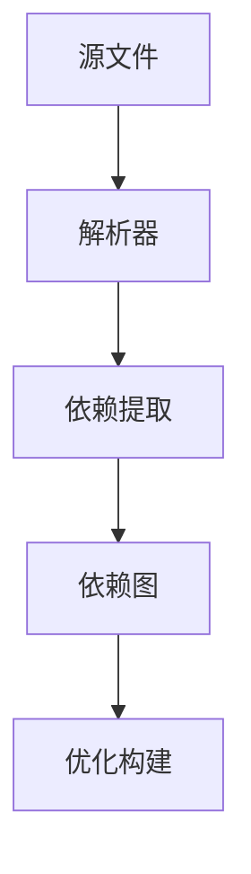
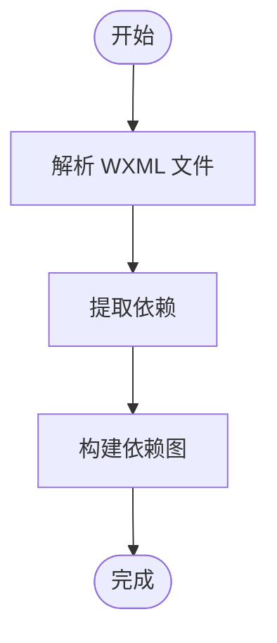
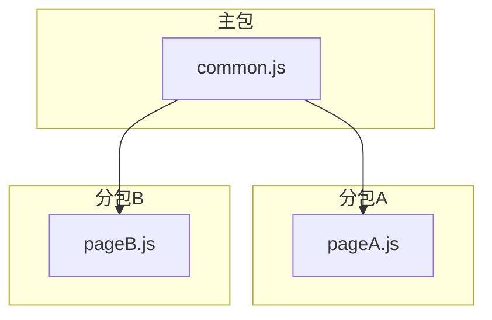
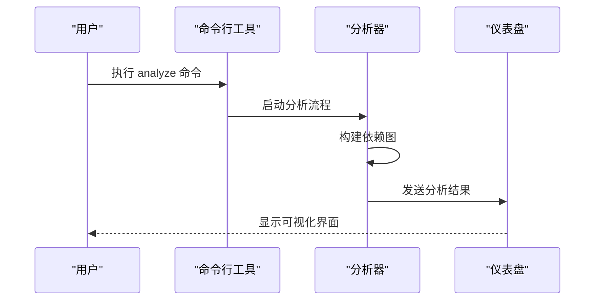
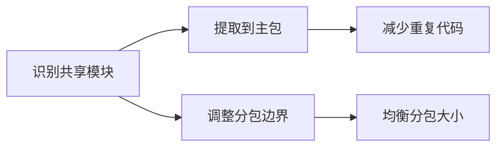

# 依赖分析

<cite>
**本文档中引用的文件**   
- [scan.ts](file://packages/weapp-vite/src/wxml/scan.ts)
- [wxmlPlugin.ts](file://packages/weapp-vite/src/runtime/wxmlPlugin.ts)
- [subpackages.ts](file://packages/weapp-vite/src/analyze/subpackages.ts)
- [chunkStrategy.ts](file://packages/weapp-vite/src/runtime/chunkStrategy.ts)
- [analyze.ts](file://packages/weapp-vite/src/cli/commands/analyze.ts)
- [dashboard.ts](file://packages/weapp-vite/src/cli/analyze/dashboard.ts)
- [App.vue](file://packages/weapp-vite/analyze-dashboard/App.vue)
- [useTreemapData.ts](file://packages/weapp-vite/analyze-dashboard/useTreemapData.ts)
</cite>

## 目录
1. [介绍](#介绍)
2. [依赖分析的重要性](#依赖分析的重要性)
3. [依赖图构建过程](#依赖图构建过程)
4. [分包依赖分析机制](#分包依赖分析机制)
5. [使用方法](#使用方法)
6. [优化策略](#优化策略)
7. [实际案例](#实际案例)
8. [总结](#总结)

## 介绍

weapp-vite 是一个用于小程序开发的构建工具，它通过静态分析技术来识别项目中文件之间的依赖关系。这种依赖分析对于优化构建过程、减少包体积以及提高应用性能至关重要。

**Section sources**
- [scan.ts](file://packages/weapp-vite/src/wxml/scan.ts#L1-L303)
- [wxmlPlugin.ts](file://packages/weapp-vite/src/runtime/wxmlPlugin.ts#L1-L204)

## 依赖分析的重要性

在小程序构建过程中，依赖分析是确保代码正确打包和加载的关键步骤。通过静态分析，weapp-vite 能够准确地识别出哪些文件被其他文件引用，从而构建出完整的依赖图。这不仅有助于避免循环引用问题，还能帮助开发者合理规划分包策略，以达到最佳的加载性能。

**Diagram sources **
- [scan.ts](file://packages/weapp-vite/src/wxml/scan.ts#L1-L303)

## 依赖图构建过程

weapp-vite 通过解析 WXML、JS/TS 和 JSON 文件来提取依赖信息。具体来说，`scanWxml` 函数负责处理 WXML 文件中的 `<import>` 和 `<include>` 标签，以及 `src` 属性指向的资源。同时，对于 JS/TS 文件，weapp-vite 会分析 `import` 语句来确定模块间的依赖关系。

**Diagram sources **
- [scan.ts](file://packages/weapp-vite/src/wxml/scan.ts#L1-L303)
- [wxmlPlugin.ts](file://packages/weapp-vite/src/runtime/wxmlPlugin.ts#L1-L204)

## 分包依赖分析机制

分包是小程序中常见的组织方式，它可以将应用拆分为多个独立的部分，每个部分可以单独加载。weapp-vite 提供了强大的分包依赖分析功能，能够识别跨分包引用和共享模块。当某个模块被多个分包共同使用时，weapp-vite 会将其提升到主包或创建共享 chunk，以避免重复打包。

**Diagram sources **
- [chunkStrategy.ts](file://packages/weapp-vite/src/runtime/chunkStrategy.ts#L1-L800)
- [subpackages.ts](file://packages/weapp-vite/src/analyze/subpackages.ts#L1-L601)

## 使用方法

要使用 weapp-vite 的依赖分析功能，可以通过命令行工具执行 `weapp-vite analyze` 命令。该命令会生成详细的依赖报告，并提供一个可视化仪表盘，帮助开发者直观地查看项目的依赖结构。

**Diagram sources **
- [analyze.ts](file://packages/weapp-vite/src/cli/commands/analyze.ts#L1-L135)
- [dashboard.ts](file://packages/weapp-vite/src/cli/analyze/dashboard.ts#L1-L172)

## 优化策略

利用依赖分析结果，开发者可以采取多种措施来优化代码组织和分包策略。例如，通过识别出被多个分包共享的模块，可以将这些模块提取到主包中，减少重复代码；或者通过调整分包边界，使得每个分包的大小更加均衡，提高加载效率。

**Diagram sources **
- [chunkStrategy.ts](file://packages/weapp-vite/src/runtime/chunkStrategy.ts#L1-L800)
- [subpackages.ts](file://packages/weapp-vite/src/analyze/subpackages.ts#L1-L601)

## 实际案例

假设有一个小程序项目，其中包含多个分包，每个分包都有自己的页面和组件。通过 weapp-vite 的依赖分析工具，我们发现某些工具函数被多个分包重复引用。通过将这些工具函数提取到主包中的 `common.js`，我们可以显著减少整体包体积，并且提高了加载速度。

**Diagram sources **
- [chunkStrategy.ts](file://packages/weapp-vite/src/runtime/chunkStrategy.ts#L1-L800)
- [subpackages.ts](file://packages/weapp-vite/src/analyze/subpackages.ts#L1-L601)

## 总结

weapp-vite 的依赖分析功能为小程序开发提供了强大的支持。通过精确的静态分析，它不仅帮助开发者构建了清晰的依赖图，还提供了有效的优化建议。无论是解决复杂的依赖问题还是优化分包策略，weapp-vite 都是一个不可或缺的工具。

**Section sources**
- [scan.ts](file://packages/weapp-vite/src/wxml/scan.ts#L1-L303)
- [wxmlPlugin.ts](file://packages/weapp-vite/src/runtime/wxmlPlugin.ts#L1-L204)
- [subpackages.ts](file://packages/weapp-vite/src/analyze/subpackages.ts#L1-L601)
- [chunkStrategy.ts](file://packages/weapp-vite/src/runtime/chunkStrategy.ts#L1-L800)
- [analyze.ts](file://packages/weapp-vite/src/cli/commands/analyze.ts#L1-L135)
- [dashboard.ts](file://packages/weapp-vite/src/cli/analyze/dashboard.ts#L1-L172)
- [App.vue](file://packages/weapp-vite/analyze-dashboard/App.vue#L1-L102)
- [useTreemapData.ts](file://packages/weapp-vite/analyze-dashboard/useTreemapData.ts#L1-L359)