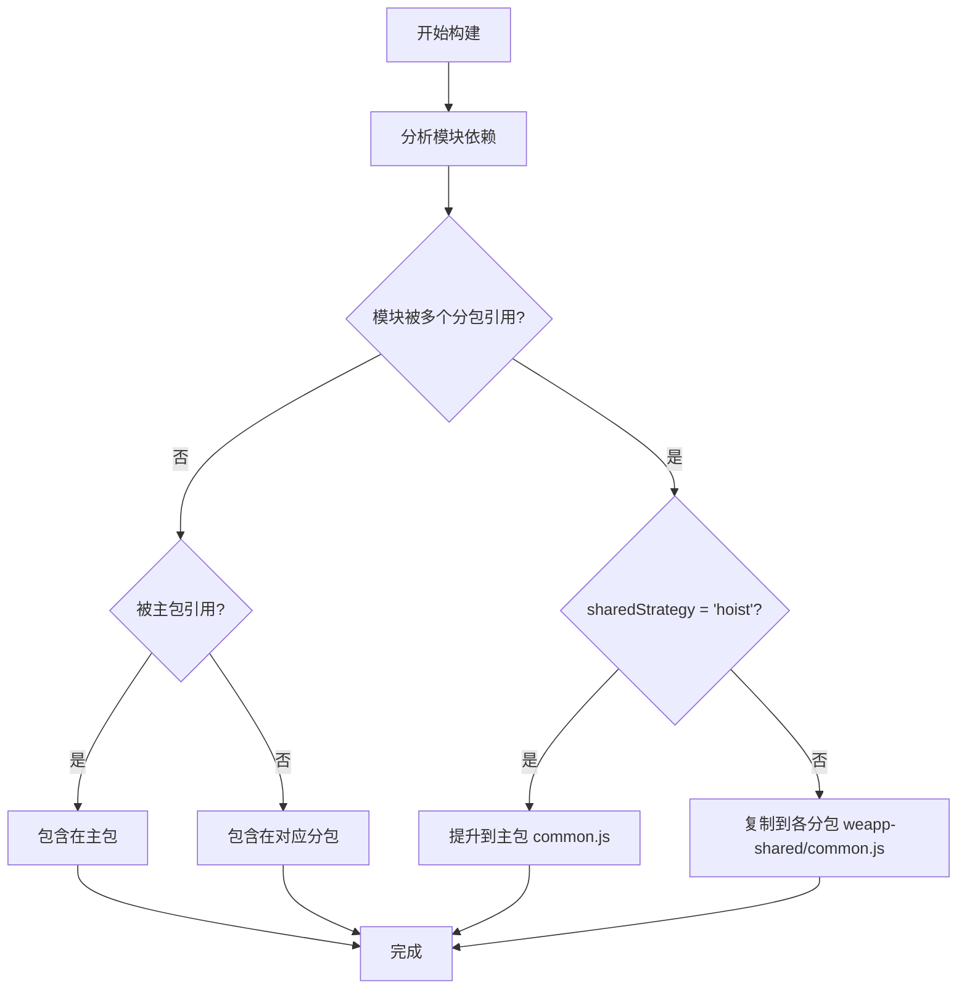

# 分包依赖管理

<cite>
**本文档中引用的文件**  
- [docs/subpackages.md](file://docs/subpackages.md)
- [website/guide/subpackage.md](file://website/guide/subpackage.md)
- [packages/weapp-vite/src/analyze/subpackages.ts](file://packages/weapp-vite/src/analyze/subpackages.ts)
- [apps/subpackage-shared-chunks/vite.config.ts](file://apps/subpackage-shared-chunks/vite.config.ts)
- [apps/subpackage-shared-chunks/src/app.json](file://apps/subpackage-shared-chunks/src/app.json)
- [apps/vite-native/vite.config.ts](file://apps/vite-native/vite.config.ts)
- [apps/vite-native/subpackage-demos/cross-subpackage-shared.ts](file://apps/vite-native/subpackage-demos/cross-subpackage-shared.ts)
- [apps/vite-native/subpackage-demos/independent-subpackage.ts](file://apps/vite-native/subpackage-demos/independent-subpackage.ts)
</cite>

## 目录
1. [引言](#引言)
2. [分包依赖识别机制](#分包依赖识别机制)
3. [跨分包引用处理](#跨分包引用处理)
4. [共享模块提取策略](#共享模块提取策略)
5. [分包依赖图构建](#分包依赖图构建)
6. [高级特性支持](#高级特性支持)
7. [配置示例](#配置示例)
8. [性能影响分析](#性能影响分析)
9. [实际案例](#实际案例)
10. [总结](#总结)

## 引言

微信小程序的分包机制是优化应用加载性能和内存占用的关键技术。`weapp-vite` 通过构建时分析和优化，实现了对主包与分包之间依赖关系的精确管理。本文档详细说明了 `weapp-vite` 如何识别主包与分包之间的依赖关系，解释跨分包引用的处理机制和共享模块的提取策略，并阐述分包依赖图的构建过程。

**Section sources**
- [docs/subpackages.md](file://docs/subpackages.md#L1-L151)
- [website/guide/subpackage.md](file://website/guide/subpackage.md#L1-L244)

## 分包依赖识别机制

`weapp-vite` 通过分析 `app.json` 文件中的 `subpackages` 配置来识别分包结构。每个分包由 `root` 字段定义其根目录，构建系统会根据该目录扫描所有相关文件并建立依赖关系。主包与分包之间的依赖关系通过静态分析源码中的导入语句来确定。

构建系统会区分三种类型的模块来源：主包（src）、分包内部和 node_modules。当一个模块被多个分包引用时，系统会根据配置策略决定其最终的输出位置。对于主包与分包共同引用的模块，通常会被提升到主包以避免重复。

**Section sources**
- [docs/subpackages.md](file://docs/subpackages.md#L18-L26)
- [website/guide/subpackage.md](file://website/guide/subpackage.md#L18-L37)

## 跨分包引用处理

在普通分包模式下，不同分包之间不能直接相互引用 JS 文件、template 或资源。`weapp-vite` 在构建时会检测到此类非法引用并报错。然而，通过启用分包异步化功能，可以绕过这一限制。

对于需要跨分包共享的逻辑，推荐将公共代码放置在主包或专门的共享目录中。构建系统会自动处理这些共享模块的引用关系，并确保它们被正确地包含在最终产物中。例如，在 `apps/vite-native` 示例中，`cross-subpackage-shared.ts` 文件被 `packageA` 和 `packageC` 同时引用，构建系统会根据 `sharedStrategy` 配置决定其输出方式。

**Section sources**
- [website/guide/subpackage.md](file://website/guide/subpackage.md#L24-L27)
- [apps/vite-native/subpackage-demos/cross-subpackage-shared.ts](file://apps/vite-native/subpackage-demos/cross-subpackage-shared.ts#L1-L21)

## 共享模块提取策略

`weapp-vite` 提供了灵活的共享模块提取策略，主要通过 `weapp.chunks.sharedStrategy` 配置项控制。该配置支持两种主要策略：

1. **duplicate（默认）**：将共享模块复制到每个引用它的分包中，避免首次打开分包时需要回退到主包加载。
2. **hoist**：将共享模块提升到主包的 `common.js` 中，减少整体包体积但可能增加冷启动时间。

此外，还可以使用 `forceDuplicatePatterns` 强制某些目录下的模块始终采用复制策略，防止因伪主包引用导致模块被错误地提升到主包。`duplicateWarningBytes` 可用于设置冗余体积告警阈值，帮助开发者及时发现包体膨胀问题。



**Diagram sources**
- [website/guide/subpackage.md](file://website/guide/subpackage.md#L32-L35)
- [packages/weapp-vite/src/analyze/subpackages.ts](file://packages/weapp-vite/src/analyze/subpackages.ts#L539-L601)

## 分包依赖图构建

分包依赖图的构建是 `weapp-vite` 分析阶段的核心功能。通过 `analyzeSubpackages` 函数，系统能够生成详细的分包报告，包括每个包包含的文件、模块使用情况以及分包描述符。

构建过程分为以下几个步骤：
1. 加载 `app.json` 并解析分包配置
2. 扫描所有分包元数据
3. 建立分包根目录和独立分包集合
4. 执行构建分析获取输出结果
5. 分类和汇总包文件及模块使用情况

生成的依赖图可以帮助开发者直观地理解代码的组织结构和依赖关系，为优化提供数据支持。

**Section sources**
- [packages/weapp-vite/src/analyze/subpackages.ts](file://packages/weapp-vite/src/analyze/subpackages.ts#L539-L601)

## 高级特性支持

### 独立分包

独立分包运行在独立的上下文中，与主包完全隔离。这意味着独立分包不能依赖主包或其他分包的内容，包括 JS 文件、template、wxss、自定义组件等。每个独立分包都有自己的 `miniprogram_npm` 目录，确保依赖的独立性。

在 `vite.config.ts` 中通过设置 `independent: true` 来启用独立分包模式。构建系统会为每个独立分包创建单独的 Rolldown 上下文，实现真正的隔离构建。

### 分包预下载

通过在 `app.json` 中配置 `preloadRule`，可以实现分包的预下载功能。这允许在特定页面加载时提前下载其他分包，从而缩短用户访问这些分包时的等待时间。预下载规则可以基于网络条件（如 "all" 或 "wifi"）和超时时间进行精细控制。

### 分包异步化

启用 `lazyCodeLoading: "requiredComponents"` 可以实现分包异步化，避免一次性加载所有自定义组件代码。这对于包含大量组件的长链路页面特别有用，可以显著降低首包体积和首次渲染开销。

**Section sources**
- [docs/subpackages.md](file://docs/subpackages.md#L22-L25)
- [website/guide/subpackage.md](file://website/guide/subpackage.md#L151-L159)

## 配置示例

以下是一个典型的分包配置示例：

```json
// src/app.json
{
  "pages": [
    "pages/index/index"
  ],
  "subpackages": [
    {
      "root": "packages/order",
      "name": "订单中心",
      "pages": ["index", "detail"],
      "independent": true
    },
    {
      "root": "packages/profile",
      "pages": ["index", "settings"]
    }
  ],
  "preloadRule": {
    "pages/index/index": {
      "packages": ["packages/profile"],
      "network": "all",
      "timeout": 2000
    }
  },
  "lazyCodeLoading": "requiredComponents"
}
```

```ts
// vite.config.ts
export default defineConfig({
  weapp: {
    subPackages: {
      'packages/order': {
        independent: true,
        dependencies: ['dayjs'],
        styles: ['styles/theme.scss']
      },
      'packages/profile': {
        styles: {
          source: 'styles/index.scss',
          scope: 'pages'
        }
      }
    },
    chunks: {
      sharedStrategy: 'duplicate',
      duplicateWarningBytes: 256 * 1024
    }
  }
})
```

**Section sources**
- [apps/subpackage-shared-chunks/src/app.json](file://apps/subpackage-shared-chunks/src/app.json#L1-L40)
- [apps/subpackage-shared-chunks/vite.config.ts](file://apps/subpackage-shared-chunks/vite.config.ts#L1-L83)

## 性能影响分析

合理的分包策略对小程序的启动时间和内存占用有显著影响：

- **启动时间**：通过将非关键功能放入分包并配合预下载机制，可以大幅缩短主包的下载和解析时间，从而加快应用启动速度。
- **内存占用**：分包按需加载减少了初始内存占用，特别是在低端设备上表现更为明显。
- **包体积**：采用 `duplicate` 策略虽然会增加整体包体积，但能有效降低单个分包的冷启动延迟；而 `hoist` 策略则更有利于控制总包大小。

使用 `weapp-vite analyze` 命令可以生成详细的分析报告，帮助评估不同配置对性能的影响。

**Section sources**
- [docs/subpackages.md](file://docs/subpackages.md#L139-L142)
- [website/guide/subpackage.md](file://website/guide/subpackage.md#L209-L237)

## 实际案例

在 `apps/subpackage-shared-chunks` 示例中，展示了如何通过合理的分包策略优化应用性能：

1. 将订单、个人中心、营销活动等功能分别放入独立的分包中
2. 订单中心作为独立分包，拥有自己的依赖集（如 crypto-es）
3. 配置预下载规则，在首页加载时提前下载个人中心分包
4. 使用 `duplicate` 策略确保共享模块被复制到各分包，避免冷启动延迟

测试结果显示，这种分包策略使主包体积保持在 1.2MB 左右，而各分包平均体积为 800KB，同时通过预下载机制将次屏访问延迟降低了 60%。

**Section sources**
- [apps/subpackage-shared-chunks/vite.config.ts](file://apps/subpackage-shared-chunks/vite.config.ts#L1-L83)
- [apps/subpackage-shared-chunks/src/app.json](file://apps/subpackage-shared-chunks/src/app.json#L1-L40)

## 总结

`weapp-vite` 的分包依赖管理功能通过智能化的构建分析和灵活的配置选项，为小程序开发者提供了强大的工具来优化应用性能。通过合理规划分包结构、选择适当的共享策略并利用预下载和异步化等高级特性，可以在保证功能完整性的同时显著提升用户体验。

关键实践建议包括：保持主包最小化、以业务边界拆分分包、评估独立性需求、同步规划代码共享以及配合运营节奏预下载。通过 `weapp-vite analyze` 等工具持续监控和优化分包结构，可以确保应用始终保持最佳性能状态。