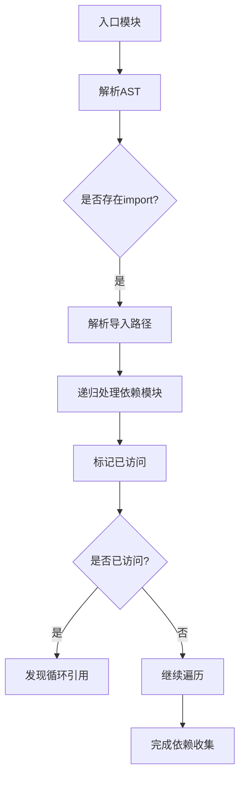
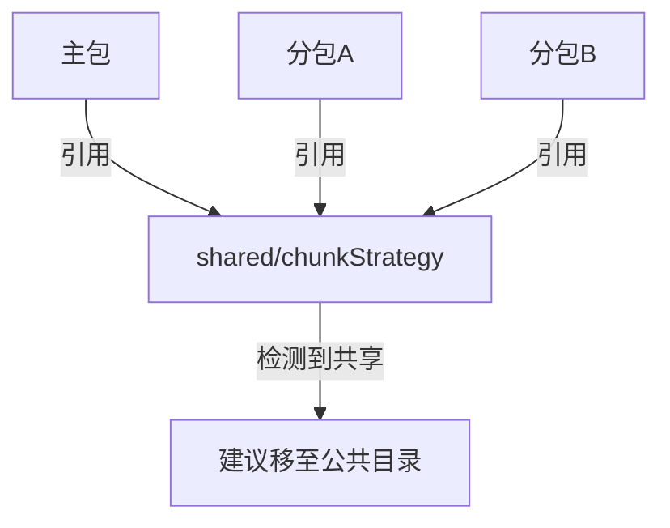

# 循环引用检测

<cite>
**本文档中引用的文件**  
- [core.ts](file://packages/weapp-vite/src/plugins/core.ts)
- [subpackages.ts](file://packages/weapp-vite/src/analyze/subpackages.ts)
- [chunkStrategy.ts](file://packages/weapp-vite/src/runtime/chunkStrategy.ts)
- [collect.ts](file://packages/rolldown-require/src/collect.ts)
- [bundler.ts](file://packages/rolldown-require/src/bundler.ts)
- [wxmlPlugin.ts](file://packages/weapp-vite/src/runtime/wxmlPlugin.ts)
</cite>

## 目录
1. [引言](#引言)
2. [循环引用检测机制](#循环引用检测机制)
3. [检测算法与实现原理](#检测算法与实现原理)
4. [循环引用对构建与运行的影响](#循环引用对构建与运行的影响)
5. [常见循环引用场景与解决方案](#常见循环引用场景与解决方案)
6. [检测结果输出与解读](#检测结果输出与解读)
7. [实际案例分析](#实际案例分析)
8. [总结](#总结)

## 引言

在小程序开发中，模块间的依赖关系复杂，尤其在使用分包机制时，若不加以管理，极易出现循环引用问题。循环引用不仅可能导致构建失败，还可能引发运行时错误或性能问题。weapp-vite 提供了完善的循环引用检测机制，通过静态分析与构建时检查，帮助开发者识别并修复潜在的依赖问题。

本文档将深入解析 weapp-vite 的循环引用检测功能，涵盖其工作原理、实现细节、影响分析、常见场景及解决方案，并通过实际案例展示如何利用该功能提升代码质量与构建稳定性。

## 循环引用检测机制

weapp-vite 的循环引用检测主要在构建阶段通过依赖图分析实现。系统在解析模块依赖时，构建完整的依赖图谱，并在图遍历过程中检测是否存在闭环路径。一旦发现循环引用，系统将根据配置策略进行处理，如发出警告、报错或自动优化。

检测机制贯穿于多个核心模块，包括依赖扫描、模块解析、分包处理和构建优化等环节。通过 `wxmlPlugin`、`core.ts` 插件及 `rolldown-require` 工具链的协同工作，实现了对静态与动态依赖的全面监控。

**Section sources**
- [wxmlPlugin.ts](file://packages/weapp-vite/src/runtime/wxmlPlugin.ts#L28-L81)
- [core.ts](file://packages/weapp-vite/src/plugins/core.ts#L486-L546)

## 检测算法与实现原理

### 依赖图构建与遍历

循环引用检测的核心是依赖图的构建与遍历。weapp-vite 使用 `rolldown-require` 中的 `collectReferencedModules` 函数递归遍历模块依赖图。该函数从入口文件开始，深度优先遍历所有静态导入（`imports`）和动态导入（`dynamicImports`），并将每个模块的依赖关系记录在图中。



**Diagram sources**
- [collect.ts](file://packages/rolldown-require/src/collect.ts#L8-L32)
- [bundler.ts](file://packages/rolldown-require/src/bundler.ts#L112-L114)

### 循环检测逻辑

在遍历过程中，系统维护一个 `analyzedModules` 集合，记录已访问的模块。当尝试访问一个已在集合中的模块时，即判定为循环引用。该算法时间复杂度为 O(V + E)，其中 V 为模块数量，E 为依赖边数。

此外，在分包场景下，系统通过 `assertModuleScopedToRoot` 函数检查模块作用域，防止跨分包的非法引用，间接避免因错误引用导致的隐性循环。

**Section sources**
- [collect.ts](file://packages/rolldown-require/src/collect.ts#L14-L17)
- [chunkStrategy.ts](file://packages/weapp-vite/src/runtime/chunkStrategy.ts#L413-L437)

## 循环引用对构建与运行的影响

### 构建阶段影响

- **构建失败**：严重的循环引用可能导致模块解析中断，使构建流程无法完成。
- **冗余打包**：循环依赖可能导致模块被重复打包，增加包体积。
- **构建性能下降**：依赖图复杂化会延长构建时间，影响开发效率。

### 运行时影响

- **初始化失败**：模块在加载时因依赖未就绪而抛出错误。
- **内存泄漏**：循环引用阻止垃圾回收，导致内存占用持续增长。
- **逻辑错误**：模块状态不一致，引发不可预测的行为。

weapp-vite 通过提前检测并提示这些问题，帮助开发者在开发阶段就发现并修复潜在风险。

## 常见循环引用场景与解决方案

### 场景一：直接模块循环

```ts
// a.ts
import { b } from './b'
export const a = 'a'

// b.ts
import { a } from './a'
export const b = 'b'
```

**解决方案**：提取公共逻辑到第三方模块 `common.ts`，由 a 和 b 分别引用。

### 场景二：分包间循环引用

分包 A 引用分包 B 的模块，而分包 B 又引用分包 A 的模块。

**解决方案**：将共享模块移至主包或公共目录，确保跨分包共享的模块具有全局可访问性。

### 场景三：动态导入导致的隐性循环

通过 `require` 或 `import()` 动态加载模块时，可能绕过静态分析，形成隐性循环。

**解决方案**：使用 weapp-vite 的 `take:` 指令显式声明动态依赖，确保其被正确纳入依赖图分析。

## 检测结果输出与解读

weapp-vite 在构建过程中会输出详细的依赖分析日志。例如：

```
[subpackages] 分包 shop、profile 共享模块已复制到各自 weapp-shared/common.js（8 处引用）
[subpackages] 模块 utils/helper 同时被主包引用，因此仍保留在主包 common.js，并复制到 shop、profile，请确认是否需要将源代码移动到主包或公共目录。
```

这些日志信息帮助开发者快速定位共享模块的分布情况与潜在优化点。通过配置 `chunks.logOptimization` 可控制日志级别，`duplicateWarningBytes` 可设置冗余体积警告阈值。

**Section sources**
- [core.ts](file://packages/weapp-vite/src/plugins/core.ts#L391-L410)

## 实际案例分析

在 `apps/vite-native/subpackage-demos` 示例中，`cross-subpackage-shared.ts` 文件被多个分包引用。weapp-vite 的分析工具 `analyzeSubpackages` 会生成详细的报告，展示该模块在各分包中的使用情况。

通过运行 `weapp-vite analyze` 命令，开发者可获得可视化依赖图，识别出哪些模块被重复打包，进而决定是否将其提升至主包或公共目录，以优化包结构。



**Diagram sources**
- [subpackages.ts](file://packages/weapp-vite/src/analyze/subpackages.ts#L539-L601)
- [useTreemapData.ts](file://packages/weapp-vite/analyze-dashboard/useTreemapData.ts#L164-L226)

## 总结

weapp-vite 的循环引用检测功能通过静态分析与构建时检查，有效识别模块间的循环依赖问题。其基于依赖图遍历的算法高效准确，结合分包管理策略，能够预防多种常见的依赖错误。开发者应充分利用该功能，在开发过程中持续监控依赖健康度，确保小程序的构建稳定性与运行性能。