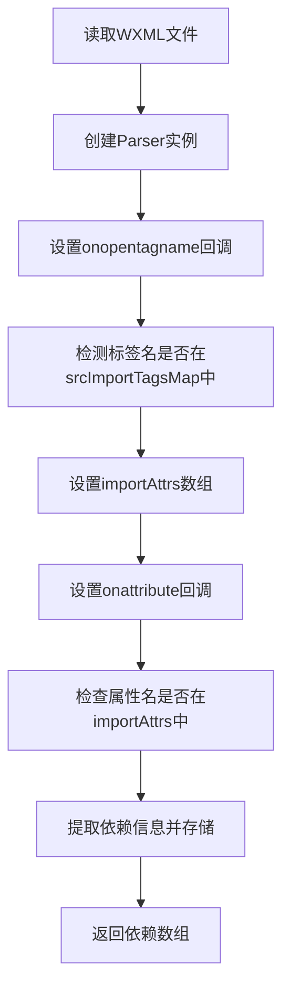
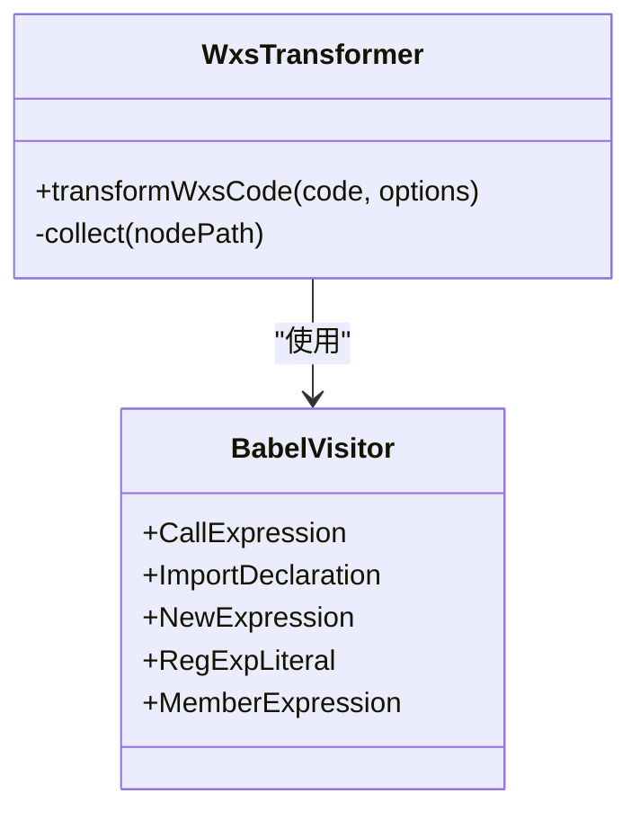
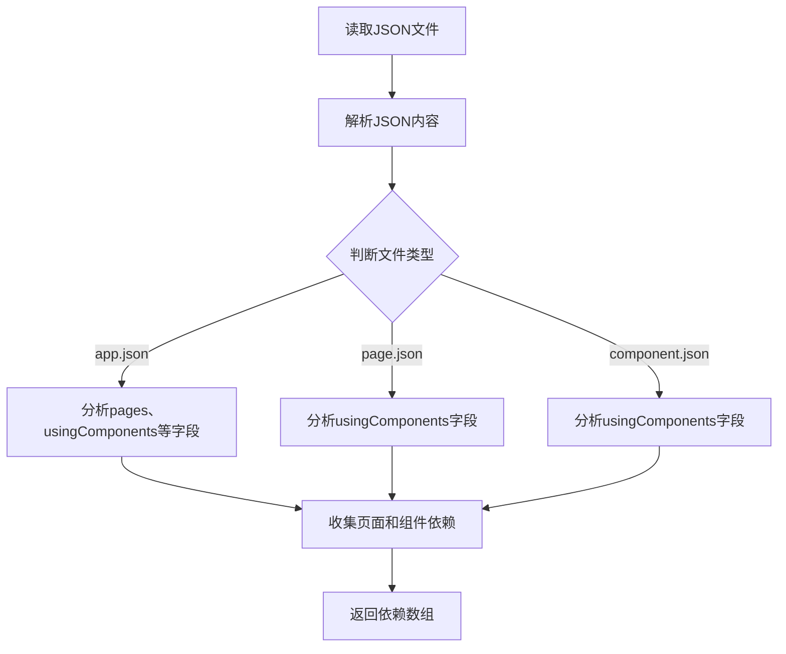
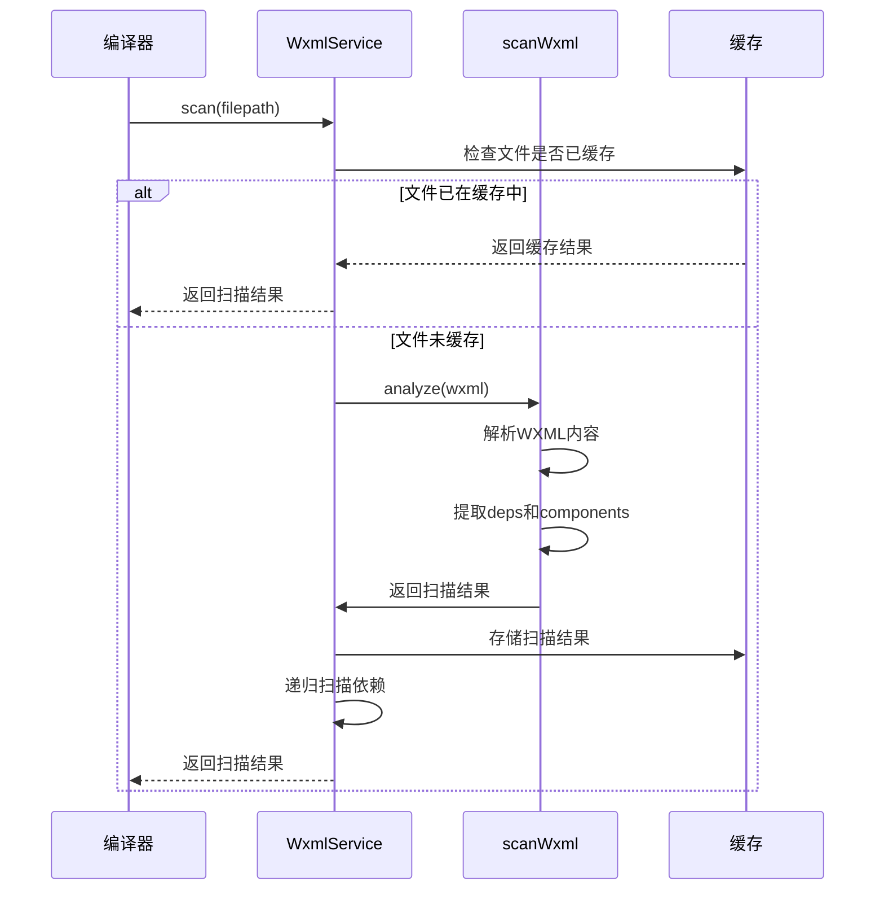
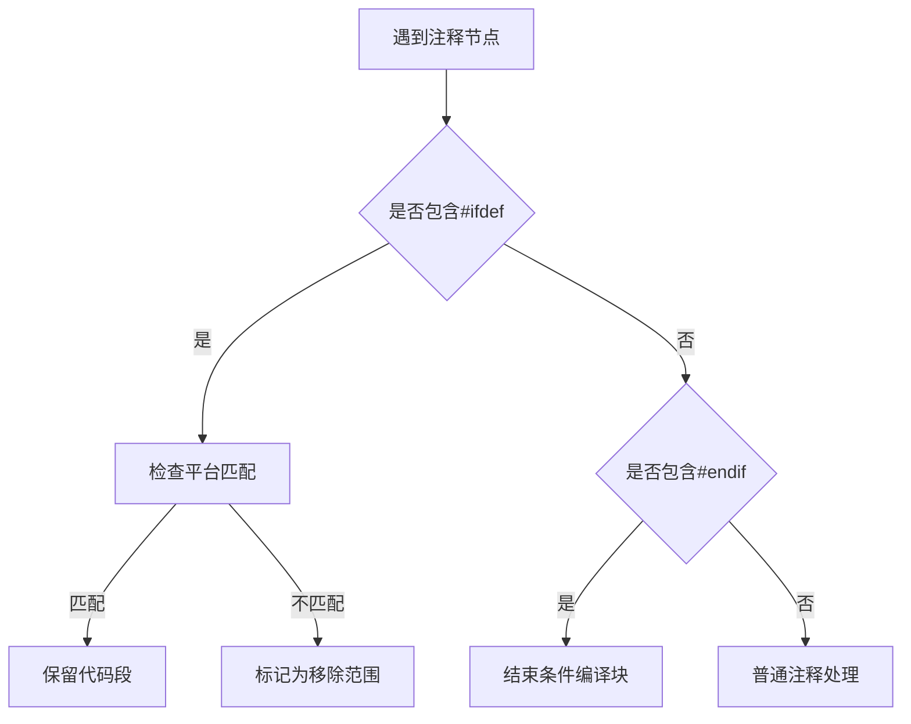
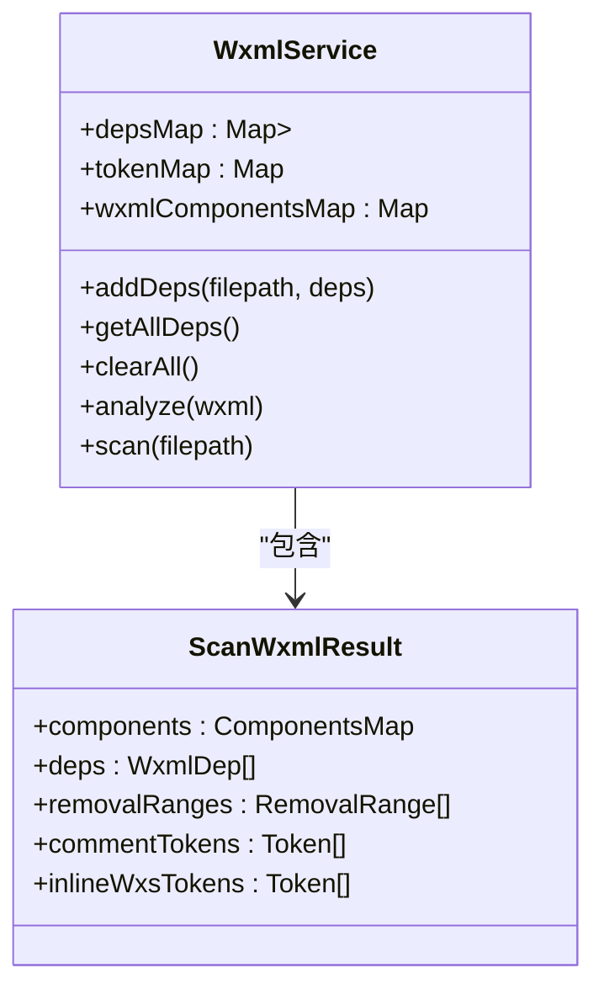
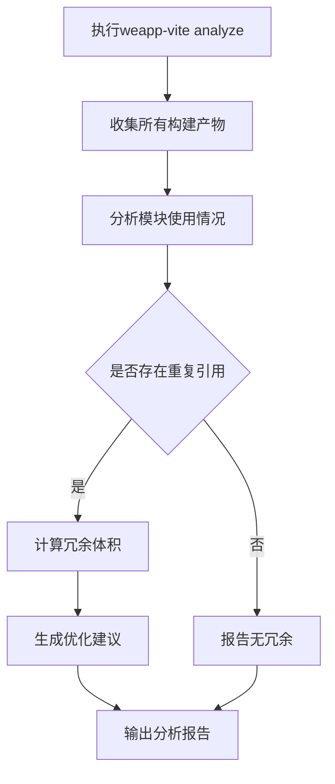

# 静态依赖分析

<cite>
**本文档中引用的文件**  
- [scan.ts](file://packages/weapp-vite/src/wxml/scan.ts)
- [wxmlPlugin.ts](file://packages/weapp-vite/src/runtime/wxmlPlugin.ts)
- [index.ts](file://packages/weapp-vite/src/wxs/index.ts)
- [analyze.ts](file://packages/weapp-vite/src/plugins/utils/analyze.ts)
- [collect.ts](file://packages/rolldown-require/src/collect.ts)
- [shared.ts](file://packages/weapp-vite/src/wxml/shared.ts)
- [deps.test.ts](file://packages/weapp-vite/test/wxml/deps.test.ts)
- [wxml.ts](file://packages/weapp-vite/test/next/wxml.ts)
- [analyze.test.ts](file://packages/weapp-vite/test/analyze.test.ts)
</cite>

## 目录
1. [引言](#引言)
2. [WXML文件依赖解析](#wxml文件依赖解析)
3. [JS/TS文件依赖提取](#jsts文件依赖提取)
4. [JSON文件依赖分析](#json文件依赖分析)
5. [依赖扫描器工作流程](#依赖扫描器工作流程)
6. [条件引用与动态引用处理](#条件引用与动态引用处理)
7. [依赖关系建立与图构建](#依赖关系建立与图构建)
8. [代码与构建优化应用](#代码与构建优化应用)
9. [实际案例分析](#实际案例分析)
10. [总结](#总结)

## 引言

weapp-vite的静态依赖分析功能是其核心构建机制的重要组成部分，通过AST（抽象语法树）解析技术对小程序项目中的WXML、JS/TS和JSON文件进行深度分析，构建完整的依赖图谱。该系统能够准确识别import、require、组件引用、页面引用等多种语法结构，为后续的代码优化和构建优化提供数据基础。本文档将详细阐述这一功能的实现原理和工作机制。

**Section sources**
- [scan.ts](file://packages/weapp-vite/src/wxml/scan.ts#L1-L303)
- [wxmlPlugin.ts](file://packages/weapp-vite/src/runtime/wxmlPlugin.ts#L1-L204)

## WXML文件依赖解析

weapp-vite通过htmlparser2库对WXML文件进行解析，识别其中的依赖引用。系统定义了`srcImportTagsMap`映射表，明确指定了哪些标签的哪些属性包含文件引用，主要包括：

- **wxs标签**：src属性引用WXS文件
- **import标签**：src属性引用其他WXML模板
- **include标签**：src属性包含其他WXML片段

**Diagram sources**
- [shared.ts](file://packages/weapp-vite/src/wxml/shared.ts#L1-L21)
- [wxml.ts](file://packages/weapp-vite/test/next/wxml.ts#L3-L12)

依赖信息以`WxmlDep`接口形式存储，包含标签名、属性名、属性值、位置信息等。对于WXS文件的特殊处理还包括移除lang属性和处理内联WXS代码。

**Section sources**
- [scan.ts](file://packages/weapp-vite/src/wxml/scan.ts#L1-L303)
- [shared.ts](file://packages/weapp-vite/src/wxml/shared.ts#L1-L21)

## JS/TS文件依赖提取

对于JS/TS文件的依赖提取，weapp-vite利用Babel进行AST解析，识别各种模块导入语法。系统能够处理以下几种常见的依赖引入方式：

- **CommonJS风格**：require('module-path')
- **ES模块风格**：import from 'module-path'
- **动态导入**：require.async('module-path')

在WXS文件处理中，`transformWxsCode`函数会遍历AST，当遇到require调用时，会收集其参数作为依赖，并对文件名进行标准化处理。同时，系统还会处理一些特殊语法，如RegExp和Date构造函数的转换。

**Diagram sources**
- [index.ts](file://packages/weapp-vite/src/wxs/index.ts#L39-L58)
- [index.ts](file://packages/weapp-vite/src/wxs/index.ts#L120-L128)

**Section sources**
- [index.ts](file://packages/weapp-vite/src/wxs/index.ts#L1-L140)
- [index.test.ts](file://packages/weapp-vite/test/ast/index.test.ts#L39-L52)

## JSON文件依赖分析

JSON文件的依赖分析主要集中在小程序的配置文件上，如app.json、page.json等。系统通过分析这些配置文件中的特定字段来提取依赖关系：

- **pages字段**：声明页面路径，作为构建入口
- **usingComponents字段**：声明使用的自定义组件
- **subPackages字段**：声明分包结构和页面
- **plugins字段**：声明插件及其导出文件

`analyzeAppJson`函数负责处理app.json文件，提取所有页面、组件和分包的入口文件路径，为构建系统提供完整的入口点列表。

**Diagram sources**
- [analyze.ts](file://packages/weapp-vite/src/plugins/utils/analyze.ts#L28-L62)
- [analyze.test.ts](file://packages/weapp-vite/test/analyze.test.ts#L4-L125)

**Section sources**
- [analyze.ts](file://packages/weapp-vite/src/plugins/utils/analyze.ts#L1-L83)
- [analyze.test.ts](file://packages/weapp-vite/test/analyze.test.ts#L1-L125)

## 依赖扫描器工作流程

weapp-vite的依赖扫描器采用缓存机制和递归扫描策略，确保依赖分析的高效性和准确性。其核心工作流程如下：

1. **初始化服务**：创建WxmlService实例，管理依赖映射、令牌映射和组件映射
2. **文件扫描**：对每个WXML文件进行扫描，提取依赖信息
3. **依赖递归**：对提取的依赖文件进行递归扫描，构建完整的依赖树
4. **缓存管理**：使用LRU缓存存储扫描结果，提高重复构建的效率

`addDeps`函数实现了关键的递归扫描逻辑，当发现新的依赖时，会立即启动对这些依赖文件的扫描，确保整个依赖图的完整性。

**Diagram sources**
- [wxmlPlugin.ts](file://packages/weapp-vite/src/runtime/wxmlPlugin.ts#L28-L37)
- [scan.ts](file://packages/weapp-vite/src/wxml/scan.ts#L115-L300)

**Section sources**
- [wxmlPlugin.ts](file://packages/weapp-vite/src/runtime/wxmlPlugin.ts#L1-L204)
- [scan.ts](file://packages/weapp-vite/src/wxml/scan.ts#L1-L303)

## 条件引用与动态引用处理

weapp-vite的静态依赖分析系统能够处理复杂的条件引用和动态引用场景，确保在各种情况下都能准确提取依赖。

### 条件编译处理

系统支持小程序的条件编译语法，如`#ifdef`和`#endif`。在扫描WXML文件时，会识别这些条件编译标记，并根据当前平台配置决定是否包含相关代码段：

### 动态引用处理

对于动态导入如`require.async`，系统能够识别这种语法并将其作为依赖进行提取。虽然这是运行时动态加载，但在静态分析阶段仍将其视为依赖，确保相关文件被包含在构建输出中。

**Section sources**
- [scan.ts](file://packages/weapp-vite/src/wxml/scan.ts#L244-L264)
- [vite.ts](file://apps/ast/vite.ts#L96-L108)

## 依赖关系建立与图构建

依赖关系的建立是通过多个数据结构协同工作完成的，主要包括：

- **depsMap**：存储文件到其直接依赖的映射关系
- **tokenMap**：存储文件到其扫描结果（包含deps、components等）的映射
- **componentsMap**：存储组件使用关系

`collectReferencedModules`函数从rolldown-require包中引入，用于遍历chunk图，收集所有引用的模块ID，为最终的依赖图构建提供支持。

**Diagram sources**
- [wxmlPlugin.ts](file://packages/weapp-vite/src/runtime/wxmlPlugin.ts#L13-L23)
- [collect.ts](file://packages/rolldown-require/src/collect.ts#L8-L32)

**Section sources**
- [wxmlPlugin.ts](file://packages/weapp-vite/src/runtime/wxmlPlugin.ts#L1-L204)
- [collect.ts](file://packages/rolldown-require/src/collect.ts#L1-L32)

## 代码与构建优化应用

静态依赖分析的结果被广泛应用于代码和构建优化中，主要包括：

### 未使用文件检测

通过分析依赖图，可以识别出项目中存在但未被任何文件引用的"孤儿"文件。这些文件可能是开发过程中遗留的，可以安全删除以减小包体积。

### 冗余引用优化

在分包构建中，静态分析可以帮助识别跨分包的共享模块。通过`analyzeSubpackages`函数，系统能够生成详细的分包报告，包括：

- 各分包包含的文件
- 模块使用情况
- 重复引用的模块

当检测到分包复制共享模块产生的冗余体积超过阈值时，系统会发出警告，建议调整分包划分或运行分析命令定位问题。

**Section sources**
- [core.ts](file://packages/weapp-vite/src/plugins/core.ts#L452-L454)
- [analyze.ts](file://packages/weapp-vite/src/analyze/subpackages.ts#L52-L550)

## 实际案例分析

以一个典型的分包项目为例，静态依赖分析的实际应用流程如下：

1. **入口分析**：从app.json开始，提取所有页面和组件入口
2. **递归扫描**：对每个入口文件进行WXML、JS、JSON的全面扫描
3. **依赖收集**：建立完整的文件依赖关系图
4. **优化决策**：根据依赖图进行代码分割和共享模块提取

例如，在`subpackage-root-util`测试用例中，系统能够正确识别出仅在特定分包中使用的工具函数，并确保它们不会被错误地提升到主包中，从而优化了代码组织和加载性能。

**Section sources**
- [subpackage-root-util.test.ts](file://packages/weapp-vite/test/subpackage-root-util.test.ts#L1-L62)
- [deps.test.ts](file://packages/weapp-vite/test/wxml/deps.test.ts#L1-L44)

## 总结

weapp-vite的静态依赖分析功能通过AST解析技术，实现了对小程序项目中WXML、JS/TS和JSON文件的全面依赖提取。该系统不仅能够准确识别各种语法结构的引用关系，还能处理条件编译和动态导入等复杂场景。构建的依赖图谱为代码优化、构建优化和分包策略提供了坚实的数据基础，有效提升了小程序的开发效率和运行性能。