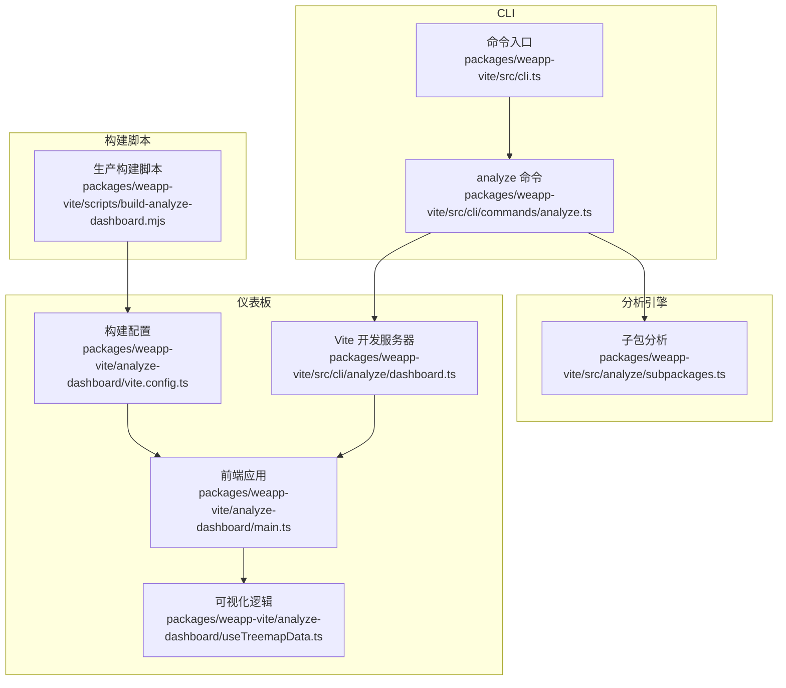
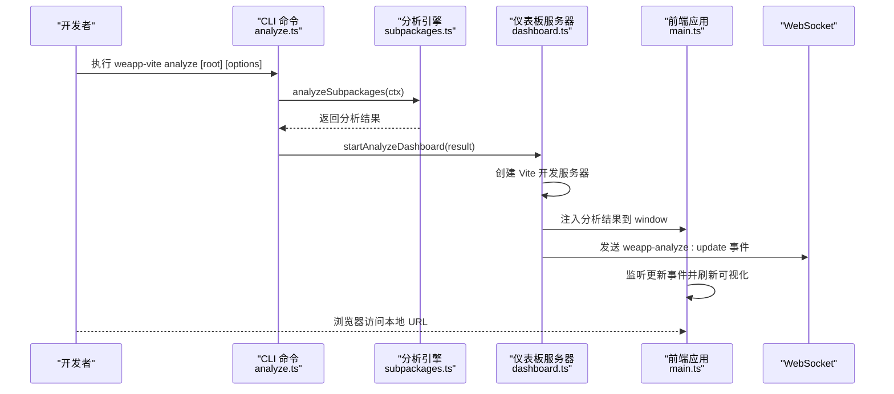
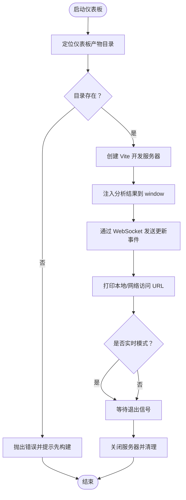
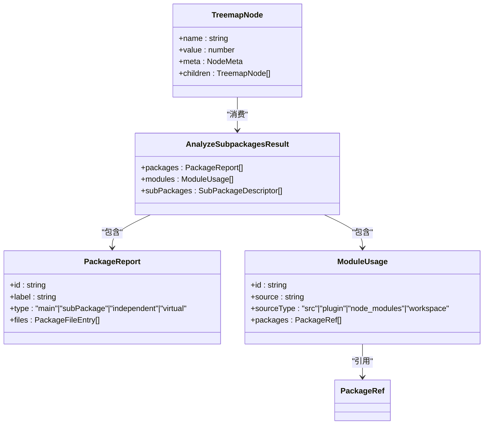
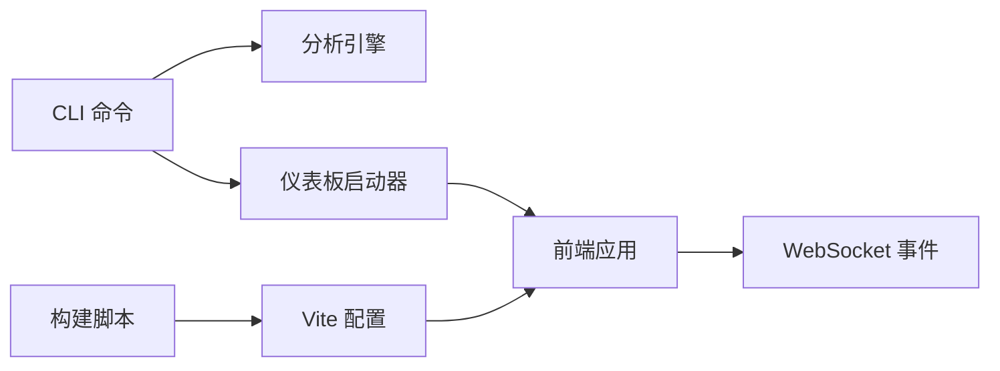
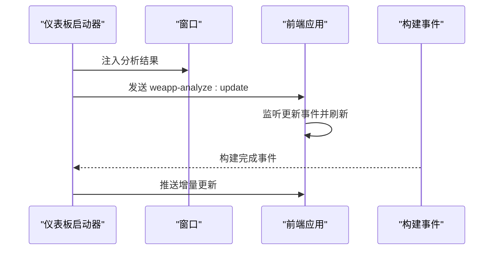

# 使用指南

<cite>
**本文引用的文件**
- [packages/weapp-vite/src/cli.ts](file://packages/weapp-vite/src/cli.ts)
- [packages/weapp-vite/src/cli/commands/analyze.ts](file://packages/weapp-vite/src/cli/commands/analyze.ts)
- [packages/weapp-vite/src/cli/analyze/dashboard.ts](file://packages/weapp-vite/src/cli/analyze/dashboard.ts)
- [packages/weapp-vite/src/analyze/subpackages.ts](file://packages/weapp-vite/src/analyze/subpackages.ts)
- [packages/weapp-vite/analyze-dashboard/vite.config.ts](file://packages/weapp-vite/analyze-dashboard/vite.config.ts)
- [packages/weapp-vite/analyze-dashboard/main.ts](file://packages/weapp-vite/analyze-dashboard/main.ts)
- [packages/weapp-vite/analyze-dashboard/useTreemapData.ts](file://packages/weapp-vite/analyze-dashboard/useTreemapData.ts)
- [packages/weapp-vite/analyze-dashboard/mock-data.ts](file://packages/weapp-vite/analyze-dashboard/mock-data.ts)
- [packages/weapp-vite/scripts/build-analyze-dashboard.mjs](file://packages/weapp-vite/scripts/build-analyze-dashboard.mjs)
- [packages/weapp-vite/package.json](file://packages/weapp-vite/package.json)
- [packages/weapp-vite/src/packagePaths.ts](file://packages/weapp-vite/src/packagePaths.ts)
- [packages/weapp-vite/src/cli/commands/build.ts](file://packages/weapp-vite/src/cli/commands/build.ts)
- [packages/weapp-vite/src/cli/commands/serve.ts](file://packages/weapp-vite/src/cli/commands/serve.ts)
</cite>

## 目录
1. [简介](#简介)
2. [项目结构](#项目结构)
3. [核心组件](#核心组件)
4. [架构总览](#架构总览)
5. [详细组件分析](#详细组件分析)
6. [依赖关系分析](#依赖关系分析)
7. [性能考虑](#性能考虑)
8. [故障排查指南](#故障排查指南)
9. [结论](#结论)
10. [附录](#附录)

## 简介
本指南面向使用 weapp-vite 的开发者，系统讲解如何通过 weapp-vite analyze 命令启动分包分析仪表板，涵盖命令行参数、启动流程、访问方式、CI/CD 集成、仪表板初始化生命周期以及常见问题处理。仪表板以 Treemap 可视化展示主包、分包与源码模块的映射关系，帮助识别包体结构与跨包复用情况。

## 项目结构
weapp-vite 分析仪表板由 CLI 命令、分析引擎、Vite 开发服务器与 Vue 前端组成：
- CLI 层：解析命令与参数，触发分析并启动仪表板。
- 分析层：基于构建输出统计包体、模块与跨包复用信息。
- 仪表板前端：Vue 应用，使用 ECharts Treemap 渲染可视化。
- 构建脚本：生产构建仪表板静态资源，供 CLI 启动时使用。

图表来源
- [packages/weapp-vite/src/cli.ts](file://packages/weapp-vite/src/cli.ts#L1-L50)
- [packages/weapp-vite/src/cli/commands/analyze.ts](file://packages/weapp-vite/src/cli/commands/analyze.ts#L76-L136)
- [packages/weapp-vite/src/analyze/subpackages.ts](file://packages/weapp-vite/src/analyze/subpackages.ts#L539-L601)
- [packages/weapp-vite/src/cli/analyze/dashboard.ts](file://packages/weapp-vite/src/cli/analyze/dashboard.ts#L88-L172)
- [packages/weapp-vite/analyze-dashboard/main.ts](file://packages/weapp-vite/analyze-dashboard/main.ts#L1-L35)
- [packages/weapp-vite/analyze-dashboard/useTreemapData.ts](file://packages/weapp-vite/analyze-dashboard/useTreemapData.ts#L164-L360)
- [packages/weapp-vite/analyze-dashboard/vite.config.ts](file://packages/weapp-vite/analyze-dashboard/vite.config.ts#L1-L53)
- [packages/weapp-vite/scripts/build-analyze-dashboard.mjs](file://packages/weapp-vite/scripts/build-analyze-dashboard.mjs#L1-L22)

章节来源
- [packages/weapp-vite/src/cli.ts](file://packages/weapp-vite/src/cli.ts#L1-L50)
- [packages/weapp-vite/src/cli/commands/analyze.ts](file://packages/weapp-vite/src/cli/commands/analyze.ts#L76-L136)
- [packages/weapp-vite/src/analyze/subpackages.ts](file://packages/weapp-vite/src/analyze/subpackages.ts#L539-L601)
- [packages/weapp-vite/src/cli/analyze/dashboard.ts](file://packages/weapp-vite/src/cli/analyze/dashboard.ts#L88-L172)
- [packages/weapp-vite/analyze-dashboard/vite.config.ts](file://packages/weapp-vite/analyze-dashboard/vite.config.ts#L1-L53)
- [packages/weapp-vite/scripts/build-analyze-dashboard.mjs](file://packages/weapp-vite/scripts/build-analyze-dashboard.mjs#L1-L22)

## 核心组件
- 命令入口与参数解析：注册 analyze 子命令，支持平台选择、输出 JSON、输出文件等选项。
- 分析引擎：扫描项目、构建输出，统计包体、模块与跨包复用，生成标准化结果。
- 仪表板启动器：创建 Vite 开发服务器，注入分析结果，提供热更新与退出控制。
- 前端可视化：根据分析结果生成 Treemap 数据，展示包体、文件、模块与资源的层级关系。
- 生产构建脚本：将前端资源构建到模块目录，供 CLI 在非开发环境下使用。

章节来源
- [packages/weapp-vite/src/cli/commands/analyze.ts](file://packages/weapp-vite/src/cli/commands/analyze.ts#L76-L136)
- [packages/weapp-vite/src/analyze/subpackages.ts](file://packages/weapp-vite/src/analyze/subpackages.ts#L539-L601)
- [packages/weapp-vite/src/cli/analyze/dashboard.ts](file://packages/weapp-vite/src/cli/analyze/dashboard.ts#L88-L172)
- [packages/weapp-vite/analyze-dashboard/main.ts](file://packages/weapp-vite/analyze-dashboard/main.ts#L1-L35)
- [packages/weapp-vite/analyze-dashboard/useTreemapData.ts](file://packages/weapp-vite/analyze-dashboard/useTreemapData.ts#L164-L360)
- [packages/weapp-vite/scripts/build-analyze-dashboard.mjs](file://packages/weapp-vite/scripts/build-analyze-dashboard.mjs#L1-L22)

## 架构总览
从启动到可视化的完整链路如下：

图表来源
- [packages/weapp-vite/src/cli/commands/analyze.ts](file://packages/weapp-vite/src/cli/commands/analyze.ts#L76-L136)
- [packages/weapp-vite/src/analyze/subpackages.ts](file://packages/weapp-vite/src/analyze/subpackages.ts#L539-L601)
- [packages/weapp-vite/src/cli/analyze/dashboard.ts](file://packages/weapp-vite/src/cli/analyze/dashboard.ts#L88-L172)
- [packages/weapp-vite/analyze-dashboard/main.ts](file://packages/weapp-vite/analyze-dashboard/main.ts#L1-L35)

## 详细组件分析

### 命令行参数与启动流程
- 基础命令：weapp-vite analyze [root]，支持以下关键选项：
  - --json：以 JSON 形式输出结果，不启动仪表板。
  - --output <file>：将分析结果写入指定文件（JSON）。
  - -p, --platform <platform>：目标平台，必须为 weapp。
- 启动流程：
  - 解析配置与运行目标，校验平台为小程序。
  - 创建编译上下文，调用分析引擎获取结果。
  - 若未选择 --json，则打印摘要并启动仪表板服务器。
  - 仪表板服务器监听端口，打印本地与网络访问地址，支持 Ctrl+C 优雅退出。

章节来源
- [packages/weapp-vite/src/cli/commands/analyze.ts](file://packages/weapp-vite/src/cli/commands/analyze.ts#L76-L136)
- [packages/weapp-vite/src/cli.ts](file://packages/weapp-vite/src/cli.ts#L1-L50)

### 分析引擎工作原理
- 输入：项目配置、扫描服务、构建服务。
- 步骤：
  - 加载应用入口与分包元数据。
  - 基于构建配置进行一次无写入的构建，收集主包与独立分包的输出。
  - 统计每个包的产物（chunk 与 asset），记录模块来源与体积。
  - 识别跨包复用模块，汇总为标准结果对象。
- 输出：包含 packages、modules、subPackages 三部分的数据结构，供前端渲染。

章节来源
- [packages/weapp-vite/src/analyze/subpackages.ts](file://packages/weapp-vite/src/analyze/subpackages.ts#L539-L601)

### 仪表板启动器与生命周期
- 仪表板启动器负责：
  - 定位构建产物目录（需先执行生产构建）。
  - 创建 Vite 开发服务器（SPA 模式），注入分析结果到 window 全局。
  - 通过 WebSocket 推送更新事件，前端监听后刷新可视化。
  - 提供 update/close/waitForExit 等接口，支持实时模式与退出控制。
- 生命周期要点：
  - 初始化：注入初始分析结果，发送一次更新事件。
  - 实时模式：在 serve/build 命令中可启用 watch，构建完成后自动推送增量更新。
  - 退出：监听 SIGINT/SIGTERM 与服务器关闭事件，确保资源清理。

图表来源
- [packages/weapp-vite/src/cli/analyze/dashboard.ts](file://packages/weapp-vite/src/cli/analyze/dashboard.ts#L88-L172)
- [packages/weapp-vite/src/packagePaths.ts](file://packages/weapp-vite/src/packagePaths.ts#L1-L24)

章节来源
- [packages/weapp-vite/src/cli/analyze/dashboard.ts](file://packages/weapp-vite/src/cli/analyze/dashboard.ts#L88-L172)
- [packages/weapp-vite/src/packagePaths.ts](file://packages/weapp-vite/src/packagePaths.ts#L1-L24)

### 前端可视化与数据处理
- 数据来源：window.__WEAPP_VITE_ANALYZE_RESULT__，由仪表板启动器注入。
- 数据处理：
  - useTreemapData 将分析结果转换为 Treemap 节点树，计算包体、文件、模块与资源的层级关系。
  - 支持跨包复用统计、体积格式化、提示框内容生成。
- 视图渲染：
  - 使用 ECharts Treemap，按包类型设置颜色与阴影，支持缩放与层级标签。
  - 响应式更新：前端监听 weapp-analyze:update 事件，触发重新计算与渲染。

图表来源
- [packages/weapp-vite/src/analyze/subpackages.ts](file://packages/weapp-vite/src/analyze/subpackages.ts#L52-L110)
- [packages/weapp-vite/analyze-dashboard/useTreemapData.ts](file://packages/weapp-vite/analyze-dashboard/useTreemapData.ts#L164-L360)

章节来源
- [packages/weapp-vite/analyze-dashboard/main.ts](file://packages/weapp-vite/analyze-dashboard/main.ts#L1-L35)
- [packages/weapp-vite/analyze-dashboard/useTreemapData.ts](file://packages/weapp-vite/analyze-dashboard/useTreemapData.ts#L164-L360)

### 访问方式与端口行为
- 默认监听地址：127.0.0.1，端口随机（0），Vite 自动分配可用端口。
- 启动后会打印本地与网络访问 URL，开发者可直接打开浏览器访问。
- 退出：Ctrl+C 或收到 SIGINT/SIGTERM 信号后优雅关闭。

章节来源
- [packages/weapp-vite/src/cli/analyze/dashboard.ts](file://packages/weapp-vite/src/cli/analyze/dashboard.ts#L103-L129)

### CI/CD 集成建议
- 本地开发环境（实时模式）：
  - 在 serve/build 命令中启用 --analyze，即可在构建完成后自动启动仪表板并持续监听变更。
  - 参考命令实现中的实时更新逻辑，确保每次构建结束后推送最新分析结果。
- 生产环境或 CI：
  - 先执行生产构建仪表板资源，再运行 analyze 命令，仪表板将从构建产物目录启动。
  - 可通过 --json 或 --output 将结果导出到文件，便于后续报告或归档。

章节来源
- [packages/weapp-vite/src/cli/commands/build.ts](file://packages/weapp-vite/src/cli/commands/build.ts#L41-L79)
- [packages/weapp-vite/src/cli/commands/serve.ts](file://packages/weapp-vite/src/cli/commands/serve.ts#L49-L98)
- [packages/weapp-vite/scripts/build-analyze-dashboard.mjs](file://packages/weapp-vite/scripts/build-analyze-dashboard.mjs#L1-L22)

## 依赖关系分析
- CLI 与分析引擎：analyze 命令依赖分析引擎生成结果。
- 仪表板启动器：依赖分析结果与构建产物目录。
- 前端应用：依赖分析结果与 WebSocket 更新事件。
- 构建脚本：依赖 Vite，输出到模块目录供启动器使用。

图表来源
- [packages/weapp-vite/src/cli/commands/analyze.ts](file://packages/weapp-vite/src/cli/commands/analyze.ts#L76-L136)
- [packages/weapp-vite/src/cli/analyze/dashboard.ts](file://packages/weapp-vite/src/cli/analyze/dashboard.ts#L88-L172)
- [packages/weapp-vite/analyze-dashboard/vite.config.ts](file://packages/weapp-vite/analyze-dashboard/vite.config.ts#L1-L53)
- [packages/weapp-vite/scripts/build-analyze-dashboard.mjs](file://packages/weapp-vite/scripts/build-analyze-dashboard.mjs#L1-L22)

章节来源
- [packages/weapp-vite/src/cli/commands/analyze.ts](file://packages/weapp-vite/src/cli/commands/analyze.ts#L76-L136)
- [packages/weapp-vite/src/cli/analyze/dashboard.ts](file://packages/weapp-vite/src/cli/analyze/dashboard.ts#L88-L172)
- [packages/weapp-vite/analyze-dashboard/vite.config.ts](file://packages/weapp-vite/analyze-dashboard/vite.config.ts#L1-L53)
- [packages/weapp-vite/scripts/build-analyze-dashboard.mjs](file://packages/weapp-vite/scripts/build-analyze-dashboard.mjs#L1-L22)

## 性能考虑
- 仪表板构建优化：前端构建配置对 vendor 分组与文件命名进行了优化，减少体积警告阈值，提升加载体验。
- 实时模式：在 serve/build 中启用 --analyze 时，构建完成后会推送增量更新，避免重复全量分析。
- 数据体量：当模块数量较多时，Treemap 渲染可能受 DOM 与 JS 运算影响，建议在 CI 中优先使用 --json 导出结果，再离线查看。

章节来源
- [packages/weapp-vite/analyze-dashboard/vite.config.ts](file://packages/weapp-vite/analyze-dashboard/vite.config.ts#L20-L53)
- [packages/weapp-vite/src/cli/commands/build.ts](file://packages/weapp-vite/src/cli/commands/build.ts#L41-L79)
- [packages/weapp-vite/src/cli/commands/serve.ts](file://packages/weapp-vite/src/cli/commands/serve.ts#L49-L98)

## 故障排查指南
- 未找到仪表板产物
  - 现象：启动仪表板时报错，提示需要先构建。
  - 处理：执行生产构建脚本生成仪表板静态资源后再启动。
  - 参考：仪表板启动器在找不到产物目录时抛出明确错误。
- 端口冲突或无法访问
  - 现象：端口被占用或网络受限导致无法访问。
  - 处理：默认使用随机端口，确保防火墙放行；若需固定端口，可在自定义 Vite 配置中调整（当前启动器使用默认端口策略）。
- 数据加载失败
  - 现象：分析结果为空或异常。
  - 处理：确认项目已正确配置、平台选择为 weapp、构建成功；必要时使用 --json 输出结果进行诊断。
- 退出与清理
  - 现象：终端无法正常退出。
  - 处理：使用 Ctrl+C 或发送 SIGINT/SIGTERM 信号；仪表板启动器会监听并优雅关闭服务器。

章节来源
- [packages/weapp-vite/src/cli/analyze/dashboard.ts](file://packages/weapp-vite/src/cli/analyze/dashboard.ts#L11-L20)
- [packages/weapp-vite/src/cli/commands/analyze.ts](file://packages/weapp-vite/src/cli/commands/analyze.ts#L76-L136)

## 结论
weapp-vite 的分析仪表板通过 CLI 命令驱动，结合分析引擎与前端可视化，为开发者提供了直观的包体与模块分布视图。通过生产构建与实时模式，既能满足本地开发的即时反馈，也能在 CI/CD 中稳定输出分析结果。遇到问题时，可依据本文的参数说明、启动流程与故障排查建议快速定位并解决。

## 附录

### 命令与参数速查
- weapp-vite analyze [root]
  - --json：以 JSON 输出结果，不启动仪表板。
  - --output <file>：将分析结果写入指定文件（JSON）。
  - -p, --platform <platform>：目标平台，必须为 weapp。

章节来源
- [packages/weapp-vite/src/cli/commands/analyze.ts](file://packages/weapp-vite/src/cli/commands/analyze.ts#L76-L136)

### 仪表板初始化生命周期（代码级）
- 初始化阶段：注入分析结果到 window，首次推送更新事件。
- 实时阶段：监听构建事件，推送增量更新。
- 退出阶段：监听进程信号与服务器关闭事件，执行清理。

图表来源
- [packages/weapp-vite/src/cli/analyze/dashboard.ts](file://packages/weapp-vite/src/cli/analyze/dashboard.ts#L120-L157)
- [packages/weapp-vite/analyze-dashboard/main.ts](file://packages/weapp-vite/analyze-dashboard/main.ts#L1-L35)