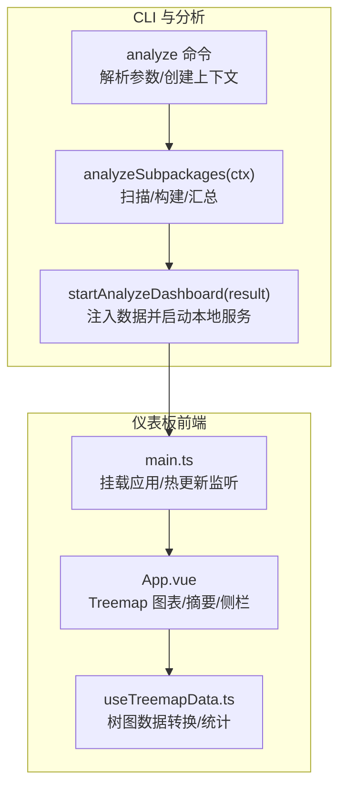
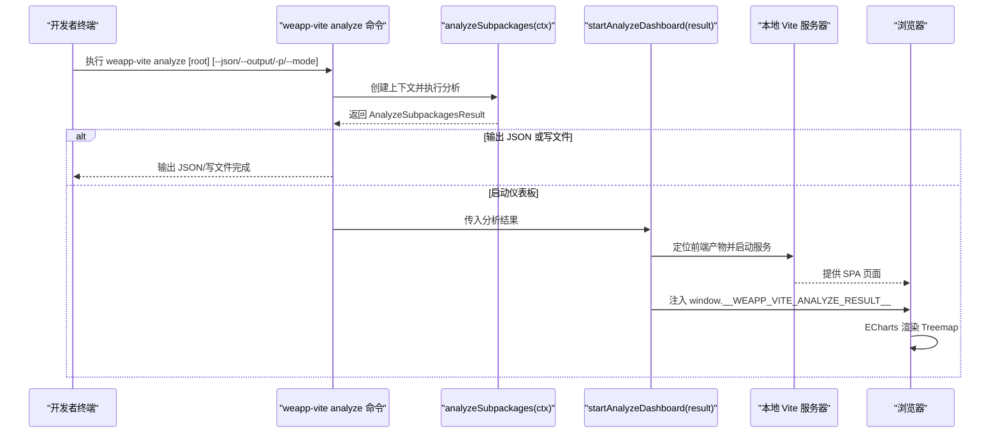
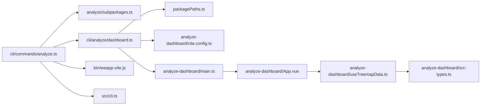

# 分析仪表板

<cite>
**本文引用的文件列表**
- [packages/weapp-vite/src/cli/commands/analyze.ts](file://packages/weapp-vite/src/cli/commands/analyze.ts)
- [packages/weapp-vite/src/cli/analyze/dashboard.ts](file://packages/weapp-vite/src/cli/analyze/dashboard.ts)
- [packages/weapp-vite/src/analyze/subpackages.ts](file://packages/weapp-vite/src/analyze/subpackages.ts)
- [packages/weapp-vite/src/packagePaths.ts](file://packages/weapp-vite/src/packagePaths.ts)
- [packages/weapp-vite/analyze-dashboard/main.ts](file://packages/weapp-vite/analyze-dashboard/main.ts)
- [packages/weapp-vite/analyze-dashboard/App.vue](file://packages/weapp-vite/analyze-dashboard/App.vue)
- [packages/weapp-vite/analyze-dashboard/useTreemapData.ts](file://packages/weapp-vite/analyze-dashboard/useTreemapData.ts)
- [packages/weapp-vite/analyze-dashboard/mock-data.ts](file://packages/weapp-vite/analyze-dashboard/mock-data.ts)
- [packages/weapp-vite/analyze-dashboard/vite.config.ts](file://packages/weapp-vite/analyze-dashboard/vite.config.ts)
- [packages/weapp-vite/scripts/build-analyze-dashboard.mjs](file://packages/weapp-vite/scripts/build-analyze-dashboard.mjs)
- [packages/weapp-vite/bin/weapp-vite.js](file://packages/weapp-vite/bin/weapp-vite.js)
- [packages/weapp-vite/src/cli.ts](file://packages/weapp-vite/src/cli.ts)
</cite>

## 目录
1. [简介](#简介)
2. [项目结构](#项目结构)
3. [核心组件](#核心组件)
4. [架构总览](#架构总览)
5. [组件详解](#组件详解)
6. [依赖关系分析](#依赖关系分析)
7. [性能考量](#性能考量)
8. [故障排查指南](#故障排查指南)
9. [结论](#结论)
10. [附录](#附录)

## 简介
本章节面向开发者，系统性讲解 weapp-vite 的“分析仪表板”能力：如何通过 weapp-vite analyze 命令启动本地可视化分析服务，如何在浏览器中查看主包/分包的模块映射、跨包复用、资源体量等关键指标，并基于这些指标优化分包策略与资源加载。文档同时给出命令参数说明、启动流程、指标解读方法与优化建议，并通过真实案例演示如何利用仪表板定位并解决构建性能问题。

## 项目结构
分析仪表板由两部分组成：
- CLI 分析命令与仪表板服务：负责收集构建产物、汇总模块与包体信息，并以本地 Vite 服务器提供可视化界面。
- 可视化前端（Vue + ECharts）：负责 Treemap 展示、统计摘要、跨包复用模块列表等。

图表来源
- [packages/weapp-vite/src/cli/commands/analyze.ts](file://packages/weapp-vite/src/cli/commands/analyze.ts#L76-L136)
- [packages/weapp-vite/src/analyze/subpackages.ts](file://packages/weapp-vite/src/analyze/subpackages.ts#L539-L601)
- [packages/weapp-vite/src/cli/analyze/dashboard.ts](file://packages/weapp-vite/src/cli/analyze/dashboard.ts#L88-L173)
- [packages/weapp-vite/analyze-dashboard/main.ts](file://packages/weapp-vite/analyze-dashboard/main.ts#L1-L36)
- [packages/weapp-vite/analyze-dashboard/App.vue](file://packages/weapp-vite/analyze-dashboard/App.vue#L1-L147)
- [packages/weapp-vite/analyze-dashboard/useTreemapData.ts](file://packages/weapp-vite/analyze-dashboard/useTreemapData.ts#L164-L360)

章节来源
- [packages/weapp-vite/src/cli/commands/analyze.ts](file://packages/weapp-vite/src/cli/commands/analyze.ts#L76-L136)
- [packages/weapp-vite/src/cli/analyze/dashboard.ts](file://packages/weapp-vite/src/cli/analyze/dashboard.ts#L88-L173)
- [packages/weapp-vite/analyze-dashboard/vite.config.ts](file://packages/weapp-vite/analyze-dashboard/vite.config.ts#L1-L53)

## 核心组件
- CLI 分析命令：解析参数、创建编译上下文、调用分析函数、输出摘要或启动仪表板。
- 分析引擎：扫描子包配置、执行构建、汇总包体、模块来源与跨包复用信息。
- 仪表板服务：定位已构建的前端产物，注入分析数据并通过 WebSocket 实时推送更新。
- 前端可视化：基于 ECharts 的 Treemap 展示包体结构，右侧显示跨包复用模块 Top 列表与摘要统计。

章节来源
- [packages/weapp-vite/src/cli/commands/analyze.ts](file://packages/weapp-vite/src/cli/commands/analyze.ts#L1-L136)
- [packages/weapp-vite/src/analyze/subpackages.ts](file://packages/weapp-vite/src/analyze/subpackages.ts#L1-L601)
- [packages/weapp-vite/src/cli/analyze/dashboard.ts](file://packages/weapp-vite/src/cli/analyze/dashboard.ts#L1-L173)
- [packages/weapp-vite/analyze-dashboard/App.vue](file://packages/weapp-vite/analyze-dashboard/App.vue#L1-L147)
- [packages/weapp-vite/analyze-dashboard/useTreemapData.ts](file://packages/weapp-vite/analyze-dashboard/useTreemapData.ts#L1-L360)

## 架构总览
下图展示了从命令行到浏览器可视化的完整链路，以及前后端数据流。

图表来源
- [packages/weapp-vite/src/cli/commands/analyze.ts](file://packages/weapp-vite/src/cli/commands/analyze.ts#L76-L136)
- [packages/weapp-vite/src/analyze/subpackages.ts](file://packages/weapp-vite/src/analyze/subpackages.ts#L539-L601)
- [packages/weapp-vite/src/cli/analyze/dashboard.ts](file://packages/weapp-vite/src/cli/analyze/dashboard.ts#L88-L173)

## 组件详解

### CLI 分析命令与参数
- 命令入口与注册：CLI 主程序注册 analyze 子命令，并在解析后调用命令处理器。
- 参数解析：
  - --json：输出 JSON 格式的分析结果到标准输出。
  - --output <file>：将分析结果写入指定文件（绝对或相对路径）。
  - -p, --platform <platform>：目标平台（当前仅支持 weapp）。
  - --mode：构建模式（默认 production）。
- 行为逻辑：
  - 解析配置与运行目标，校验平台。
  - 创建编译上下文，执行分析，得到结果。
  - 若指定了 --json 或 --output，则输出/写文件；否则打印摘要并启动仪表板服务。

章节来源
- [packages/weapp-vite/src/cli.ts](file://packages/weapp-vite/src/cli.ts#L1-L49)
- [packages/weapp-vite/src/cli/commands/analyze.ts](file://packages/weapp-vite/src/cli/commands/analyze.ts#L76-L136)

### 分析引擎：包体与模块映射
- 输入：编译上下文（包含配置、扫描、构建服务）。
- 关键职责：
  - 扫描主包与子包配置，建立包分类上下文。
  - 执行构建（主包与独立分包），收集输出（chunks 与 assets）。
  - 遍历输出，按包体维度聚合文件条目，记录每个模块的来源类型与所在包。
  - 计算跨包复用：统计模块出现在多个包中的次数与文件位置。
  - 生成统一结果结构 AnalyzeSubpackagesResult，包含 packages、modules、subPackages 三部分。

章节来源
- [packages/weapp-vite/src/analyze/subpackages.ts](file://packages/weapp-vite/src/analyze/subpackages.ts#L1-L601)

### 仪表板服务：本地 Vite 服务器
- 产物定位：根据包根目录定位已构建的仪表板前端目录，若不存在则提示先构建。
- 数据注入：通过 transformIndexHtml 插件在页面头部注入全局变量，承载分析结果。
- 本地服务：创建 Vite 开发服务器（SPA），打印可访问 URL。
- 实时更新：通过 WebSocket 发送自定义事件，前端监听并刷新数据。

章节来源
- [packages/weapp-vite/src/packagePaths.ts](file://packages/weapp-vite/src/packagePaths.ts#L1-L24)
- [packages/weapp-vite/src/cli/analyze/dashboard.ts](file://packages/weapp-vite/src/cli/analyze/dashboard.ts#L1-L173)

### 前端可视化：Treemap 与摘要
- Treemap 图表：基于 ECharts treemap，按包体层级展开，节点元信息包含模块来源、体积、跨包复用次数等。
- 摘要统计：包体数量、源码模块数、跨包复用数、总产物体积。
- 侧栏“跨包复用模块 TOP N”：按复用次数排序，列出模块来源与所在包。
- 实时更新：前端监听窗口事件，接收新数据并重新渲染。

章节来源
- [packages/weapp-vite/analyze-dashboard/App.vue](file://packages/weapp-vite/analyze-dashboard/App.vue#L1-L147)
- [packages/weapp-vite/analyze-dashboard/useTreemapData.ts](file://packages/weapp-vite/analyze-dashboard/useTreemapData.ts#L164-L360)

### 仪表板构建与打包
- 仪表板前端通过独立的 Vite 配置进行构建，输出到包内 modules/analyze-dashboard 目录。
- 构建脚本：读取仪表板目录下的 vite.config.ts，以生产模式执行构建。

章节来源
- [packages/weapp-vite/analyze-dashboard/vite.config.ts](file://packages/weapp-vite/analyze-dashboard/vite.config.ts#L1-L53)
- [packages/weapp-vite/scripts/build-analyze-dashboard.mjs](file://packages/weapp-vite/scripts/build-analyze-dashboard.mjs#L1-L22)

## 依赖关系分析

图表来源
- [packages/weapp-vite/src/cli/commands/analyze.ts](file://packages/weapp-vite/src/cli/commands/analyze.ts#L1-L136)
- [packages/weapp-vite/src/analyze/subpackages.ts](file://packages/weapp-vite/src/analyze/subpackages.ts#L1-L601)
- [packages/weapp-vite/src/cli/analyze/dashboard.ts](file://packages/weapp-vite/src/cli/analyze/dashboard.ts#L1-L173)
- [packages/weapp-vite/src/packagePaths.ts](file://packages/weapp-vite/src/packagePaths.ts#L1-L24)
- [packages/weapp-vite/analyze-dashboard/vite.config.ts](file://packages/weapp-vite/analyze-dashboard/vite.config.ts#L1-L53)
- [packages/weapp-vite/analyze-dashboard/main.ts](file://packages/weapp-vite/analyze-dashboard/main.ts#L1-L36)
- [packages/weapp-vite/analyze-dashboard/App.vue](file://packages/weapp-vite/analyze-dashboard/App.vue#L1-L147)
- [packages/weapp-vite/analyze-dashboard/useTreemapData.ts](file://packages/weapp-vite/analyze-dashboard/useTreemapData.ts#L1-L360)
- [packages/weapp-vite/bin/weapp-vite.js](file://packages/weapp-vite/bin/weapp-vite.js#L1-L3)
- [packages/weapp-vite/src/cli.ts](file://packages/weapp-vite/src/cli.ts#L1-L49)

## 性能考量
- Treemap 展示粒度：通过 useTreemapData 将模块与资产映射为树节点，节点值采用模块体积或原始体积，确保大模块优先凸显。
- 跨包复用识别：对模块出现在多个包的情况计数，帮助识别重复依赖与冗余代码。
- 体积单位换算：提供格式化函数，便于直观对比不同包体规模。
- 构建产物分组：仪表板构建配置对 vendor、echarts、vue 等进行预分组，有助于识别第三方库体积占比。

章节来源
- [packages/weapp-vite/analyze-dashboard/useTreemapData.ts](file://packages/weapp-vite/analyze-dashboard/useTreemapData.ts#L104-L163)
- [packages/weapp-vite/analyze-dashboard/vite.config.ts](file://packages/weapp-vite/analyze-dashboard/vite.config.ts#L20-L51)

## 故障排查指南
- 未找到仪表板产物
  - 现象：启动仪表板时报错，提示需先构建仪表板。
  - 处理：执行构建脚本生成前端产物后再启动。
  - 参考
    - [packages/weapp-vite/src/cli/analyze/dashboard.ts](file://packages/weapp-vite/src/cli/analyze/dashboard.ts#L11-L20)
    - [packages/weapp-vite/scripts/build-analyze-dashboard.mjs](file://packages/weapp-vite/scripts/build-analyze-dashboard.mjs#L1-L22)
- 未检测到分析数据
  - 现象：浏览器打开仪表板报错，提示未检测到分析数据。
  - 处理：确认命令已成功返回结果并注入到页面全局变量。
  - 参考
    - [packages/weapp-vite/analyze-dashboard/App.vue](file://packages/weapp-vite/analyze-dashboard/App.vue#L19-L27)
    - [packages/weapp-vite/analyze-dashboard/main.ts](file://packages/weapp-vite/analyze-dashboard/main.ts#L5-L10)
- 无法访问本地服务
  - 现象：控制台打印了 URL 但浏览器无法打开。
  - 处理：检查端口占用、防火墙设置；确认网络主机地址可访问。
  - 参考
    - [packages/weapp-vite/src/cli/analyze/dashboard.ts](file://packages/weapp-vite/src/cli/analyze/dashboard.ts#L116-L129)
- 无跨包复用模块
  - 现象：侧栏为空。
  - 处理：这是正常现象，说明模块复用良好；如需进一步优化，可结合模块体积与来源类型分析。
  - 参考
    - [packages/weapp-vite/analyze-dashboard/App.vue](file://packages/weapp-vite/analyze-dashboard/App.vue#L120-L144)
    - [packages/weapp-vite/analyze-dashboard/useTreemapData.ts](file://packages/weapp-vite/analyze-dashboard/useTreemapData.ts#L196-L213)

## 结论
weapp-vite 分析仪表板通过 CLI 命令与本地 Vite 服务，将复杂的包体与模块映射转化为直观的 Treemap 图表与摘要统计，帮助开发者快速识别大型依赖、跨包复用与冗余代码，从而优化分包策略与资源加载。配合 JSON 输出与写文件能力，可在 CI 或自动化流程中持续监控构建体积变化。

## 附录

### 使用步骤（从启动到访问）
- 步骤一：构建仪表板前端
  - 在 weapp-vite 包内执行构建脚本，生成 modules/analyze-dashboard 前端产物。
  - 参考
    - [packages/weapp-vite/scripts/build-analyze-dashboard.mjs](file://packages/weapp-vite/scripts/build-analyze-dashboard.mjs#L1-L22)
- 步骤二：启动分析服务
  - 在项目根目录执行 weapp-vite analyze 命令，默认进入仪表板模式。
  - 可选参数：
    - --json：直接输出 JSON 到标准输出。
    - --output <file>：将 JSON 写入文件。
    - -p/--platform weapp：指定目标平台。
    - --mode：构建模式（默认 production）。
  - 参考
    - [packages/weapp-vite/src/cli/commands/analyze.ts](file://packages/weapp-vite/src/cli/commands/analyze.ts#L76-L136)
- 步骤三：访问 Web 界面
  - 仪表板启动后会打印本地与网络可用的访问地址，打开任一 URL 即可查看。
  - 参考
    - [packages/weapp-vite/src/cli/analyze/dashboard.ts](file://packages/weapp-vite/src/cli/analyze/dashboard.ts#L116-L129)

### 可视化指标与解读
- 包体数量：主包、分包、独立分包、共享虚拟包的数量。
- 源码模块：参与构建的源码模块总数。
- 跨包复用：模块出现在多个包中的次数与涉及包体。
- 总产物：所有产物体积总和。
- Treemap 层级：
  - 顶层：包体（主包/分包/独立分包/共享虚拟包）。
  - 中层：包内文件（chunk/asset）。
  - 底层：模块或资源，节点值为体积，鼠标悬停可查看来源类型与跨包复用次数。
- 侧栏“跨包复用模块 TOP N”：优先展示复用次数最多的模块，便于定位重复依赖与冗余代码。

章节来源
- [packages/weapp-vite/analyze-dashboard/App.vue](file://packages/weapp-vite/analyze-dashboard/App.vue#L73-L147)
- [packages/weapp-vite/analyze-dashboard/useTreemapData.ts](file://packages/weapp-vite/analyze-dashboard/useTreemapData.ts#L164-L360)

### 优化建议（基于仪表板洞察）
- 识别大型依赖包
  - 在 Treemap 中关注体积较大的模块或资源，优先考虑拆分为独立 chunk 或移出 node_modules。
- 减少跨包复用
  - 对于跨包复用次数高的模块，评估是否可放入共享虚拟包或调整分包边界，避免重复下载。
- 优化分包策略
  - 将高频但体量小的模块集中到主包，减少首屏加载；将低频模块放入对应分包。
- 控制第三方库体积
  - 通过构建分组策略（如 vendor、echarts、vue）识别大体量依赖，评估按需引入与替代方案。

### 实际案例：利用仪表板发现并解决构建性能问题
- 场景：某分包中出现大量重复模块，导致二次下载与体积膨胀。
- 步骤：
  - 运行 weapp-vite analyze，打开仪表板。
  - 在 Treemap 中定位体积较大的模块，查看其跨包复用次数与所在包。
  - 在侧栏“跨包复用模块 TOP N”中确认重复模块清单。
  - 优化：
    - 将重复模块放入共享虚拟包，减少重复打包。
    - 调整分包边界，避免同一模块同时出现在多个分包。
    - 对体量大的第三方库进行按需引入或替换更轻量的实现。
- 验证：再次运行分析，观察 Treemap 中该模块体积下降、跨包复用次数减少。

章节来源
- [packages/weapp-vite/analyze-dashboard/App.vue](file://packages/weapp-vite/analyze-dashboard/App.vue#L120-L144)
- [packages/weapp-vite/analyze-dashboard/useTreemapData.ts](file://packages/weapp-vite/analyze-dashboard/useTreemapData.ts#L196-L213)