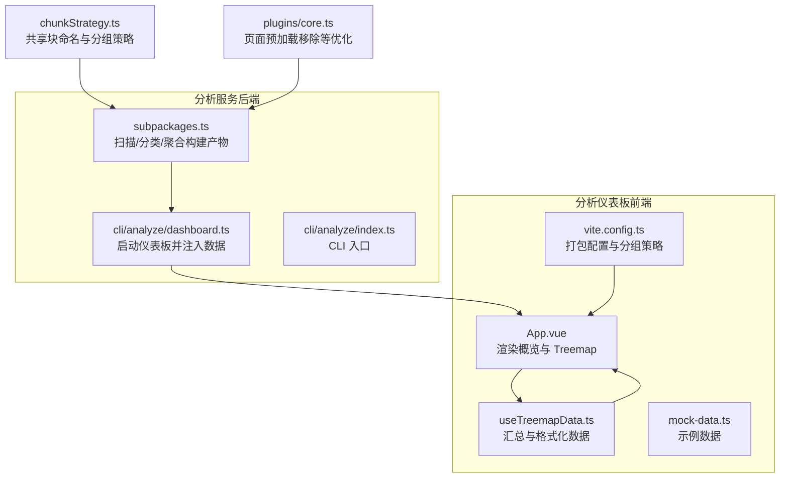
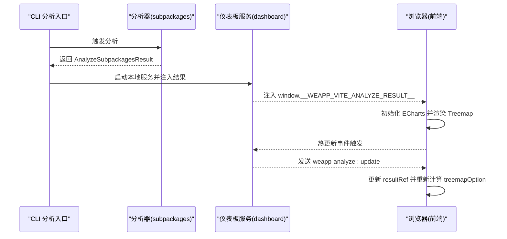
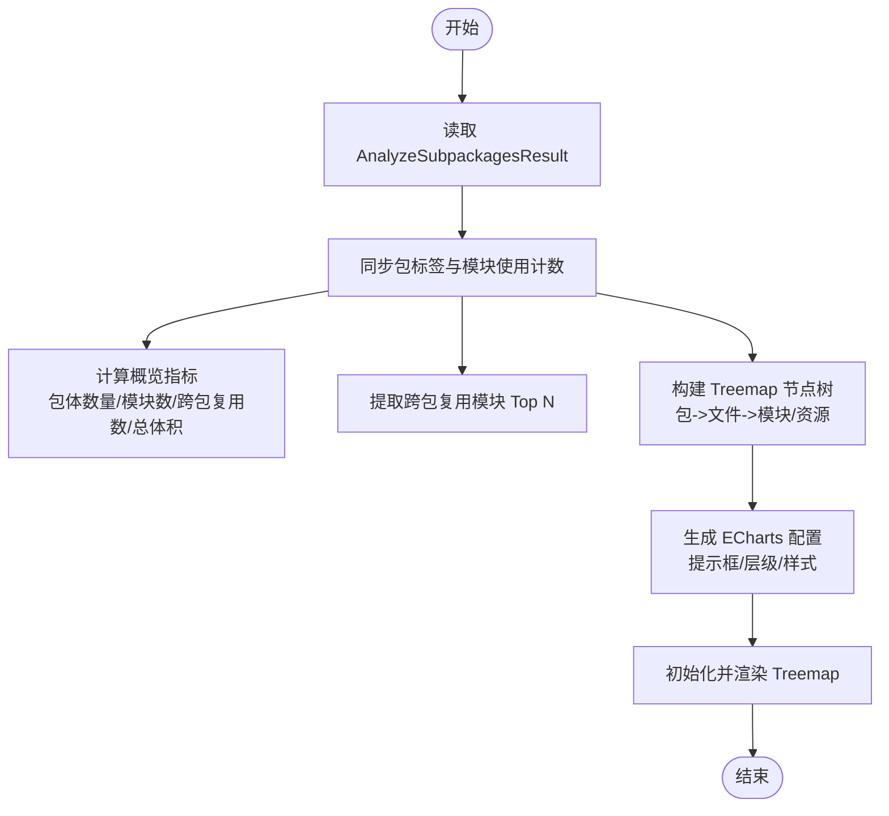
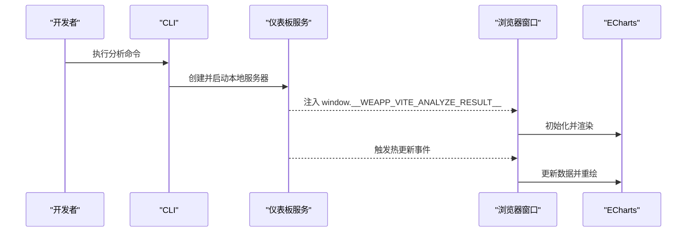
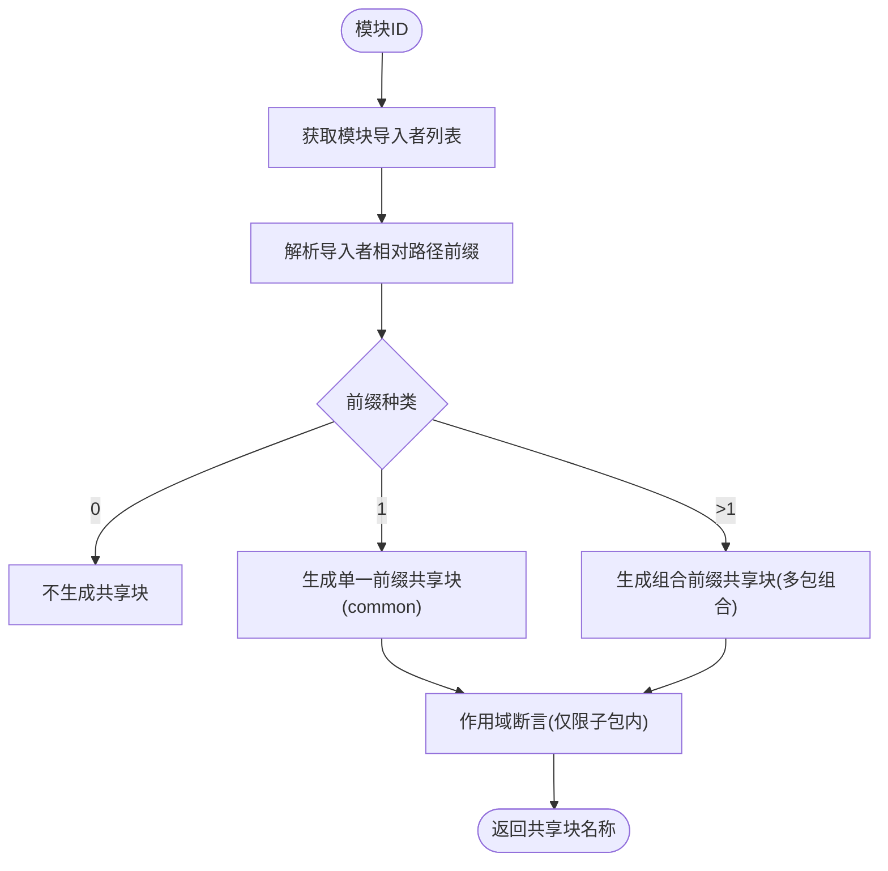
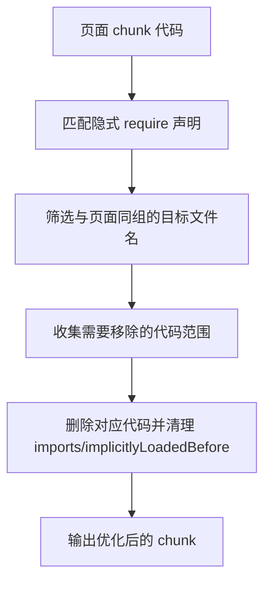
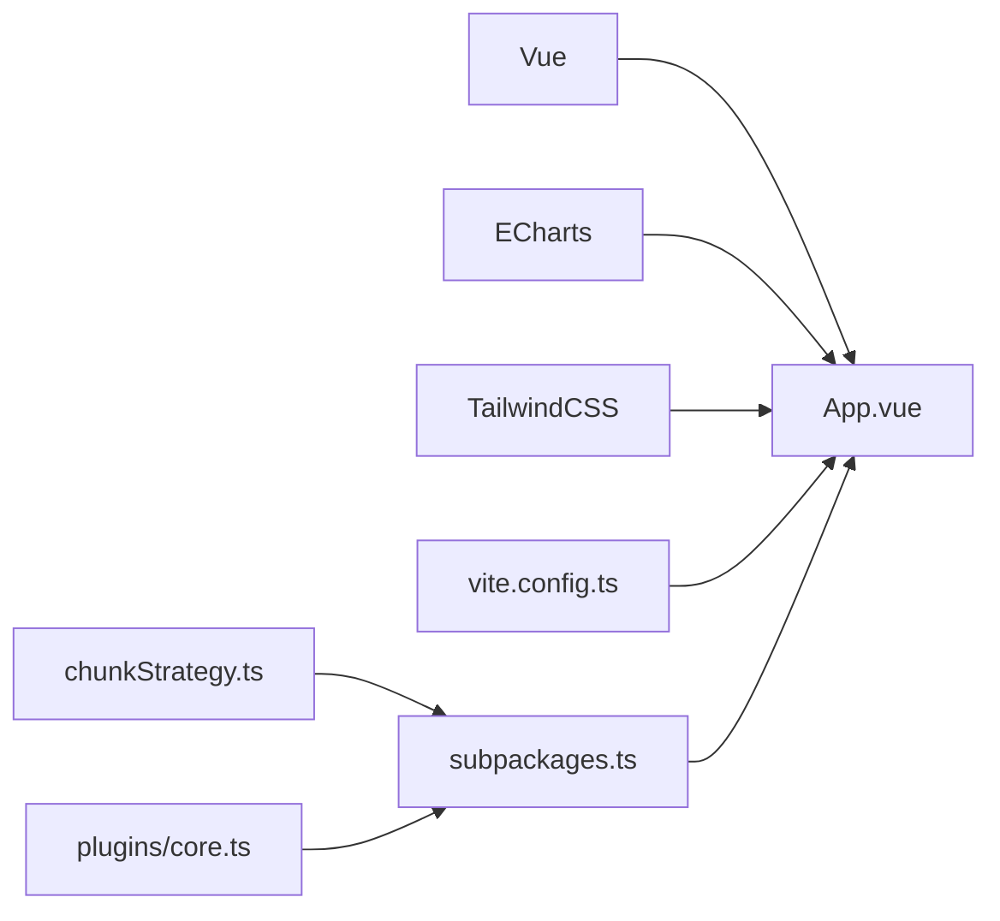

# 性能指标解读

<cite>
**本文引用的文件**
- [packages/weapp-vite/analyze-dashboard/App.vue](file://packages/weapp-vite/analyze-dashboard/App.vue)
- [packages/weapp-vite/analyze-dashboard/useTreemapData.ts](file://packages/weapp-vite/analyze-dashboard/useTreemapData.ts)
- [packages/weapp-vite/analyze-dashboard/mock-data.ts](file://packages/weapp-vite/analyze-dashboard/mock-data.ts)
- [packages/weapp-vite/analyze-dashboard/vite.config.ts](file://packages/weapp-vite/analyze-dashboard/vite.config.ts)
- [packages/weapp-vite/src/analyze/subpackages.ts](file://packages/weapp-vite/src/analyze/subpackages.ts)
- [packages/weapp-vite/src/cli/analyze/dashboard.ts](file://packages/weapp-vite/src/cli/analyze/dashboard.ts)
- [packages/weapp-vite/src/cli/analyze/index.ts](file://packages/weapp-vite/src/cli/analyze/index.ts)
- [packages/weapp-vite/src/runtime/chunkStrategy.ts](file://packages/weapp-vite/src/runtime/chunkStrategy.ts)
- [packages/weapp-vite/src/plugins/core.ts](file://packages/weapp-vite/src/plugins/core.ts)
</cite>

## 目录
1. [引言](#引言)
2. [项目结构](#项目结构)
3. [核心组件](#核心组件)
4. [架构总览](#架构总览)
5. [详细组件分析](#详细组件分析)
6. [依赖关系分析](#依赖关系分析)
7. [性能考量](#性能考量)
8. [故障排查指南](#故障排查指南)
9. [结论](#结论)
10. [附录](#附录)

## 引言
本篇文档围绕 weapp-vite 分析仪表板的性能指标体系进行系统化解读，帮助开发者从包大小、构建时间、依赖复杂度、资源加载效率等维度理解小程序构建产物，并通过可视化数据识别大型依赖与冗余代码，指导分包策略优化与按需加载改进，最终形成“问题识别—指标定位—可视化诊断—优化建议—验证闭环”的完整流程。

## 项目结构
weapp-vite 的分析仪表板由前端可视化界面与后端分析数据两部分组成：
- 前端：基于 Vue + ECharts 的 Treemap 可视化，负责渲染包体结构、模块来源与跨包复用情况。
- 后端：分析服务负责收集构建输出、统计模块与文件分布、生成可注入到前端的数据对象。



图表来源
- [packages/weapp-vite/analyze-dashboard/App.vue](file://packages/weapp-vite/analyze-dashboard/App.vue#L1-L147)
- [packages/weapp-vite/analyze-dashboard/useTreemapData.ts](file://packages/weapp-vite/analyze-dashboard/useTreemapData.ts#L1-L360)
- [packages/weapp-vite/analyze-dashboard/mock-data.ts](file://packages/weapp-vite/analyze-dashboard/mock-data.ts#L1-L294)
- [packages/weapp-vite/analyze-dashboard/vite.config.ts](file://packages/weapp-vite/analyze-dashboard/vite.config.ts#L1-L53)
- [packages/weapp-vite/src/analyze/subpackages.ts](file://packages/weapp-vite/src/analyze/subpackages.ts#L1-L601)
- [packages/weapp-vite/src/cli/analyze/dashboard.ts](file://packages/weapp-vite/src/cli/analyze/dashboard.ts#L1-L120)
- [packages/weapp-vite/src/cli/analyze/index.ts](file://packages/weapp-vite/src/cli/analyze/index.ts#L1-L200)
- [packages/weapp-vite/src/runtime/chunkStrategy.ts](file://packages/weapp-vite/src/runtime/chunkStrategy.ts#L86-L411)
- [packages/weapp-vite/src/plugins/core.ts](file://packages/weapp-vite/src/plugins/core.ts#L630-L739)

章节来源
- [packages/weapp-vite/analyze-dashboard/App.vue](file://packages/weapp-vite/analyze-dashboard/App.vue#L1-L147)
- [packages/weapp-vite/analyze-dashboard/useTreemapData.ts](file://packages/weapp-vite/analyze-dashboard/useTreemapData.ts#L1-L360)
- [packages/weapp-vite/analyze-dashboard/vite.config.ts](file://packages/weapp-vite/analyze-dashboard/vite.config.ts#L1-L53)
- [packages/weapp-vite/src/analyze/subpackages.ts](file://packages/weapp-vite/src/analyze/subpackages.ts#L1-L601)
- [packages/weapp-vite/src/cli/analyze/dashboard.ts](file://packages/weapp-vite/src/cli/analyze/dashboard.ts#L1-L120)
- [packages/weapp-vite/src/runtime/chunkStrategy.ts](file://packages/weapp-vite/src/runtime/chunkStrategy.ts#L86-L411)
- [packages/weapp-vite/src/plugins/core.ts](file://packages/weapp-vite/src/plugins/core.ts#L630-L739)

## 核心组件
- 包体与模块统计：仪表板首页展示包体数量、源码模块数、跨包复用数与总产物体积，用于快速把握整体体量与重复度。
- Treemap 可视化：以树状矩形展示主包/分包/独立分包/虚拟共享包的文件与模块分布，颜色与层级区分包类型与层级。
- 跨包复用模块 Top 列表：列出被多个包使用的模块及其出现次数与涉及包名，便于识别“大而全”的共享模块。
- 数据注入与热更新：通过全局变量注入分析结果，支持热更新事件同步最新分析数据。

章节来源
- [packages/weapp-vite/analyze-dashboard/App.vue](file://packages/weapp-vite/analyze-dashboard/App.vue#L73-L147)
- [packages/weapp-vite/analyze-dashboard/useTreemapData.ts](file://packages/weapp-vite/analyze-dashboard/useTreemapData.ts#L164-L359)

## 架构总览
仪表板工作流分为“分析—注入—渲染”三步：
1) 分析阶段：扫描构建产物，按包类型分类，统计模块来源与跨包复用关系，生成可序列化的分析结果。
2) 注入阶段：在本地开发服务器中注入分析结果到窗口对象，并提供热更新事件。
3) 渲染阶段：前端初始化 ECharts Treemap，监听选项变化与窗口尺寸变化，动态渲染。



图表来源
- [packages/weapp-vite/src/cli/analyze/index.ts](file://packages/weapp-vite/src/cli/analyze/index.ts#L1-L200)
- [packages/weapp-vite/src/analyze/subpackages.ts](file://packages/weapp-vite/src/analyze/subpackages.ts#L539-L601)
- [packages/weapp-vite/src/cli/analyze/dashboard.ts](file://packages/weapp-vite/src/cli/analyze/dashboard.ts#L1-L120)
- [packages/weapp-vite/analyze-dashboard/App.vue](file://packages/weapp-vite/analyze-dashboard/App.vue#L1-L71)

## 详细组件分析

### 组件一：分析数据模型与聚合逻辑
- 数据模型：包含 packages（包列表）、modules（模块使用分布）、subPackages（子包元信息）。
- 聚合过程：遍历构建输出，按文件类型（chunk/asset）与来源（主包/独立分包）分类；对模块记录其所在包与文件集合；最后汇总成稳定顺序的报告。
- 关键字段：
  - 包类型：main、subPackage、independent、virtual
  - 文件类型：chunk、asset
  - 模块来源类型：src、plugin、node_modules、workspace
  - 跨包复用：统计模块出现在多少个包中

```mermaid
classDiagram
class AnalyzeSubpackagesResult {
+packages : PackageReport[]
+modules : ModuleUsage[]
+subPackages : SubPackageDescriptor[]
}
class PackageReport {
+id : string
+label : string
+type : "main"|"subPackage"|"independent"|"virtual"
+files : PackageFileEntry[]
}
class PackageFileEntry {
+file : string
+type : "chunk"|"asset"
+from : "main"|"independent"
+size? : number
+isEntry? : boolean
+modules? : ModuleInFile[]
+source? : string
}
class ModuleUsage {
+id : string
+source : string
+sourceType : "src"|"plugin"|"node_modules"|"workspace"
+packages : {packageId : string, files : string[]}[]
}
AnalyzeSubpackagesResult --> PackageReport
AnalyzeSubpackagesResult --> ModuleUsage
PackageReport --> PackageFileEntry
PackageFileEntry --> ModuleUsage : "modules"
```

图表来源
- [packages/weapp-vite/src/analyze/subpackages.ts](file://packages/weapp-vite/src/analyze/subpackages.ts#L52-L108)
- [packages/weapp-vite/src/analyze/subpackages.ts](file://packages/weapp-vite/src/analyze/subpackages.ts#L266-L355)
- [packages/weapp-vite/src/analyze/subpackages.ts](file://packages/weapp-vite/src/analyze/subpackages.ts#L415-L448)

章节来源
- [packages/weapp-vite/src/analyze/subpackages.ts](file://packages/weapp-vite/src/analyze/subpackages.ts#L1-L601)

### 组件二：Treemap 数据处理与可视化
- 数据结构转换：将分析结果转换为 Treemap 节点树，节点包含包、文件、模块、资源四类元信息，支持层级样式与提示框格式化。
- 概览指标：包体数量、源码模块数、跨包复用数、总产物体积。
- 跨包复用 Top：按复用次数排序，显示模块来源与涉及包名。
- 提示框格式化：根据节点类型输出包/文件/模块/资源的详细信息，含体积、来源、跨包复用次数等。



图表来源
- [packages/weapp-vite/analyze-dashboard/useTreemapData.ts](file://packages/weapp-vite/analyze-dashboard/useTreemapData.ts#L164-L359)
- [packages/weapp-vite/analyze-dashboard/App.vue](file://packages/weapp-vite/analyze-dashboard/App.vue#L1-L71)

章节来源
- [packages/weapp-vite/analyze-dashboard/useTreemapData.ts](file://packages/weapp-vite/analyze-dashboard/useTreemapData.ts#L1-L360)
- [packages/weapp-vite/analyze-dashboard/App.vue](file://packages/weapp-vite/analyze-dashboard/App.vue#L73-L147)

### 组件三：仪表板启动与数据注入
- 本地服务：在开发模式下启动本地 Vite 服务器，注入分析结果到 window 对象，并提供热更新事件。
- 错误处理：当未找到仪表板产物时抛出明确错误，引导先构建仪表板。
- 窗口事件：前端监听 weapp-analyze:update 事件，实时更新分析数据并重绘。



图表来源
- [packages/weapp-vite/src/cli/analyze/dashboard.ts](file://packages/weapp-vite/src/cli/analyze/dashboard.ts#L1-L120)
- [packages/weapp-vite/analyze-dashboard/main.ts](file://packages/weapp-vite/analyze-dashboard/main.ts#L1-L35)
- [packages/weapp-vite/analyze-dashboard/App.vue](file://packages/weapp-vite/analyze-dashboard/App.vue#L1-L71)

章节来源
- [packages/weapp-vite/src/cli/analyze/dashboard.ts](file://packages/weapp-vite/src/cli/analyze/dashboard.ts#L1-L120)
- [packages/weapp-vite/analyze-dashboard/main.ts](file://packages/weapp-vite/analyze-dashboard/main.ts#L1-L35)

### 组件四：分包策略与共享块命名
- 共享块命名：根据模块导入者分布决定是否提升到公共目录或创建跨包组合共享块名称，避免重复打包。
- 导入者前缀汇总：统计各导入者所属子包根路径，决定共享块命名与分组策略。
- 作用域断言：确保模块仅在限定范围内使用，防止跨包污染。



图表来源
- [packages/weapp-vite/src/runtime/chunkStrategy.ts](file://packages/weapp-vite/src/runtime/chunkStrategy.ts#L86-L411)

章节来源
- [packages/weapp-vite/src/runtime/chunkStrategy.ts](file://packages/weapp-vite/src/runtime/chunkStrategy.ts#L86-L411)

### 组件五：资源加载与按需加载优化
- 页面预加载移除：扫描页面 chunk 中的隐式 require 引用，移除与目标页面同属一组的预加载声明，减少不必要的首屏请求。
- 动态导入链路：通过基准测试脚本模拟动态导入场景，评估不同库在冷/热构建下的耗时与内存占用，辅助选择更优的依赖策略。



图表来源
- [packages/weapp-vite/src/plugins/core.ts](file://packages/weapp-vite/src/plugins/core.ts#L630-L739)

章节来源
- [packages/weapp-vite/src/plugins/core.ts](file://packages/weapp-vite/src/plugins/core.ts#L630-L739)

## 依赖关系分析
- 前端依赖：Vue、ECharts（treemap、tooltip、visualMap、renderer），TailwindCSS。
- 打包配置：自定义 advancedChunks 分组策略，将第三方依赖拆分为 vendor、vue、echarts 等组，降低单 chunk 体积，提升缓存命中率。
- 运行时依赖：chunkStrategy 与 plugins/core 在构建期参与共享块命名与页面预加载优化，影响最终产物体积与加载路径。



图表来源
- [packages/weapp-vite/analyze-dashboard/App.vue](file://packages/weapp-vite/analyze-dashboard/App.vue#L1-L71)
- [packages/weapp-vite/analyze-dashboard/vite.config.ts](file://packages/weapp-vite/analyze-dashboard/vite.config.ts#L1-L53)
- [packages/weapp-vite/src/analyze/subpackages.ts](file://packages/weapp-vite/src/analyze/subpackages.ts#L1-L601)
- [packages/weapp-vite/src/runtime/chunkStrategy.ts](file://packages/weapp-vite/src/runtime/chunkStrategy.ts#L86-L411)
- [packages/weapp-vite/src/plugins/core.ts](file://packages/weapp-vite/src/plugins/core.ts#L630-L739)

章节来源
- [packages/weapp-vite/analyze-dashboard/vite.config.ts](file://packages/weapp-vite/analyze-dashboard/vite.config.ts#L1-L53)
- [packages/weapp-vite/src/analyze/subpackages.ts](file://packages/weapp-vite/src/analyze/subpackages.ts#L1-L601)

## 性能考量
- 包大小与体积
  - 通过 Treemap 直观查看主包/分包/独立分包/虚拟共享包的文件与模块分布，定位超大 chunk 或资源。
  - 使用跨包复用 Top 列表识别被多个包重复引入的大模块，优先将其迁移至共享块或独立分包。
  - 参考打包配置中的 advancedChunks 分组策略，将 vendor、vue、echarts 等拆分，降低单 chunk 体积，提升缓存命中。
- 构建时间
  - 依赖优化与缓存：通过依赖发现与版本查询注入，减少浏览器重复校验与网络往返。
  - 冷/热构建对比：利用基准测试脚本评估不同库在冷/热构建下的耗时与内存占用，选择更友好的依赖与工具链。
- 依赖复杂度
  - 模块来源类型：区分 src、plugin、node_modules、workspace，识别外部依赖与插件引入带来的复杂度。
  - 跨包复用：跨包复用数越高，意味着模块越“大而全”，应考虑拆分或下沉到更小粒度的共享层。
- 资源加载性能
  - 页面预加载移除：减少不必要的隐式预加载，缩短首屏渲染时间。
  - 按需加载效率：通过动态导入链路测试，评估按需加载的延迟与体积开销，优化加载策略。

章节来源
- [packages/weapp-vite/analyze-dashboard/useTreemapData.ts](file://packages/weapp-vite/analyze-dashboard/useTreemapData.ts#L164-L359)
- [packages/weapp-vite/analyze-dashboard/vite.config.ts](file://packages/weapp-vite/analyze-dashboard/vite.config.ts#L20-L53)
- [packages/weapp-vite/src/plugins/core.ts](file://packages/weapp-vite/src/plugins/core.ts#L630-L739)
- [packages/rolldown-require-bench/benchmark/index.mjs](file://packages/rolldown-require-bench/benchmark/index.mjs#L83-L192)

## 故障排查指南
- 未找到仪表板产物
  - 现象：启动仪表板时报错，提示需先构建仪表板。
  - 处理：先执行仪表板构建命令，再运行分析。
  - 参考
    - [packages/weapp-vite/src/cli/analyze/dashboard.ts](file://packages/weapp-vite/src/cli/analyze/dashboard.ts#L11-L20)
- 未检测到分析数据
  - 现象：前端抛出错误，提示未注入分析数据。
  - 处理：确认 CLI 已注入 window.__WEAPP_VITE_ANALYZE_RESULT__，或在开发模式下启用 mock 数据。
  - 参考
    - [packages/weapp-vite/analyze-dashboard/App.vue](file://packages/weapp-vite/analyze-dashboard/App.vue#L24-L26)
    - [packages/weapp-vite/analyze-dashboard/main.ts](file://packages/weapp-vite/analyze-dashboard/main.ts#L1-L35)
- 无法热更新
  - 现象：修改分析数据后 Treemap 未刷新。
  - 处理：检查热更新事件是否正确派发，确认前端已监听 weapp-analyze:update 并更新 resultRef。
  - 参考
    - [packages/weapp-vite/analyze-dashboard/main.ts](file://packages/weapp-vite/analyze-dashboard/main.ts#L20-L35)
    - [packages/weapp-vite/analyze-dashboard/App.vue](file://packages/weapp-vite/analyze-dashboard/App.vue#L44-L71)

章节来源
- [packages/weapp-vite/src/cli/analyze/dashboard.ts](file://packages/weapp-vite/src/cli/analyze/dashboard.ts#L11-L20)
- [packages/weapp-vite/analyze-dashboard/App.vue](file://packages/weapp-vite/analyze-dashboard/App.vue#L24-L71)
- [packages/weapp-vite/analyze-dashboard/main.ts](file://packages/weapp-vite/analyze-dashboard/main.ts#L1-L35)

## 结论
weapp-vite 分析仪表板通过 Treemap 将复杂的包体结构与模块分布直观呈现，结合跨包复用、模块来源与体积统计，能够有效识别大型依赖与冗余代码，指导分包策略与共享块命名。配合页面预加载移除与按需加载优化，可在保证加载效率的同时控制包体规模，形成从指标到可视化的闭环优化路径。

## 附录
- 指标阈值参考（建议）
  - 主包体积上限：建议主包总产物不超过 2–3 MB（依据业务复杂度与网络环境调整）。
  - 单 chunk 体积上限：建议单 chunk 不超过 200–300 KB，避免缓存失效与加载阻塞。
  - 跨包复用阈值：跨包复用数超过 3 的模块建议下沉共享层或拆分。
  - 依赖分组：vendor、vue、echarts 等第三方库应独立分组，提升缓存命中率。
- 优化建议清单
  - 将高频但体积大的第三方库放入独立分包或共享虚拟包。
  - 使用共享块命名策略，避免模块在多包重复打包。
  - 移除页面预加载中与当前页面无关的隐式依赖。
  - 采用按需加载与动态导入，降低首屏体积。
  - 定期运行基准测试，评估冷/热构建性能与内存占用，持续优化依赖与工具链。