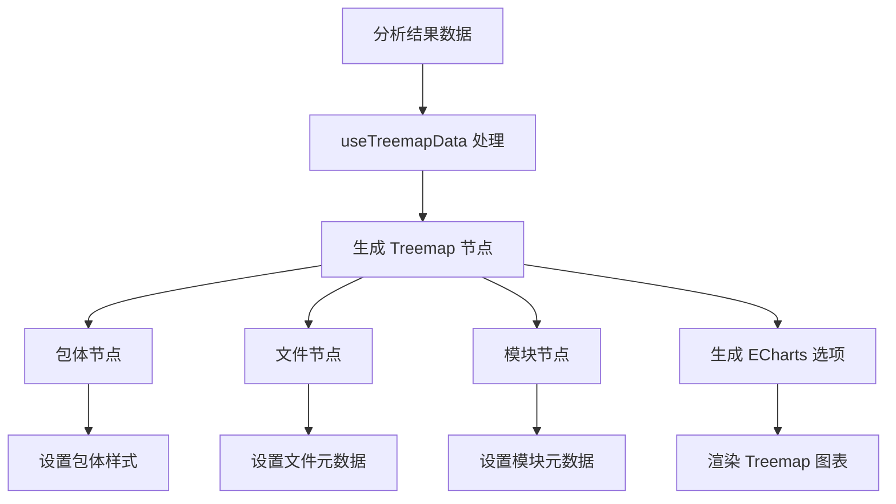
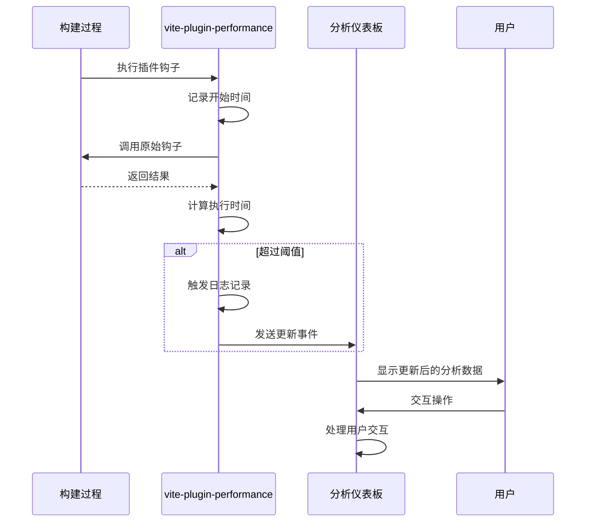

# 数据可视化

<cite>
**本文档引用的文件**  
- [App.vue](file://packages/weapp-vite/analyze-dashboard/App.vue)
- [main.ts](file://packages/weapp-vite/analyze-dashboard/main.ts)
- [useTreemapData.ts](file://packages/weapp-vite/analyze-dashboard/useTreemapData.ts)
- [mock-data.ts](file://packages/weapp-vite/analyze-dashboard/mock-data.ts)
- [dashboard.ts](file://packages/weapp-vite/src/cli/analyze/dashboard.ts)
- [subpackages.ts](file://packages/weapp-vite/src/analyze/subpackages.ts)
- [vite.config.ts](file://packages/weapp-vite/analyze-dashboard/vite.config.ts)
- [build-analyze-dashboard.mjs](file://packages/weapp-vite/scripts/build-analyze-dashboard.mjs)
</cite>

## 目录
1. [可视化技术栈](#可视化技术栈)
2. [依赖关系图展示逻辑](#依赖关系图展示逻辑)
3. [模块大小分布图实现原理](#模块大小分布图实现原理)
4. [构建时间分析图表设计](#构建时间分析图表设计)
5. [自定义可视化配置](#自定义可视化配置)

## 可视化技术栈

weapp-vite 分析仪表板采用 Vue 3 和 ECharts 作为核心可视化技术栈，通过 Treemap 图表直观展示小程序构建产物的包体结构。仪表板集成 ECharts 的 TreemapChart、TooltipComponent、TitleComponent 等组件，并使用 Canvas 渲染器进行高效渲染。样式方面采用 Tailwind CSS 进行现代化 UI 构建，通过 dark 主题提供专业的数据可视化界面。

仪表板通过 Vite 构建，配置了 Vue 插件和 Tailwind CSS 插件，构建时将依赖按 echarts、vue 和 vendor 进行分组，优化加载性能。开发环境支持热更新，通过自定义事件 `weapp-analyze:update` 实现数据实时同步。

**Section sources**
- [App.vue](file://packages/weapp-vite/analyze-dashboard/App.vue#L1-L147)
- [main.ts](file://packages/weapp-vite/analyze-dashboard/main.ts#L1-L36)
- [vite.config.ts](file://packages/weapp-vite/analyze-dashboard/vite.config.ts#L1-L53)

## 依赖关系图展示逻辑

依赖关系图通过 Treemap 层级结构展示模块间的引用关系，采用三级层级设计：包体层级、文件层级和模块层级。每个包体（主包、分包、独立分包、虚拟包）用不同颜色区分，主包使用蓝色系，分包使用绿色系，独立分包使用橙色系，虚拟包使用紫色系。

Treemap 的每个矩形区域代表一个实体，大小与体积成正比。包体层级显示包体标签、类型和产物数量；文件层级显示文件名、来源和模块数量；模块层级显示源码路径、源码类型和跨包复用次数。通过 `nodeClick: 'zoomToNode'` 配置实现点击缩放交互，用户可逐层深入查看细节。



**Diagram sources**
- [useTreemapData.ts](file://packages/weapp-vite/analyze-dashboard/useTreemapData.ts#L214-L308)
- [App.vue](file://packages/weapp-vite/analyze-dashboard/App.vue#L49-L50)

**Section sources**
- [useTreemapData.ts](file://packages/weapp-vite/analyze-dashboard/useTreemapData.ts#L77-L102)
- [App.vue](file://packages/weapp-vite/analyze-dashboard/App.vue#L318-L339)

## 模块大小分布图实现原理

模块大小分布图基于 `useTreemapData` 函数实现数据聚合和转换。首先通过 `analyzeSubpackages` 函数分析构建输出，收集包体、文件和模块信息。模块数据按源码类型（src、plugin、node_modules、workspace）分类，并计算每个模块在不同包体中的引用次数。

颜色编码采用预定义的 `PACKAGE_STYLES` 配置，为不同类型的包体分配特定的填充色、边框色和高亮色。主包使用深蓝色（#1e40af），分包使用深绿色（#065f46），独立分包使用深橙色（#92400e），虚拟包使用深紫色（#5b21b6）。

交互设计包括：鼠标悬停显示详细信息工具提示、点击缩放查看层级细节、窗口大小变化时自动调整图表尺寸。工具提示内容包含实体类型、标签、体积等信息，通过 `formatTooltip` 函数格式化生成。

```mermaid
classDiagram
class AnalyzeSubpackagesResult {
+packages PackageReport[]
+modules ModuleUsage[]
+subPackages SubPackageDescriptor[]
}
class PackageReport {
+id string
+label string
+type PackageType
+files PackageFileEntry[]
}
class ModuleUsage {
+id string
+source string
+sourceType ModuleSourceType
+packages Array<{packageId : string, files : string[]}>
}
class PackageFileEntry {
+file string
+type 'chunk' | 'asset'
+from BuildOrigin
+size? number
+isEntry? boolean
+modules? ModuleInFile[]
+source? string
}
AnalyzeSubpackagesResult --> PackageReport : "包含"
AnalyzeSubpackagesResult --> ModuleUsage : "包含"
AnalyzeSubpackagesResult --> SubPackageDescriptor : "包含"
PackageReport --> PackageFileEntry : "包含"
```

**Diagram sources**
- [subpackages.ts](file://packages/weapp-vite/src/analyze/subpackages.ts#L52-L56)
- [useTreemapData.ts](file://packages/weapp-vite/analyze-dashboard/useTreemapData.ts#L54-L75)

**Section sources**
- [useTreemapData.ts](file://packages/weapp-vite/analyze-dashboard/useTreemapData.ts#L164-L359)
- [subpackages.ts](file://packages/weapp-vite/src/analyze/subpackages.ts#L14-L56)

## 构建时间分析图表设计

构建时间分析功能通过 `vite-plugin-performance` 插件实现，该插件包装 Vite 插件的生命周期钩子，测量每个钩子的执行时间。时间轴设计基于高精度计时器，通过 `performance.now()` 或 `Date.now()` 获取时间戳，计算钩子执行的持续时间。

性能瓶颈识别机制通过设置阈值（默认 10ms）来检测耗时过长的钩子执行。当钩子执行时间超过阈值时，触发日志记录和回调函数。插件支持自定义日志记录器、格式化函数和时钟源，可灵活集成到不同环境。

实时模式下，构建服务监听 `END` 事件，每次构建完成后自动触发分析数据更新，确保仪表板显示最新状态。通过 `startAnalyzeDashboard` 函数的 `watch: true` 选项启用实时更新功能。



**Diagram sources**
- [wrapPlugin.ts](file://packages/vite-plugin-performance/src/wrapPlugin.ts#L26-L48)
- [dashboard.ts](file://packages/weapp-vite/src/cli/analyze/dashboard.ts#L144-L148)

**Section sources**
- [wrapPlugin.ts](file://packages/vite-plugin-performance/src/wrapPlugin.ts#L1-L86)
- [dashboard.ts](file://packages/weapp-vite/src/cli/analyze/dashboard.ts#L88-L173)

## 自定义可视化配置

自定义可视化配置通过 `startAnalyzeDashboard` 函数的参数实现，允许开发者根据需求调整展示维度和粒度。开发者可通过 `options.watch` 参数控制是否启用实时更新模式，`true` 为实时模式，`false` 为静态模式。

仪表板数据通过 `__WEAPP_VITE_ANALYZE_RESULT__` 全局变量注入，开发者可自定义分析结果数据结构。通过 `createAnalyzeHtmlPlugin` 插件将分析结果序列化为 JSON 并注入到 HTML 页面中，实现数据传递。

构建脚本 `build-analyze-dashboard.mjs` 提供了仪表板前端资源的构建功能，开发者可修改 `vite.config.ts` 中的构建配置，调整输出目录、分组策略和文件命名规则。通过 `ANALYZE_DASHBOARD_ROOT` 环境变量可自定义仪表板根目录。

**Section sources**
- [dashboard.ts](file://packages/weapp-vite/src/cli/analyze/dashboard.ts#L88-L173)
- [vite.config.ts](file://packages/weapp-vite/analyze-dashboard/vite.config.ts#L20-L48)
- [build-analyze-dashboard.mjs](file://packages/weapp-vite/scripts/build-analyze-dashboard.mjs#L1-L23)