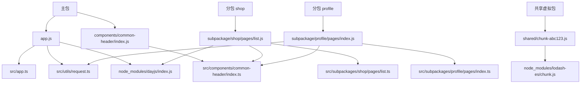
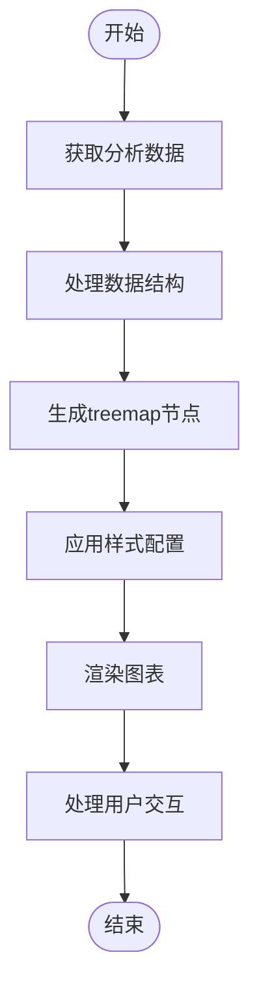

# 分析工具

<cite>
**本文档引用的文件**  
- [index.ts](file://packages/vite-plugin-performance/src/index.ts)
- [options.ts](file://packages/vite-plugin-performance/src/options.ts)
- [types.ts](file://packages/vite-plugin-performance/src/types.ts)
- [utils.ts](file://packages/vite-plugin-performance/src/utils.ts)
- [README.md](file://packages/vite-plugin-performance/README.md)
- [main.ts](file://packages/weapp-vite/analyze-dashboard/main.ts)
- [App.vue](file://packages/weapp-vite/analyze-dashboard/App.vue)
- [useTreemapData.ts](file://packages/weapp-vite/analyze-dashboard/useTreemapData.ts)
- [mock-data.ts](file://packages/weapp-vite/analyze-dashboard/mock-data.ts)
- [dashboard.md](file://website/dashboard.md)
- [types.ts](file://packages/weapp-vite/src/cli/types.ts)
- [dashboard.ts](file://packages/weapp-vite/src/cli/analyze/dashboard.ts)
- [analyze.ts](file://packages/weapp-vite/src/cli/commands/analyze.ts)
- [subpackages.ts](file://packages/weapp-vite/src/analyze/subpackages.ts)
- [cli.ts](file://packages/weapp-vite/src/cli.ts)
</cite>

## 目录
1. [介绍](#介绍)
2. [内置分析仪表板功能](#内置分析仪表板功能)
3. [vite-plugin-performance插件分析能力](#vite-plugin-performance插件分析能力)
4. [实际案例演示](#实际案例演示)
5. [高级使用技巧](#高级使用技巧)
6. [总结](#总结)

## 介绍

weapp-vite提供了强大的性能分析工具集，帮助开发者深入理解构建过程和包体结构。本文档将详细介绍内置的分析仪表板功能和vite-plugin-performance插件提供的性能分析能力，包括如何启动分析服务、查看依赖关系图和性能指标，以及如何利用这些工具识别性能瓶颈并制定优化策略。

**Section sources**
- [cli.ts](file://packages/weapp-vite/src/cli.ts#L1-L50)

## 内置分析仪表板功能

weapp-vite内置了功能丰富的分析仪表板，通过可视化方式展示构建产物的包体结构、源码映射和跨包复用情况。该仪表板基于Vue 3和ECharts实现，提供直观的treemap图表和详细的数据统计。

### 启动分析服务

通过`weapp-vite analyze`命令可以启动分析服务。该命令会分析当前项目的构建产物，并自动启动一个本地服务器来展示分析仪表板。

```bash
weapp-vite analyze
```

该命令会执行以下操作：
1. 扫描项目中的主包和分包配置
2. 分析构建产物的文件结构和模块依赖
3. 启动分析仪表板服务器
4. 在控制台输出访问URL

**Section sources**
- [analyze.ts](file://packages/weapp-vite/src/cli/commands/analyze.ts#L76-L136)
- [dashboard.ts](file://packages/weapp-vite/src/cli/analyze/dashboard.ts#L88-L173)

### 查看依赖关系图

分析仪表板的核心功能是treemap图表，它以可视化方式展示包体结构和模块分布。每个矩形区域代表一个包、文件或模块，面积大小与资源体积成正比。

#### 图表功能特性

- **层级钻取**：点击某个包可以深入查看其内部文件结构
- **悬停提示**：鼠标悬停显示详细的资源信息
- **颜色编码**：不同类型的包使用不同的颜色区分
- **实时更新**：支持在构建过程中实时更新分析结果



**Diagram sources**
- [App.vue](file://packages/weapp-vite/analyze-dashboard/App.vue#L1-L147)
- [useTreemapData.ts](file://packages/weapp-vite/analyze-dashboard/useTreemapData.ts#L1-L360)

### 性能指标解读

分析仪表板提供了多个关键性能指标，帮助开发者快速评估项目状态：

- **包体数量**：显示主包和所有分包的总数
- **源码模块**：统计参与构建的源码模块总数
- **跨包复用**：标识被多个包引用的模块数量
- **总产物**：显示所有构建产物的总体积

这些指标位于仪表板的头部区域，为开发者提供项目构建的概览信息。

**Section sources**
- [App.vue](file://packages/weapp-vite/analyze-dashboard/App.vue#L77-L116)

### 分析仪表板可视化功能

分析仪表板的可视化功能基于ECharts的treemap图表实现，通过`useTreemapData`组合式函数处理原始分析数据。

#### 数据处理流程

1. **数据同步**：从全局变量`__WEAPP_VITE_ANALYZE_RESULT__`获取分析结果
2. **结构转换**：将原始数据转换为treemap图表所需的数据结构
3. **样式配置**：根据包类型应用不同的颜色和样式
4. **交互处理**：实现图表的缩放、悬停等交互功能



**Diagram sources**
- [useTreemapData.ts](file://packages/weapp-vite/analyze-dashboard/useTreemapData.ts#L164-L359)
- [main.ts](file://packages/weapp-vite/analyze-dashboard/main.ts#L1-L36)

## vite-plugin-performance插件分析能力

vite-plugin-performance插件提供了细粒度的构建性能分析能力，可以测量Vite插件生命周期钩子的执行时间，帮助识别构建过程中的性能瓶颈。

### 构建时间分析

该插件通过包装Vite插件的生命周期钩子，测量每个钩子的执行时间，并报告超过阈值的耗时操作。

#### 核心功能

- **钩子包装**：支持包装单个或多个插件的所有生命周期钩子
- **阈值过滤**：只报告执行时间超过指定阈值的钩子
- **异步支持**：正确处理异步钩子的执行时间测量
- **错误处理**：在测量过程中保持原始插件行为不变

**Section sources**
- [README.md](file://packages/vite-plugin-performance/README.md#L1-L124)

### 资源大小分析

虽然vite-plugin-performance主要关注时间性能，但其收集的数据可以间接反映资源大小的影响。执行时间较长的`transform`钩子可能表明处理的资源较大或转换逻辑复杂。

#### 配置选项

插件提供了丰富的配置选项来定制分析行为：

| 选项 | 类型 | 默认值 | 描述 |
|------|------|--------|------|
| `hooks` | `PluginHookName[] \| 'all'` | `DEFAULT_PLUGIN_HOOKS` | 指定要包装的钩子，使用`'all'`包装所有函数钩子 |
| `threshold` | `number` | `0` | 只有执行时间大于等于阈值的钩子才会被报告 |
| `silent` | `boolean` | `false` | 禁用内置日志输出 |
| `logger` | `(message, context) => void` | `console.log` | 自定义日志记录器 |
| `formatter` | `(context) => string` | `[plugin] transform ⏱  12.34 ms` | 自定义消息格式化器 |
| `onHookExecution` | `(context) => void` | `undefined` | 钩子执行完成后的回调 |
| `clock` | `() => number` | `performance.now`或`Date.now` | 高精度计时器，便于测试 |

**Section sources**
- [options.ts](file://packages/vite-plugin-performance/src/options.ts#L1-L40)
- [types.ts](file://packages/vite-plugin-performance/src/types.ts#L1-L44)

### 依赖分析

通过分析插件钩子的执行顺序和时间，可以间接了解构建过程中的依赖关系。例如，`resolveId`钩子的执行顺序反映了模块解析的依赖链。

#### 使用方法

```typescript
import { defineConfig } from 'vite'
import Inspect from 'vite-plugin-inspect'
import { wrapPlugin } from 'vite-plugin-performance'

export default defineConfig({
  plugins: [
    wrapPlugin(Inspect(), {
      threshold: 50,
      onHookExecution({ pluginName, hookName, duration }) {
        reportToAPM({ pluginName, hookName, duration })
      },
    }),
  ],
})
```

当某个钩子执行时间超过阈值时，会输出类似以下的信息：

```
[inspect] transform            ⏱   78.42 ms
```

**Section sources**
- [index.ts](file://packages/vite-plugin-performance/src/index.ts#L1-L5)
- [utils.ts](file://packages/vite-plugin-performance/src/utils.ts#L1-L8)

## 实际案例演示

### 发现性能瓶颈

假设在构建过程中发现`transform`钩子执行时间过长，可以通过以下步骤进行分析：

1. **启用性能分析**：在vite配置中添加vite-plugin-performance插件
2. **设置阈值**：将阈值设置为50ms，只关注耗时较长的操作
3. **分析输出**：查看控制台输出，识别执行时间最长的钩子
4. **定位问题**：根据插件名称和钩子类型定位到具体的插件和处理逻辑

### 解决性能问题

一旦识别出性能瓶颈，可以采取以下优化策略：

- **代码分割**：将大型模块拆分为更小的单元
- **缓存优化**：为耗时的转换操作添加缓存机制
- **异步处理**：将同步操作改为异步，避免阻塞主线程
- **资源压缩**：优化资源文件大小，减少处理时间

## 高级使用技巧

### 包装多个插件

可以一次性包装多个插件，统一进行性能分析：

```typescript
const pluginA = ...
const pluginB = ...

export default defineConfig({
  plugins: wrapPlugin([pluginA, pluginB], { threshold: 20 }),
})
```

### 自定义日志格式

通过`formatter`和`logger`选项可以完全定制输出格式和目标：

```typescript
wrapPlugin(plugin, {
  formatter({ pluginName, hookName, duration }) {
    return `${pluginName}:${hookName} took ${duration}ms`
  },
  logger(message) {
    myLogger.info(message)
  },
})
```

### 限制分析范围

可以指定只分析特定的钩子，减少不必要的性能开销：

```typescript
wrapPlugin(plugin, {
  hooks: ['resolveId', 'load', 'transform'],
})
```

## 总结

weapp-vite的性能分析工具集为开发者提供了全面的构建性能洞察。内置的分析仪表板通过可视化方式展示包体结构和模块分布，帮助识别跨包复用和资源体积问题。vite-plugin-performance插件则提供了细粒度的构建时间分析能力，可以精确测量各个生命周期钩子的执行时间。结合这两种工具，开发者可以全面了解项目的构建性能，识别瓶颈并实施有效的优化策略。