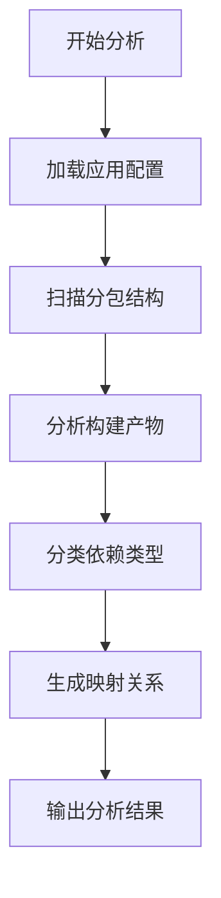
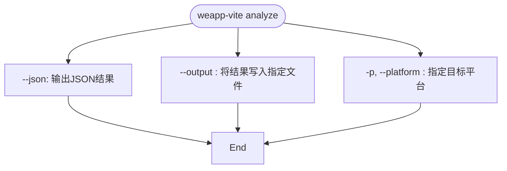
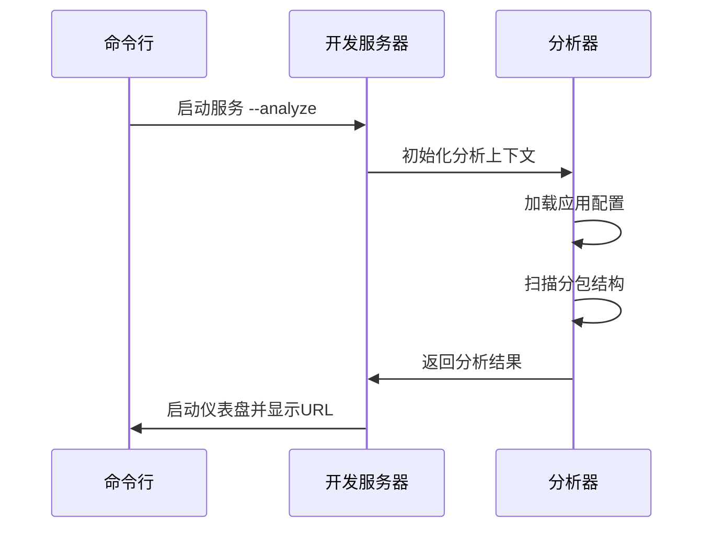
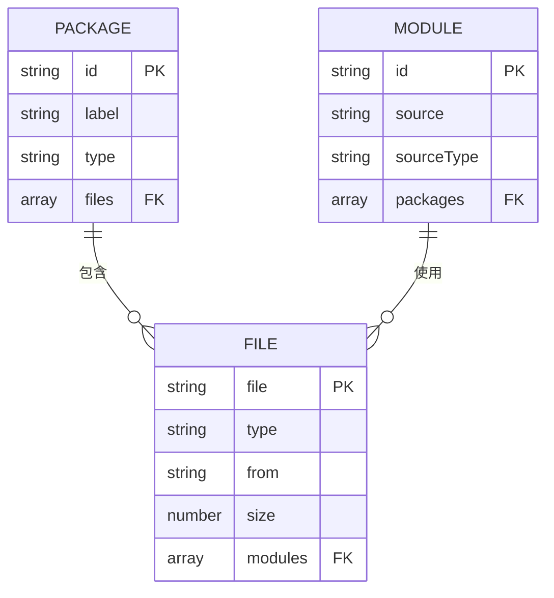
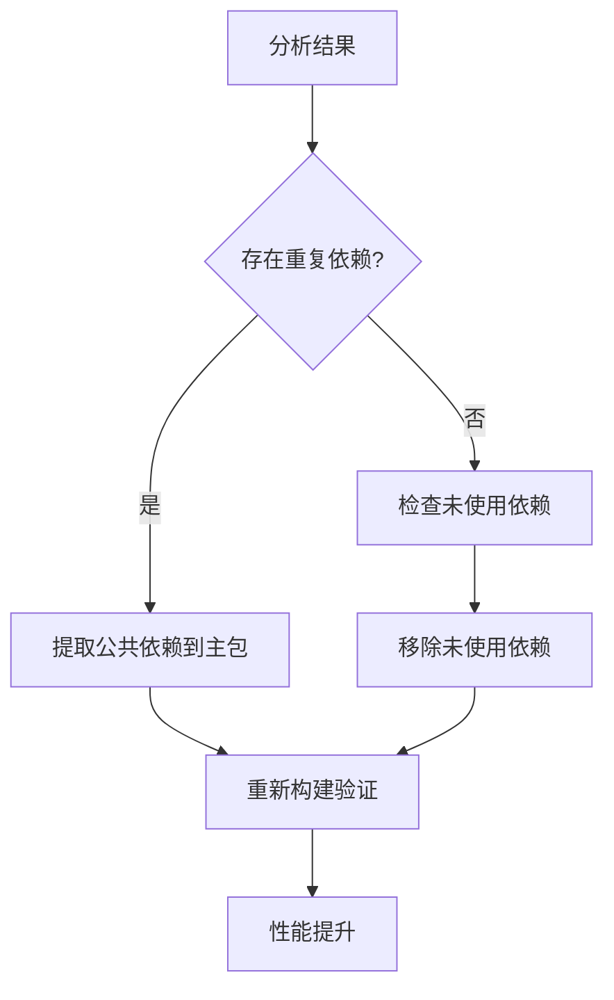
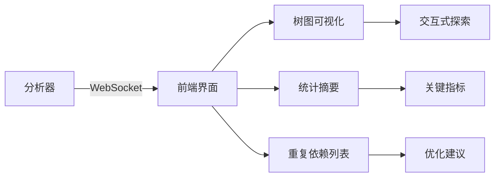
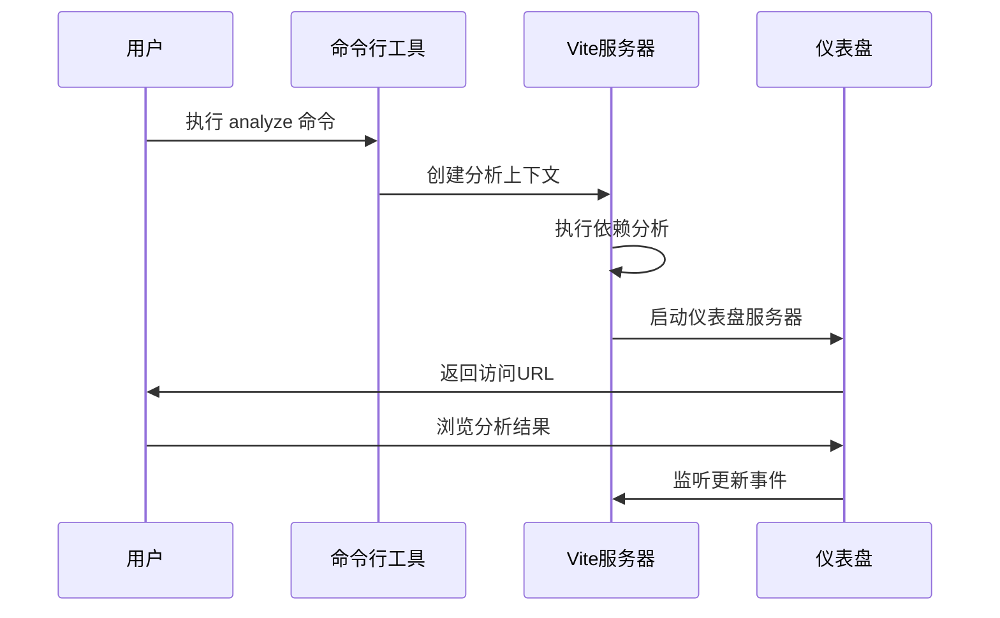
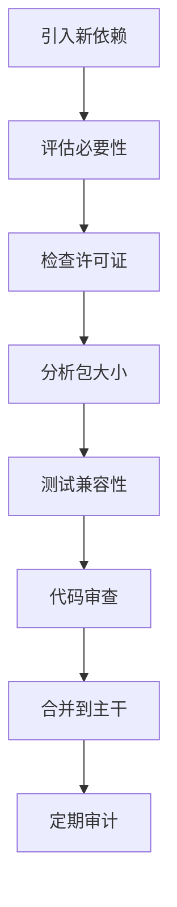

# 依赖分析

<cite>
**本文档引用的文件**
- [analyze.ts](file://packages/weapp-vite/src/cli/commands/analyze.ts)
- [subpackages.ts](file://packages/weapp-vite/src/analyze/subpackages.ts)
- [dashboard.ts](file://packages/weapp-vite/src/cli/analyze/dashboard.ts)
- [packagePaths.ts](file://packages/weapp-vite/src/packagePaths.ts)
- [types.ts](file://packages/weapp-vite/src/cli/types.ts)
- [analyze-dashboard/main.ts](file://packages/weapp-vite/analyze-dashboard/main.ts)
- [analyze-dashboard/useTreemapData.ts](file://packages/weapp-vite/analyze-dashboard/useTreemapData.ts)
</cite>

## 目录
1. [功能概述](#功能概述)
2. [依赖分析机制](#依赖分析机制)
3. [配置与使用](#配置与使用)
4. [结果解读与优化](#结果解读与优化)
5. [可视化仪表盘](#可视化仪表盘)
6. [最佳实践](#最佳实践)

## 功能概述

依赖分析功能用于分析小程序项目的分包结构和依赖关系，帮助开发者识别直接依赖、间接依赖和重复依赖。该功能通过扫描项目构建产物，生成详细的依赖关系报告，支持命令行输出和可视化仪表盘两种展示方式。

**本文档引用的文件**
- [analyze.ts](file://packages/weapp-vite/src/cli/commands/analyze.ts)
- [subpackages.ts](file://packages/weapp-vite/src/analyze/subpackages.ts)

## 依赖分析机制

依赖分析功能通过以下步骤实现依赖关系的识别和分析：

1. **扫描服务初始化**：加载应用入口文件和分包配置
2. **构建产物分析**：解析主包和独立分包的构建输出
3. **依赖分类**：将依赖分为主包、分包、独立分包和虚拟包四种类型
4. **模块映射**：建立源码模块与打包产物的映射关系

分析过程中，系统会识别以下依赖类型：
- **直接依赖**：被单个分包直接引用的模块
- **间接依赖**：通过其他依赖间接引入的模块
- **重复依赖**：被多个分包共同引用的模块

**图表来源**
- [subpackages.ts](file://packages/weapp-vite/src/analyze/subpackages.ts#L539-L601)

**本节来源**
- [subpackages.ts](file://packages/weapp-vite/src/analyze/subpackages.ts#L539-L601)

## 配置与使用

### CLI命令配置

通过`weapp-vite analyze`命令启动依赖分析，支持以下选项：

**图表来源**
- [analyze.ts](file://packages/weapp-vite/src/cli/commands/analyze.ts#L76-L136)

### 运行时配置

在开发服务器中启用实时分析：

**图表来源**
- [dashboard.ts](file://packages/weapp-vite/src/cli/analyze/dashboard.ts#L1-L172)
- [serve.ts](file://packages/weapp-vite/src/cli/commands/serve.ts#L15-L47)

**本节来源**
- [analyze.ts](file://packages/weapp-vite/src/cli/commands/analyze.ts#L76-L136)
- [dashboard.ts](file://packages/weapp-vite/src/cli/analyze/dashboard.ts#L1-L172)

## 结果解读与优化

### 分析结果结构

分析结果包含三个主要部分：
- **packages**：分包信息，包括主包、分包和独立分包
- **modules**：模块使用情况，记录每个模块在哪些分包中被使用
- **subPackages**：分包配置描述

**图表来源**
- [subpackages.ts](file://packages/weapp-vite/src/analyze/subpackages.ts#L32-L56)

### 优化建议

根据分析结果，可以采取以下优化措施：

1. **依赖升级**：识别过时的依赖版本并进行升级
2. **替代方案选择**：用更轻量的库替代大型依赖
3. **依赖树精简**：移除未使用的依赖和重复依赖

**图表来源**
- [useTreemapData.ts](file://packages/weapp-vite/analyze-dashboard/useTreemapData.ts#L164-L226)

**本节来源**
- [subpackages.ts](file://packages/weapp-vite/src/analyze/subpackages.ts#L32-L56)
- [useTreemapData.ts](file://packages/weapp-vite/analyze-dashboard/useTreemapData.ts#L164-L226)

## 可视化仪表盘

### 仪表盘架构

可视化仪表盘采用Vue 3构建，通过WebSocket实现实时更新：

**图表来源**
- [main.ts](file://packages/weapp-vite/analyze-dashboard/main.ts#L1-L35)
- [dashboard.ts](file://packages/weapp-vite/src/cli/analyze/dashboard.ts#L1-L172)

### 启动流程

**图表来源**
- [dashboard.ts](file://packages/weapp-vite/src/cli/analyze/dashboard.ts#L1-L172)

**本节来源**
- [main.ts](file://packages/weapp-vite/analyze-dashboard/main.ts#L1-L35)
- [dashboard.ts](file://packages/weapp-vite/src/cli/analyze/dashboard.ts#L1-L172)

## 最佳实践

### 依赖管理流程

建立规范的依赖审查流程：

### 健康度指标

建立依赖健康度评估体系：

| 指标 | 计算方法 | 健康阈值 |
|------|--------|---------|
| 重复依赖率 | 重复模块数/总模块数 | < 15% |
| 未使用依赖率 | 未使用依赖数/总依赖数 | < 5% |
| 平均包大小 | 总大小/分包数 | < 2MB |
| 主包占比 | 主包大小/总大小 | < 40% |

**本节来源**
- [subpackages.ts](file://packages/weapp-vite/src/analyze/subpackages.ts#L164-L226)
- [analyze.ts](file://packages/weapp-vite/src/cli/commands/analyze.ts#L14-L74)