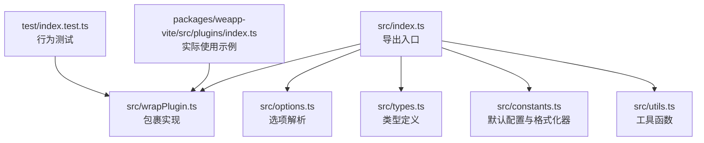
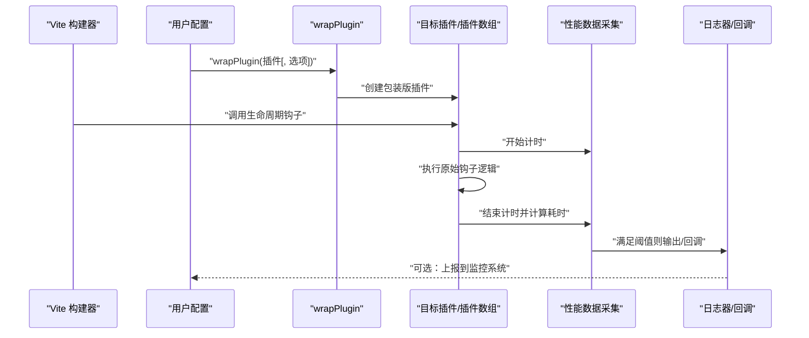
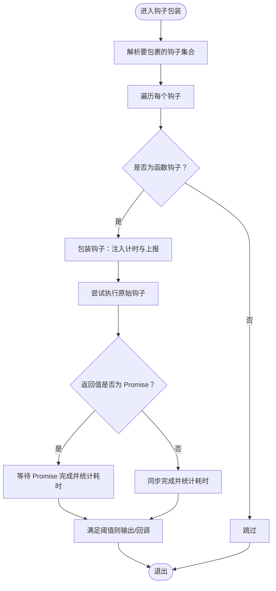
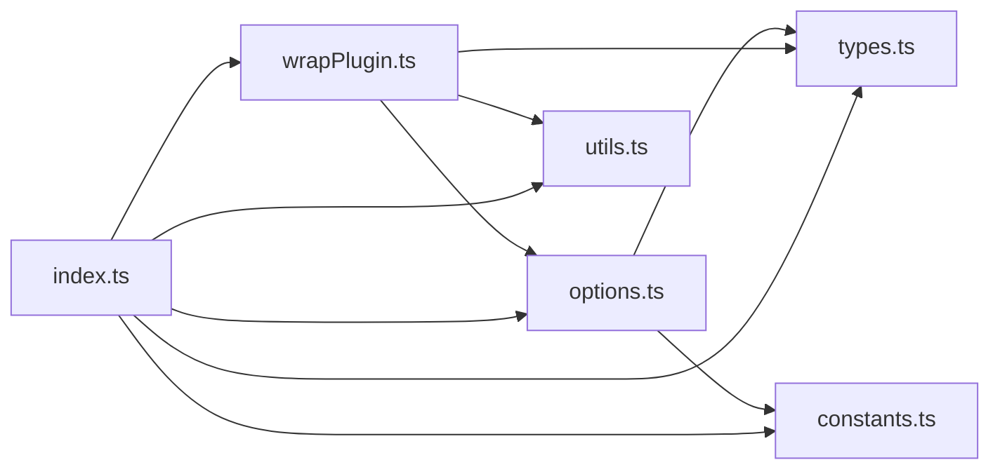

# 性能监控

<cite>
**本文引用的文件**
- [packages/vite-plugin-performance/src/index.ts](file://packages/vite-plugin-performance/src/index.ts)
- [packages/vite-plugin-performance/src/wrapPlugin.ts](file://packages/vite-plugin-performance/src/wrapPlugin.ts)
- [packages/vite-plugin-performance/src/options.ts](file://packages/vite-plugin-performance/src/options.ts)
- [packages/vite-plugin-performance/src/types.ts](file://packages/vite-plugin-performance/src/types.ts)
- [packages/vite-plugin-performance/src/constants.ts](file://packages/vite-plugin-performance/src/constants.ts)
- [packages/vite-plugin-performance/src/utils.ts](file://packages/vite-plugin-performance/src/utils.ts)
- [packages/vite-plugin-performance/README.md](file://packages/vite-plugin-performance/README.md)
- [packages/vite-plugin-performance/test/index.test.ts](file://packages/vite-plugin-performance/test/index.test.ts)
- [packages/weapp-vite/src/plugins/index.ts](file://packages/weapp-vite/src/plugins/index.ts)
</cite>

## 目录
1. [简介](#简介)
2. [项目结构](#项目结构)
3. [核心组件](#核心组件)
4. [架构总览](#架构总览)
5. [组件详解](#组件详解)
6. [依赖关系分析](#依赖关系分析)
7. [性能考量](#性能考量)
8. [故障排查指南](#故障排查指南)
9. [结论](#结论)
10. [附录](#附录)

## 简介
vite-plugin-performance 是一个轻量的 Vite 插件性能监控工具，它通过“包裹”目标插件的方式，在不改变原插件行为的前提下，对插件生命周期钩子的执行耗时进行测量，并按阈值输出或上报。其设计理念是“最小侵入、可观测、可扩展”，帮助开发者快速定位构建链路中的性能瓶颈。

- 设计理念
  - 不修改原插件逻辑，仅在钩子调用前后注入计时与上报逻辑。
  - 提供可配置的钩子集合、阈值、日志器、格式化器与回调，便于接入现有监控体系。
  - 对同步与异步钩子均友好处理，错误场景也能统计耗时。

- 核心能力
  - 单插件或插件数组包裹。
  - 默认钩子集或全量钩子包裹策略。
  - 基于阈值的筛选输出。
  - 可插拔的日志器、格式化器与生命周期回调。
  - 高精度计时器支持（优先使用高分辨率时钟）。

- 适用场景
  - 构建时间分析：识别最慢的钩子与插件。
  - 资源处理链路观测：定位 transform/load 等阶段的热点。
  - 依赖关系与链路分析：结合 onHookExecution 回调，绘制插件间调用时序。

**章节来源**
- [packages/vite-plugin-performance/README.md](file://packages/vite-plugin-performance/README.md#L1-L124)

## 项目结构
vite-plugin-performance 的源码集中在 src 目录，包含导出入口、包裹实现、选项解析、类型定义、常量与工具函数。测试位于 test 目录，覆盖关键行为与边界条件。

**图表来源**
- [packages/vite-plugin-performance/src/index.ts](file://packages/vite-plugin-performance/src/index.ts#L1-L5)
- [packages/vite-plugin-performance/src/wrapPlugin.ts](file://packages/vite-plugin-performance/src/wrapPlugin.ts#L1-L86)
- [packages/vite-plugin-performance/src/options.ts](file://packages/vite-plugin-performance/src/options.ts#L1-L40)
- [packages/vite-plugin-performance/src/types.ts](file://packages/vite-plugin-performance/src/types.ts#L1-L44)
- [packages/vite-plugin-performance/src/constants.ts](file://packages/vite-plugin-performance/src/constants.ts#L1-L30)
- [packages/vite-plugin-performance/src/utils.ts](file://packages/vite-plugin-performance/src/utils.ts#L1-L8)
- [packages/vite-plugin-performance/test/index.test.ts](file://packages/vite-plugin-performance/test/index.test.ts#L1-L191)
- [packages/weapp-vite/src/plugins/index.ts](file://packages/weapp-vite/src/plugins/index.ts#L1-L78)

**章节来源**
- [packages/vite-plugin-performance/src/index.ts](file://packages/vite-plugin-performance/src/index.ts#L1-L5)
- [packages/vite-plugin-performance/src/wrapPlugin.ts](file://packages/vite-plugin-performance/src/wrapPlugin.ts#L1-L86)
- [packages/vite-plugin-performance/src/options.ts](file://packages/vite-plugin-performance/src/options.ts#L1-L40)
- [packages/vite-plugin-performance/src/types.ts](file://packages/vite-plugin-performance/src/types.ts#L1-L44)
- [packages/vite-plugin-performance/src/constants.ts](file://packages/vite-plugin-performance/src/constants.ts#L1-L30)
- [packages/vite-plugin-performance/src/utils.ts](file://packages/vite-plugin-performance/src/utils.ts#L1-L8)
- [packages/vite-plugin-performance/test/index.test.ts](file://packages/vite-plugin-performance/test/index.test.ts#L1-L191)
- [packages/weapp-vite/src/plugins/index.ts](file://packages/weapp-vite/src/plugins/index.ts#L1-L78)

## 核心组件
- 导出入口
  - 暴露默认钩子集合、阈值、选项解析、类型与包裹函数，便于外部直接使用。
- 包裹实现（wrapPlugin）
  - 将目标插件或插件数组转换为“包装版”，在每个被选中的钩子执行前后注入计时与上报逻辑。
  - 支持“全量钩子”模式与指定钩子集合模式。
  - 对 Promise 返回值进行兼容处理，确保异步钩子也能正确统计耗时。
- 选项解析（resolveOptions）
  - 合并用户配置与默认值，提供高精度时钟实现（优先使用高分辨率时钟）。
- 类型系统（types）
  - 定义钩子名、上下文、日志器、格式化器、时钟接口与配置项。
- 常量与默认行为（constants）
  - 默认钩子集合、默认阈值、匿名插件名、默认格式化器与默认日志器。
- 工具函数（utils）
  - 数组化与 Promise 判断辅助函数，简化包裹逻辑。

**章节来源**
- [packages/vite-plugin-performance/src/index.ts](file://packages/vite-plugin-performance/src/index.ts#L1-L5)
- [packages/vite-plugin-performance/src/wrapPlugin.ts](file://packages/vite-plugin-performance/src/wrapPlugin.ts#L1-L86)
- [packages/vite-plugin-performance/src/options.ts](file://packages/vite-plugin-performance/src/options.ts#L1-L40)
- [packages/vite-plugin-performance/src/types.ts](file://packages/vite-plugin-performance/src/types.ts#L1-L44)
- [packages/vite-plugin-performance/src/constants.ts](file://packages/vite-plugin-performance/src/constants.ts#L1-L30)
- [packages/vite-plugin-performance/src/utils.ts](file://packages/vite-plugin-performance/src/utils.ts#L1-L8)

## 架构总览
下图展示了从 Vite 配置到插件包裹再到性能数据采集与上报的整体流程。

**图表来源**
- [packages/vite-plugin-performance/src/wrapPlugin.ts](file://packages/vite-plugin-performance/src/wrapPlugin.ts#L1-L86)
- [packages/vite-plugin-performance/src/options.ts](file://packages/vite-plugin-performance/src/options.ts#L1-L40)
- [packages/vite-plugin-performance/src/constants.ts](file://packages/vite-plugin-performance/src/constants.ts#L1-L30)
- [packages/vite-plugin-performance/src/types.ts](file://packages/vite-plugin-performance/src/types.ts#L1-L44)

## 组件详解

### 包裹实现（wrapPlugin）
- 功能要点
  - 接受单个插件或插件数组，返回对应的包装版本。
  - 解析钩子集合：支持指定列表或“全量”模式。
  - 注入计时与上报：在钩子执行前后计算耗时，满足阈值后输出或触发回调。
  - 异步兼容：对 Promise 结果进行 then/finalize 处理，保证耗时统计准确。
  - 错误处理：即使抛错也先统计耗时再重新抛出，避免遗漏异常路径的耗时信息。
- 关键流程图

**图表来源**
- [packages/vite-plugin-performance/src/wrapPlugin.ts](file://packages/vite-plugin-performance/src/wrapPlugin.ts#L1-L86)
- [packages/vite-plugin-performance/src/utils.ts](file://packages/vite-plugin-performance/src/utils.ts#L1-L8)

**章节来源**
- [packages/vite-plugin-performance/src/wrapPlugin.ts](file://packages/vite-plugin-performance/src/wrapPlugin.ts#L1-L86)
- [packages/vite-plugin-performance/src/utils.ts](file://packages/vite-plugin-performance/src/utils.ts#L1-L8)

### 选项解析（resolveOptions）
- 默认时钟选择：优先使用高分辨率时钟，否则回退到普通时间戳。
- 默认钩子集合：来自常量定义，覆盖常见构建阶段。
- 默认阈值：0，表示只要耗时大于 0 就会输出（可按需提高以聚焦慢钩子）。
- 兼容旧字段：保留历史拼写错误的选项别名，映射到新字段。
- 可插拔点：允许替换日志器、格式化器与时钟实现，便于测试与集成。

**章节来源**
- [packages/vite-plugin-performance/src/options.ts](file://packages/vite-plugin-performance/src/options.ts#L1-L40)
- [packages/vite-plugin-performance/src/constants.ts](file://packages/vite-plugin-performance/src/constants.ts#L1-L30)

### 类型系统（types）
- 钩子名：从 Vite 插件接口中提取可用生命周期钩子名称。
- 上下文：包含插件名、钩子名、参数列表与耗时。
- 日志器/格式化器/时钟：均为可插拔接口，便于扩展。
- 配置项：hooks、threshold、silent、logger、formatter、onHookExecution、clock、slient（兼容）。

**章节来源**
- [packages/vite-plugin-performance/src/types.ts](file://packages/vite-plugin-performance/src/types.ts#L1-L44)

### 常量与默认行为（constants）
- 默认钩子集合：涵盖从配置到打包生成的关键阶段，便于快速定位瓶颈。
- 默认阈值：0，便于观察所有钩子的耗时。
- 匿名插件名：当插件未提供名称时的兜底显示。
- 默认格式化器：统一输出格式，包含插件名、钩子名与耗时。
- 默认日志器：使用控制台输出。

**章节来源**
- [packages/vite-plugin-performance/src/constants.ts](file://packages/vite-plugin-performance/src/constants.ts#L1-L30)

### 实际使用示例（在 weapp-vite 中的应用）
- 在 weapp-vite 的插件装配逻辑中，根据调试配置决定是否对插件数组进行包裹，从而开启性能监控。
- 这种做法使得性能监控可按需启用，不影响生产构建的默认行为。

**章节来源**
- [packages/weapp-vite/src/plugins/index.ts](file://packages/weapp-vite/src/plugins/index.ts#L1-L78)

## 依赖关系分析
- 内部依赖
  - wrapPlugin 依赖 options、types、utils、constants。
  - options 依赖 constants 与 types。
  - index.ts 统一导出各模块。
- 外部依赖
  - 仅依赖 Vite 的 Plugin 接口类型，无运行时依赖。
- 测试依赖
  - 使用 Vitest 进行行为验证，覆盖同步/异步钩子、阈值过滤、静默模式、全量钩子与插件数组等场景。

**图表来源**
- [packages/vite-plugin-performance/src/index.ts](file://packages/vite-plugin-performance/src/index.ts#L1-L5)
- [packages/vite-plugin-performance/src/wrapPlugin.ts](file://packages/vite-plugin-performance/src/wrapPlugin.ts#L1-L86)
- [packages/vite-plugin-performance/src/options.ts](file://packages/vite-plugin-performance/src/options.ts#L1-L40)
- [packages/vite-plugin-performance/src/types.ts](file://packages/vite-plugin-performance/src/types.ts#L1-L44)
- [packages/vite-plugin-performance/src/constants.ts](file://packages/vite-plugin-performance/src/constants.ts#L1-L30)
- [packages/vite-plugin-performance/src/utils.ts](file://packages/vite-plugin-performance/src/utils.ts#L1-L8)

**章节来源**
- [packages/vite-plugin-performance/src/index.ts](file://packages/vite-plugin-performance/src/index.ts#L1-L5)
- [packages/vite-plugin-performance/src/wrapPlugin.ts](file://packages/vite-plugin-performance/src/wrapPlugin.ts#L1-L86)
- [packages/vite-plugin-performance/src/options.ts](file://packages/vite-plugin-performance/src/options.ts#L1-L40)
- [packages/vite-plugin-performance/src/types.ts](file://packages/vite-plugin-performance/src/types.ts#L1-L44)
- [packages/vite-plugin-performance/src/constants.ts](file://packages/vite-plugin-performance/src/constants.ts#L1-L30)
- [packages/vite-plugin-performance/src/utils.ts](file://packages/vite-plugin-performance/src/utils.ts#L1-L8)

## 性能考量
- 计时开销
  - 包裹逻辑仅在钩子执行前后插入极少量计时与判断，对整体性能影响可忽略。
- 异步钩子
  - 通过 Promise 链式处理确保耗时统计发生在最终结果返回之后，避免误判。
- 阈值策略
  - 将阈值设为合理值（如 1–10ms），可显著降低噪声，聚焦真正慢的钩子。
- 日志与回调
  - 默认日志器为控制台输出；在 CI 或生产环境建议关闭默认日志，仅使用回调上报至监控系统。
- 时钟选择
  - 优先使用高分辨率时钟以提升精度；在测试环境中可注入固定时间序列以稳定复现。

[本节为通用性能讨论，无需具体文件来源]

## 故障排查指南
- 现象：某些钩子未被统计
  - 检查 hooks 配置是否包含该钩子，或是否选择了“全量”模式。
  - 确认插件名称是否正确，匿名插件将显示为默认名称。
- 现象：日志未输出
  - 检查 silent 是否为 true。
  - 检查 threshold 是否过高导致未触发。
  - 确认 logger 是否被替换且未输出。
- 现象：异步钩子耗时不准确
  - 确保钩子返回 Promise 并等待完成；包装逻辑已处理 Promise，但若手动绕过则可能丢失耗时。
- 现象：错误未统计耗时
  - 包装逻辑会在抛错前统计耗时并重新抛出，确认未被外层捕获吞掉异常。

**章节来源**
- [packages/vite-plugin-performance/src/wrapPlugin.ts](file://packages/vite-plugin-performance/src/wrapPlugin.ts#L1-L86)
- [packages/vite-plugin-performance/src/options.ts](file://packages/vite-plugin-performance/src/options.ts#L1-L40)
- [packages/vite-plugin-performance/test/index.test.ts](file://packages/vite-plugin-performance/test/index.test.ts#L1-L191)

## 结论
vite-plugin-performance 以极小的侵入性提供了强大的构建期性能观测能力。通过合理的钩子选择、阈值与日志/回调配置，开发者可以快速定位瓶颈、优化资源处理链路并减少包体积。结合 weapp-vite 的实际应用，该插件可在调试阶段透明启用，既不影响生产构建，又能提供可观测的数据支撑。

[本节为总结性内容，无需具体文件来源]

## 附录

### 配置选项一览
- hooks
  - 类型：字符串数组或全量标记
  - 默认：内置常用钩子集合
  - 说明：选择需要包裹的钩子；传入全量标记可包裹所有函数钩子
- threshold
  - 类型：数值（毫秒）
  - 默认：0
  - 说明：仅输出/上报耗时大于等于阈值的钩子
- silent
  - 类型：布尔
  - 默认：false
  - 说明：关闭内置日志输出
- logger
  - 类型：函数
  - 默认：控制台输出
  - 说明：自定义日志输出函数
- formatter
  - 类型：函数
  - 默认：统一格式化模板
  - 说明：自定义日志内容格式
- onHookExecution
  - 类型：函数
  - 默认：未定义
  - 说明：钩子执行完成后触发，可用于上报监控系统
- clock
  - 类型：函数
  - 默认：高分辨率时钟或普通时间戳
  - 说明：高精度计时器，便于测试或自定义时间源
- slient（兼容）
  - 类型：布尔
  - 默认：false
  - 说明：历史拼写错误的别名，映射到 silent

**章节来源**
- [packages/vite-plugin-performance/README.md](file://packages/vite-plugin-performance/README.md#L47-L80)
- [packages/vite-plugin-performance/src/options.ts](file://packages/vite-plugin-performance/src/options.ts#L1-L40)
- [packages/vite-plugin-performance/src/constants.ts](file://packages/vite-plugin-performance/src/constants.ts#L1-L30)
- [packages/vite-plugin-performance/src/types.ts](file://packages/vite-plugin-performance/src/types.ts#L1-L44)

### 使用示例路径
- 快速上手（包裹单个插件）
  - 示例路径：[packages/vite-plugin-performance/README.md](file://packages/vite-plugin-performance/README.md#L22-L46)
- 包裹多个插件
  - 示例路径：[packages/vite-plugin-performance/README.md](file://packages/vite-plugin-performance/README.md#L83-L92)
- 自定义日志格式与日志器
  - 示例路径：[packages/vite-plugin-performance/README.md](file://packages/vite-plugin-performance/README.md#L94-L106)
- 限制到特定钩子
  - 示例路径：[packages/vite-plugin-performance/README.md](file://packages/vite-plugin-performance/README.md#L107-L114)
- 在 weapp-vite 中的实际应用
  - 示例路径：[packages/weapp-vite/src/plugins/index.ts](file://packages/weapp-vite/src/plugins/index.ts#L36-L44)

### 数据解读与优化建议
- 识别瓶颈
  - 关注 transform、load、resolveId 等高频钩子的耗时。
  - 对 renderChunk/generateBundle/writeBundle 等打包阶段进行重点观察。
- 优化资源加载
  - 减少不必要的文件扫描与 IO 操作，优先缓存中间结果。
  - 合理拆分依赖，避免单个钩子处理过多模块。
- 减少包体积
  - 通过 onHookExecution 回调记录模块体积与依赖关系，配合可视化工具定位大模块与重复依赖。
- 高级技巧
  - 在 CI 中设置较高阈值并关闭默认日志，仅通过回调上报关键指标。
  - 使用自定义时钟在测试中稳定重现耗时波动，便于回归分析。

**章节来源**
- [packages/vite-plugin-performance/README.md](file://packages/vite-plugin-performance/README.md#L1-L124)
- [packages/weapp-vite/src/plugins/index.ts](file://packages/weapp-vite/src/plugins/index.ts#L1-L78)