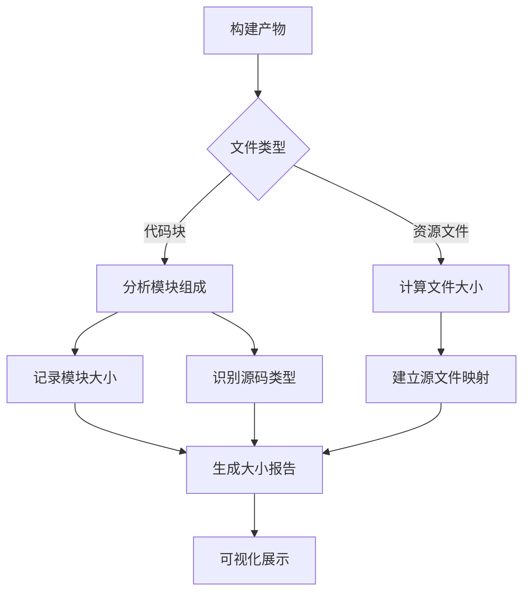
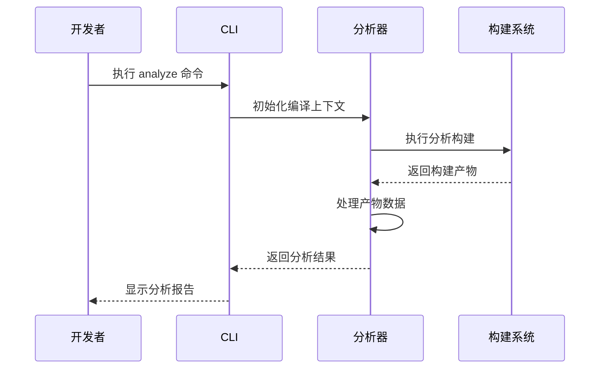
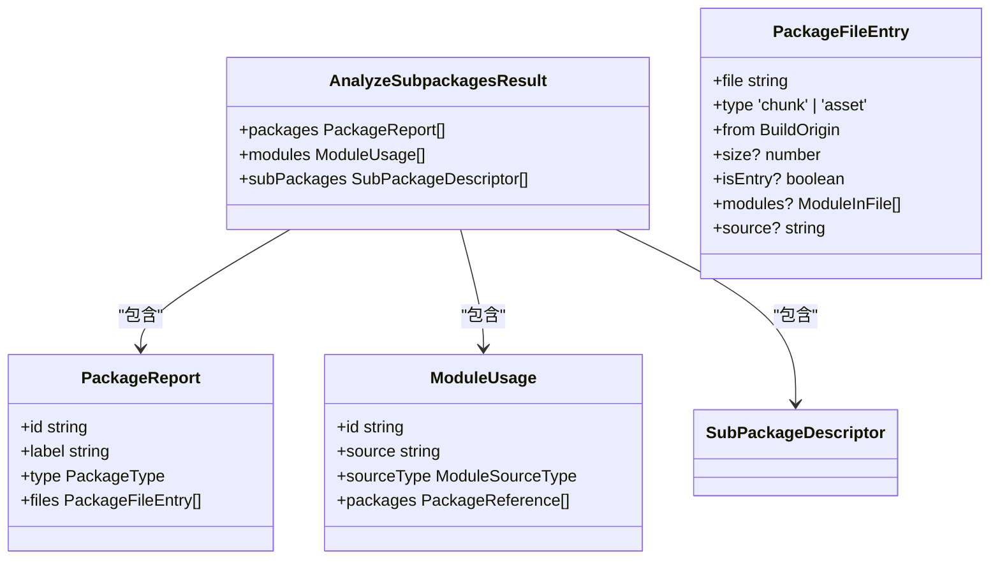
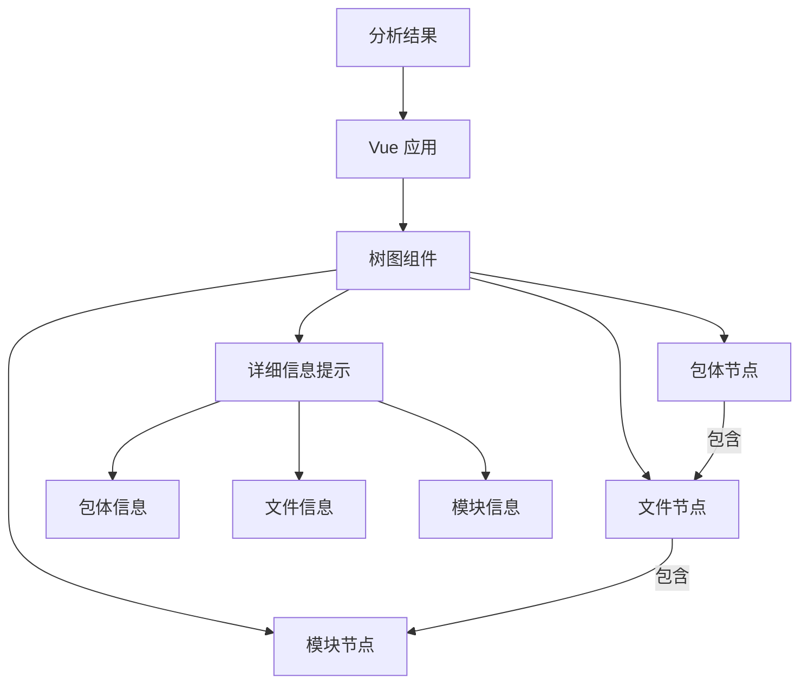
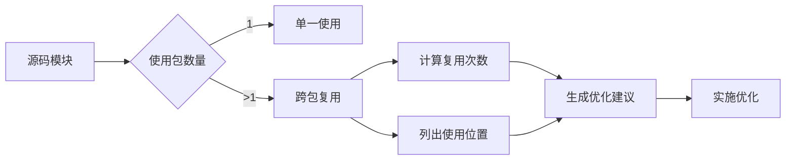

# 资源大小分析

<cite>
**本文档引用的文件**  
- [analyze.ts](file://packages/weapp-vite/src/cli/commands/analyze.ts)
- [subpackages.ts](file://packages/weapp-vite/src/analyze/subpackages.ts)
- [useTreemapData.ts](file://packages/weapp-vite/analyze-dashboard/useTreemapData.ts)
- [App.vue](file://packages/weapp-vite/analyze-dashboard/App.vue)
- [mock-data.ts](file://packages/weapp-vite/analyze-dashboard/mock-data.ts)
- [dashboard.ts](file://packages/weapp-vite/src/cli/analyze/dashboard.ts)
- [packagePaths.ts](file://packages/weapp-vite/src/packagePaths.ts)
- [build-analyze-dashboard.mjs](file://packages/weapp-vite/scripts/build-analyze-dashboard.mjs)
</cite>

## 目录
1. [功能概述](#功能概述)
2. [资源大小监控机制](#资源大小监控机制)
3. [配置与启用分析功能](#配置与启用分析功能)
4. [资源大小报告生成](#资源大小报告生成)
5. [可视化分析仪表盘](#可视化分析仪表盘)
6. [优化策略与最佳实践](#优化策略与最佳实践)
7. [跨包复用与冗余分析](#跨包复用与冗余分析)
8. [命令行使用示例](#命令行使用示例)
9. [总结](#总结)

## 功能概述

资源大小分析功能是 weapp-vite 构建系统中的核心性能监控工具，旨在帮助开发者全面了解小程序包体的构成和分布情况。该功能通过静态分析构建产物，监控 JavaScript、CSS、WXML、WXSS 等各类资源文件的大小分布，为包体积优化提供数据支持。

本功能特别针对小程序的主包和分包架构设计，能够精确识别每个包体中包含的模块和资源，分析源码模块在不同包之间的复用情况。通过详细的资源大小报告，开发者可以快速定位体积过大的文件和冗余依赖，从而实施有效的优化措施。

资源大小分析不仅关注最终产物的大小，还深入到源码模块级别，提供从源码到产物的映射关系。这种细粒度的分析能力使得开发者能够理解代码变更对包体积的具体影响，建立科学的大小预算控制机制。

**Section sources**
- [subpackages.ts](file://packages/weapp-vite/src/analyze/subpackages.ts#L1-L601)
- [analyze.ts](file://packages/weapp-vite/src/cli/commands/analyze.ts#L1-L136)

## 资源大小监控机制

资源大小分析功能通过构建过程中的产物分析来监控各类资源文件的大小。系统会收集和分析所有输出文件，包括 JavaScript 模块、CSS 样式表、WXML 模板和 WXSS 样式文件等。

分析器通过 Rolldown 构建系统的输出信息，获取每个产物文件的详细信息。对于代码块（chunk）类型文件，系统会进一步分析其包含的源码模块，记录每个模块的原始大小和压缩后大小。对于资源文件（asset），系统会计算其字节大小，并建立与源文件的映射关系。



**Diagram sources**
- [subpackages.ts](file://packages/weapp-vite/src/analyze/subpackages.ts#L357-L377)
- [useTreemapData.ts](file://packages/weapp-vite/analyze-dashboard/useTreemapData.ts#L214-L308)

## 配置与启用分析功能

资源大小分析功能通过命令行工具启用，无需额外的配置选项。开发者可以通过执行 `weapp-vite analyze` 命令来启动分析过程。该命令会自动读取项目配置，执行一次不写入文件的构建过程，以收集包体分析所需的数据。

分析功能默认集成在 weapp-vite CLI 中，无需安装额外插件。当执行分析命令时，系统会创建一个编译上下文，加载应用入口和分包配置，然后执行分析专用的构建流程。构建配置会被修改为不写入文件（write: false）且不启用监听模式（watch: null），以确保分析过程的高效性。



**Section sources**
- [analyze.ts](file://packages/weapp-vite/src/cli/commands/analyze.ts#L76-L136)
- [subpackages.ts](file://packages/weapp-vite/src/analyze/subpackages.ts#L539-L600)

## 资源大小报告生成

资源大小报告的生成机制基于对构建产物的全面分析。系统会遍历所有输出文件，分类统计主包、分包和独立分包的构成情况。报告包含三个核心部分：包体报告、模块使用情况和分包配置。

包体报告详细列出每个包（主包、分包、虚拟包）包含的文件数量、类型分布和总体积。系统会区分代码块（chunk）和资源文件（asset），并计算每个包的总字节数。模块使用情况报告则追踪每个源码模块在不同包中的使用情况，识别跨包复用的模块。

报告生成过程中，系统会自动分类文件所属的包类型：
- 主包（main）：根目录下的文件
- 分包（subPackage）：配置在 subPackages 中的目录
- 独立分包（independent）：独立构建的分包
- 虚拟包（virtual）：共享的虚拟模块



**Diagram sources**
- [subpackages.ts](file://packages/weapp-vite/src/analyze/subpackages.ts#L52-L56)
- [subpackages.ts](file://packages/weapp-vite/src/analyze/subpackages.ts#L32-L37)

## 可视化分析仪表盘

weapp-vite 提供了基于 Web 的可视化分析仪表盘，通过树图（Treemap）直观展示包体结构和资源分布。仪表盘以交互式界面呈现分析结果，帮助开发者快速识别体积过大的文件和优化机会。

仪表盘的主要功能包括：
- 包体概览：显示包体数量、源码模块数、跨包复用数和总产物大小
- 树图可视化：使用嵌套矩形展示包、文件和模块的层级关系
- 详细信息提示：悬停时显示文件或模块的详细信息，包括大小、来源和类型
- 跨包复用分析：突出显示在多个包中复用的源码模块

仪表盘的实现基于 Vue 3 和 ECharts，通过 `__WEAPP_VITE_ANALYZE_RESULT__` 全局变量接收分析数据。开发服务器会注入分析结果到 HTML 页面中，实现实时更新。在开发模式下，系统会使用模拟数据进行预览。



**Diagram sources**
- [App.vue](file://packages/weapp-vite/analyze-dashboard/App.vue#L73-L116)
- [useTreemapData.ts](file://packages/weapp-vite/analyze-dashboard/useTreemapData.ts#L164-L308)
- [main.ts](file://packages/weapp-vite/analyze-dashboard/main.ts#L5-L35)

## 优化策略与最佳实践

基于资源大小分析结果，开发者可以采取多种优化策略来减小程序包体积。首先，应重点关注体积过大的文件和模块，通过代码压缩、Tree Shaking 和按需加载等技术进行优化。

Tree Shaking 优化可以通过分析模块使用情况来实施。系统会识别未被使用的模块和代码，建议从依赖中移除。对于大型第三方库，应采用按需导入的方式，避免引入整个库的代码。例如，对于工具库如 lodash，应使用 `import { debounce } from 'lodash-es'` 而不是 `import _ from 'lodash'`。

按需加载策略特别适用于分包架构。通过合理划分分包，将非核心功能延迟加载，可以显著减小主包体积。分析报告可以帮助识别哪些模块适合放入分包，以及如何优化分包之间的依赖关系。

建立资源大小基线是持续优化的关键。开发者应在项目关键节点记录包体积数据，监控大小变化趋势。通过实施大小预算控制，为每个包设置体积上限，可以在代码审查时及时发现可能导致包体积膨胀的变更。

**Section sources**
- [subpackages.ts](file://packages/weapp-vite/src/analyze/subpackages.ts#L184-L193)
- [useTreemapData.ts](file://packages/weapp-vite/analyze-dashboard/useTreemapData.ts#L173-L194)

## 跨包复用与冗余分析

跨包复用分析是资源大小分析功能的重要组成部分，能够识别在多个包中重复出现的源码模块。系统会追踪每个模块在不同包中的使用情况，计算复用次数，并提供详细的分布信息。

当一个模块在多个包中被使用时，它会被计入每个包的体积，导致总包体积增加。分析器会特别标记这类模块，帮助开发者识别潜在的优化机会。常见的跨包复用场景包括：
- 公共工具函数在主包和分包中都被引用
- 通用组件被多个分包使用
- 第三方库的部分功能在不同包中被独立引入

对于检测到的跨包复用模块，建议的优化策略包括：
1. 将公共模块提取到独立的共享包中
2. 使用动态导入实现按需加载
3. 重构代码结构，减少不必要的依赖
4. 对于第三方库，确保使用正确的按需导入方式



**Diagram sources**
- [subpackages.ts](file://packages/weapp-vite/src/analyze/subpackages.ts#L523-L537)
- [analyze.ts](file://packages/weapp-vite/src/cli/commands/analyze.ts#L53-L74)

## 命令行使用示例

资源大小分析功能通过 `weapp-vite analyze` 命令行工具使用。基本用法如下：

```bash
# 基本分析，显示文本报告并启动可视化仪表盘
weapp-vite analyze

# 输出 JSON 格式结果到标准输出
weapp-vite analyze --json

# 将分析结果写入指定文件
weapp-vite analyze --output analysis-result.json

# 指定项目根目录进行分析
weapp-vite analyze /path/to/project --platform weapp
```

命令行工具提供了多个选项来定制分析行为：
- `--json`：以 JSON 格式输出分析结果
- `--output <file>`：将分析结果写入指定文件
- `--platform <platform>`：指定目标平台（weapp | h5）
- `--mode <mode>`：指定构建模式（development | production）

分析结果首先以文本摘要形式输出到控制台，然后自动启动可视化仪表盘。文本摘要包括每个包的模块数量、资源数量和覆盖的源码模块数，以及跨包复用的模块列表。

**Section sources**
- [analyze.ts](file://packages/weapp-vite/src/cli/commands/analyze.ts#L76-L136)
- [dashboard.ts](file://packages/weapp-vite/src/cli/analyze/dashboard.ts#L1-L47)

## 总结

资源大小分析功能为 weapp-vite 项目提供了全面的包体积监控和优化支持。通过深入分析构建产物，该功能帮助开发者理解包体构成，识别性能瓶颈，并实施有效的优化策略。

核心价值体现在三个方面：首先，通过详细的资源大小报告，开发者可以获得包体构成的全景视图；其次，可视化仪表盘提供了直观的交互式分析界面，便于快速定位问题；最后，跨包复用分析揭示了代码复用模式，为架构优化提供了数据支持。

为了最大化该功能的价值，建议开发者将其集成到开发工作流中，定期执行分析，建立大小基线，并设置合理的大小预算。通过持续监控和优化，可以有效控制小程序包体积，提升用户体验和应用性能。