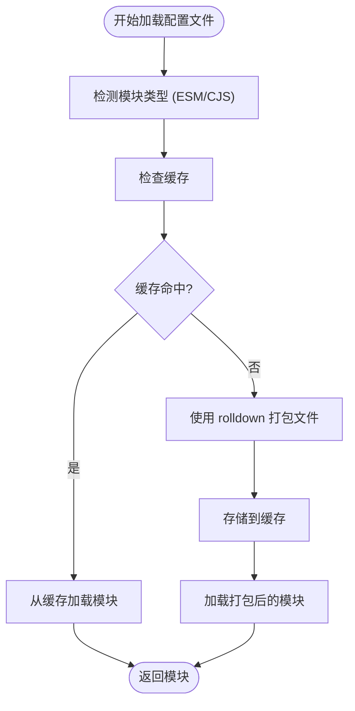
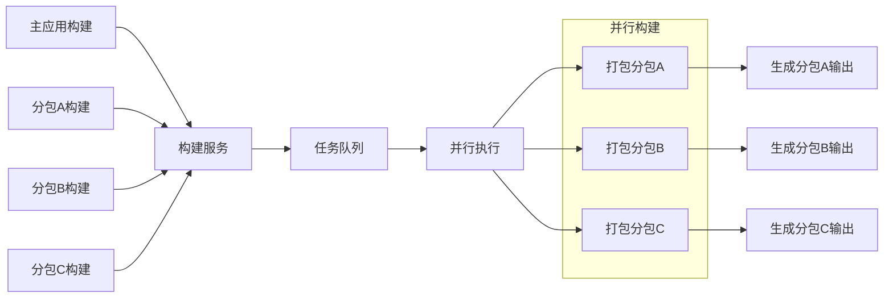
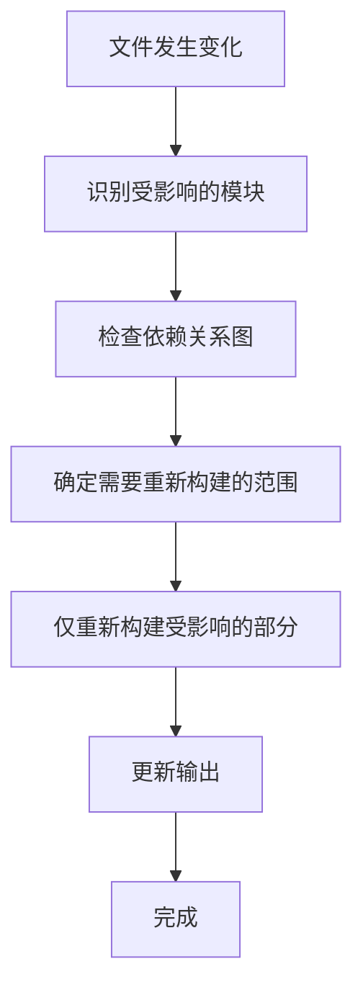
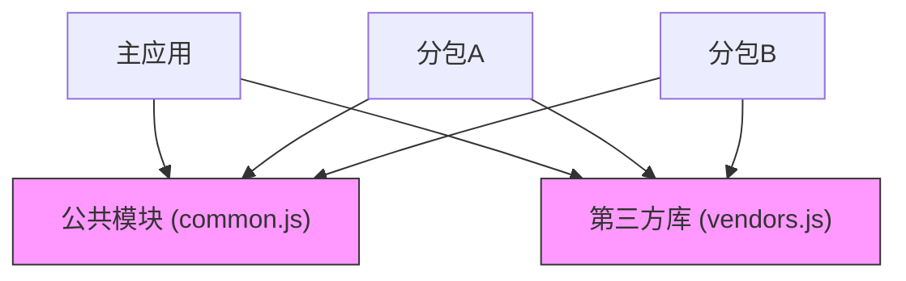
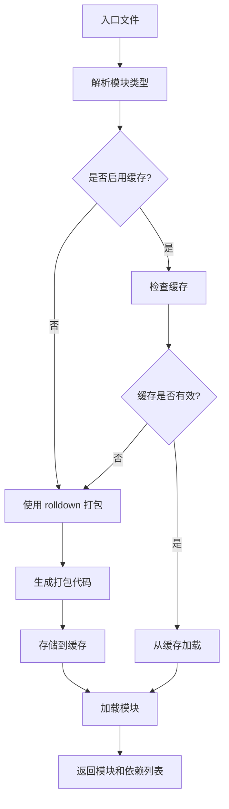

# 性能优化

<cite>
**本文档中引用的文件**  
- [index.ts](file://packages/vite-plugin-performance/src/index.ts)
- [options.ts](file://packages/vite-plugin-performance/src/options.ts)
- [types.ts](file://packages/vite-plugin-performance/src/types.ts)
- [wrapPlugin.ts](file://packages/vite-plugin-performance/src/wrapPlugin.ts)
- [README.md](file://packages/vite-plugin-performance/README.md)
- [README.zh-CN.md](file://packages/vite-plugin-performance/README.zh-CN.md)
- [index.ts](file://packages/rolldown-require/src/index.ts)
- [bundler.ts](file://packages/rolldown-require/src/bundler.ts)
- [loader.ts](file://packages/rolldown-require/src/loader.ts)
- [cache.ts](file://packages/rolldown-require/src/cache.ts)
- [constants.ts](file://packages/rolldown-require/src/constants.ts)
- [README.md](file://packages/rolldown-require/README.md)
- [README-cn.md](file://packages/rolldown-require/README-cn.md)
- [options.md](file://website/packages/rolldown-require/options.md)
- [options.zh.md](file://website/packages/rolldown-require/options.zh.md)
- [index.mjs](file://packages/rolldown-require-bench/benchmark/index.mjs)
- [cache.test.ts](file://packages/rolldown-require/test/cache.test.ts)
- [chunkStrategy.ts](file://packages/weapp-vite/src/runtime/chunkStrategy.ts)
- [core.ts](file://packages/weapp-vite/src/plugins/core.ts)
</cite>

## 目录
1. [构建性能优化策略](#构建性能优化策略)
2. [运行时性能优化](#运行时性能优化)
3. [vite-plugin-performance 插件](#vite-plugin-performance-插件)
4. [rolldown-require 打包工具](#rolldown-require-打包工具)
5. [性能分析工具使用指南](#性能分析工具使用指南)
6. [高级优化技巧](#高级优化技巧)

## 构建性能优化策略

weapp-vite 通过多种机制优化构建性能，包括缓存机制、并行处理和增量构建。这些优化策略显著减少了开发过程中的等待时间，提升了开发体验。

### 缓存机制

rolldown-require 实现了多层缓存机制，包括持久化缓存和内存缓存，以加速配置文件的加载过程。当启用缓存时，系统会根据入口文件的元数据（如修改时间、大小、格式等）生成一个唯一的哈希值作为缓存键。



**Diagram sources**
- [index.ts](file://packages/rolldown-require/src/index.ts#L11-L34)
- [cache.ts](file://packages/rolldown-require/src/cache.ts#L55-L96)

缓存配置选项包括：
- `enabled`: 是否启用缓存
- `dir`: 缓存目录路径
- `reset`: 是否重置缓存
- `memory`: 是否启用内存缓存

当文件未发生变化时，系统直接从缓存中加载模块，避免了重复的打包过程。当依赖文件发生变化时，缓存会自动失效并重新生成。

**Section sources**
- [cache.ts](file://packages/rolldown-require/src/cache.ts#L55-L249)
- [cache.test.ts](file://packages/rolldown-require/test/cache.test.ts#L1-L78)

### 并行处理

weapp-vite 在构建过程中充分利用了 Node.js 的异步特性，实现了高效的并行处理。通过 Promise 和 async/await 机制，多个构建任务可以同时进行，而不是串行执行。

在独立分包构建中，系统会为每个独立分包创建并行的构建任务：



**Diagram sources**
- [buildPlugin.ts](file://packages/weapp-vite/src/runtime/buildPlugin.ts#L31-L61)
- [core.ts](file://packages/weapp-vite/src/plugins/core.ts#L237-L251)

### 增量构建

增量构建是 weapp-vite 提供的核心优化功能之一。系统通过监听文件变化，只重新构建受影响的部分，而不是整个应用。这种机制大大减少了开发过程中的构建时间。

当文件发生变化时，系统会执行以下流程：



系统维护了一个依赖关系图，记录了模块之间的导入关系。当某个文件发生变化时，系统可以快速定位所有依赖该文件的模块，并只重新构建这些模块。

**Section sources**
- [core.ts](file://packages/weapp-vite/src/plugins/core.ts#L182-L221)
- [chunkStrategy.ts](file://packages/weapp-vite/src/runtime/chunkStrategy.ts#L1-L999)

## 运行时性能优化

### 代码分割

weapp-vite 实现了智能的代码分割策略，通过分析模块的依赖关系，将代码拆分为多个 chunks，实现按需加载。这种策略减少了初始加载时间，提升了应用启动速度。

系统提供了多种共享 chunk 策略：
- `hoist`: 将共享模块提升到公共位置
- `duplicate`: 在多个分包中复制共享模块
- 自定义策略: 通过高级配置实现更精细的控制



**Diagram sources**
- [chunkStrategy.ts](file://packages/weapp-vite/src/runtime/chunkStrategy.ts#L76-L162)
- [core.ts](file://packages/weapp-vite/src/plugins/core.ts#L313-L314)

### 懒加载

weapp-vite 支持动态导入（dynamic import）实现懒加载。通过 `import()` 语法，开发者可以将代码分割点标记为按需加载，只有在实际需要时才加载相应的模块。

系统还提供了 `take:` 前缀语法，用于显式声明模块的归属关系，优化分包策略：

```typescript
// 显式声明模块属于某个分包
import 'take:packageA/utils/helper'
```

这种机制允许开发者精确控制模块的打包位置，避免不必要的代码重复。

**Section sources**
- [core.ts](file://packages/weapp-vite/src/plugins/core.ts#L69-L135)

### 资源压缩

weapp-vite 集成了高效的资源压缩机制，通过 rolldown 的打包能力，对 JavaScript 代码进行压缩和优化。系统在生产构建时会自动启用代码压缩，减少最终包的大小。

压缩优化包括：
- 变量名压缩
- 无用代码消除
- 字符串优化
- 模块合并

这些优化显著减少了网络传输的数据量，提升了应用的加载速度。

## vite-plugin-performance 插件

vite-plugin-performance 是一个用于监控 Vite 插件性能的工具，可以帮助开发者识别构建过程中的性能瓶颈。

### 功能特性

该插件的主要功能包括：
- 包装一个或多个 Vite 插件，测量每个生命周期钩子的执行时间
- 保持原有插件行为不变，只在钩子执行后收集性能数据
- 提供阈值过滤机制，只报告耗时超过指定阈值的钩子
- 支持自定义日志记录、格式化和回调函数

### 使用方法

安装插件：
```bash
pnpm add -D vite-plugin-performance
```

在 vite.config.ts 中使用：
```typescript
import { defineConfig } from 'vite'
import Inspect from 'vite-plugin-inspect'
import { wrapPlugin } from 'vite-plugin-performance'

export default defineConfig({
  plugins: [
    wrapPlugin(Inspect(), {
      threshold: 50,
      onHookExecution({ pluginName, hookName, duration }) {
        reportToAPM({ pluginName, hookName, duration })
      },
    }),
  ],
})
```

当某个钩子执行时间超过阈值时，控制台会输出类似以下信息：
```
[inspect] transform            ⏱   78.42 ms
```

### 配置选项

| 选项 | 类型 | 默认值 | 说明 |
| ---- | ---- | ------ | ---- |
| `hooks` | `PluginHookName[] \| 'all'` | `DEFAULT_PLUGIN_HOOKS` | 指定需要包裹的钩子；传 `'all'` 包裹所有函数钩子 |
| `threshold` | `number` | `0` | 只有耗时大于等于该值的钩子才会被记录 |
| `silent` | `boolean` | `false` | 关闭内置日志输出 |
| `logger` | `(message, context) => void` | `console.log` | 自定义日志输出函数 |
| `formatter` | `(context) => string` | `[plugin] transform ⏱  12.34 ms` | 自定义日志内容格式 |
| `onHookExecution` | `(context) => void` | `undefined` | 钩子执行完毕后触发，可用于上报 |
| `clock` | `() => number` | `performance.now` 或 `Date.now` | 高精度计时器，便于测试或自定义时间源 |

默认监控的钩子包括：`options`, `config`, `configResolved`, `configureServer`, `buildStart`, `resolveId`, `load`, `transform`, `buildEnd`, `generateBundle`, `renderChunk`, `writeBundle`。

**Section sources**
- [index.ts](file://packages/vite-plugin-performance/src/index.ts#L1-L5)
- [options.ts](file://packages/vite-plugin-performance/src/options.ts#L1-L40)
- [types.ts](file://packages/vite-plugin-performance/src/types.ts#L1-L44)
- [wrapPlugin.ts](file://packages/vite-plugin-performance/src/wrapPlugin.ts#L6-L27)
- [README.md](file://packages/vite-plugin-performance/README.md#L1-L124)
- [README.zh-CN.md](file://packages/vite-plugin-performance/README.zh-CN.md#L1-L124)

## rolldown-require 打包工具

rolldown-require 是基于 rolldown 的"打包再加载"工具，用于安全地执行任意格式的配置文件（如 TypeScript、ESM、CJS 等）。

### 核心特性

#### 跨格式加载
rolldown-require 可以自动识别入口模块类型，支持 ESM/CJS/TypeScript 等多种格式，无需开发者手动配置。

#### 一致的解析策略
工具沿用了 Vite/rolldown 的解析与外部化逻辑，包括 `module-sync` 条件，避免了 `require`/`import` 行为不一致的问题。

#### 源码上下文保持
在打包后恢复 `__dirname`、`__filename`、`import.meta.url` 等变量，确保临时产物与源文件路径一致。

#### 依赖可观察
返回打包时命中的依赖列表，可直接用于文件监听或缓存校验。

#### 可选缓存
内置持久化 + 进程内缓存，重复加载配置时可显著缩短启动时间。

### 使用方法

安装：
```bash
pnpm add rolldown-require rolldown -D
```

使用：
```typescript
import { bundleRequire } from 'rolldown-require'

const { mod, dependencies } = await bundleRequire({
  filepath: './vite.config.ts',
  cache: true, // 可选：启用缓存，重复执行更快
})

// mod 即为被加载的模块（默认导出会被解包）
// dependencies 可用于 watcher，决定何时重新 bundle
```

### 性能收益分析

根据基准测试数据，rolldown-require 在不同场景下的性能表现如下：

| 场景 | rolldown-require 平均值 | unrun 平均值 | 备注 |
| ---- | ---------------------- | ----------- | ---- |
| tiny-static（25 modules） | 60.52 ms | 61.16 ms | deps 26，rssΔ 中位 1.02 MB vs 0.64 MB |
| medium-mixed（100 modules，动态每 10） | 49.85 ms | 52.30 ms | deps 102 vs 101，rssΔ 中位 2.29 MB vs 1.44 MB |
| large-static（200 modules） | 55.47 ms | 64.54 ms | deps 201，rssΔ 中位 2.86 MB vs 1.33 MB |

测试结果表明，在冷启动平均值下，rolldown-require 普遍比 unrun 更快，尽管 unrun 的内存增量略低。



**Diagram sources**
- [index.ts](file://packages/rolldown-require/src/index.ts#L11-L34)
- [bundler.ts](file://packages/rolldown-require/src/bundler.ts#L10-L147)
- [loader.ts](file://packages/rolldown-require/src/loader.ts#L44-L75)
- [cache.ts](file://packages/rolldown-require/src/cache.ts#L162-L194)

### 高级选项

#### filepath / cwd
- `filepath` 必填，支持相对路径或绝对路径。
- `cwd` 默认使用 `process.cwd()`，用于解析相对入口和 `tsconfig`。

#### format
- 不传则自动根据后缀与 `package.json.type` 推断（`.mjs`/`.mts`/`type:module` -> `esm`，`.cjs`/`.cts` -> `cjs`）。
- 手动传入 `cjs`/`esm` 可跳过推断，例如希望强制以 ESM 方式加载 `.js`。

#### require
自定义产物的加载方式，签名为 `(outfile, { format }) => any`。默认行为：
- ESM：`import(outfile)`（在打包时会写入临时文件或 data: URL）
- CJS：通过 `_require.extensions` 临时钩子编译并 `require` 源文件

典型用途：接入你自己的 loader、为 ESM 产物追加自定义 `import` 逻辑，或在测试环境中注入 mock。

#### rolldownOptions
允许透传部分 rolldown 选项：
- `input`: 可加入自定义插件、`resolve` 规则、`transform` 等。内部会固定 `platform: 'node'`、`treeshake: false`，并注入 `define` 保持 `__dirname`/`__filename`/`import.meta.url`。
- `output`: 会与内部默认项合并，但 `format` 会被 `format` 选项覆盖，`inlineDynamicImports` 固定为 `true`。

> 避免覆写 `platform`、`input` 或 `inlineDynamicImports`，否则可能导致运行时与依赖收集异常。

**Section sources**
- [index.ts](file://packages/rolldown-require/src/index.ts#L11-L34)
- [bundler.ts](file://packages/rolldown-require/src/bundler.ts#L10-L147)
- [loader.ts](file://packages/rolldown-require/src/loader.ts#L44-L75)
- [cache.ts](file://packages/rolldown-require/src/cache.ts#L55-L249)
- [README.md](file://packages/rolldown-require/README.md#L1-L158)
- [README-cn.md](file://packages/rolldown-require/README-cn.md#L1-L157)
- [options.md](file://website/packages/rolldown-require/options.md#L1-L39)
- [options.zh.md](file://website/packages/rolldown-require/options.zh.md#L1-L39)
- [index.mjs](file://packages/rolldown-require-bench/benchmark/index.mjs#L129-L192)

## 性能分析工具使用指南

### 使用 vite-plugin-performance 识别瓶颈

vite-plugin-performance 是识别构建性能瓶颈的首选工具。通过包装关键插件并设置合理的阈值，可以快速定位耗时较长的构建环节。

最佳实践：
1. 在开发环境中启用性能监控
2. 设置合理的阈值（如 50ms）
3. 将性能数据上报到 APM 系统
4. 定期分析性能报告，优化慢速插件

```typescript
// 性能监控配置示例
const performancePlugin = wrapPlugin(heavyPlugin(), {
  threshold: 50,
  onHookExecution: ({ pluginName, hookName, duration }) => {
    // 上报到监控系统
    performanceMonitor.report({
      type: 'vite-plugin',
      plugin: pluginName,
      hook: hookName,
      duration
    })
  }
})
```

### 分析构建输出

通过分析最终的构建输出，可以识别代码重复、包大小等问题。重点关注：
- 共享 chunk 的大小和内容
- 第三方库的打包方式
- 代码分割的合理性

### 监控内存使用

构建过程中的内存使用也是重要的性能指标。通过监控 RSS（Resident Set Size）变化，可以识别内存泄漏或过度内存使用的问题。

## 高级优化技巧

### 自定义共享 chunk 策略

对于复杂的应用结构，可以实现自定义的共享 chunk 策略：

```typescript
import { createAdvancedChunkNameResolver } from 'weapp-vite/runtime/advancedChunks'

const customResolver = createAdvancedChunkNameResolver({
  relativeAbsoluteSrcRoot,
  getSubPackageRoots: () => subPackageRoots,
  strategy: 'duplicate',
  vendorsMatchers: [[/[\\/]node_modules[\\/]/gi]],
  forceDuplicateTester: (relativeId, absoluteId) => {
    // 自定义逻辑判断是否应该重复
    return relativeId.includes('utils/special')
  }
})
```

### 精细控制缓存

通过实现自定义的缓存事件处理器，可以更精细地控制缓存行为：

```typescript
const { mod } = await bundleRequire({
  filepath: './config.ts',
  cache: {
    enabled: true,
    dir: './.cache',
    onEvent: (ev) => {
      switch (ev.type) {
        case 'store':
          console.log(`缓存已存储: ${ev.key}`)
          break
        case 'hit':
          console.log(`缓存命中: ${ev.key}`)
          break
        case 'miss':
          console.log(`缓存未命中: ${ev.key}`)
          break
      }
    }
  }
})
```

### 并行独立分包构建

对于包含多个独立分包的应用，可以实现并行构建以最大化构建速度：

```typescript
// 同时启动多个独立分包的构建任务
const buildTasks = Array.from(independentSubPackageMap.keys()).map(root => 
  buildService.buildIndependentBundle(root, meta)
)

// 等待所有任务完成
await Promise.all(buildTasks)
```

这些高级技巧可以帮助追求极致性能的开发者进一步优化构建流程，实现最佳的开发体验和应用性能。

**Section sources**
- [advancedChunks.ts](file://packages/weapp-vite/src/runtime/advancedChunks.ts#L1-L57)
- [advancedChunks.test.ts](file://packages/weapp-vite/src/runtime/advancedChunks.test.ts#L1-L72)
- [buildPlugin.ts](file://packages/weapp-vite/src/runtime/buildPlugin.ts#L49-L60)