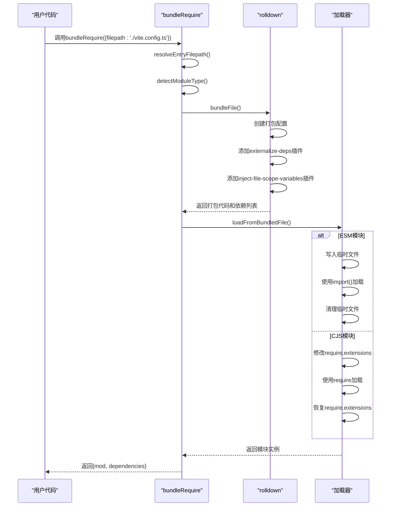
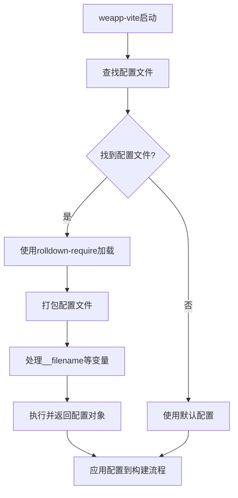
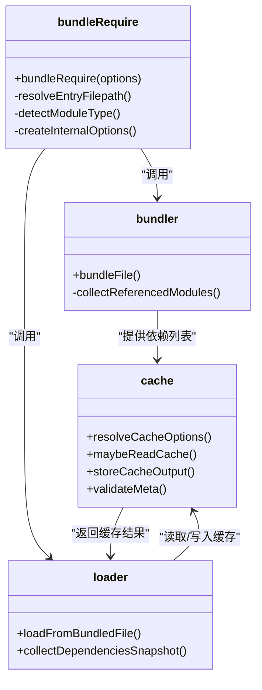
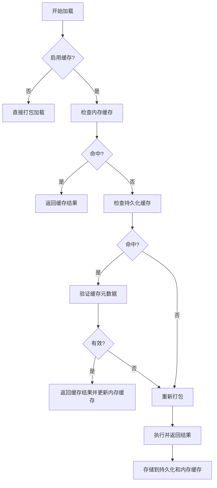

# 打包优化

<cite>
**本文档中引用的文件**  
- [index.ts](file://packages/rolldown-require/src/index.ts)
- [bundler.ts](file://packages/rolldown-require/src/bundler.ts)
- [loader.ts](file://packages/rolldown-require/src/loader.ts)
- [config.ts](file://packages/rolldown-require/src/config.ts)
- [options.ts](file://packages/rolldown-require/src/options.ts)
- [types.ts](file://packages/rolldown-require/src/types.ts)
- [cache.ts](file://packages/rolldown-require/src/cache.ts)
- [externalize.ts](file://packages/rolldown-require/src/externalize.ts)
- [utils.ts](file://packages/rolldown-require/src/utils.ts)
- [README.md](file://packages/rolldown-require/README.md)
- [index.test.ts](file://packages/rolldown-require/test/index.test.ts)
- [index.mjs](file://packages/rolldown-require-bench/benchmark/index.mjs)
- [weappConfig.ts](file://packages/weapp-vite/src/utils/weappConfig.ts)
</cite>

## 目录
1. [简介](#简介)
2. [核心工作原理](#核心工作原理)
3. [API使用示例](#api使用示例)
4. [性能基准测试](#性能基准测试)
5. [在weapp-vite中的关键作用](#在weapp-vite中的关键作用)
6. [依赖可观察特性](#依赖可观察特性)
7. [缓存机制](#缓存机制)
8. [结论](#结论)

## 简介

rolldown-require是一个基于rolldown的"打包再加载"工具，专为安全执行任意格式的用户配置文件而设计。它解决了传统require()方法无法处理TypeScript、JSX等现代JavaScript格式的问题，通过将配置文件打包后再加载，实现了跨格式的配置文件加载能力。该工具在weapp-vite项目中扮演着关键角色，确保了配置文件的安全执行和一致性解析。

**Section sources**
- [README.md](file://packages/rolldown-require/README.md#L1-L158)

## 核心工作原理

rolldown-require的核心工作流程分为三个主要阶段：打包、变量替换和加载。首先，工具使用rolldown对指定的配置文件进行打包，此过程中会排除node_modules中的依赖，以避免打包第三方库带来的问题。打包时，工具会自动处理多种文件格式，包括TypeScript(.ts)、JavaScript(.js)、ES模块(.mjs)和CommonJS(.cjs)等。

在打包过程中，一个关键的处理是__filename、__dirname和import.meta.url等文件作用域变量的替换。这些变量在打包后的临时文件中会被错误地指向临时路径，rolldown-require通过注入特殊的变量来解决这个问题。具体实现是在打包时创建一个名为"inject-file-scope-variables"的插件，该插件会在每个模块的代码开头注入三个常量：__vite_injected_original_dirname、__vite_injected_original_filename和__vite_injected_original_import_meta_url，这些常量的值被设置为原始文件的路径信息。

打包完成后，工具会根据模块类型选择适当的加载方式。对于ES模块，使用import()动态导入；对于CommonJS模块，则通过修改require.extensions来实现自定义加载。这种设计确保了无论配置文件采用何种模块系统，都能被正确加载和执行。

```mermaid
flowchart TD
A[开始] --> B[解析文件路径]
B --> C[检测模块类型]
C --> D[使用rolldown打包]
D --> E[排除node_modules依赖]
E --> F[替换__filename和__dirname变量]
F --> G[生成打包代码]
G --> H[根据模块类型选择加载方式]
H --> I[ES模块: import()]
H --> J[CommonJS: require.extensions]
I --> K[返回模块和依赖列表]
J --> K
```

**Diagram sources**
- [bundler.ts](file://packages/rolldown-require/src/bundler.ts#L10-L147)
- [loader.ts](file://packages/rolldown-require/src/loader.ts#L26-L117)
- [options.ts](file://packages/rolldown-require/src/options.ts#L7-L47)

**Section sources**
- [bundler.ts](file://packages/rolldown-require/src/bundler.ts#L10-L147)
- [loader.ts](file://packages/rolldown-require/src/loader.ts#L26-L117)
- [options.ts](file://packages/rolldown-require/src/options.ts#L7-L47)

## API使用示例

rolldown-require提供了简洁的API，主要通过bundleRequire函数来使用。以下是一个典型的使用示例，展示如何加载vite.config.ts配置文件：



**Diagram sources**
- [index.ts](file://packages/rolldown-require/src/index.ts#L11-L34)
- [bundler.ts](file://packages/rolldown-require/src/bundler.ts#L10-L147)
- [loader.ts](file://packages/rolldown-require/src/loader.ts#L26-L117)

**Section sources**
- [index.ts](file://packages/rolldown-require/src/index.ts#L11-L34)
- [index.test.ts](file://packages/rolldown-require/test/index.test.ts#L8-L15)

## 性能基准测试

rolldown-require在不同场景下的性能表现经过了严格的基准测试，与unrun工具进行了对比。测试在M3芯片的机器上使用Node 22.21.1版本进行，包含10次冷启动迭代。测试场景分为三种：tiny-static（25个模块）、medium-mixed（100个模块，每10个有动态导入）和large-static（200个模块）。

测试结果显示，在tiny-static场景下，rolldown-require的平均执行时间为60.52ms，中位数为58.36ms；而unrun分别为61.16ms和61.32ms。在medium-mixed场景中，rolldown-require表现更优，平均49.85ms，中位数46.38ms，而unrun为52.30ms和30.49ms。在large-static场景下，rolldown-require的平均时间为55.47ms，中位数45.89ms，优于unrun的64.54ms和50.02ms。

值得注意的是，虽然rolldown-require在执行时间上普遍优于unrun，但其内存使用量（rssΔ）相对较高。这表明rolldown-require在性能和内存使用之间做出了权衡，优先保证了执行效率。依赖数量在两种工具间基本一致，说明它们的依赖图覆盖范围相当。

```mermaid
barChart
title 性能基准测试结果对比
x-axis 场景
y-axis 执行时间 (ms)
series rolldown-require, unrun
tiny-static: 60.52, 61.16
medium-mixed: 49.85, 52.30
large-static: 55.47, 64.54
```

**Diagram sources**
- [index.mjs](file://packages/rolldown-require-bench/benchmark/index.mjs#L1-L284)
- [README.md](file://packages/rolldown-require/README.md#L124-L138)

**Section sources**
- [index.mjs](file://packages/rolldown-require-bench/benchmark/index.mjs#L1-L284)
- [README.md](file://packages/rolldown-require/README.md#L124-L138)

## 在weapp-vite中的关键作用

rolldown-require在weapp-vite项目中扮演着至关重要的角色，主要体现在配置文件的安全执行和一致性解析上。weapp-vite需要加载各种格式的用户配置文件，如weapp-vite.config.ts、vite.config.mts等，这些文件可能采用不同的模块系统和语法特性。rolldown-require通过统一的打包加载机制，确保了这些配置文件能够被安全、一致地执行。

在weapp-vite的配置加载流程中，首先通过resolveWeappConfigFile函数查找可能的配置文件，然后使用rolldown-require来加载找到的配置文件。这种设计避免了直接使用Node.js原生的require或import机制可能带来的兼容性问题。特别是对于TypeScript配置文件，rolldown-require能够自动处理类型检查和编译，无需用户预先编译配置文件。

此外，rolldown-require与Vite/rolldown保持一致的解析策略，确保了配置文件中的路径解析、别名处理和条件导出等特性能够正确工作。这对于weapp-vite这样的构建工具至关重要，因为它需要确保开发时和构建时的解析行为完全一致，避免出现"开发环境能运行，生产环境报错"的问题。



**Diagram sources**
- [weappConfig.ts](file://packages/weapp-vite/src/utils/weappConfig.ts#L1-L56)
- [index.ts](file://packages/rolldown-require/src/index.ts#L11-L34)

**Section sources**
- [weappConfig.ts](file://packages/weapp-vite/src/utils/weappConfig.ts#L1-L56)

## 依赖可观察特性

rolldown-require的一个重要特性是其依赖可观察性，即在打包过程中收集并返回命中的依赖列表。这一特性对于文件监听和缓存校验至关重要。当bundleRequire函数执行时，它不仅返回加载的模块，还返回一个包含所有依赖文件路径的数组。

这一机制的实现依赖于rolldown的打包图遍历功能。在bundler.ts文件中，collectReferencedModules函数负责遍历打包图，从入口文件开始，递归地收集所有引用的模块ID。这些模块ID包括静态导入和动态导入的所有依赖。收集到的依赖列表随后被用于文件监听器的配置，当任何一个依赖文件发生变化时，系统可以及时重新加载配置。

依赖可观察性还支持缓存校验。通过collectFileStats函数，工具可以收集每个依赖文件的元数据，包括文件路径、修改时间和大小。这些信息被存储在缓存元数据中，当下次加载时，工具会检查这些元数据是否发生变化，从而决定是否需要重新打包。这种基于文件状态的缓存校验机制既高效又可靠，避免了不必要的重新打包操作。



**Diagram sources**
- [bundler.ts](file://packages/rolldown-require/src/bundler.ts#L8-L33)
- [cache.ts](file://packages/rolldown-require/src/cache.ts#L206-L224)
- [loader.ts](file://packages/rolldown-require/src/loader.ts#L119-L127)

**Section sources**
- [bundler.ts](file://packages/rolldown-require/src/bundler.ts#L8-L33)
- [cache.ts](file://packages/rolldown-require/src/cache.ts#L206-L224)
- [loader.ts](file://packages/rolldown-require/src/loader.ts#L119-L127)

## 缓存机制

rolldown-require提供了强大的缓存机制，包括持久化缓存和内存缓存两种模式，以加速重复的配置文件加载。缓存机制通过CacheOptions接口进行配置，可以启用或禁用，也可以指定缓存目录和重置策略。

持久化缓存默认存储在最近的node_modules/.rolldown-require-cache目录中，如果没有找到合适的node_modules目录，则使用操作系统的临时目录。缓存文件包括打包后的代码文件（.code.cjs或.code.mjs）和元数据文件（.meta.json）。元数据文件记录了缓存的格式、代码路径以及所有依赖文件的状态信息，包括路径、修改时间和大小。

内存缓存则使用Map数据结构在进程内存中存储缓存结果，可以避免频繁的文件系统访问。当同时启用持久化缓存和内存缓存时，工具会优先检查内存缓存，如果命中则直接返回结果；如果未命中，则检查持久化缓存。这种分层缓存策略在保证性能的同时，也确保了跨进程调用的效率。

缓存验证机制通过validateMeta函数实现，该函数会检查元数据中的格式是否匹配、代码文件是否存在，以及所有依赖文件的状态是否发生变化。只有当所有检查都通过时，缓存才会被使用，否则将重新打包并生成新的缓存。



**Diagram sources**
- [cache.ts](file://packages/rolldown-require/src/cache.ts#L37-L286)
- [loader.ts](file://packages/rolldown-require/src/loader.ts#L32-L42)

**Section sources**
- [cache.ts](file://packages/rolldown-require/src/cache.ts#L37-L286)

## 结论

rolldown-require作为一个基于rolldown的"打包再加载"工具，在weapp-vite项目中发挥了关键作用。它通过创新的打包加载机制，解决了跨格式配置文件加载的难题，确保了TypeScript、JSX等多种格式配置文件的安全执行。工具的核心优势在于其与Vite/rolldown一致的解析策略、对__filename和__dirname等变量的正确处理，以及依赖可观察性带来的高效文件监听能力。

性能测试表明，rolldown-require在多种场景下均表现出优于竞品的执行效率，尽管在内存使用上略有增加，但其整体性能表现仍然出色。内置的分层缓存机制进一步提升了重复加载的效率，使得开发工具的启动和配置加载更加迅速。

对于weapp-vite这样的构建工具而言，rolldown-require不仅是一个技术实现，更是确保开发体验一致性和可靠性的关键组件。它使得开发者可以自由选择配置文件的格式和语法，而不必担心兼容性问题，从而提升了开发效率和用户体验。