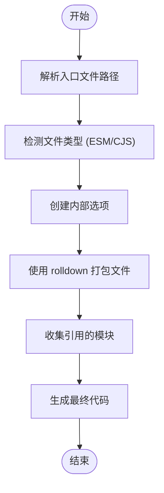
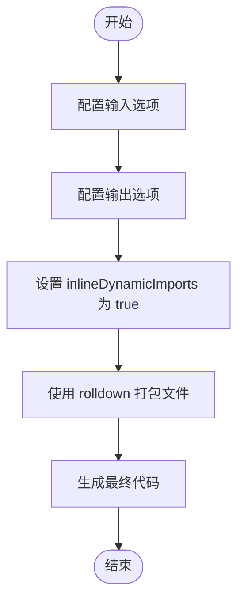
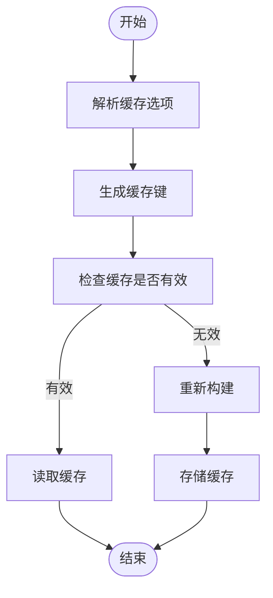
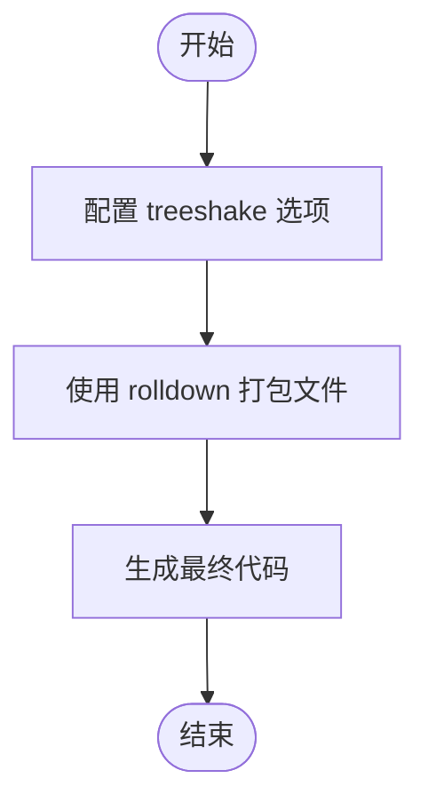
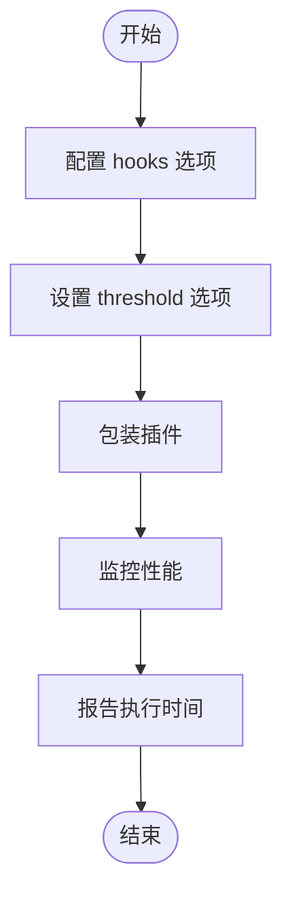
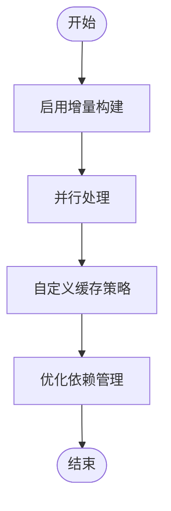

# 构建优化

<cite>
**本文档引用的文件**
- [index.ts](file://packages/rolldown-require/src/index.ts)
- [bundler.ts](file://packages/rolldown-require/src/bundler.ts)
- [cache.ts](file://packages/rolldown-require/src/cache.ts)
- [types.ts](file://packages/rolldown-require/src/types.ts)
- [collect.ts](file://packages/rolldown-require/src/collect.ts)
- [externalize.ts](file://packages/rolldown-require/src/externalize.ts)
- [index.test.ts](file://packages/rolldown-require/test/index.test.ts)
- [README.md](file://packages/rolldown-require/README.md)
- [wrapPlugin.ts](file://packages/vite-plugin-performance/src/wrapPlugin.ts)
- [options.ts](file://packages/vite-plugin-performance/src/options.ts)
- [constants.ts](file://packages/vite-plugin-performance/src/constants.ts)
- [index.test.ts](file://packages/vite-plugin-performance/test/index.test.ts)
- [README.md](file://packages/vite-plugin-performance/README.md)
</cite>

## 目录
1. [引言](#引言)
2. [rolldown-require 打包工具核心优化机制](#rolldown-require-打包工具核心优化机制)
3. [vite-plugin-performance 插件构建优化功能](#vite-plugin-performance-插件构建优化功能)
4. [构建性能分析工具使用指南](#构建性能分析工具使用指南)
5. [高级优化技巧](#高级优化技巧)
6. [结论](#结论)

## 引言

weapp-vite 是一个用于微信小程序开发的构建工具，其核心目标是提供快速、高效的开发体验。为了实现这一目标，weapp-vite 采用了多种构建优化技术，包括使用 rolldown-require 作为打包工具和 vite-plugin-performance 作为性能监控插件。本文档将详细介绍这些优化技术的实现原理、配置选项和使用方法，帮助开发者理解和应用这些技术，以提升构建性能和开发效率。

**Section sources**
- [README.md](file://packages/rolldown-require/README.md)
- [README.md](file://packages/vite-plugin-performance/README.md)

## rolldown-require 打包工具核心优化机制

rolldown-require 是一个基于 rolldown 的打包工具，旨在解决传统打包工具在处理用户配置文件时的局限性。它能够处理各种格式的配置文件，包括 CommonJS、ESM 和 TypeScript。rolldown-require 的核心优化机制包括模块依赖分析、代码分割策略和缓存管理。

### 模块依赖分析

rolldown-require 通过 `bundleFile` 函数实现模块依赖分析。该函数首先解析入口文件路径，然后根据文件类型（ESM 或 CJS）创建内部选项。接着，它使用 rolldown 进行打包，生成包含所有依赖模块的代码。`collectReferencedModules` 函数负责收集所有引用的模块，确保所有依赖项都被正确包含在最终的打包文件中。



**Diagram sources**
- [index.ts](file://packages/rolldown-require/src/index.ts#L11-L34)
- [bundler.ts](file://packages/rolldown-require/src/bundler.ts#L10-L119)
- [collect.ts](file://packages/rolldown-require/src/collect.ts#L8-L33)

**Section sources**
- [index.ts](file://packages/rolldown-require/src/index.ts#L11-L34)
- [bundler.ts](file://packages/rolldown-require/src/bundler.ts#L10-L119)
- [collect.ts](file://packages/rolldown-require/src/collect.ts#L8-L33)

### 代码分割策略

rolldown-require 通过 `rolldownOptions` 配置项支持代码分割。在 `bundleFile` 函数中，`rolldownInputOptions` 和 `rolldownOutputOptions` 分别用于配置输入和输出选项。通过设置 `inlineDynamicImports` 为 `true`，可以将动态导入的模块内联到主包中，从而减少网络请求次数，提高加载速度。



**Diagram sources**
- [bundler.ts](file://packages/rolldown-require/src/bundler.ts#L20-L103)

**Section sources**
- [bundler.ts](file://packages/rolldown-require/src/bundler.ts#L20-L103)

### 缓存管理

rolldown-require 提供了持久化缓存功能，以加速重复的构建过程。通过 `cache` 配置项，可以启用或禁用缓存，并指定缓存目录。`resolveCacheOptions` 函数负责解析缓存选项，生成唯一的缓存键。`maybeReadCache` 函数检查缓存是否有效，如果有效则直接读取缓存，否则重新构建并存储缓存。



**Diagram sources**
- [cache.ts](file://packages/rolldown-require/src/cache.ts#L39-L286)

**Section sources**
- [cache.ts](file://packages/rolldown-require/src/cache.ts#L39-L286)

## vite-plugin-performance 插件构建优化功能

vite-plugin-performance 是一个 Vite 插件，用于测量和报告构建过程中各个生命周期钩子的执行时间。它可以帮助开发者识别性能瓶颈，优化构建流程。

### 资源压缩

vite-plugin-performance 本身不直接提供资源压缩功能，但可以通过与其他插件结合使用来实现。例如，可以使用 `vite-plugin-compression` 插件来压缩输出文件，减少文件大小，提高加载速度。

### Tree Shaking

vite-plugin-performance 通过 `treeshake` 配置项支持 Tree Shaking。在 `bundleFile` 函数中，`treeshake` 选项被设置为 `false`，以确保所有模块都被包含在最终的打包文件中。然而，开发者可以在 `rolldownOptions` 中显式启用 Tree Shaking，以移除未使用的代码，减少包大小。



**Diagram sources**
- [bundler.ts](file://packages/rolldown-require/src/bundler.ts#L71)

**Section sources**
- [bundler.ts](file://packages/rolldown-require/src/bundler.ts#L71)

### 代码分割配置

vite-plugin-performance 通过 `hooks` 配置项支持代码分割。开发者可以指定需要监控的生命周期钩子，例如 `transform`、`buildStart` 等。通过 `threshold` 配置项，可以设置性能阈值，只有当钩子执行时间超过阈值时才会报告。



**Diagram sources**
- [wrapPlugin.ts](file://packages/vite-plugin-performance/src/wrapPlugin.ts#L6-L86)

**Section sources**
- [wrapPlugin.ts](file://packages/vite-plugin-performance/src/wrapPlugin.ts#L6-L86)

## 构建性能分析工具使用指南

vite-plugin-performance 提供了详细的性能分析功能，帮助开发者识别和解决构建瓶颈。以下是使用该插件的步骤：

1. **安装插件**：使用 `pnpm add -D vite-plugin-performance` 安装插件。
2. **配置插件**：在 `vite.config.ts` 中引入并配置插件。
3. **运行构建**：执行构建命令，观察性能报告。

```typescript
import { defineConfig } from 'vite'
import { wrapPlugin } from 'vite-plugin-performance'

export default defineConfig({
  plugins: [
    wrapPlugin(Inspect(), {
      threshold: 50,
      onHookExecution({ pluginName, hookName, duration }) {
        reportToAPM({ pluginName, hookName, duration })
      },
    }),
  ],
})
```

**Section sources**
- [README.md](file://packages/vite-plugin-performance/README.md#L24-L38)

## 高级优化技巧

为了追求极致的构建性能，开发者可以采用以下高级优化技巧：

1. **增量构建**：通过 `cache` 配置项启用增量构建，避免重复构建未更改的文件。
2. **并行处理**：利用多核 CPU 并行处理多个构建任务，提高构建速度。
3. **自定义缓存策略**：根据项目特点自定义缓存策略，例如使用内存缓存或分布式缓存。
4. **优化依赖管理**：合理管理项目依赖，避免不必要的依赖引入，减少构建时间。



**Diagram sources**
- [cache.ts](file://packages/rolldown-require/src/cache.ts#L39-L286)
- [bundler.ts](file://packages/rolldown-require/src/bundler.ts#L10-L119)

**Section sources**
- [cache.ts](file://packages/rolldown-require/src/cache.ts#L39-L286)
- [bundler.ts](file://packages/rolldown-require/src/bundler.ts#L10-L119)

## 结论

weapp-vite 通过集成 rolldown-require 和 vite-plugin-performance 等工具，实现了高效的构建优化。rolldown-require 提供了强大的模块依赖分析、代码分割和缓存管理功能，而 vite-plugin-performance 则帮助开发者监控和优化构建性能。通过合理配置和使用这些工具，开发者可以显著提升构建速度和开发体验。希望本文档能为开发者提供有价值的参考，帮助他们在实际项目中应用这些优化技术。

**Section sources**
- [README.md](file://packages/rolldown-require/README.md)
- [README.md](file://packages/vite-plugin-performance/README.md)