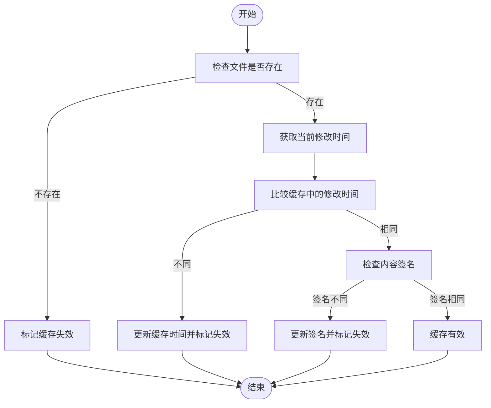
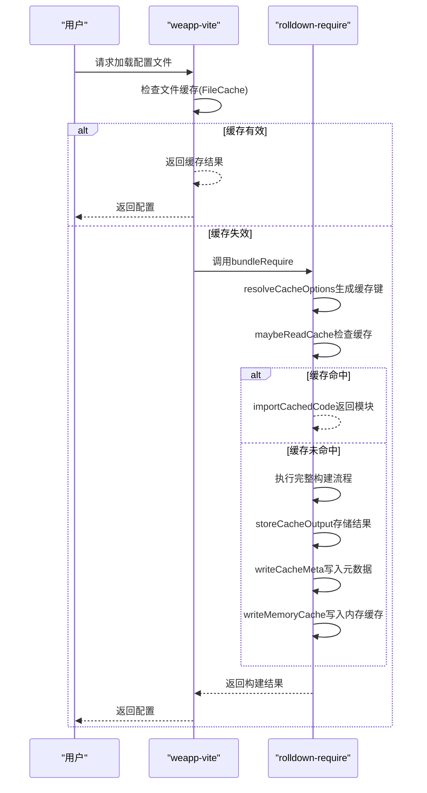

# 缓存机制

<cite>
**本文档引用的文件**   
- [file.ts](file://packages/weapp-vite/src/cache/file.ts)
- [cache.ts](file://packages/rolldown-require/src/cache.ts)
- [loader.ts](file://packages/rolldown-require/src/loader.ts)
- [jsonPlugin.ts](file://packages/weapp-vite/src/runtime/jsonPlugin.ts)
- [runtimeState.ts](file://packages/weapp-vite/src/runtime/runtimeState.ts)
- [npmPlugin.ts](file://packages/weapp-vite/src/runtime/npmPlugin.ts)
</cite>

## 目录
1. [介绍](#介绍)
2. [文件缓存实现原理](#文件缓存实现原理)
3. [与rolldown-require的协同工作](#与rolldown-require的协同工作)
4. [缓存失效条件](#缓存失效条件)
5. [缓存对开发体验的影响](#缓存对开发体验的影响)
6. [缓存优化建议](#缓存优化建议)

## 介绍

在weapp-vite的构建过程中，缓存机制扮演着至关重要的角色。通过有效利用缓存，可以显著缩短重复加载配置时的启动时间。当项目进行二次构建或开发服务器重启时，系统能够复用之前构建过程中的结果，避免了重复的文件解析、转换和编译操作。这种机制特别适用于大型项目，其中包含大量需要处理的源文件和依赖项。通过缓存，weapp-vite能够在保持构建结果一致性的同时，大幅提升开发效率和用户体验。

**Section sources**
- [file.ts](file://packages/weapp-vite/src/cache/file.ts#L1-L121)
- [cache.ts](file://packages/rolldown-require/src/cache.ts#L1-L286)

## 文件缓存实现原理

weapp-vite的文件缓存机制基于`FileCache`类实现，该类位于`packages/weapp-vite/src/cache/file.ts`文件中。其核心原理是通过文件路径和内容生成唯一的缓存键，并以此为基础进行缓存的存储和读取。

缓存键的生成采用了FNV-1a哈希算法，这是一种非加密哈希函数，具有良好的分布特性和计算效率。在`createSignature`函数中，输入的内容（字符串或Buffer）会被逐字节处理，通过异或和乘法运算生成最终的哈希值。这种方法确保了即使文件内容发生微小变化，也会产生完全不同的哈希值，从而准确反映文件的变化状态。

缓存系统维护了三个主要的数据结构：`cache`（LRU缓存实例）、`mtimeMap`（修改时间映射）和`signatureMap`（签名映射）。其中，`cache`使用LRU（最近最少使用）策略管理缓存项，当缓存达到最大容量时，最久未使用的条目将被自动清除。`mtimeMap`记录了每个文件的最后修改时间，而`signatureMap`则存储了基于文件内容生成的哈希签名。

缓存的读取和验证过程在`isInvalidate`方法中实现。该方法首先获取文件的当前修改时间，然后与缓存中记录的修改时间进行比较。如果文件已被删除或无法访问，则视为缓存失效。如果修改时间发生变化，则直接判定为失效。特别值得注意的是，即使修改时间未变，系统还会检查内容签名，这对于处理虚拟文件或内容变更但时间戳不变的场景尤为重要。

**Diagram sources**
- [file.ts](file://packages/weapp-vite/src/cache/file.ts#L62-L120)

**Section sources**
- [file.ts](file://packages/weapp-vite/src/cache/file.ts#L1-L121)

## 与rolldown-require的协同工作

weapp-vite的缓存机制与rolldown-require内置的持久化+进程内缓存协同工作，形成了多层次的缓存体系。rolldown-require作为weapp-vite的核心依赖，提供了更底层的模块加载和缓存功能。

在`packages/rolldown-require/src/cache.ts`中，定义了`resolveCacheOptions`函数，该函数根据入口文件路径、修改时间、大小、格式、Node版本等多种因素生成缓存键。这个缓存键是一个SHA-1哈希值，确保了缓存的唯一性和准确性。缓存配置不仅包括启用状态，还包含缓存目录、是否重置等选项。

rolldown-require实现了两种缓存策略：持久化缓存和进程内缓存。持久化缓存将编译结果存储在磁盘上，默认位置为最近的`node_modules/.rolldown-require-cache`目录，如果找不到则使用系统临时目录。进程内缓存则利用内存中的`Map`对象存储已加载的模块，避免重复的文件系统读写操作。

当加载一个捆绑文件时，`loadFromBundledFile`函数会首先尝试从缓存中读取。如果缓存命中（`maybeReadCache`返回有效结果），则直接返回缓存的模块；如果未命中，则执行完整的构建流程，并在完成后将结果写入缓存（`writeCacheMeta`和`writeMemoryCache`）。这种设计确保了在开发过程中，未发生变化的模块能够被快速加载，而发生变化的模块则会被重新构建。

**Diagram sources**
- [cache.ts](file://packages/rolldown-require/src/cache.ts#L39-L286)
- [loader.ts](file://packages/rolldown-require/src/loader.ts#L26-L70)

**Section sources**
- [cache.ts](file://packages/rolldown-require/src/cache.ts#L1-L286)
- [loader.ts](file://packages/rolldown-require/src/loader.ts#L1-L133)

## 缓存失效条件

weapp-vite的缓存系统在多种情况下会触发缓存更新，确保开发环境中的代码始终是最新的。缓存失效的主要条件包括源文件修改、依赖列表变化以及特定配置变更。

最直接的失效条件是文件的修改时间（mtime）发生变化。在`FileCache.isInvalidate`方法中，系统会比较当前文件的修改时间与缓存中记录的时间。如果当前时间大于或等于缓存时间，则判定为失效。这种机制能够准确捕捉到文件的任何修改操作。

除了修改时间，内容签名的变化也会导致缓存失效。这对于处理虚拟文件或内容变更但时间戳不变的场景尤为重要。在测试用例中可以看到，即使修改时间保持不变，内容从"first"变为"second"也会触发缓存失效。这种双重验证机制确保了缓存的准确性。

依赖列表的变化是另一个重要的失效条件。在`collectFileStats`函数中，系统会收集入口文件及其所有依赖的统计信息（路径、修改时间、大小）。当`validateMeta`函数验证缓存元数据时，会逐个检查这些文件的状态。如果任意依赖文件的修改时间或大小发生变化，整个缓存将被视为失效。

特定配置的变更也会导致缓存失效。例如，在`npmPlugin.ts`中，`checkDependenciesCacheOutdate`函数通过比较`package.json`中依赖项的哈希值来判断是否需要重新构建npm包。如果依赖项发生变化，即使文件本身未修改，缓存也会被标记为过期。

此外，文件的删除或访问权限变化也会触发缓存失效。在`isInvalidate`方法中，如果`fs.stat`调用抛出ENOENT错误（文件不存在），系统会清除相关缓存并返回失效状态。这种设计确保了在文件被删除或移动时，不会继续使用过期的缓存数据。

**Section sources**
- [file.ts](file://packages/weapp-vite/src/cache/file.ts#L62-L120)
- [cache.ts](file://packages/rolldown-require/src/cache.ts#L251-L268)
- [npmPlugin.ts](file://packages/weapp-vite/src/runtime/npmPlugin.ts#L76-L84)

## 缓存对开发体验的影响

缓存机制对weapp-vite的开发体验产生了显著的积极影响，主要体现在加快开发服务器启动速度和提升增量构建效率两个方面。

在开发服务器启动阶段，缓存能够大幅减少初始化时间。当开发者启动`weapp-vite dev`命令时，系统会首先检查配置文件、JSON文件和其他资源的缓存状态。对于未发生变化的文件，可以直接使用缓存结果，避免了重复的解析和编译过程。这种优化使得开发服务器的冷启动时间从可能的数秒缩短到几百毫秒，极大地提升了开发效率。

增量构建速度的提升是缓存带来的另一个重要优势。在开发过程中，开发者通常只会修改少量文件。通过精确的缓存失效检测机制，weapp-vite能够识别出哪些模块需要重新构建，而哪些可以继续使用缓存。这种精细化的构建策略避免了全量重建的开销，使得代码修改后的热更新几乎瞬时完成。

缓存还改善了大型项目的开发体验。对于包含数百个页面和组件的复杂小程序项目，每次构建都需要处理大量的文件。通过缓存，weapp-vite能够将构建时间从分钟级降低到秒级，使开发者能够更快地看到修改效果，从而形成更流畅的开发工作流。

此外，缓存机制还支持了更复杂的开发场景。例如，在处理动态导入或条件编译时，缓存能够准确跟踪依赖关系的变化，确保构建结果的正确性。这种可靠性使得开发者可以更自信地进行代码重构和功能迭代，而不必担心构建系统可能出现的问题。

**Section sources**
- [jsonPlugin.ts](file://packages/weapp-vite/src/runtime/jsonPlugin.ts#L27-L94)
- [runtimeState.ts](file://packages/weapp-vite/src/runtime/runtimeState.ts#L164-L179)

## 缓存优化建议

为了追求极致性能，开发者可以采取以下缓存优化建议来进一步提升weapp-vite的构建效率。

首先，合理配置缓存大小。`FileCache`类的构造函数接受一个`max`参数，默认值为1024。对于大型项目，可以适当增加这个值以容纳更多缓存项，减少LRU淘汰带来的性能损耗。但需要注意的是，过大的缓存可能会占用过多内存，需要根据项目规模和开发环境的硬件配置进行权衡。

其次，充分利用rolldown-require的缓存事件。通过设置`cache.onEvent`回调函数，开发者可以监控缓存的命中、未命中和存储事件。这些信息有助于分析构建性能瓶颈，识别频繁变化的模块，从而优化代码结构或调整缓存策略。

对于依赖管理，建议启用npm缓存功能。在`weapp-vite.config.ts`中设置`npm.cache`为`true`，可以让系统缓存已构建的npm包。这对于包含大量第三方依赖的项目尤其重要，能够避免每次启动都重新构建所有依赖包。

定期清理缓存也是保持构建系统健康的重要措施。虽然weapp-vite的缓存机制设计得相当健壮，但在某些极端情况下（如系统异常关闭）可能会产生损坏的缓存文件。建议在CI/CD流程中加入缓存清理步骤，或在开发环境中定期手动清理`.rolldown-require-cache`目录。

最后，考虑使用更高效的哈希算法。虽然FNV-1a在当前场景下表现良好，但对于特别大的文件，可以探索使用更快的非加密哈希算法（如xxHash）来进一步提升缓存键的生成速度。这需要在`createSignature`函数中进行替换，并确保哈希碰撞的概率保持在可接受范围内。

**Section sources**
- [file.ts](file://packages/weapp-vite/src/cache/file.ts#L41-L44)
- [cache.ts](file://packages/rolldown-require/src/cache.ts#L55-L60)
- [npmPlugin.ts](file://packages/weapp-vite/src/runtime/npmPlugin.ts#L62-L66)