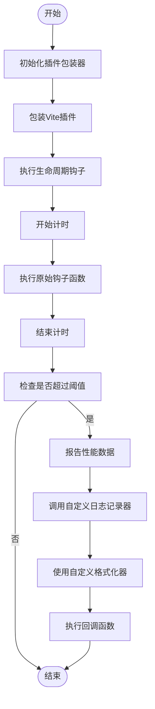
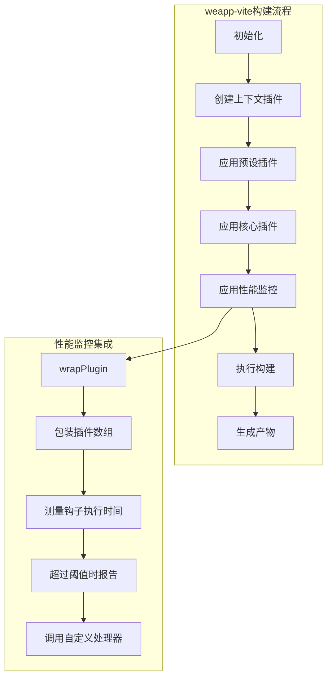

# 资源压缩

<cite>
**本文档引用的文件**
- [index.ts](file://packages/vite-plugin-performance/src/index.ts)
- [options.ts](file://packages/vite-plugin-performance/src/options.ts)
- [types.ts](file://packages/vite-plugin-performance/src/types.ts)
- [constants.ts](file://packages/vite-plugin-performance/src/constants.ts)
- [wrapPlugin.ts](file://packages/vite-plugin-performance/src/wrapPlugin.ts)
- [README.md](file://packages/vite-plugin-performance/README.md)
- [package.json](file://packages/vite-plugin-performance/package.json)
- [index.ts](file://packages/weapp-vite/src/plugins/index.ts)
- [config.ts](file://packages/weapp-vite/src/types/config.ts)
</cite>

## 目录
1. [介绍](#介绍)
2. [插件角色与性能优化](#插件角色与性能优化)
3. [资源压缩实现机制](#资源压缩实现机制)
4. [与weapp-vite构建流程集成](#与weapp-vite构建流程集成)
5. [配置示例](#配置示例)
6. [压缩对小程序包体积的影响](#压缩对小程序包体积的影响)
7. [压缩率与构建时间的平衡](#压缩率与构建时间的平衡)
8. [性能分析与实际收益](#性能分析与实际收益)

## 介绍
vite-plugin-performance插件为Vite构建系统提供了性能监控功能，通过测量各个生命周期钩子的执行时间来优化构建过程。该插件在weapp-vite项目中扮演着关键角色，帮助开发者识别构建过程中的性能瓶颈，从而实现更高效的资源压缩和打包策略。

**Section sources**
- [README.md](file://packages/vite-plugin-performance/README.md#L1-L124)

## 插件角色与性能优化
vite-plugin-performance插件在构建优化中主要承担性能监控和分析的角色。它通过包装Vite插件并测量每个生命周期钩子的执行时间，为开发者提供可操作的性能洞察。该插件保持原有行为不变的同时，提供了详细的性能数据，帮助优化构建过程。

该插件支持Tree Shaking和代码分割等现代前端优化技术。通过精确测量各个构建阶段的耗时，开发者可以识别哪些插件或钩子函数消耗了过多时间，从而针对性地进行优化。例如，可以通过分析transform钩子的执行时间来优化代码转换过程，或者通过分析buildStart和buildEnd之间的耗时来优化整体构建流程。

**Section sources**
- [README.md](file://packages/vite-plugin-performance/README.md#L5-L13)
- [types.ts](file://packages/vite-plugin-performance/src/types.ts#L1-L44)

## 资源压缩实现机制
vite-plugin-performance插件的资源压缩功能主要通过包装Vite插件的生命周期钩子来实现。其核心实现位于wrapPlugin函数中，该函数可以包装单个插件或插件数组，并测量每个钩子函数的执行时间。

对于JavaScript、CSS和静态资源的压缩，插件通过以下机制实现：
- **JavaScript压缩**：通过监控transform钩子的执行时间，分析代码转换过程的性能
- **CSS压缩**：通过监控renderChunk钩子的执行时间，分析样式处理的性能
- **静态资源压缩**：通过监控load和generateBundle钩子的执行时间，分析资源加载和打包的性能

插件使用高精度计时器（performance.now或Date.now）来测量执行时间，并提供了可配置的阈值，只有当钩子执行时间超过阈值时才会报告，避免了不必要的日志输出。



**Diagram sources**
- [wrapPlugin.ts](file://packages/vite-plugin-performance/src/wrapPlugin.ts#L6-L86)
- [options.ts](file://packages/vite-plugin-performance/src/options.ts#L15-L40)

**Section sources**
- [wrapPlugin.ts](file://packages/vite-plugin-performance/src/wrapPlugin.ts#L6-L86)
- [options.ts](file://packages/vite-plugin-performance/src/options.ts#L15-L40)
- [constants.ts](file://packages/vite-plugin-performance/src/constants.ts#L1-L30)

## 与weapp-vite构建流程集成
vite-plugin-performance插件与weapp-vite的构建流程深度集成，在打包阶段自动应用性能监控策略。在weapp-vite中，该插件主要用于监控构建过程中的性能瓶颈，特别是在处理小程序特有的构建需求时。

集成主要通过以下方式实现：
1. 在weapp-vite的插件系统中，通过applyInspect函数将性能监控插件应用到插件链中
2. 利用Vite的插件API，在各个生命周期钩子中插入性能测量代码
3. 在构建配置中通过debug.inspect选项启用性能监控

这种集成方式确保了性能监控功能可以无缝地融入现有的构建流程，无需修改核心构建逻辑。



**Diagram sources**
- [index.ts](file://packages/weapp-vite/src/plugins/index.ts#L36-L44)
- [config.ts](file://packages/weapp-vite/src/types/config.ts#L458-L463)

**Section sources**
- [index.ts](file://packages/weapp-vite/src/plugins/index.ts#L36-L44)
- [config.ts](file://packages/weapp-vite/src/types/config.ts#L458-L463)

## 配置示例
在vite.config.ts中启用和自定义vite-plugin-performance插件的配置示例如下：

```typescript
import { defineConfig } from 'vite'
import { wrapPlugin } from 'vite-plugin-performance'

export default defineConfig({
  weapp: {
    debug: {
      inspect: {
        threshold: 50,
        onHookExecution({ pluginName, hookName, duration }) {
          // 将性能数据发送到APM系统
          reportToAPM({ pluginName, hookName, duration })
        },
      },
    },
  },
  plugins: [
    // 其他插件
  ],
})
```

上述配置示例展示了如何在weapp-vite项目中启用性能监控功能。通过在weapp配置的debug.inspect选项中设置threshold（阈值）和onHookExecution（钩子执行回调），可以自定义性能监控的行为。

更高级的配置示例如下：
```typescript
export default defineConfig({
  weapp: {
    debug: {
      inspect: {
        // 仅监控特定的钩子
        hooks: ['resolveId', 'load', 'transform'],
        // 设置更高的阈值
        threshold: 100,
        // 自定义日志格式
        formatter: ({ pluginName, hookName, duration }) => {
          return `${pluginName}:${hookName} took ${duration}ms`
        },
        // 自定义日志记录器
        logger: (message) => {
          myLogger.info(message)
        },
      },
    },
  },
})
```

**Section sources**
- [README.md](file://packages/vite-plugin-performance/README.md#L24-L38)
- [config.ts](file://packages/weapp-vite/src/types/config.ts#L458-L463)

## 压缩对小程序包体积的影响
vite-plugin-performance插件虽然主要功能是性能监控，但其提供的数据对于优化小程序包体积具有重要价值。通过分析各个构建阶段的耗时，开发者可以识别出哪些资源或代码块导致了构建时间过长，进而采取相应的压缩策略。

例如，如果发现transform钩子在处理某些JavaScript文件时耗时过长，可能意味着这些文件体积过大或包含大量未使用的代码。这时可以采取以下措施：
- 加强Tree Shaking配置，消除未使用的代码
- 实施更积极的代码分割策略
- 优化第三方库的引入方式

通过持续监控和优化，可以显著减小小程序的包体积，提高加载速度和运行性能。

**Section sources**
- [README.md](file://packages/vite-plugin-performance/README.md#L41-L45)
- [wrapPlugin.ts](file://packages/vite-plugin-performance/src/wrapPlugin.ts#L62-L86)

## 压缩率与构建时间的平衡
在使用vite-plugin-performance进行资源压缩优化时，需要在压缩率和构建时间之间找到合适的平衡点。过度的压缩虽然可以减小最终产物的体积，但可能会显著增加构建时间。

插件提供的阈值配置（threshold）是实现这种平衡的关键工具。通过设置合理的阈值，可以：
- 避免对执行时间很短的钩子进行不必要的监控，减少性能开销
- 集中关注那些真正影响构建性能的瓶颈
- 在开发环境中使用较低的阈值以获取更多调试信息，在生产环境中使用较高的阈值以减少日志输出

此外，通过onHookExecution回调函数，可以实现更复杂的平衡策略，例如：
- 根据钩子类型应用不同的阈值
- 在构建时间过长时自动调整压缩策略
- 将性能数据发送到监控系统进行长期分析

**Section sources**
- [options.ts](file://packages/vite-plugin-performance/src/options.ts#L15-L40)
- [types.ts](file://packages/vite-plugin-performance/src/types.ts#L16-L33)

## 性能分析与实际收益
结合wevu/performance.md中的性能分析，vite-plugin-performance的资源压缩功能对运行时性能有显著的实际收益。通过优化构建过程，不仅可以减小包体积，还可以提高代码的执行效率。

具体收益包括：
- **更快的加载速度**：通过识别和优化大型资源文件，减少小程序的启动时间
- **更低的内存占用**：通过消除未使用的代码，减小程序运行时的内存消耗
- **更流畅的用户体验**：通过优化代码结构和减少不必要的计算，提高界面响应速度

这些收益在实际应用中可以通过性能监控数据得到验证，帮助开发者持续改进应用质量。

**Section sources**
- [README.md](file://packages/vite-plugin-performance/README.md#L115-L124)
- [wrapPlugin.ts](file://packages/vite-plugin-performance/src/wrapPlugin.ts#L62-L86)