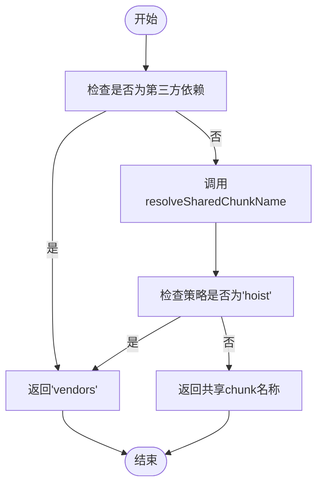
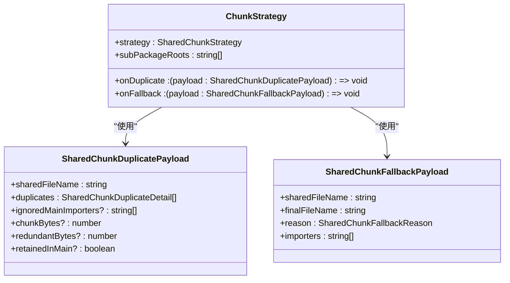
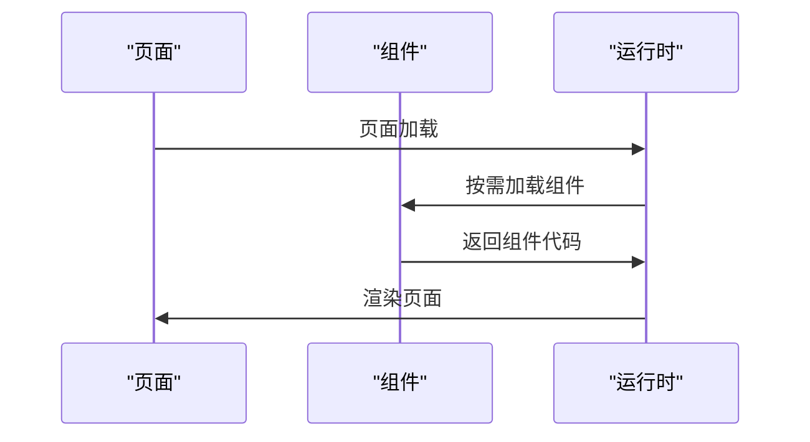
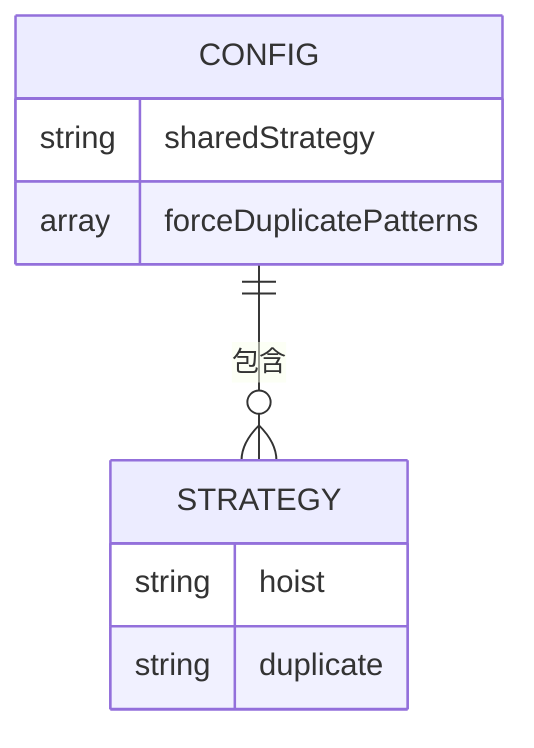

# 代码分割

<cite>
**本文档引用的文件**   
- [advancedChunks.ts](file://packages/weapp-vite/src/runtime/advancedChunks.ts)
- [chunkStrategy.ts](file://packages/weapp-vite/src/runtime/chunkStrategy.ts)
- [sharedBuildConfig.ts](file://packages/weapp-vite/src/runtime/sharedBuildConfig.ts)
- [core.ts](file://packages/weapp-vite/src/plugins/core.ts)
- [subpackages.md](file://docs/subpackages.md)
</cite>

## 目录
1. [引言](#引言)
2. [代码分割机制概述](#代码分割机制概述)
3. [advancedChunks和chunkStrategy实现原理](#advancedchunks和chunkstrategy实现原理)
4. [分包优化技术](#分包优化技术)
5. [按需加载机制](#按需加载机制)
6. [代码分割配置选项与使用示例](#代码分割配置选项与使用示例)
7. [性能收益分析](#性能收益分析)
8. [高级代码分割技巧](#高级代码分割技巧)
9. [结论](#结论)

## 引言

在小程序开发中，代码分割是提升应用性能的关键技术。通过合理的代码分割策略，可以显著减少小程序的初始加载时间，优化内存占用，提升用户体验。weapp-vite作为一款专为小程序优化的构建工具，提供了先进的代码分割机制，包括advancedChunks和chunkStrategy等核心特性。本文将深入探讨weapp-vite的代码分割机制，详细解释其运行时实现原理和优化策略，为追求极致性能的开发者提供全面的指导。

**Section sources**
- [subpackages.md](file://docs/subpackages.md#L18-L142)

## 代码分割机制概述

weapp-vite的代码分割机制基于Rollup打包器的advancedChunks功能，通过自定义chunk命名策略来实现精细化的代码分割。该机制主要包含两个核心组件：advancedChunks和chunkStrategy。advancedChunks负责定义更复杂的chunk分组规则，而chunkStrategy则决定了共享代码在不同分包间的处理策略。

代码分割的主要目标是将应用代码拆分为多个小的chunk，使得小程序在启动时只需加载必要的代码，其他代码按需加载。这不仅可以减少主包体积，还能提高代码的复用率，避免重复加载相同的代码。

**Section sources**
- [advancedChunks.ts](file://packages/weapp-vite/src/runtime/advancedChunks.ts#L1-L57)
- [chunkStrategy.ts](file://packages/weapp-vite/src/runtime/chunkStrategy.ts#L1-L999)

## advancedChunks和chunkStrategy实现原理

### advancedChunks实现原理

advancedChunks是weapp-vite中用于实现高级代码分割的核心机制。它通过createAdvancedChunkNameResolver函数创建一个高级chunk名称解析器，该解析器根据模块的导入关系和配置策略来决定chunk的名称。



**Diagram sources**
- [advancedChunks.ts](file://packages/weapp-vite/src/runtime/advancedChunks.ts#L25-L57)

### chunkStrategy实现原理

chunkStrategy定义了共享代码在不同分包间的处理策略，主要有两种策略：'hoist'（提升）和'duplicate'（复制）。'hoist'策略将共享代码提升到主包，所有分包都引用主包中的共享代码；'duplicate'策略则将共享代码复制到每个需要它的分包中。



**Diagram sources**
- [chunkStrategy.ts](file://packages/weapp-vite/src/runtime/chunkStrategy.ts#L468-L473)

## 分包优化技术

### 独立分包

独立分包是一种特殊的分包形式，它运行在独立的上下文中，不共享主包的全局数据。独立分包适用于需要自定义TabBar、插件能力或明显跨团队交付的模块。通过设置`independent: true`，可以将分包配置为独立分包。

**Section sources**
- [subpackages.md](file://docs/subpackages.md#L22-L23)

### 预下载分包

预下载分包通过在`app.json`的`preloadRule`中声明触发页、目标分包、网络条件与超时时间，实现分包的预加载。首屏页通常指定为触发页，将次屏高频路径加入`packages`，并配置`network: "all"`以便Wi-Fi/4G均可预下载。

**Section sources**
- [subpackages.md](file://docs/subpackages.md#L125-L129)

### 主包优化

主包优化的核心原则是保持主包最小化，首屏只保留必要页面与基座逻辑，其余业务模块放入分包。通过合理规划分包，可以有效控制主包体积，确保小程序快速启动。

**Section sources**
- [subpackages.md](file://docs/subpackages.md#L20-L21)

## 按需加载机制

按需加载机制通过`lazyCodeLoading: "requiredComponents"`配置启用，避免一次性加载所有自定义组件代码（包含分包组件）。对于长链路页面，可以结合动态组件、`Component`的`lifetimes`中延迟`require`的模式，确保同一分包内部也按需执行。



**Diagram sources**
- [subpackages.md](file://docs/subpackages.md#L131-L134)

## 代码分割配置选项与使用示例

### 配置选项

weapp-vite的代码分割配置主要通过`weappViteConfig.chunks`进行设置，包括`sharedStrategy`和`forceDuplicatePatterns`等选项。



**Diagram sources**
- [sharedBuildConfig.ts](file://packages/weapp-vite/src/runtime/sharedBuildConfig.ts#L55-L57)

### 使用示例

```typescript
// vite.config.ts
export default defineConfig({
  weappVite: {
    chunks: {
      sharedStrategy: 'duplicate',
      forceDuplicatePatterns: ['**/utils/**', /node_modules\/lodash/]
    }
  }
})
```

**Section sources**
- [sharedBuildConfig.ts](file://packages/weapp-vite/src/runtime/sharedBuildConfig.ts#L55-L57)

## 性能收益分析

### 启动速度优化

通过代码分割和按需加载，小程序的初始加载时间显著减少。主包体积的减小使得小程序能够更快地启动，提升了用户体验。

### 内存占用优化

合理的代码分割策略可以减少内存中的代码冗余，避免重复加载相同的代码，从而降低内存占用。

### 性能监控

weapp-vite提供了`weapp-vite analyze`命令，可以分析每个（子）包的产物结构与共享模块，帮助开发者定位性能瓶颈。

**Section sources**
- [core.ts](file://packages/weapp-vite/src/plugins/core.ts#L452-L454)

## 高级代码分割技巧

### 自定义分包策略

通过`inlineConfig`为独立分包追加自定义`define`、插件或按需关闭自动导入，实现更精细的分包控制。

### 动态导入优化

在`weapp-vite`中使用`import()`动态引入模块时，构建器会生成独立chunk；搭配`chunks.sharedStrategy`可避免重复落地。

### 调试与排查

执行`pnpm run analyze`（或`pnpm run analyze -- --report`）查看每个（子）包的产物结构与共享模块。关注构建日志中的`[subpackages]`警告，它们通常意味着路径超出`srcRoot`、格式不受支持或重复注册。

**Section sources**
- [subpackages.md](file://docs/subpackages.md#L137-L142)

## 结论

weapp-vite的代码分割机制通过advancedChunks和chunkStrategy等核心特性，为小程序开发提供了强大的性能优化能力。通过合理配置分包策略、启用按需加载机制，开发者可以显著提升小程序的启动速度和内存效率。本文详细介绍了weapp-vite代码分割的实现原理、配置选项和高级技巧，为追求极致性能的开发者提供了全面的指导。