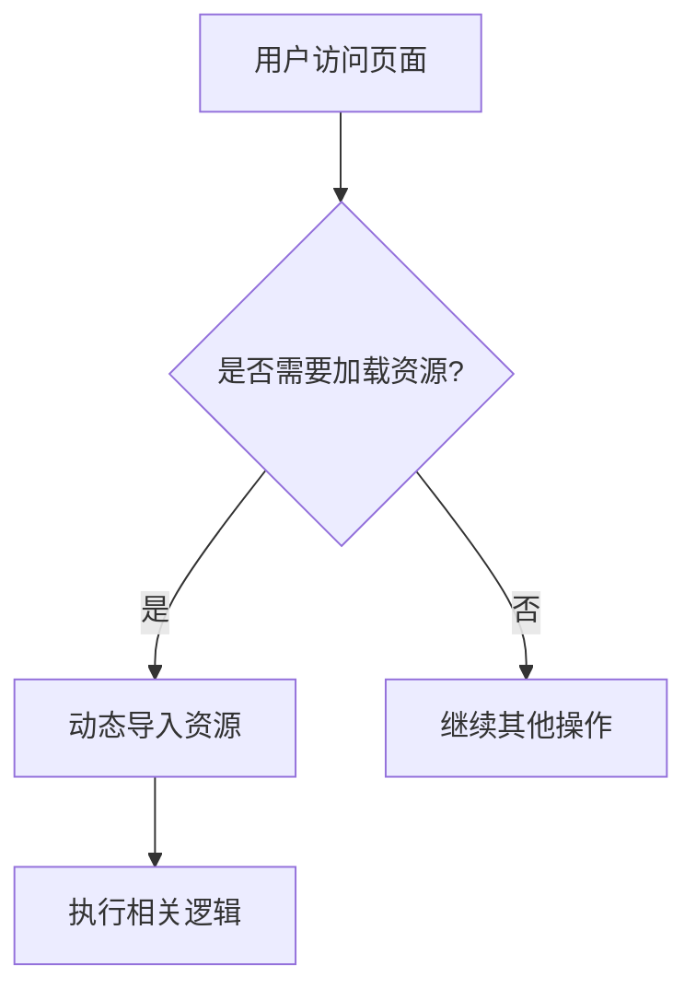
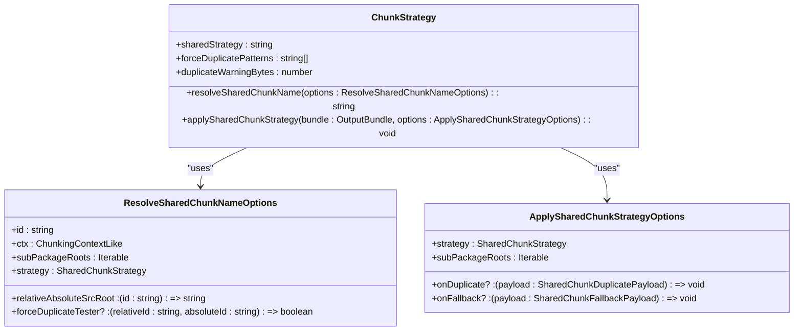
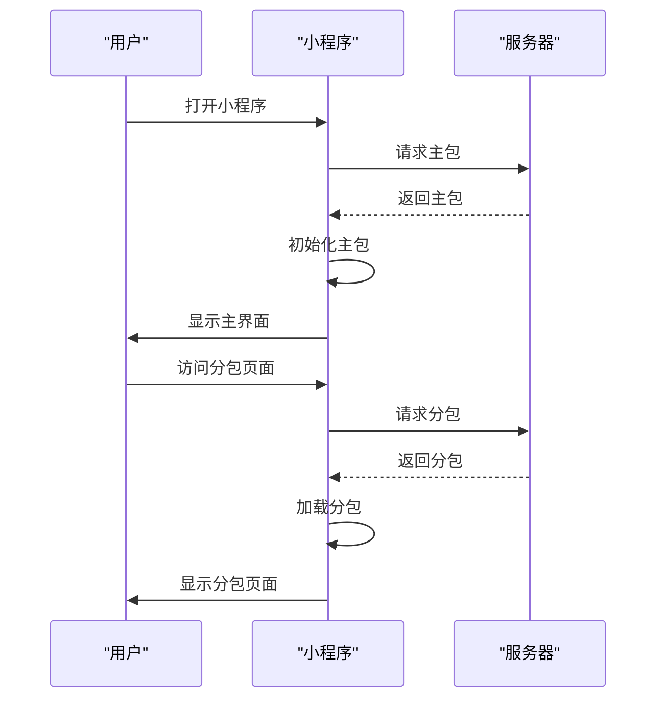

# 按需加载

<cite>
**本文档引用文件**  
- [index.ts](file://apps/wevu-runtime-demo/src/subpackages/perf/pages/chunk/index.ts)
- [index.wxml](file://apps/wevu-runtime-demo/src/subpackages/perf/pages/chunk/index.wxml)
- [index.json](file://apps/wevu-runtime-demo/src/subpackages/perf/pages/chunk/index.json)
- [chunkStrategy.ts](file://packages/weapp-vite/src/runtime/chunkStrategy.ts)
- [core.ts](file://packages/weapp-vite/src/plugins/core.ts)
- [config.ts](file://packages/weapp-vite/src/types/config.ts)
- [subpackage.md](file://website/guide/subpackage.md)
- [sharedBuildConfig.ts](file://packages/weapp-vite/src/runtime/sharedBuildConfig.ts)
</cite>

## 目录
1. [引言](#引言)
2. [按需加载实现原理](#按需加载实现原理)
3. [运行时优化策略](#运行时优化策略)
4. [配置选项与使用示例](#配置选项与使用示例)
5. [性能影响分析](#性能影响分析)
6. [最佳实践指南](#最佳实践指南)
7. [常见问题与解决方案](#常见问题与解决方案)
8. [结论](#结论)

## 引言

weapp-vite 提供了强大的按需加载机制，通过动态导入和懒加载技术显著减少小程序的初始加载时间。本文档深入探讨了按需加载的实现原理、运行时优化策略以及如何通过配置和使用示例来实现页面、组件和资源的按需加载。此外，还将分析按需加载对小程序启动速度和内存占用的影响，并提供性能收益评估方法。

## 按需加载实现原理

weapp-vite 的按需加载机制基于动态导入（`import()`）和懒加载技术。当用户访问某个页面或组件时，只有在需要时才会加载相应的代码和资源，从而减少了初始加载时间。这种机制特别适用于大型小程序，可以有效提升用户体验。

在 weapp-vite 中，按需加载主要通过以下方式实现：

1. **动态导入**：使用 `import()` 函数动态加载模块。例如，在 `wevu-runtime-demo` 项目中，`chunk` 页面通过 `import('../../../../utils/heavy')` 动态加载 heavy 工具并进行计算。
2. **分包管理**：利用微信小程序的分包机制，将代码拆分为多个独立的包，每个包只在需要时加载。这不仅减少了主包的体积，还提高了加载效率。



**图示来源**
- [index.ts](file://apps/wevu-runtime-demo/src/subpackages/perf/pages/chunk/index.ts)

## 运行时优化策略

weapp-vite 在运行时采用了多种优化策略来提高按需加载的效率和性能：

1. **共享代码提取**：通过 `weapp.chunks.sharedStrategy` 配置项，可以选择将共享代码提取到主包或复制到各个分包中。默认策略为 `duplicate`，即将共享代码复制到各个分包中，以避免分包首次打开时再从主包拉取。
2. **强制复制**：使用 `take:` 前缀可以强制将某个模块复制到指定分包中，即使全局共享策略是 `hoist`。这有助于更好地控制代码的分布和加载顺序。
3. **冗余体积警告**：通过 `weapp.chunks.duplicateWarningBytes` 设置冗余体积的提醒阈值，超过该阈值后构建日志会给出告警，便于提前关注包体膨胀。



**图示来源**
- [chunkStrategy.ts](file://packages/weapp-vite/src/runtime/chunkStrategy.ts)

## 配置选项与使用示例

weapp-vite 提供了丰富的配置选项来支持按需加载，以下是一些常用的配置及其使用示例：

### 配置选项

1. **sharedStrategy**：控制跨分包共享代码的输出策略。
   - `duplicate`：默认策略，将共享代码复制到各自的分包中。
   - `hoist`：将共享代码提炼到主包中。
   
2. **forceDuplicatePatterns**：强制按分包复制的模块匹配规则。当共享模块的直接导入方命中这些规则时，其“主包”身份会被忽略，继续沿用 `duplicate` 策略。

3. **duplicateWarningBytes**：当共享模块复制后的冗余体积（字节）超过该阈值时输出警告。设置为 0 或 undefined 则禁用。

### 使用示例

以下是一个具体的使用示例，展示了如何在 `vite.config.ts` 中配置按需加载：

```typescript
import { defineConfig } from 'weapp-vite/config'

export default defineConfig({
  weapp: {
    chunks: {
      // 若项目更关注分包首屏性能，可以显式复制共享模块
      sharedStrategy: 'duplicate',
      // 强制忽略 action/ 下的导入方，防止伪主包引用拖回主包 common.js
      forceDuplicatePatterns: ['action/**'],
      // 调整冗余体积告警阈值
      duplicateWarningBytes: 768 * 1024,
    },
  },
})
```

**代码来源**
- [config.ts](file://packages/weapp-vite/src/types/config.ts)

## 性能影响分析

按需加载对小程序的启动速度和内存占用有显著影响。通过减少初始加载的代码量，可以显著提升启动速度。同时，由于只在需要时加载资源，内存占用也得到了有效控制。

### 启动速度

- **减少初始加载时间**：通过按需加载，只有必要的代码和资源在启动时加载，大大减少了初始加载时间。
- **提高用户体验**：更快的启动速度意味着用户可以更快地进入应用，提升了整体用户体验。

### 内存占用

- **降低内存峰值**：按需加载避免了一次性加载大量代码，从而降低了内存峰值。
- **优化资源管理**：通过分包管理和共享代码提取，可以更有效地管理内存资源。

### 性能收益评估方法

1. **启动时间测量**：使用开发者工具中的性能面板测量应用的启动时间。
2. **内存使用监控**：监控应用运行时的内存使用情况，确保没有不必要的内存占用。
3. **构建产物分析**：通过 `weapp-vite analyze` 命令分析构建产物，了解各分包和共享模块的分布情况。



**图示来源**
- [subpackage.md](file://website/guide/subpackage.md)

## 最佳实践指南

为了最大化按需加载的效果，以下是一些最佳实践建议：

1. **合理划分分包**：根据功能模块合理划分分包，确保每个分包的职责单一且独立。
2. **优化共享代码**：尽量将通用的工具类和组件放在主包中，避免重复加载。
3. **使用 `take:` 前缀**：对于少量公共逻辑，可以使用 `take:` 前缀强制复制到指定分包中，以优化加载顺序。
4. **定期检查包体**：通过 `weapp-vite analyze` 命令定期检查构建产物，确保包体大小在合理范围内。

## 常见问题与解决方案

### 本地运行时报路径错误？

- **检查页面是否引用了其他分包的资源**：确保页面引用的资源路径正确，避免跨分包引用。
- **检查 `weapp.chunks` 配置**：确保配置与项目需求一致，特别是 `sharedStrategy` 和 `forceDuplicatePatterns`。

### 产物体积过大？

- **使用 `weapp.subPackages[].dependencies`**：精确声明每个独立分包需要的 npm 依赖，避免主包依赖泄漏。
- **优化共享代码**：尽量减少不必要的共享代码，避免冗余。

### 想在分包中调试 Worker？

- **在 `weapp.worker` 中声明入口**：确保 Worker 文件位于对应分包目录，并在 `weapp.worker` 中声明入口。

## 结论

weapp-vite 的按需加载机制通过动态导入和懒加载技术显著提升了小程序的启动速度和用户体验。通过合理的配置和优化策略，可以有效控制包体大小和内存占用，确保加载过程的流畅性和高效性。希望本文档能帮助开发者更好地理解和应用按需加载技术，提升小程序的整体性能。