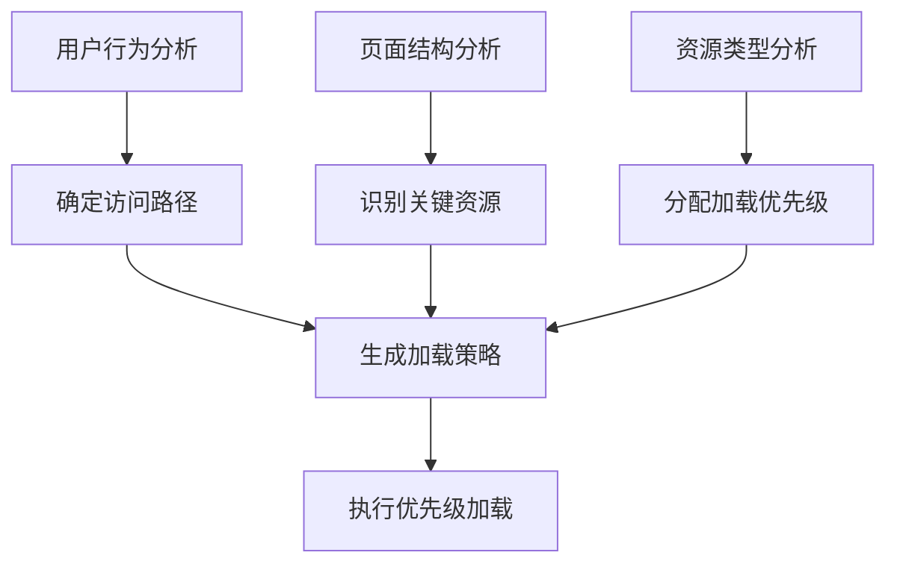
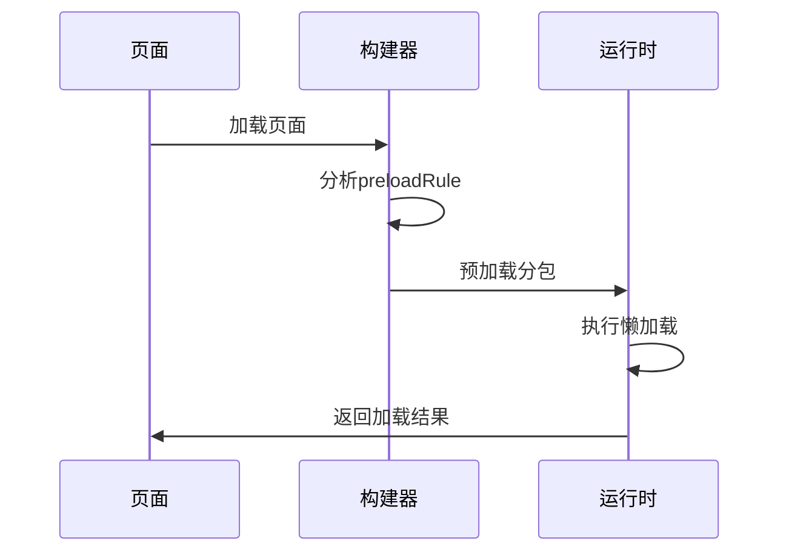
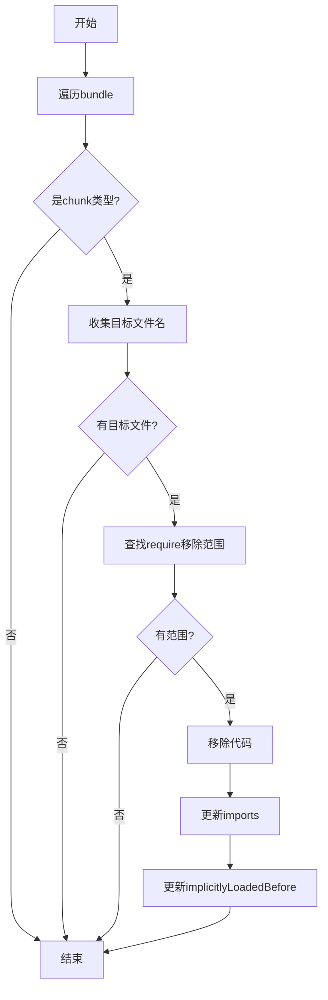

# 优先级加载策略

<cite>
**本文档引用的文件**   
- [core.ts](file://packages/weapp-vite/src/plugins/core.ts)
- [chunkStrategy.ts](file://packages/weapp-vite/src/runtime/chunkStrategy.ts)
- [subpackages.md](file://docs/subpackages.md)
- [pagePreloadRemoval.test.ts](file://packages/weapp-vite/test/plugins/pagePreloadRemoval.test.ts)
- [vite-plugin-performance](file://packages/vite-plugin-performance)
</cite>

## 目录
1. [简介](#简介)
2. [资源加载优先级机制](#资源加载优先级机制)
3. [优先级配置方法](#优先级配置方法)
4. [预加载与懒加载协同策略](#预加载与懒加载协同策略)
5. [性能监控与优化建议](#性能监控与优化建议)
6. [优先级算法内部实现](#优先级算法内部实现)
7. [网络环境动态调整](#网络环境动态调整)

## 简介
weapp-vite 提供了一套完整的优先级加载策略，通过分包管理、资源预加载和懒加载等机制，优化小程序的启动性能和用户体验。本文档深入分析了资源加载优先级的确定机制、配置方法以及内部实现原理。

## 资源加载优先级机制

weapp-vite 的优先级加载策略主要基于用户行为、页面结构和资源类型来确定加载优先级。系统通过分析 `app.json` 中的 `preloadRule` 配置，结合分包结构和用户访问路径，智能地决定资源的加载顺序。

在构建过程中，系统会自动识别关键资源并优先加载，同时将非关键资源标记为延迟加载。这种机制确保了首屏内容能够快速呈现，提升了用户体验。



**Diagram sources**
- [subpackages.md](file://docs/subpackages.md)
- [core.ts](file://packages/weapp-vite/src/plugins/core.ts)

**Section sources**
- [subpackages.md](file://docs/subpackages.md#L18-L68)
- [core.ts](file://packages/weapp-vite/src/plugins/core.ts#L630-L739)

## 优先级配置方法

### 关键资源优先
通过在 `app.json` 中配置 `preloadRule`，可以指定在特定页面加载时预加载相关分包。例如：

```json
{
  "preloadRule": {
    "pages/index/index": {
      "packages": ["packages/profile"],
      "network": "all",
      "timeout": 2000
    }
  }
}
```

### 非关键资源延迟加载
启用 `lazyCodeLoading` 配置，可以实现按需加载自定义组件代码：

```json
{
  "lazyCodeLoading": "requiredComponents"
}
```

### 分包独立性配置
通过设置 `independent: true`，可以让分包运行在独立上下文中，避免主包依赖泄漏：

```json
{
  "subpackages": [
    {
      "root": "packages/order",
      "name": "订单中心",
      "pages": ["index", "detail"],
      "independent": true
    }
  ]
}
```

**Section sources**
- [subpackages.md](file://docs/subpackages.md#L27-L68)
- [subpackages.md](file://docs/subpackages.md#L121-L142)

## 预加载与懒加载协同策略

weapp-vite 的优先级加载策略与预加载和懒加载机制紧密协同工作。系统通过 `preloadRule` 实现分包预加载，同时利用 `import()` 动态导入实现细粒度的懒加载。



**Diagram sources**
- [subpackages.md](file://docs/subpackages.md)
- [core.ts](file://packages/weapp-vite/src/plugins/core.ts)

**Section sources**
- [subpackages.md](file://docs/subpackages.md#L125-L135)

## 性能监控与优化建议

### 性能监控
weapp-vite 集成了 `vite-plugin-performance` 插件，可以监控构建过程中的性能瓶颈：

```typescript
import { wrapPlugin } from 'vite-plugin-performance'

export default defineConfig({
  plugins: [
    wrapPlugin(Inspect(), {
      threshold: 50,
      onHookExecution({ pluginName, hookName, duration }) {
        reportToAPM({ pluginName, hookName, duration })
      },
    }),
  ],
})
```

### 优化建议
1. **保持主包最小化**：首屏只保留必要页面与基座逻辑
2. **合理规划分包**：以业务边界拆分，避免过度拆分
3. **精细控制预加载**：根据用户行为预测预加载分包
4. **监控包体积**：确保主包 < 2MB，单个分包 < 2MB

**Section sources**
- [vite-plugin-performance](file://packages/vite-plugin-performance/README.zh-CN.md)
- [subpackages.md](file://docs/subpackages.md#L142)

## 优先级算法内部实现

weapp-vite 的优先级算法在构建阶段通过分析模块依赖关系来确定加载优先级。核心实现位于 `removeImplicitPagePreloads` 函数中，该函数会移除隐式的页面预加载：



**Diagram sources**
- [core.ts](file://packages/weapp-vite/src/plugins/core.ts)
- [pagePreloadRemoval.test.ts](file://packages/weapp-vite/test/plugins/pagePreloadRemoval.test.ts)

**Section sources**
- [core.ts](file://packages/weapp-vite/src/plugins/core.ts#L630-L739)
- [pagePreloadRemoval.test.ts](file://packages/weapp-vite/test/plugins/pagePreloadRemoval.test.ts#L1-L52)

## 网络环境动态调整

weapp-vite 支持根据不同的网络环境动态调整加载优先级。通过 `preloadRule` 中的 `network` 配置，可以针对不同网络条件设置不同的预加载策略：

- `network: "all"`：Wi-Fi 和 4G 网络均预加载
- `network: "wifi"`：仅 Wi-Fi 网络预加载

这种机制确保了在网络条件较差时不会过度消耗用户流量，同时在网络条件良好时提供最佳用户体验。

**Section sources**
- [subpackages.md](file://docs/subpackages.md#L128)